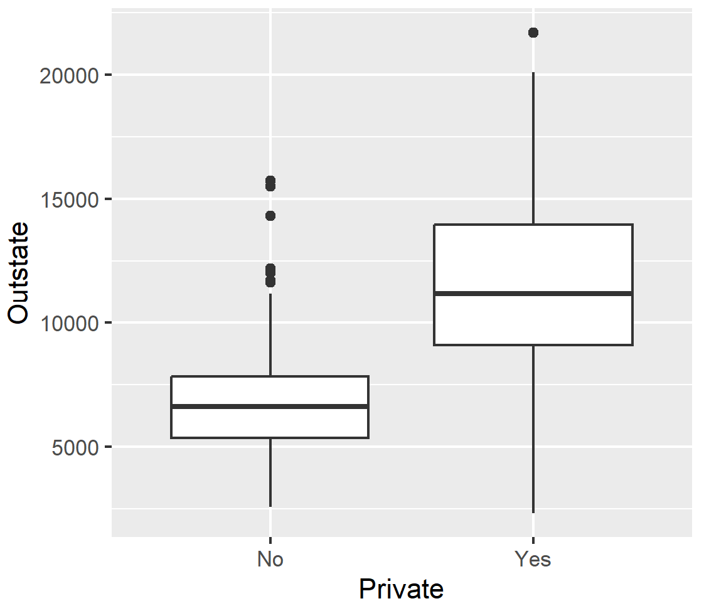

# (PART\*) Section 1 {.unnumbered}

# Overview {.unnumbered}

::: {style="color: #333; font-size: 24px; font-style: italic; text-align: justify;"}
Section 1: Introduction to Data Science: The Basics of Statistical
Learning
:::

**In this section, you will practice using the functions below. It is
highly recommended that you explore these functions further using the
Help tab in your RStudio console. You can access the R documentation in
the Help tab using ? (e.g. `?read.csv`)**

|            Function             |                                   Description                                   |       Package       |
|:----------------------:|:----------------------:|:----------------------:|
|          `read.csv()`           |                                 read csv files                                  |       base R        |
|          `read_csv()`           |                                 read csv files                                  |      tidyverse      |
|     `column_to_rownames()`      |                           convert column to row names                           |      tidyverse      |
|          `rownames()`           |                              obtain names of rows                               |       base R        |
|           `summary()`           |                            obtain summary statistics                            |       base R        |
|            `pairs()`            |                        produce a matrix of scatterplots                         |       base R        |
|            `plot()`             |                                  create a plot                                  |       base R        |
|           `ggplot()`            |                      generic function for creating a plot                       | tidyverse (ggplot2) |
|           `mutate()`            |                       create, modify, and delete columns                        |  tidyverse (dplyr)  |
|           `if_else()`           |                            condition-based function                             |  tidyverse (dplyr)  |
|          `as_factor()`          |                       create factor using existing levels                       | tidyverse (forcats) |
|             `par()`             |                            set graphical parameters                             |       base R        |
|            `mfrow()`            |                                `par()` parameter                                |       base R        |
| `slice_min()` and `slice_max()` | index rows by location (smallest and largest values of a variable respectively) |  tidyverse (dplyr)  |

::: ilos
**Learning Outcomes:**

-   indexing using base R;
-   create scatterplot matrices;
-   create new variables;
-   transform existing variables;
-   translate base R code to `tidyverse` and vice versa.
:::

# Practical 1 {.unnumbered}

```{js, echo=FALSE}
document.addEventListener('DOMContentLoaded', function() {
    // Find all <details> elements as potential containers of R input
    var detailElements = document.querySelectorAll('details.chunk-details');

    detailElements.forEach(function(details) {
        var nextElement = details.nextElementSibling;
        var elementToToggle = null;

        // Check if the nextElement is a textual R output
        if (nextElement && nextElement.matches('pre') && nextElement.textContent.trim().startsWith('##')) {
            elementToToggle = nextElement;
        }
        // Alternatively, check if the nextElement contains a graphical R output (plot)
        else if (nextElement && nextElement.querySelector('img')) {
            elementToToggle = nextElement;
        }

        // Proceed to create a toggle button only if a matching element is found
        if (elementToToggle) {
            var button = document.createElement('button');
            button.className = 'toggle-button';
            button.textContent = 'Show R Output';
            button.style.display = 'block';

            // Initially hide the R output/plot
            elementToToggle.style.display = 'none';

            button.onclick = function() {
                var isHidden = elementToToggle.style.display === 'none';
                elementToToggle.style.display = isHidden ? 'block' : 'none';
                button.textContent = isHidden ? 'Hide R Output' : 'Show R Output';
            };

            // Insert the toggle button immediately after the <details>
            details.parentNode.insertBefore(button, details.nextSibling);
        }
    });
});
```

```{js, echo=FALSE}
document.addEventListener('DOMContentLoaded', function() {
    var answers = document.querySelectorAll('.answers');

    answers.forEach(function(answer) {
        // Create the toggle button
        var button = document.createElement('button');
        button.className = 'toggle-answer-button';
        button.textContent = 'Show Answer'; // Updated text content
        button.style.display = 'block'; // Ensure button is visible
        answer.style.display = 'none'; // Initially hide the answer

        // Add click event listener to the button
        button.onclick = function() {
            if (answer.style.display === 'none') {
                answer.style.display = 'block'; // Show the answer
                button.textContent = 'Hide Answer'; // Update button text
            } else {
                answer.style.display = 'none'; // Hide the answer
                button.textContent = 'Show Answer'; // Reset button text
            }
        };

        // Insert the button before the answer
        answer.parentNode.insertBefore(button, answer);
    });
});

```

This practical consists of two parts, both of which will use datasets
and exercises adapted from the core textbook for this course:

James, G., Witten, D., Hastie, T. and Tibshirani, R. (2021). *An
Introduction to Statistical Learning with Applications in R*. 2nd ed.
New York: Springer. <https://www.statlearning.com/>

## PART I {.unnumbered}

::: file
For the tasks below, you will require the **College** dataset.

Click here to download the file:
<a href="data/College.csv" download="College.csv"> College.csv </a>.

*Remember to place your data file in a separate subfolder within your R
project working directory.*
:::

This data file contains 18 variables for 777 different universities and
colleges in the United States. The variables are:

-   Private : Public/private indicator
-   Apps : Number of applications received
-   Accept : Number of applicants accepted
-   Enroll : Number of new students enrolled\
-   Top10perc : New students from top 10% of high school class
-   Top25perc : New students from top 25% of high school class
-   F.Undergrad : Number of full-time undergraduates
-   P.Undergrad : Number of part-time undergraduates
-   Outstate : Out-of-state tuition
-   Room.Board : Room and board costs
-   Books : Estimated book costs
-   Personal : Estimated personal spending
-   PhD : Percent of faculty with Ph.D.’s
-   Terminal : Percent of faculty with terminal degree
-   S.F.Ratio: Student/faculty ratio
-   perc.alumni : Percent of alumni who donate
-   Expend : Instructional expenditure per student
-   Grad.Rate : Graduation rate

### Task 1 {.unnumbered}

Import the dataset using a suitable tidyverse function and name this
object `college`.

```{r warning = FALSE, message = FALSE}
# Remember to load tidyverse first

library(tidyverse)

college <- read_csv("data/College.csv")
```

If you have a look at the contents of the data object using `View()`,
you will notice that the first column contains the names of all of the
universities in the dataset. You will also notice that it has a strange
name.


Actually, these data should not be treated as a variable (column) since
it is just a list of university names.

### Task 2 {.unnumbered}

Keeping the list of names in the data object, transform this column such
that the university names in the column become row names. Hint: use the
`column_to_rownames()` function from `dplyr`.

```{r warning = FALSE, message = FALSE}
college <- college %>% column_to_rownames(var = "...1") 
```

::: question
How would have your approach to this task differed if you would have
imported the dataset using base R? Try it!
:::

::: answers
The data file could have instead been imported using `read.csv()`:

`college <- read.csv("data/College.csv")`

Using the base R approach, the first column containing the university
names would have been named "X", as shown below using `View()`.


Now, how would be go about transforming the contents of the first column
into row names?

This would require two steps.

First, we assign the column contents to rows names.

`rownames(college) <- college[, 1]`

If you have another look at the data object, you will see that the rows
have now been renamed using the university names in the "X" column, but
the column is still part of the dataset. We therefore need to tell R to
delete the column.

`college <- college[, -1]`
:::

### Task 3 {.unnumbered}

Produce summary statistics for all variables in the data object.

```{r warning = FALSE, message = FALSE}
summary(college)
```

### Task 4 {.unnumbered}

Create a scatterplot matrix of the first three numeric variables.

```{r warning = FALSE, message = FALSE}
pairs(college[,2:4])
```

### Task 5 {.unnumbered}

Produce side by side box plots of `Outstate` versus `Private` using base
R.

```{r eval = FALSE}
plot(college$Private, college$Outstate, xlab = "Private", ylab = "Outstate")
```

::: question
Did this work? Why?
:::

::: answers
Using the `plot()` base R function to produce a box plot would produce
an error since the `Private` variable is of class character. Most
statistical functions will not work with character vectors.

`Error in plot.window(...) : need finite 'xlim' values`\
`In addition: Warning messages:`\
`1: In xy.coords(x, y, xlabel, ylabel, log) : NAs introduced by coercion`\
`2: In min(x) : no non-missing arguments to min; returning Inf`\
`3: In max(x) : no non-missing arguments to max; returning -Inf`

Creating a box plot with `tidyverse` would work.

`college %>%       ggplot(aes(x = Private, y = Outstate)) +        geom_boxplot()`



However, it is important to note that if a variable is not of the right
class, then this might have unintended consequences for example, when
building models. In this case, the `Private` variable must be
transformed into a factor.
:::

### Task 6 {.unnumbered}

Using the `Top10perc` variable, create a new categorical variable called
`Elite` such that universities are divided into two groups based on
whether or not the proportion of students coming from the top 10% of
their high school classes exceeds 50%. Hint: use a combination of
`mutate()` and `if_else()`.

```{r warning = FALSE, message = FALSE}
college <- college %>%
  mutate(Elite = if_else(Top10perc > 50, "Yes", "No"),
         Elite = as_factor(Elite))
#do not forget the factor transformation step (categorical variables are factors in R)
```

### Task 7 {.unnumbered}

Produce side by side box plots of the new `Elite` variable and
`Outstate`.

```{r}
college %>%  
  ggplot(aes(x = Elite, y = Outstate)) +   
  geom_boxplot()
```

::: question
How would you produce a similar plot using base R?
:::

::: answers
`plot(college$Elite, college$Outstate,  xlab = "Elite", ylab = "Outstate")`
:::

### Task 8 {.unnumbered}

Use base R to produce a multipanel plot that displays histograms of the
following variables: `Apps`, `perc.alumni`, `S.F.Ratio`, `Expend`. Hint:
use `par(mfrow=c(2,2))` to set up a 2x2 panel. Try to adjust the
specifications (e.g. breaks).

```{r}

# An example is shown below. Note that the purpose of the mfrow parameter is to change the default way in which R displays plots which is in a single panel display. Once applied, all plots you create later will also be displayed in a 2x2 grid. To revert back, you need to enter par(mfrow=c(1,1)) into the console.

par(mfrow=c(2,2))
hist(college$Apps)
hist(college$perc.alumni, col=2)
hist(college$S.F.Ratio, col=3, breaks=10)
hist(college$Expend, breaks=100)
  
```

### Task 9 {.unnumbered}

Using `Accept` and `Apps`, create a new variable that describes
acceptance rate. Name this variable `acceptance_rate`. Hint: use
`mutate()`.

```{r}
college <- college %>%
  mutate(acceptance_rate = Accept / Apps)
```

### Task 10 {.unnumbered}

Using the `acceptance_rate` variable, find out which university has the
lowest acceptance rate. Hint: for a `tidyverse` approach, you can use
`slice_min()`.

```{r}
college %>%
  slice_min(order_by = acceptance_rate, n = 1)
```

### Task 11 {.unnumbered}

Using the `acceptance_rate` variable, find out which university has the
highest acceptance rate.

```{r}
college %>%
  slice_max(order_by = acceptance_rate, n = 1)
```

## PART II {.unnumbered}

::: file
For the tasks below, you will require the **Boston** dataset.

Click here to download the file:
<a href="data/Boston.csv" download="Boston.csv"> Boston.csv </a>.

*Remember to place your data file in a separate subfolder within your R
project working directory.*
:::

```{r boston-solution}


#b
pairs(Boston)

#c
plot(Boston$age, Boston$crim)
# Older homes, more crime
plot(Boston$dis, Boston$crim)
# Closer to work-area, more crime
plot(Boston$rad, Boston$crim)
# Higher index of accessibility to radial highways, more crime
plot(Boston$tax, Boston$crim)
# Higher tax rate, more crime
plot(Boston$ptratio, Boston$crim)

#d
par(mfrow=c(1,3))
hist(Boston$crim[Boston$crim>1], breaks=25)
# most cities have low crime rates, but there is a long tail: 18 suburbs appear
# to have a crime rate > 20, reaching to above 80
hist(Boston$tax, breaks=25)
# there is a large divide between suburbs with low tax rates and a peak at 660-680
hist(Boston$ptratio, breaks=25)
# a skew towards high ratios, but no particularly high ratios

```

```{r boston2, exercise=TRUE}
#Q(e)-(h)


```

```{r boston2-solution}
# (e)
dim(subset(Boston, chas == 1))

# (f)
median(Boston$ptratio)

# (g)
t(subset(Boston, medv == min(Boston$medv)))
summary(Boston)
# Not the best place to live, but certainly not the worst.

# (h)
dim(subset(Boston, rm > 7))
dim(subset(Boston, rm > 8))
summary(subset(Boston, rm > 8))
summary(Boston)
# relatively lower crime (comparing range), lower lstat (comparing range)

```
