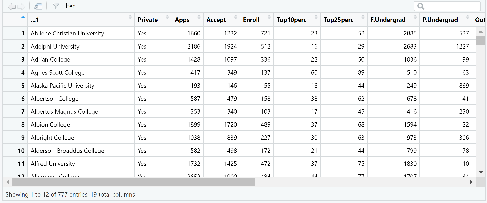
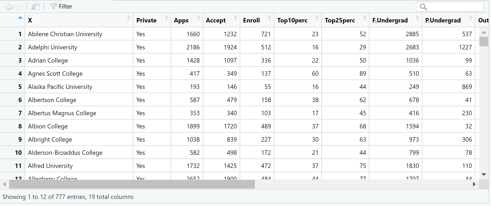

# (PART\*) Section 1 {.unnumbered}

# Overview {.unnumbered}

::: {style="color: #333; font-size: 24px; font-style: italic; text-align: justify;"}
Section 1: Introduction to Data Science: The Basics of Statistical Learning
:::

**In this section, we will cover the following functions:**

|   Function    |               Description               | Package |
|:-------------:|:---------------------------------------:|:-------:|
|     `c()`     |               concatenate               | base R  |
|    `ls()`     | provides names of object in environment | base R  |
|    `rm()`     |             remove objects              | base R  |
|   `View()`    | viewing data objects spreadsheet-style  | base R  |


::: ilos
**Learning Outcomes:**  
-   
:::

# Practical 1 {-}

```{js, echo=FALSE}
document.addEventListener('DOMContentLoaded', function() {
    // Find all <details> elements as potential containers of R input
    var detailElements = document.querySelectorAll('details.chunk-details');

    detailElements.forEach(function(details) {
        var nextElement = details.nextElementSibling;
        var elementToToggle = null;

        // Check if the nextElement is a textual R output
        if (nextElement && nextElement.matches('pre') && nextElement.textContent.trim().startsWith('##')) {
            elementToToggle = nextElement;
        }
        // Alternatively, check if the nextElement contains a graphical R output (plot)
        else if (nextElement && nextElement.querySelector('img')) {
            elementToToggle = nextElement;
        }

        // Proceed to create a toggle button only if a matching element is found
        if (elementToToggle) {
            var button = document.createElement('button');
            button.className = 'toggle-button';
            button.textContent = 'Show R Output';
            button.style.display = 'block';

            // Initially hide the R output/plot
            elementToToggle.style.display = 'none';

            button.onclick = function() {
                var isHidden = elementToToggle.style.display === 'none';
                elementToToggle.style.display = isHidden ? 'block' : 'none';
                button.textContent = isHidden ? 'Hide R Output' : 'Show R Output';
            };

            // Insert the toggle button immediately after the <details>
            details.parentNode.insertBefore(button, details.nextSibling);
        }
    });
});
```

```{js, echo=FALSE}
document.addEventListener('DOMContentLoaded', function() {
    var answers = document.querySelectorAll('.answers');

    answers.forEach(function(answer) {
        // Create the toggle button
        var button = document.createElement('button');
        button.className = 'toggle-answer-button';
        button.textContent = 'Show Answer'; // Updated text content
        button.style.display = 'block'; // Ensure button is visible
        answer.style.display = 'none'; // Initially hide the answer

        // Add click event listener to the button
        button.onclick = function() {
            if (answer.style.display === 'none') {
                answer.style.display = 'block'; // Show the answer
                button.textContent = 'Hide Answer'; // Update button text
            } else {
                answer.style.display = 'none'; // Hide the answer
                button.textContent = 'Show Answer'; // Reset button text
            }
        };

        // Insert the button before the answer
        answer.parentNode.insertBefore(button, answer);
    });
});

```


This practical consists of two parts, both of which will use datasets and exercises adapted from the core textbook for this course.   

::: reference
*Reference*  
James, G., Witten, D., Hastie, T. and Tibshirani, R. (2021). *An Introduction to Statistical Learning with Applications in R*. 2nd ed. New York: Springer.  https://www.statlearning.com/      
::: 

## PART I {-}

::: file
For the tasks below, you will require the **College** dataset.  

Click here to download the file: <a href="data/College.csv" download="College.csv"> College.csv </a>.    

*Remember to place your data file in a separate subfolder within your R project working directory.*
:::

This data file contains 18 variables for 777 different universities and colleges in the United States. The variables are: 

-   Private : Public/private indicator
-   Apps : Number of applications received
-   Accept : Number of applicants accepted 
-   Enroll : Number of new students enrolled  
-   Top10perc : New students from top 10% of high school class
-   Top25perc : New students from top 25% of high school class
-   F.Undergrad : Number of full-time undergraduates
-   P.Undergrad : Number of part-time undergraduates
-   Outstate : Out-of-state tuition
-   Room.Board : Room and board costs
-   Books : Estimated book costs
-   Personal : Estimated personal spending
-   PhD : Percent of faculty with Ph.D.’s
-   Terminal : Percent of faculty with terminal degree
-   S.F.Ratio: Student/faculty ratio
-   perc.alumni : Percent of alumni who donate
-   Expend : Instructional expenditure per student
-   Grad.Rate : Graduation rate


### Task 1 {-}

Import the dataset using a suitable tidyverse function and name this object `college`.

```{r warning = FALSE, message = FALSE}
# Remember to load tidyverse first

library(tidyverse)

college <- read_csv("data/College.csv")
```

If you have a look at the contents of the data object using `View()`, you will notice that the first column contains the names of all of the universities in the dataset. You will also notice that it has a strange name.

::: image

:::


Actually, these data should not be treated as a variable (column) since it is just a list of university names. 

### Task 2 {-}

Keeping the list of names in the data object, transform this column such that the university names in the column become row names. Hint: use the  `column_to_rownames()` function from `dplyr`.

```{r warning = FALSE, message = FALSE}
college <- college %>% column_to_rownames(var = "...1") 
```

::: question
How would have your approach to this task differed if you would have imported the dataset using base R? Try it!
:::

::: answers
The data file could have instead been imported using `read.csv()`:  
 
`college <- read.csv("data/College.csv")`   


Using the base R approach, the first column containing the university names would have been named "X", as shown below using `View()`.

   

Now, how would be go about transforming the contents of the first column into row names?

This would require two steps.   

First, we assign the column contents to rows names. 

`rownames(college) <- college[, 1]`     

If you have another look at the data object, you will see that the rows have now been renamed using the university names in the "X" column, but the column is still part of the dataset. We therefore need to tell R to delete the column. 

`college <- college[, -1]`
:::


### Task 3 {-}

Create a scatterplot matrix of the first three numeric variables. 

```{r}
pairs(college[,2:4])
```


```{r college-solution}
summary(college)
```


```{r }
#iii) plot side by side boxplots of Outstate versus Private (Private universities have more out of state students):

class(college$Private)
#Character vectors cannot be used in most statistical functions in R, since they don't define groups.
college$Private <- ifelse(college$Private=="Yes", 1, 0)
#we need to convert the Character vector 'private' to numerical vector.
plot(college$Private, college$Outstate)

#iv)
Elite <- rep("No", nrow(college))
Elite[college$Top10perc > 50] <- "Yes"
Elite <- as.factor(Elite)
college <- data.frame(college, Elite)

summary(Elite)

# plot side by side boxplots of Outstate versus Elite (Elite universities have more out of state students):
plot(college$Elite, college$Outstate)

#v)

par(mfrow=c(2,2))
hist(college$Apps)
hist(college$perc.alumni, col=2)
hist(college$S.F.Ratio, col=3, breaks=10)
hist(college$Expend, breaks=100)

#vi)
#for example

college[which.max(college$Top10perc), ]  # what is the university with the most students in the top 10% of class


acceptance_rate <- college$Accept/college$Apps

college[which.min(acceptance_rate), ]  # what university has the smallest acceptance rate

college[which.max(acceptance_rate), ]  # what university has the most liberal acceptance rate

```

## PART II {-}


For the exercises below, you will require the **Boston** dataset. 

Click here to download the file: <a href="data/Boston.csv" download="Boston.csv"> Boston.csv </a>.   
In this practical, you will revise and practice your R programming skills using some sample data from universities and colleges in the United States.   

Click on the following link to download the file: <a href="data/boston.csv" download="boston.csv"> boston.csv </a>. 

```{r boston, exercise=TRUE}
#Q(a)-(d)

```

```{r boston-solution}
#a
library(MASS)


#b
pairs(Boston)

#c
plot(Boston$age, Boston$crim)
# Older homes, more crime
plot(Boston$dis, Boston$crim)
# Closer to work-area, more crime
plot(Boston$rad, Boston$crim)
# Higher index of accessibility to radial highways, more crime
plot(Boston$tax, Boston$crim)
# Higher tax rate, more crime
plot(Boston$ptratio, Boston$crim)

#d
par(mfrow=c(1,3))
hist(Boston$crim[Boston$crim>1], breaks=25)
# most cities have low crime rates, but there is a long tail: 18 suburbs appear
# to have a crime rate > 20, reaching to above 80
hist(Boston$tax, breaks=25)
# there is a large divide between suburbs with low tax rates and a peak at 660-680
hist(Boston$ptratio, breaks=25)
# a skew towards high ratios, but no particularly high ratios

```

```{r boston2, exercise=TRUE}
#Q(e)-(h)


```

```{r boston2-solution}
# (e)
dim(subset(Boston, chas == 1))

# (f)
median(Boston$ptratio)

# (g)
t(subset(Boston, medv == min(Boston$medv)))
summary(Boston)
# Not the best place to live, but certainly not the worst.

# (h)
dim(subset(Boston, rm > 7))
dim(subset(Boston, rm > 8))
summary(subset(Boston, rm > 8))
summary(Boston)
# relatively lower crime (comparing range), lower lstat (comparing range)

```
