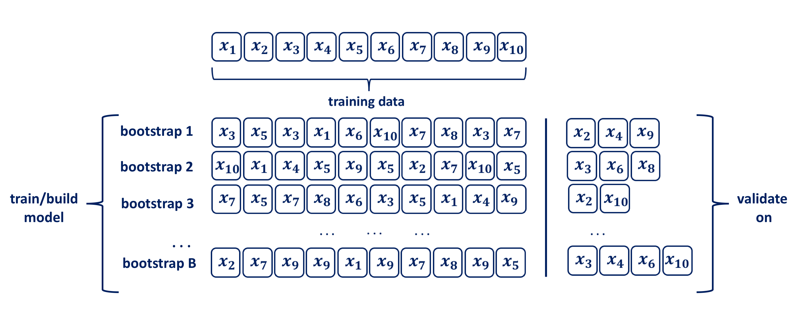

---
editor_options:
  markdown:
    wrap: 72
---

# Demonstration 2: Bootstrapping {-}

The bootstrap method was introduced by [Efron in 1979](https://projecteuclid.org/journals/annals-of-statistics/volume-7/issue-1/Bootstrap-Methods-Another-Look-at-the-Jackknife/10.1214/aos/1176344552.full). Since then it has evolved considerably. Due to its intuitive nature, easily grasped by practitioners and available strong computational power necessary for its application, today bootstrapping is regarded as the indispensable tool for data analysis. The method is named after Baron Münchhausen, a fictional character who in one of the stories saved his life by pulling himself out of the bottom of a deep lake by his own hair.

Bootstrapping is a computationally intensive, nonparametric technique that makes probability-based inference about a population characteristic theta, $Θ$, based on an estimator, $\hat{Θ}$, using a sample drawn from a population. The data is resampled with replacement many times in order to obtain an empirical estimate of the sampling distribution of the statistic of interest $Θ$. Thus, bootstrapping enables us to make inference without having to make distributional assumptions (see Efron, 1979). In machine learning, for estimation purposes the idea of bootstrapping datasets has been proposed as an alternative to CV.

A bootstrap sample is a random sample of the data taken with replacement [Efron and Tibshirani 1986](https://projecteuclid.org/journals/statistical-science/volume-1/issue-1/Bootstrap-Methods-for-Standard-Errors-Confidence-Intervals-and-Other-Measures/10.1214/ss/1177013815.full). Consequently, since samples are drawn with replacement, each bootstrap sample is likely to contain duplicate values. Bootstrapping relies on analogy between the sample and the population from which the sample was drawn, by treating the sample as if it is a population. The two key features of bootstrapping a sample with replacement are:

- a data point is randomly selected for the subset and returned to the original data set, so that it is still available for further selection   
- the bootstrap sample is the same size as the original data set from which it was constructed. 




Using uniform re-sampling with replacement, a $B$ number of training sets are produced by bootstrap to produce a performance estimate of a chosen statistical method, ie. model. The model is trained and its performance is estimated on the out-of-sample observations, as depicted in the figure above. The original observations not selected in a particular bootstrap sample are usually referred to as the out-of-bag (OOB). Hence, for a given bootstrap iteration, a model is built on the selected sample and is used to predict the out-of-bag sample. On average around 63.2% of the original sample ends up in any particular bootstrap sample [Mendelson et al. 2016](https://arxiv.org/abs/1602.05822). When allying the bootstrapping procedure for inferential purposes typical chose for B is in the range of a few hundreds to thousands. [Efron and Tibshirani 1986](https://projecteuclid.org/journals/statistical-science/volume-1/issue-1/Bootstrap-Methods-for-Standard-Errors-Confidence-Intervals-and-Other-Measures/10.1214/ss/1177013815.full) indicate that $B=50$ and even $B=25$ is usually sufficient for bootstrap standard error estimates and point out that there are rare occasions for which more than $B=200$ replications are needed for estimating a standard error. In the context of using bootstraping for validation purposes the size of $B$ in the range of hundreds may be unacceptably high, and the validation process should be repeated for a specified number of folds $k$, i.e. set $B=k$. Hence, the bootstrap resampling with replacement procedure for ML from a data set of size $n$ can be summarised as follows:  

- randomly select with replacement $n$ examples and use this set for training and model building  
- the remaining examples that were not selected for training are used for testing  
- repeat this process for a specific number of folds $k$  
- the true error is estimated as the average error rate on test examples  

As [Efron in his paper on estimating the error rates of prediction rules](https://www.jstor.org/stable/2288636) points out, when performing statistical modelling one might want more than just an estimate of an error rate. Bootstrap methods are helpful in understanding variability all aspects of the prediction problem. In this paper he makes comprehensive comparisons between different resampling methods, drawing the conclusion that in general the bootstrap error rates tend to have less uncertainty than $k$-fold cross-validation. One should also be aware that for small sample sizes the bias is noticeable and decreases as the sample size becomes larger as shown in [Young and Daniels’ paper Bootstrap Bias](https://www.math.wustl.edu/~kuffner/AlastairYoung/YoungDaniels1990.pdf)
.

## Data and Variables {-}

How do we implement bootstrapping in R? Follow the steps outlined in this demonstration to build basic coding skills required to perform bootstrapping. 

In this demonstration, we will make use the **Portfolio** and **Auto** datasets  from the core textbook (James et. al 2021). These datasets are part of the `ISRL2` package. 

**Portfolio** is a dataframe contains 100 observations specifically designed to illustrate the concept of bootstrapping and the way in which it is applied in R. The dataframe contains only two variables: *X*: returns for Asset X, and *Y*: returns for Asset Y.

In addition to `ISRL2`, you will also require the `boot` package. 

```{r warning = FALSE, message = FALSE}
library(ISLR2)
library(boot) #you should have already installed this for Demo 1
```

## Estimating the Accuracy of a Statistic of Interest {-}

One of the advantages of bootstrapping as a resampling method is that it can be applied in almost all situations and it is quite simple to perform it with R. 

The first step is to create a function that computes our statistic of
interest. This function should take as input the $(X,Y)$ data as well as a vector indicating which observations should be used to estimate $\alpha$. The function then outputs the estimate for $\alpha$ based on the selected observations. We will call our function `alpha.fn()`, 

```{r}
alpha.fn <- function(data, index) {
  X <- data$X[index]
  Y <- data$Y[index]
  (var(Y) - cov(X, Y)) / (var(X) + var(Y) - 2 * cov(X, Y))
}
```

For example, the following command tells `R` to estimate $\alpha$ using
all $100$ observations from our dataset.

```{r}
alpha.fn(Portfolio, 1:100)
```

We now use the `sample()` function to randomly select $100$ observations from the range $1$ to $100$, with replacement. This is equivalent to constructing one new bootstrap dataset and recomputing $\hat{\alpha}$
based on the new data set. We can perform this command many, many times, recording all of the corresponding estimates for $\alpha$, and computing the resulting standard deviation. 

```{r}
set.seed(7)
alpha.fn(Portfolio, sample(100, 100, replace = T))
```

However, the `boot()` function automates this approach. For example, we can tell R to repeat this command 1000 times and we obtain $R=1,000$ bootstrap estimates for $\alpha$. The final output shows that using the original data,$\hat{\alpha}=0.5758$, and that the bootstrap estimate for ${\rm SE}(\hat{\alpha})$ is $0.0897$.

```{r}
boot(Portfolio, alpha.fn, R = 1000)
```


## Estimating the Accuracy of a Linear Regression Model {-}

The bootstrap approach can be used to assess the variability of the coefficient estimates and predictions from a statistical learning method. In this example, we will assess the variability of the estimates for $\beta_0$ and $\beta_1$, the intercept and slope terms for a simple linear regression model that uses `horsepower` to predict `mpg` in the `Auto` data set. 

We will compare the estimates obtained using the bootstrap to those obtained using the formulas for ${\rm SE}(\hat{\beta}_0)$ and ${\rm SE}(\hat{\beta}_1)$.

We first create a simple function, `boot.fn()`, which takes in the
`Auto` data set as well as a set of indices for the observations, and
returns the intercept and slope estimates for the linear regression model. We then apply this function to the full set of $392$ observations in order to compute the estimates of $\beta_0$ and $\beta_1$ on the entire data set. *Note that we do not need the `{` and `}` at the beginning and end of the function because it is only one line long.*

```{r}
boot.fn <- function(data, index)
  coef(lm(mpg ~ horsepower, data = data, subset = index))
boot.fn(Auto, 1:392)
```

The `boot.fn()` function can also be used in order to create bootstrap estimates for the intercept and slope terms by randomly sampling from among the observations with replacement (as we did in the previous example with the `**Portfolio** dataset). We can see slight differences for the coefficient estimates each time we repeat this procedure.

```{r}
set.seed(1)
boot.fn(Auto, sample(392, 392, replace = T))
boot.fn(Auto, sample(392, 392, replace = T))
```

Now, we use the `boot()` function to compute the standard errors of 1,000 bootstrap estimates for the intercept and slope terms.

```{r}
boot(Auto, boot.fn, 1000)
```

The results show that the bootstrap estimate for ${\rm SE}(\hat{\beta}_0)$ is $0.84$, and that the bootstrap estimate for ${\rm SE}(\hat{\beta}_1)$ is $0.0073$.  

How different are those estimates from those provided by fitting the model? Let's now compute the standard errors for the regression coefficients in a linear model (we use `summary` and then extract the coefficients using `$coef`)

```{r}
summary(lm(mpg ~ horsepower, data = Auto))$coef
```

The standard error estimates for $\hat{\beta}_0$ and $\hat{\beta}_1$ obtained from fitting the model using `lm()` are $0.717$ for the intercept and $0.0064$ for the slope. 

Interestingly, these are somewhat different from the estimates obtained using the bootstrap.  

Does this indicate a problem with the bootstrap? In fact, it suggests the opposite. Reflect on the formulae we covered earlier in the course and the assumptions on which these formulae rely. For example, they depend on the unknown parameter $\sigma^2$ (the noise variance) and so we estimate $\sigma^2$ using the RSS. Now although the formulas for the standard errors do not rely on the linear model being correct, the estimate for $\sigma^2$ does. If we create a scatterplot and examine the relationship between **mpg** and **horsepower**, we can see that there is a non-linear relationship and so the residuals from a linear fit will be inflated, and so will $\hat{\sigma}^2$.

```{r}
plot(Auto$mpg, Auto$horsepower)
```

Secondly, the standard formulas assume (somewhat unrealistically) that the $x_i$ are fixed, and all the variability comes from the variation in the errors $\epsilon_i$.   

The bootstrap approach **does not** rely on any of these assumptions, and so it is likely giving a more accurate estimate of the standard errors of
$\hat{\beta}_0$ and $\hat{\beta}_1$ than is the `summary()` function.

Given the non-linear association betwen the two variables, let's now compute the bootstrap standard error estimates and the standard
linear regression estimates that result from fitting a *quadratic* model to the data.   

```{r}
boot.fn <- function(data, index)
  coef(
      lm(mpg ~ horsepower + I(horsepower^2), 
        data = data, subset = index)
    )

set.seed(1)
boot(Auto, boot.fn, 1000)
```

Since this model provides a good fit to the data, there is now a better correspondence between the bootstrap estimates and the standard estimates of ${\rm SE}(\hat{\beta}_0)$, ${\rm SE}(\hat{\beta}_1)$ and ${\rm SE}(\hat{\beta}_2)$.

```{r}
summary(lm(mpg ~ horsepower + I(horsepower^2), data = Auto))$coef
```


