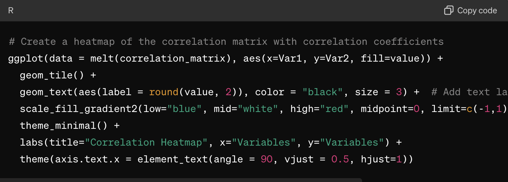

```{r setup, include=FALSE, message = FALSE, warning = FALSE}
knitr::opts_chunk$set(echo = TRUE,
                      include=TRUE,
                      prompt = TRUE,
                      message = FALSE,
                      warning = FALSE,
                      fig.height = 5,
                      fig.width = 7,
                      cache = FALSE)
```


# Demonstration {-}

*Enhancing Data Science Projects with ChatGPT: A Case Study in R.*  

## Data Set {-}

The Spanish Wine Quality Dataset focuses on red wine variants from Spain, detailing various metrics related to their popularity and characteristics, and their influence on quality. It is suitable for classification or regression tasks, with the goal being to predict the quality or price of the wines. Note that the quality ratings range from nearly 5 to 4 points and are not evenly distributed. The dataset comprises 7,500 different types of Spanish red wines, each described by 11 features including price, rating, and flavor descriptors. The data was meticulously gathered through web scraping from diverse sources, such as specialised wine websites and supermarkets.  

Attribute Information

- winery: Name of the winery
- wine: Name of the wine
- year: Harvest year of the grapes
- rating: Average user rating (1-5)
- num_reviews: Number of user reviews
- country: Country of origin (Spain)
- region: Wine-producing region
- price: Price in euros (€)
- type: Wine variety
- body: Body score, indicating the richness and weight of the wine (1-5)
- acidity: Acidity score, indicating the wine's tartness and refreshing quality (1-5)

To start our AI-aided data science project, we'll need to download the dataset named `wines_SPA.csv`. Save this dataset in a "data" folder within a new project directory called `wines_SPA`.

```{r data_folder, out.width = "75%", fig.align = 'center', echo=FALSE}
knitr::include_graphics("images/data_folder.png")
```

Before we begin, let's take an initial look at the dataset. Open the downloaded csv file to ensure it's functional and contains the data we need.

```{r wines_SPA_csv, out.width = "85%", fig.align = 'center', echo=FALSE}
knitr::include_graphics("images/wines_SPA_csv.png")
```

After that, we'll set up an R project file and dive into our data science project. 

```{r Rproj, out.width = "85%", fig.align = 'center', echo=FALSE}
knitr::include_graphics("images/Rproj.png")
```

*Exciting times ahead!*  

## Project Planning: Setting the Stage for Success {-}

Project planning is a critical phase where we assess available resources and goals to develop an optimal strategy. To initiate this process, visit [chatGPT](chat.openai.com) and start a new chat. Mention the availability of the Spanish Wine Quality dataset and ask ChatGPT to provide steps for building an end-to-end generic portfolio project. This step lays the groundwork for a successful project by defining clear objectives and identifying the necessary resources.

<span style="color:red">**Prompt:** </span> <span style="color:gray"> *I have The Spanish Wine Quality Dataset, which centers on red wine variations from Spain. It provides detailed metrics regarding their popularity, characteristics, and how these factors influence quality. This dataset is ideal for classification or regression tasks, aiming to predict the quality or price of wines. It's worth noting that the quality ratings range from nearly 5 to 4 points and are not evenly distributed. The dataset includes 7,500 different types of Spanish red wines, each described by 11 features such as price, rating, and flavor descriptors. Could you guide me through the necessary steps for this data science project using this dataset*</span>

<span style="color:red">**ChatGPT**</span>
```{r prompt1, out.width = "85%", fig.align = 'center', echo=FALSE}
knitr::include_graphics("images/prompt1.gif")
```

To be in line with our adopted practice, we will summarise ChatGPT's suggestions into the following set of steps:

i) Data Preprocessing + Feature Engineering  
ii) Exploratory Data Analysis (EDA) + Feature Engineering if still needed  
iii) Model Selection and Model Training  
iv) Model Evaluation  
v) Model Interpretation  
vi) Conclusion   
 
## Data Preprocessing {-}

As we use ChatGPT to assist us in this project, some steps will be performed without its aid. These include loading the necessary packages, uploading data, and converting some character-type variables into appropriate factor types. 

❗️<span style="color:green"> Please ensure that you have installed all necessary packages before proceeding with these steps. </span>


```{r}
# Load packages
# Note that you will need to install some of these packages

library(ggplot2) # For creating visualisations.
library(dplyr) # For wrangling data.
library(tidyr) # For data tidying operations.
library(reshape2) # For reshaping data frames.
library(caret) # For data preprocessing tasks like scaling and imputing missing values and ML.
library(glmnet) # For fitting Lasso and Ridge regression models.
library(randomForest) # For fitting Random Forest models.
library(rpart) # For fitting and visualising decision trees.
library(rpart.plot) # For visualising decision trees created with the `rpart` package.
library(splines) # For creating spline basis functions for use in generalised linear models (GLMs)

#read data
wine_data <- read.csv('data/wines_SPA.csv',
                    header=TRUE, 
                    na.strings=c("","NA"),
                    stringsAsFactor = FALSE) 
glimpse(wine_data)
```

Next, we will convert character types into factors and change the `year` variable to an integer type. We will also remove the `country` variable since all the wine is from Spain.

```{r}
wine_data [,1] <- as.factor(wine_data[,1])
wine_data [,2] <- as.factor(wine_data[,2])
wine_data [,3] <- as.integer(wine_data[,3])
wine_data [,7] <- as.factor(wine_data[,7])
wine_data [,9] <- as.factor(wine_data[,9])
wine_data [,10] <- as.factor(wine_data[,10])
wine_data [,11] <- as.factor(wine_data[,11])
wine_data <- wine_data[, !(names(wine_data) %in% c("country"))]
summary(wine_data)
dim(wine_data)
```

We have observed the presence of missing values in our dataset. Given the substantial size of our dataset, we can opt to remove rows that contain `NA` values.
```{r}
# contains only the rows where there are no NAs in the specified columns.
wine_data <- wine_data[complete.cases(wine_data[, c("body", "acidity", "type")]), ]
# Handle missing values in the 'year' variable
wine_data$year[is.na(wine_data$year)] <- median(wine_data$year, na.rm = TRUE)
# Check the number of missing values after removal
missing_values <- colSums(is.na(wine_data))
print(missing_values)
# Summary of the dataset
summary(wine_data)
# Structure of the dataset
glimpse(wine_data)
```

As we conclude the data preprocessing step, we have transformed character types into factors, changed the year variable to an integer type, and removed the country variable, considering that all wines are from Spain. Additionally, we have addressed missing values by removing rows containing NA values. With these preparations completed, we are now ready to proceed to the next step: Exploratory Data Analysis (EDA), where we will delve deeper into the dataset to gain insights and prepare for the model selection process.

## Exploratory Data Analysis (EDA) {-}

Exploratory Data Analysis (EDA) is a crucial step in the data science process that involves exploring and understanding the structure, patterns, and relationships in a dataset. By visually and statistically analysing the data, data scientists can uncover insights, identify patterns, and detect anomalies that can inform subsequent analysis and modelling decisions. In this section, we will perform EDA on the wine dataset to gain a deeper understanding of its features and prepare for the modelling phase. Through visualisations and summary statistics, we aim to uncover meaningful patterns and relationships in the data, which will guide our further analysis and modelling strategies.

Let's begin by presenting the dataset's size and complexity, starting with the number of rows and columns. Additionally, we'll compute summary statistics for numerical variables to gain insights into their distribution and range. This analysis can help us identify potential outliers and better understand the overall structure of the data.

```{r}
# Display the number of rows and columns
cat("Number of rows:", nrow(wine_data), "\n")
cat("Number of columns:", ncol(wine_data), "\n\n")

# Statistical summary for numerical variables
num_vars <- sapply(wine_data, is.numeric)
num_data <- wine_data[, num_vars]
summary(num_data)
```

From the summary statistics, we can draw the following conclusions:

- `year`: The wines in the dataset span a wide range of years, from 1910 to 2021, with the majority falling between 2011 and 2017.  
- `rating`: The ratings for the wines range from 4.2 to 4.9, with an average rating of approximately 4.26. The ratings appear to be quite high, with the median also at 4.2.  
- `num_reviews `: The number of reviews for the wines varies widely, with a minimum of 25 reviews and a maximum of 16505 reviews. The average number of reviews is approximately 440, indicating that some wines have received significant attention and feedback.  
- `price`: The prices of the wines range from 6.26 to 3119.08, with an average price of approximately 67.40. However, the distribution of prices appears to be skewed, as the median price is 31.63, which is much lower than the mean.  

Now, we will utilise ChatGPT to aid us in conducting Exploratory Data Analysis (EDA) on the `wine_data` dataset. Through a combination of visualisations and statistical analyses, we aim to explore the distribution of key numerical variables such as rating, num_reviews, and price. Additionally, we will investigate the potential impact of categorical variables such as region, type and acidity on these key metrics.

<span style="color:red">**Prompt:** </span> <span style="color:gray">
Please provide an R code for creating visually appealing visualisations of key numerical variables such as rating, num_reviews, and price. Additionally, analyse the potential impact of categorical variables such as region, and type on these key metrics. The dataset has a structure of 6,331 rows and 10 columns, with variables including winery, wine, year, rating, num_reviews, region, price, type, body, and acidity.</span>
```
> glimpse(wine_data)
Rows: 6,331
Columns: 10
$ winery      <fct> Teso La Monja, Artadi, Vega…
$ wine        <fct> Tinto, Vina El Pison, Unico…
$ year        <dbl> 2013, 2018, 2009, 1999, 199…
$ rating      <dbl> 4.9, 4.9, 4.8, 4.8, 4.8, 4.…
$ num_reviews <int> 58, 31, 1793, 1705, 1309, 1…
$ region      <fct> Toro, Vino de Espana, Riber…
$ price       <dbl> 995.00, 313.50, 324.95, 692…
$ type        <fct> Toro Red, Tempranillo, Ribe…
$ body        <fct> 5, 4, 5, 5, 5, 5, 5, 5, 5, …
$ acidity     <fct> 3, 2, 3, 3, 3, 3, 3, 3, 3, …
```

❗️<span style="color:green"> Make sure to include the `glimpse()` output in your prompt question to give an overview of your data's structure!</span>

<span style="color:red">**ChatGPT**</span>
```{r prompt2, out.width = "85%", fig.align = 'center', echo=FALSE}
knitr::include_graphics("images/prompt2.gif")
```

```{r}
# Create visualisations

# Histogram of Ratings
ggplot(wine_data, aes(x = rating)) + 
  geom_histogram(binwidth = 0.1, fill = "skyblue", color = "black") +
  labs(title = "Distribution of Ratings", x = "Rating", y = "Frequency")

# Histogram of Price
ggplot(wine_data, aes(x = price)) + 
  geom_histogram(binwidth = 20, fill = "skyblue", color = "black") +
  labs(title = "Distribution of Wine Prices", x = "Price", y = "Frequency")

# Scatterplot of Rating vs. Num_reviews
ggplot(wine_data, aes(x = num_reviews, y = rating)) + 
  geom_point(color = "skyblue") +
  labs(title = "Rating vs. Number of Reviews", x = "Number of Reviews", y = "Rating")

# Barplot of Wine Types
ggplot(wine_data, aes(x = type, fill = type)) + 
  geom_bar() +
  labs(title = "Distribution of Wine Types", x = "Type", y = "Count") +
  theme(axis.text.x = element_text(angle = 45, hjust = 1),
        legend.position = "none")

# Barplot of Regions
ggplot(wine_data, aes(x = region, fill = region)) + 
  geom_bar() +
  labs(title = "Distribution of Regions", x = "Region", y = "Count") +
  theme(axis.text.x = element_text(angle = 45, hjust = 1),
        legend.position = "none")
```

The Barplot of Regions is challenging to interpret due to the numerous regions displayed. Since there are too many regions to effectively visualise, let's seek assistance from ChatGPT for a solution.

<span style="color:red">**Prompt:** </span>Please filter and display only the top 10 regions for better clarity in this visualization.
```
ggplot(wine_data, aes(x = region, fill = region)) + 
  geom_bar() +
  labs(title = "Distribution of Regions", x = "Region", y = "Count") +
  theme(axis.text.x = element_text(angle = 45, hjust = 1),
        legend.position = "none")
```
<span style="color:gray">

❗️<span style="color:green"> Once more, please ensure that the code is included to enhance clarity</span>

<span style="color:red">**ChatGPT**</span>
```{r prompt3, out.width = "85%", fig.align = 'center', echo=FALSE}
knitr::include_graphics("images/prompt3.png")
```

We can enhance the ggplot by removing the legend, as the region names are already displayed below the bars.

```{r}

# Get the top 10 regions by frequency
top_regions <- wine_data %>%
  group_by(region) %>%
  summarize(count = n()) %>%
  arrange(desc(count)) %>%
  head(10)
# Filter the dataset to include only the top 10 regions
wine_data_top_regions <- wine_data %>%
  filter(region %in% top_regions$region)
# Barplot of Top 10 Regions
ggplot(wine_data_top_regions, aes(x = region, fill = region)) + 
  geom_bar() +
  labs(title = "Top 10 Regions by Frequency", x = "Region", y = "Count") +
  theme(axis.text.x = element_text(angle = 45, hjust = 1),
        legend.position = "none")

```

Let's assess the degree of association between the key variables. To do this, we'll need to convert the variables 'body' and 'acidity'.

```{r}
# Convert factors to numeric (if appropriate)
wine_data$body <- as.numeric(as.character(wine_data$body))
wine_data$acidity <- as.numeric(as.character(wine_data$acidity))

# Compute the correlation matrix
correlation_matrix <- cor(wine_data[, c("year", "rating", "num_reviews", "price", "body", "acidity")])
correlation_matrix
```

Let us ask chatGPT to visualise this outcome.

<span style="color:red">**Prompt:** </span> <span style="color:gray">Please provide R code to create a heatmap visualising the correlation matrix shown below. Ensure the heatmap includes a gradient color scheme, correlation coefficients, axis labels, and a title.</span>
```
> correlation_matrix
                   year        rating   num_reviews       price
year         1.00000000 -0.2957784867  0.0354872722 -0.38526005
rating      -0.29577849  1.0000000000 -0.0001653593  0.55209571
num_reviews  0.03548727 -0.0001653593  1.0000000000 -0.03393994
price       -0.38526005  0.5520957084 -0.0339399360  1.00000000
body        -0.10277253  0.1630334935  0.0671056895  0.15362352
acidity      0.14806938 -0.0945527010  0.0401375039 -0.03286992
                   body     acidity
year        -0.10277253  0.14806938
rating       0.16303349 -0.09455270
num_reviews  0.06710569  0.04013750
price        0.15362352 -0.03286992
body         1.00000000 -0.01795032
acidity     -0.01795032  1.00000000
```
<span style="color:red">**ChatGPT**</span>
```{r prompt4, out.width = "85%", fig.align = 'center', echo=FALSE}

```


```{r}
# Create a heatmap of the correlation matrix with correlation coefficients
ggplot(data = melt(correlation_matrix), aes(x=Var1, y=Var2, fill=value)) +
  geom_tile() +
  geom_text(aes(label = round(value, 2)), color = "black", size = 3) +  # Add text labels for correlation coefficients
  scale_fill_gradient2(low="blue", mid="white", high="red", midpoint=0, limit=c(-1,1)) +
  theme_minimal() +
  labs(title="Correlation Heatmap", x="Variables", y="Variables") +
  theme(axis.text.x = element_text(angle = 90, vjust = 0.5, hjust=1))
```

The correlation matrix offers valuable insights into the relationship between wine attributes and prices. It reveals that older wines tend to be less expensive, as seen in the negative correlation between year and price. Conversely, higher-rated wines are associated with higher prices, supported by the positive correlation between rating and price. Surprisingly, there is almost no relationship between the number of reviews or acidity and price, suggesting limited impact on pricing decisions. Additionally, wines with a higher body may command slightly higher prices, indicated by a weak positive correlation. Overall, the rating emerges as the strongest predictor of wine price, underscoring the significance of quality perception in pricing strategies.  

In conclusion, the EDA phase has shed light on the key variables influencing wine prices. Factors such as the year of production, wine rating, and body appear to be significant determinants. However, variables like the number of reviews and acidity show minimal impact. With these insights, we can now transition to the next phase: model selection and training. This step will involve choosing suitable models to predict wine prices based on the identified variables and training them on our dataset to make accurate price predictions.  

## Model Selection and Model Training {-}

Model selection and training are pivotal stages in any data analysis project, especially when predicting intricate phenomena like wine prices. During this phase, we will leverage the insights gleaned from our exploratory data analysis (EDA) to select the most appropriate machine learning models for predicting wine prices. Our goal is to choose models that can adeptly capture the relationships between key variables identified in the EDA, thereby crafting robust and accurate models for predicting wine prices. This process will entail evaluating various regression models, including linear regression, lasso regression, ridge regression, regression tree, and Generalized Additive Model (GAM), to ascertain which one performs optimally for our dataset. Through the process of model selection and training, our aim is to develop a dependable pricing model that can facilitate stakeholders in making well-informed decisions within the wine industry.  

However, considering that certain attribute variables in `wine_data` comprise a large number of levels, we will exclude the fitting of the multiple regression model. Linear models assume a linear relationship between the predictors and the outcome variable, which can be challenging when dealing with numerous factor levels. In such instances, the model may attempt to fit each level individually, leading to overfitting and a lack of generalisation to new data. Furthermore, estimating coefficients for each factor level can be computationally intensive and may not be viable for sizable datasets. The interpretation of coefficients in a linear model with many factor levels can also be intricate, making it challenging to discern the impact of each level on the outcome variable. Therefore, alternative modeling techniques that can effectively handle factor variables with a large number of levels, such as tree-based models, may be more suitable in these scenarios.  

So, let us start by asking chatGPT to build for us those suggested models.  

<span style="color:red">**Prompt:** </span> <span style="color:gray">Perform machine learning to predict wine prices using lasso regression, ridge regression, regression tree, and Generalized Additive Model (GAM) to identify the most effective model for the wine_data dataset.</span>
```
> glimpse(wine_data)
Rows: 6,331
Columns: 10
$ winery      <fct> Teso La Monja, Artadi, Vega…
$ wine        <fct> Tinto, Vina El Pison, Unico…
$ year        <dbl> 2013, 2018, 2009, 1999, 199…
$ rating      <dbl> 4.9, 4.9, 4.8, 4.8, 4.8, 4.…
$ num_reviews <int> 58, 31, 1793, 1705, 1309, 1…
$ region      <fct> Toro, Vino de Espana, Riber…
$ price       <dbl> 995.00, 313.50, 324.95, 692…
$ type        <fct> Toro Red, Tempranillo, Ribe…
$ body        <dbl> 5, 4, 5, 5, 5, 5, 5, 5, 5, …
$ acidity     <dbl> 3, 2, 3, 3, 3, 3, 3, 3, 3, …
```

<span style="color:red">**ChatGPT**</span>
```{r prompt5, out.width = "85%", fig.align = 'center', echo=FALSE}
knitr::include_graphics("images/prompt5.png")
```


```{r}
# Set seed for reproducibility
set.seed(123)

# Split the data into training and testing sets
train_indices <- sample(1:nrow(wine_data), 0.7 * nrow(wine_data))
train_data <- wine_data[train_indices, ]
test_data <- wine_data[-train_indices, ]

# Fit lasso regression
lasso_model <- glmnet::glmnet(as.matrix(select(train_data, -price)), train_data$price, alpha = 1)

# Fit ridge regression
ridge_model <- glmnet::glmnet(as.matrix(select(train_data, -price)), train_data$price, alpha = 0)

# Fit regression tree
tree_model <- rpart::rpart(price ~ ., data = train_data)

# Fit Generalized Additive Model (GAM)
gam_model <- mgcv::gam(price ~ bs(year, df = 3) + bs(rating, df = 3) + bs(num_reviews, df = 3) + bs(body, df = 3) + bs(acidity, df = 3), data = train_data)
```

In this section, we fitted various models for predicting wine prices, including lasso regression, ridge regression, regression tree, and Generalized Additive Model (GAM). Each model offers unique advantages and complexities, making it crucial to select the most suitable one for our dataset. Following model selection and training, the next step is to evaluate the performance of these models to determine which one best predicts wine prices. This evaluation will provide insights into the model's accuracy and reliability, guiding us in making informed decisions about the most effective model for our wine_data dataset.

## Model Evaluation {-}

In the Model Evaluation section, we assess the performance of various machine learning models in predicting wine prices for the `wine_data` dataset. By examining metrics such as RMSE and MAE, we aim to determine the most accurate and reliable model for our predictive tasks. This evaluation will provide valuable insights into the effectiveness of each model and guide us in selecting the best approach for predicting wine prices.  

We will ask chatGPT to generate the code for this task.  

<span style="color:red">**Prompt:** </span> <span style="color:gray">Please generate R code to evaluate the performance of the fitted models (lasso regression, ridge regression, regression tree, and Generalized Additive Model) on the test dataset. Compute and print the RMSE and MAE for each model in the code given to assess their predictive accuracy.</span> 
```
# Set seed for reproducibility
set.seed(123)

# Split the data into training and testing sets
train_indices <- sample(1:nrow(wine_data), 0.7 * nrow(wine_data))
train_data <- wine_data[train_indices, ]
test_data <- wine_data[-train_indices, ]

# Fit lasso regression
lasso_model <- glmnet::glmnet(as.matrix(select(train_data, -price)), train_data$price, alpha = 1)

# Fit ridge regression
ridge_model <- glmnet::glmnet(as.matrix(select(train_data, -price)), train_data$price, alpha = 0)

# Fit regression tree
tree_model <- rpart::rpart(price ~ ., data = train_data)

# Fit Generalized Additive Model (GAM)
gam_model <- mgcv::gam(price ~ bs(year, df = 3) + bs(rating, df = 3) + bs(num_reviews, df = 3) + bs(body, df = 3) + bs(acidity, df = 3), data = train_data)
```

<span style="color:red">**ChatGPT**</span>
```{r prompt6, out.width = "85%", fig.align = 'center', echo=FALSE}
knitr::include_graphics("images/prompt6.gif")
```

```{r}
# Predictions for lasso regression
lasso_pred <- predict(lasso_model, newx = as.matrix(select(test_data, -price)))
lasso_rmse <- sqrt(mean((lasso_pred - test_data$price)^2))
lasso_mae <- mean(abs(lasso_pred - test_data$price))

# Predictions for ridge regression
ridge_pred <- predict(ridge_model, newx = as.matrix(select(test_data, -price)))
ridge_rmse <- sqrt(mean((ridge_pred - test_data$price)^2))
ridge_mae <- mean(abs(ridge_pred - test_data$price))

# Predictions for regression tree
tree_pred <- predict(tree_model, newdata = test_data)
tree_rmse <- sqrt(mean((tree_pred - test_data$price)^2))
tree_mae <- mean(abs(tree_pred - test_data$price))

# Predictions for GAM
gam_pred <- predict(gam_model, newdata = test_data)
gam_rmse <- sqrt(mean((gam_pred - test_data$price)^2))
gam_mae <- mean(abs(gam_pred - test_data$price))

# Print RMSE and MAE for each model
cat("Lasso Regression RMSE:", lasso_rmse, "\n")
cat("Lasso Regression MAE:", lasso_mae, "\n")

cat("Ridge Regression RMSE:", ridge_rmse, "\n")
cat("Ridge Regression MAE:", ridge_mae, "\n")

cat("Regression Tree RMSE:", tree_rmse, "\n")
cat("Regression Tree MAE:", tree_mae, "\n")

cat("Generalized Additive Model RMSE:", gam_rmse, "\n")
cat("Generalized Additive Model MAE:", gam_mae, "\n")

```

We can consolidate the results and display them in a unified table for easier comparison.

```{r}
# Combine results into a table
results <- data.frame(
  Model = c("Lasso Regression", "Ridge Regression", "Regression Tree", "Generalized Additive Model"),
  RMSE = c(lasso_rmse, ridge_rmse, tree_rmse, gam_rmse),
  MAE = c(lasso_mae, ridge_mae, tree_mae, gam_mae)
)

# Print the table
print(results)
```

Upon analysis, it becomes evident that the Regression Tree model outperforms other models in this dataset, particularly due to its ability to handle numerous features effectively. This conclusion is drawn from a comparative evaluation of the models, highlighting the Regression Tree's superior performance in managing the complexity of the dataset's features.  

## Model Interpretation {-}

In the model interpretation section of this report, we delve into the insights gained from the trained machine learning models, aiming to understand the underlying factors that influence wine prices. By analysing the feature importance, decision rules, and predicted values of the models, we seek to unravel the complex relationships between wine characteristics and their market values. This section not only sheds light on the predictive performance of the models but also provides actionable insights for stakeholders in the wine industry, guiding them in making informed decisions related to pricing strategies and product development.  

We will begin by plotting the regression tree for the `wine_data`, providing a visual representation of the decision-making process of the model. You can interpret the tree by starting at the root node and following the branches to the leaf nodes, where the predictions are made. Each split in the tree represents a decision based on a feature in the dataset, and the leaf nodes represent the predicted wine prices.  

Let us visualise the tree.  

```{r}
rpart.plot(tree_model, 
            box.palette = "RdBu", 
            shadow.col = "gray", 
            nn = TRUE, 
            type = 4, 
            fallen.leaves = TRUE, 
            branch.lty = 3, 
            branch.lwd = 2,
            extra = 1,
            cex = 0.6,  # Reduce the size of nodes and text
            faclen = 3)  # Adjust the faclen value to increase space between nodes

summary(tree_model)
```

In our analysis, the decision tree model started with 4431 observations and successfully split them into child nodes based on certain criteria, resulting in a deviance of 107497100.0 and a predicted value of 63.84701 for the root node. The complexity of interpreting the tree is compounded by the large number of levels in some of the attribute variables, which makes it challenging to understand the model's decision-making process using this tree.  

One particular challenge arises from the inclusion of a large number of wine names as features in the decision tree model. The sheer volume of features and their unique names can make interpretation difficult. However, by using feature importance, we can gain insight into which wine attributes, i.e. features are most influential in predicting the target variable. Features with higher importance values are more critical in the model's decision-making process.  

Understanding feature importance is crucial in data science as it not only helps prioritise efforts but also enhances the transparency of the model. By identifying the most impactful factors, we can improve the interpretability of the model's results and make our data science reports more informative and actionable.  

```{r}
# Get feature importance
importance <- varImp(tree_model)

# Print the feature importance
print(importance)
```

The feature importance scores provide insight into the relative importance of each feature in the model for predicting the target variable. Features with higher importance scores have more influence on accurate predictions. In this case, the wine feature has the highest importance score of 2.3487, indicating its significant impact on predictions. The winery feature follows closely behind with a score of 2.2631, followed by rating with a score of 0.9709, and year with a score of 1.1576. Conversely, features with lower importance scores, such as body and acidity, have less influence on predictions.  

We realise that interpreting a decision tree with a large number of features like wine names requires careful analysis and consideration of the unique characteristics of the dataset. Features such as wine names can lead to a high-dimensional feature space, making it challenging to visualise and comprehend the decision-making process of the model. It is important to understand the underlying relationships between features and the target variable to ensure the model's predictions are reliable and actionable.   

## Report Conclusion {-}

The proposed `tree_model` offers valuable insights into the dataset, highlighting key features like `wine`, `winery`, `rating`, and `year` that significantly influence predictions. However, the model's complexity, particularly with a large number of levels in some attribute variables, poses challenges for interpretation. Future models could benefit from simplification techniques or alternative algorithms to improve interpretability. Additionally, while the feature importance analysis provides useful information, it would be beneficial to explore the interaction effects between features, which could further enhance the model's predictive power. Furthermore, the high-dimensional feature space created by including a large number of wine names as features underscores the importance of feature selection techniques to identify the most relevant features for the model. Overall, future modelling efforts could focus on improving interpretability, exploring feature interactions, and refining feature selection processes to build more robust and insightful models.

## Key Insights {-}

In the case study of enhancing data science projects with ChatGPT using the `wine_data` dataset in R, several positives and negatives emerged. On the positive side, ChatGPT proved to be a useful tool in facilitating data exploration and preprocessing, contributing to the cleaning and preparation of datasets. Additionally, ChatGPT's ability to summarise findings, create visualisations, and generate reports enhanced the communication of results and insights. However, there are some considerations to note. ChatGPT's effectiveness may be limited by the quality and quantity of the data it is trained on, potentially leading to biased or inaccurate recommendations. Furthermore, while ChatGPT can assist in selecting machine learning algorithms, it may not always suggest the most optimal approach for every dataset. Therefore, it is essential to use ChatGPT as a supportive tool rather than relying solely on its suggestions, ensuring a balanced approach to data science project development.  

Despite these considerations, integrating ChatGPT into the data science workflow can bring valuable insights, streamline processes, and ultimately enhance the overall success of the project.  

# 👉 Your Turn! {-}


Conduct a data science analysis using the [Used Cars Dataset](https://www.kaggle.com/datasets/austinreese/craigslist-carstrucks-data) available from [Kaggle](https://www.kaggle.com/datasets/) and apply the ideas presented in this case study "Enhancing Data Science Projects with ChatGPT: A Case Study in R."   

- Begin by exploring and preprocessing the dataset with ChatGPT's assistance, focusing on data cleaning and preparation.    
- Utilise ChatGPT to guide the selection of machine learning algorithms and techniques based on the project's objectives and dataset characteristics.   
- During model development, use ChatGPT to interpret complex models, such as decision trees, by providing explanations and insights into the model's predictions.   
- Finally, leverage ChatGPT to communicate the results and insights effectively, whether through summarising findings, creating visualisations, or generating reports.   
- Evaluate the impact of integrating ChatGPT into your workflow and note any positives and negatives that emerge from this approach.   


