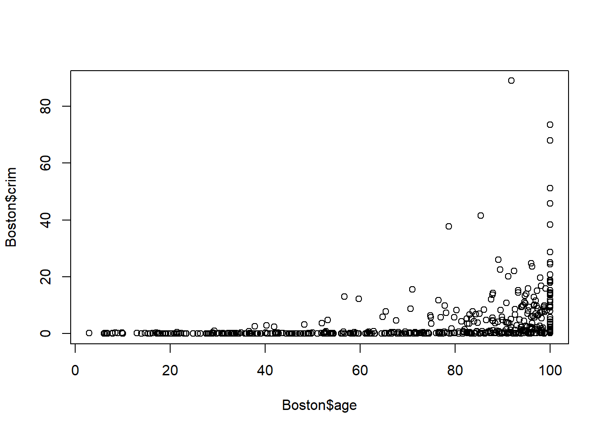

# (PART\*) Section 1 {.unnumbered}

# Overview {.unnumbered}

::: {style="color: #333; font-size: 24px; font-style: italic; text-align: justify;"}
Section 1: Introduction to Data Science: The Basics of Statistical
Learning
:::

**In this section, you will practice using the functions below. It is
highly recommended that you explore these functions further using the
Help tab in your RStudio console. You can access the R documentation in
the Help tab using ? (e.g. `?read.csv`)**

|            Function             |                                   Description                                   |       Package       |
|:----------------------:|:----------------------:|:----------------------:|
|          `read.csv()`           |                                 read csv files                                  |       base R        |
|          `read_csv()`           |                                 read csv files                                  |      tidyverse      |
|     `column_to_rownames()`      |                           convert column to row names                           |      tidyverse      |
|          `rownames()`           |                              obtain names of rows                               |       base R        |
|           `summary()`           |                            obtain summary statistics                            |       base R        |
|            `pairs()`            |                        produce a matrix of scatterplots                         |       base R        |
|            `plot()`             |                                  create a plot                                  |       base R        |
|           `ggplot()`            |                      generic function for creating a plot                       | tidyverse (ggplot2) |
|           `mutate()`            |                       create, modify, and delete columns                        |  tidyverse (dplyr)  |
|           `if_else()`           |                            condition-based function                             |  tidyverse (dplyr)  |
|          `as_factor()`          |                       create factor using existing levels                       | tidyverse (forcats) |
|             `par()`             |                            set graphical parameters                             |       base R        |
|            `mfrow()`            |                                `par()` parameter                                |       base R        |
| `slice_min()` and `slice_max()` | index rows by location (smallest and largest values of a variable respectively) |  tidyverse (dplyr)  |

::: ilos
**Learning Outcomes:**

-   indexing using base R;
-   create scatterplot matrices;
-   create new variables;
-   transform existing variables;
-   translate base R code to `tidyverse` and vice versa.
:::

# Practical 1 {.unnumbered}

<script>
document.addEventListener('DOMContentLoaded', function() {
    // Find all <details> elements as potential containers of R input
    var detailElements = document.querySelectorAll('details.chunk-details');

    detailElements.forEach(function(details) {
        var nextElement = details.nextElementSibling;
        var elementToToggle = null;

        // Check if the nextElement is a textual R output
        if (nextElement && nextElement.matches('pre') && nextElement.textContent.trim().startsWith('##')) {
            elementToToggle = nextElement;
        }
        // Alternatively, check if the nextElement contains a graphical R output (plot)
        else if (nextElement && nextElement.querySelector('img')) {
            elementToToggle = nextElement;
        }

        // Proceed to create a toggle button only if a matching element is found
        if (elementToToggle) {
            var button = document.createElement('button');
            button.className = 'toggle-button';
            button.textContent = 'Show R Output';
            button.style.display = 'block';

            // Initially hide the R output/plot
            elementToToggle.style.display = 'none';

            button.onclick = function() {
                var isHidden = elementToToggle.style.display === 'none';
                elementToToggle.style.display = isHidden ? 'block' : 'none';
                button.textContent = isHidden ? 'Hide R Output' : 'Show R Output';
            };

            // Insert the toggle button immediately after the <details>
            details.parentNode.insertBefore(button, details.nextSibling);
        }
    });
});
</script>

<script>
document.addEventListener('DOMContentLoaded', function() {
    var answers = document.querySelectorAll('.answers');

    answers.forEach(function(answer) {
        // Create the toggle button
        var button = document.createElement('button');
        button.className = 'toggle-answer-button';
        button.textContent = 'Show Answer'; // Updated text content
        button.style.display = 'block'; // Ensure button is visible
        answer.style.display = 'none'; // Initially hide the answer

        // Add click event listener to the button
        button.onclick = function() {
            if (answer.style.display === 'none') {
                answer.style.display = 'block'; // Show the answer
                button.textContent = 'Hide Answer'; // Update button text
            } else {
                answer.style.display = 'none'; // Hide the answer
                button.textContent = 'Show Answer'; // Reset button text
            }
        };

        // Insert the button before the answer
        answer.parentNode.insertBefore(button, answer);
    });
});

</script>

This practical consists of two parts, both of which will use datasets
and exercises adapted from the core textbook for this course:

James, G., Witten, D., Hastie, T. and Tibshirani, R. (2021). *An
Introduction to Statistical Learning with Applications in R*. 2nd ed.
New York: Springer. <https://www.statlearning.com/>

## PART I {.unnumbered}

::: file
For the tasks below, you will require the **College** dataset.

Click here to download the file:
<a href="data/College.csv" download="College.csv"> College.csv </a>.

*Remember to place your data file in a separate subfolder within your R
project working directory.*
:::

This data file contains 18 variables for 777 different universities and
colleges in the United States. The variables are:

-   Private : Public/private indicator
-   Apps : Number of applications received
-   Accept : Number of applicants accepted
-   Enroll : Number of new students enrolled\
-   Top10perc : New students from top 10% of high school class
-   Top25perc : New students from top 25% of high school class
-   F.Undergrad : Number of full-time undergraduates
-   P.Undergrad : Number of part-time undergraduates
-   Outstate : Out-of-state tuition
-   Room.Board : Room and board costs
-   Books : Estimated book costs
-   Personal : Estimated personal spending
-   PhD : Percent of faculty with Ph.D.’s
-   Terminal : Percent of faculty with terminal degree
-   S.F.Ratio: Student/faculty ratio
-   perc.alumni : Percent of alumni who donate
-   Expend : Instructional expenditure per student
-   Grad.Rate : Graduation rate

### Task 1 {.unnumbered}

Import the dataset using a suitable tidyverse function and name this
object `college`.


```r
# Remember to load tidyverse first

library(tidyverse)

college <- read_csv("data/College.csv")
```

If you have a look at the contents of the data object using `View()`,
you will notice that the first column contains the names of all of the
universities in the dataset. You will also notice that it has a strange
name.


Actually, these data should not be treated as a variable (column) since
it is just a list of university names.

### Task 2 {.unnumbered}

Keeping the list of names in the data object, transform this column such
that the university names in the column become row names. Hint: use the
`column_to_rownames()` function from `dplyr`.


```r
college <- college %>% column_to_rownames(var = "...1") 
```

::: question
How would have your approach to this task differed if you would have
imported the dataset using base R? Try it!
:::

::: answers
The data file could have instead been imported using `read.csv()`:

`college <- read.csv("data/College.csv")`

Using the base R approach, the first column containing the university
names would have been named "X", as shown below using `View()`.


Now, how would be go about transforming the contents of the first column
into row names?

This would require two steps.

First, we assign the column contents to rows names.

`rownames(college) <- college[, 1]`

If you have another look at the data object, you will see that the rows
have now been renamed using the university names in the "X" column, but
the column is still part of the dataset. We therefore need to tell R to
delete the column.

`college <- college[, -1]`
:::

### Task 3 {.unnumbered}

Produce summary statistics for all variables in the data object.


```r
summary(college)
```

```
##    Private               Apps           Accept          Enroll    
##  Length:777         Min.   :   81   Min.   :   72   Min.   :  35  
##  Class :character   1st Qu.:  776   1st Qu.:  604   1st Qu.: 242  
##  Mode  :character   Median : 1558   Median : 1110   Median : 434  
##                     Mean   : 3002   Mean   : 2019   Mean   : 780  
##                     3rd Qu.: 3624   3rd Qu.: 2424   3rd Qu.: 902  
##                     Max.   :48094   Max.   :26330   Max.   :6392  
##    Top10perc       Top25perc      F.Undergrad     P.Undergrad     
##  Min.   : 1.00   Min.   :  9.0   Min.   :  139   Min.   :    1.0  
##  1st Qu.:15.00   1st Qu.: 41.0   1st Qu.:  992   1st Qu.:   95.0  
##  Median :23.00   Median : 54.0   Median : 1707   Median :  353.0  
##  Mean   :27.56   Mean   : 55.8   Mean   : 3700   Mean   :  855.3  
##  3rd Qu.:35.00   3rd Qu.: 69.0   3rd Qu.: 4005   3rd Qu.:  967.0  
##  Max.   :96.00   Max.   :100.0   Max.   :31643   Max.   :21836.0  
##     Outstate       Room.Board       Books           Personal   
##  Min.   : 2340   Min.   :1780   Min.   :  96.0   Min.   : 250  
##  1st Qu.: 7320   1st Qu.:3597   1st Qu.: 470.0   1st Qu.: 850  
##  Median : 9990   Median :4200   Median : 500.0   Median :1200  
##  Mean   :10441   Mean   :4358   Mean   : 549.4   Mean   :1341  
##  3rd Qu.:12925   3rd Qu.:5050   3rd Qu.: 600.0   3rd Qu.:1700  
##  Max.   :21700   Max.   :8124   Max.   :2340.0   Max.   :6800  
##       PhD            Terminal       S.F.Ratio      perc.alumni   
##  Min.   :  8.00   Min.   : 24.0   Min.   : 2.50   Min.   : 0.00  
##  1st Qu.: 62.00   1st Qu.: 71.0   1st Qu.:11.50   1st Qu.:13.00  
##  Median : 75.00   Median : 82.0   Median :13.60   Median :21.00  
##  Mean   : 72.66   Mean   : 79.7   Mean   :14.09   Mean   :22.74  
##  3rd Qu.: 85.00   3rd Qu.: 92.0   3rd Qu.:16.50   3rd Qu.:31.00  
##  Max.   :103.00   Max.   :100.0   Max.   :39.80   Max.   :64.00  
##      Expend        Grad.Rate     
##  Min.   : 3186   Min.   : 10.00  
##  1st Qu.: 6751   1st Qu.: 53.00  
##  Median : 8377   Median : 65.00  
##  Mean   : 9660   Mean   : 65.46  
##  3rd Qu.:10830   3rd Qu.: 78.00  
##  Max.   :56233   Max.   :118.00
```

### Task 4 {.unnumbered}

Create a scatterplot matrix of the first three numeric variables.


```r
pairs(college[,2:4])
```


### Task 5 {.unnumbered}

Produce side by side box plots of `Outstate` versus `Private` using base
R.


```r
plot(college$Private, college$Outstate, xlab = "Private", ylab = "Outstate")
```

::: question
Did this work? Why?
:::

::: answers
Using the `plot()` base R function to produce a box plot would produce
an error since the `Private` variable is of class character. Most
statistical functions will not work with character vectors.

`Error in plot.window(...) : need finite 'xlim' values`\
`In addition: Warning messages:`\
`1: In xy.coords(x, y, xlabel, ylabel, log) : NAs introduced by coercion`\
`2: In min(x) : no non-missing arguments to min; returning Inf`\
`3: In max(x) : no non-missing arguments to max; returning -Inf`

Creating a box plot with `tidyverse` would work.

`college %>%       ggplot(aes(x = Private, y = Outstate)) +        geom_boxplot()`


However, it is important to note that if a variable is not of the right
class, then this might have unintended consequences for example, when
building models. In this case, the `Private` variable must be
transformed into a factor.
:::

### Task 6 {.unnumbered}

Using the `Top10perc` variable, create a new categorical variable called
`Elite` such that universities are divided into two groups based on
whether or not the proportion of students coming from the top 10% of
their high school classes exceeds 50%. Hint: use a combination of
`mutate()` and `if_else()`.


```r
college <- college %>%
  mutate(Elite = if_else(Top10perc > 50, "Yes", "No"),
         Elite = as_factor(Elite))
#do not forget the factor transformation step (categorical variables are factors in R)
```

### Task 7 {.unnumbered}

Produce side by side box plots of the new `Elite` variable and
`Outstate`.


```r
college %>%  
  ggplot(aes(x = Elite, y = Outstate)) +   
  geom_boxplot()
```


::: question
How would you produce a similar plot using base R?
:::

::: answers
`plot(college$Elite, college$Outstate,  xlab = "Elite", ylab = "Outstate")`
:::

### Task 8 {.unnumbered}

Use base R to produce a multipanel plot that displays histograms of the
following variables: `Apps`, `perc.alumni`, `S.F.Ratio`, `Expend`. Hint:
use `par(mfrow=c(2,2))` to set up a 2x2 panel. Try to adjust the
specifications (e.g. breaks).


```r
# An example is shown below. Note that the purpose of the mfrow parameter is to change the default way in which R displays plots which is in a single panel display. Once applied, all plots you create later will also be displayed in a 2x2 grid. To revert back, you need to enter par(mfrow=c(1,1)) into the console.

par(mfrow=c(2,2))
hist(college$Apps)
hist(college$perc.alumni, col=2)
hist(college$S.F.Ratio, col=3, breaks=10)
hist(college$Expend, breaks=100)
```


### Task 9 {.unnumbered}

Using `Accept` and `Apps`, create a new variable that describes
acceptance rate. Name this variable `acceptance_rate`. Hint: use
`mutate()`.


```r
college <- college %>%
  mutate(acceptance_rate = Accept / Apps)
```

### Task 10 {.unnumbered}

Using the `acceptance_rate` variable, find out which university has the
lowest acceptance rate. Hint: for a `tidyverse` approach, you can use
`slice_min()`.


```r
college %>%
  slice_min(order_by = acceptance_rate, n = 1)
```

```
##                      Private  Apps Accept Enroll Top10perc Top25perc
## Princeton University     Yes 13218   2042   1153        90        98
##                      F.Undergrad P.Undergrad Outstate Room.Board Books Personal
## Princeton University        4540         146    19900       5910   675     1575
##                      PhD Terminal S.F.Ratio perc.alumni Expend Grad.Rate Elite
## Princeton University  91       96       8.4          54  28320        99   Yes
##                      acceptance_rate
## Princeton University       0.1544863
```

### Task 11 {.unnumbered}

Using the `acceptance_rate` variable, find out which university has the
highest acceptance rate.


```r
college %>%
  slice_max(order_by = acceptance_rate, n = 1)
```

```
##                                  Private Apps Accept Enroll Top10perc Top25perc
## Emporia State University              No 1256   1256    853        43        79
## Mayville State University             No  233    233    153         5        12
## MidAmerica Nazarene College          Yes  331    331    225        15        36
## Southwest Baptist University         Yes 1093   1093    642        12        32
## University of Wisconsin-Superior      No  910    910    342        14        53
## Wayne State College                   No 1373   1373    724         6        21
##                                  F.Undergrad P.Undergrad Outstate Room.Board
## Emporia State University                3957         588     5401       3144
## Mayville State University                658          58     4486       2516
## MidAmerica Nazarene College             1100         166     6840       3720
## Southwest Baptist University            1770         967     7070       2500
## University of Wisconsin-Superior        1434         417     7032       2780
## Wayne State College                     2754         474     2700       2660
##                                  Books Personal PhD Terminal S.F.Ratio
## Emporia State University           450     1888  72       75      19.3
## Mayville State University          600     1900  68       68      15.7
## MidAmerica Nazarene College       1100     4913  33       33      15.4
## Southwest Baptist University       400     1000  52       54      15.9
## University of Wisconsin-Superior   550     1960  75       81      15.2
## Wayne State College                540     1660  60       68      20.3
##                                  perc.alumni Expend Grad.Rate Elite
## Emporia State University                   4   5527        50    No
## Mayville State University                 11   6971        51    No
## MidAmerica Nazarene College               20   5524        49    No
## Southwest Baptist University              13   4718        71    No
## University of Wisconsin-Superior          15   6490        36    No
## Wayne State College                       29   4550        52    No
##                                  acceptance_rate
## Emporia State University                       1
## Mayville State University                      1
## MidAmerica Nazarene College                    1
## Southwest Baptist University                   1
## University of Wisconsin-Superior               1
## Wayne State College                            1
```

## PART II {.unnumbered}

::: file
For the tasks below, you will require the **Boston** dataset.

Click here to download the file:
<a href="data/Boston.csv" download="Boston.csv"> Boston.csv </a>.

*Remember to place your data file in a separate subfolder within your R
project working directory.*
:::


```r
Boston <- read_csv("data/Boston.csv")
```

```
## New names:
## Rows: 506 Columns: 14
## ── Column specification
## ──────────────────────────────────────────────────────── Delimiter: "," dbl
## (14): ...1, crim, zn, indus, chas, nox, rm, age, dis, rad, tax, ptratio,...
## ℹ Use `spec()` to retrieve the full column specification for this data. ℹ
## Specify the column types or set `show_col_types = FALSE` to quiet this message.
## • `` -> `...1`
```

```r
#b
pairs(Boston)
```


```r
#c
plot(Boston$age, Boston$crim)
```



```r
# Older homes, more crime
plot(Boston$dis, Boston$crim)
```


```r
# Closer to work-area, more crime
plot(Boston$rad, Boston$crim)
```


```r
# Higher index of accessibility to radial highways, more crime
plot(Boston$tax, Boston$crim)
```


```r
# Higher tax rate, more crime
plot(Boston$ptratio, Boston$crim)
```


```r
#d
par(mfrow=c(1,3))
hist(Boston$crim[Boston$crim>1], breaks=25)
# most cities have low crime rates, but there is a long tail: 18 suburbs appear
# to have a crime rate > 20, reaching to above 80
hist(Boston$tax, breaks=25)
# there is a large divide between suburbs with low tax rates and a peak at 660-680
hist(Boston$ptratio, breaks=25)
```


```r
# a skew towards high ratios, but no particularly high ratios
```


```r
#Q(e)-(h)
```


```r
# (e)
dim(subset(Boston, chas == 1))
```

```
## [1] 35 14
```

```r
# (f)
median(Boston$ptratio)
```

```
## [1] 19.05
```

```r
# (g)
t(subset(Boston, medv == min(Boston$medv)))
```

```
##             [,1]     [,2]
## ...1    399.0000 406.0000
## crim     38.3518  67.9208
## zn        0.0000   0.0000
## indus    18.1000  18.1000
## chas      0.0000   0.0000
## nox       0.6930   0.6930
## rm        5.4530   5.6830
## age     100.0000 100.0000
## dis       1.4896   1.4254
## rad      24.0000  24.0000
## tax     666.0000 666.0000
## ptratio  20.2000  20.2000
## lstat    30.5900  22.9800
## medv      5.0000   5.0000
```

```r
summary(Boston)
```

```
##       ...1            crim                zn             indus      
##  Min.   :  1.0   Min.   : 0.00632   Min.   :  0.00   Min.   : 0.46  
##  1st Qu.:127.2   1st Qu.: 0.08205   1st Qu.:  0.00   1st Qu.: 5.19  
##  Median :253.5   Median : 0.25651   Median :  0.00   Median : 9.69  
##  Mean   :253.5   Mean   : 3.61352   Mean   : 11.36   Mean   :11.14  
##  3rd Qu.:379.8   3rd Qu.: 3.67708   3rd Qu.: 12.50   3rd Qu.:18.10  
##  Max.   :506.0   Max.   :88.97620   Max.   :100.00   Max.   :27.74  
##       chas              nox               rm             age        
##  Min.   :0.00000   Min.   :0.3850   Min.   :3.561   Min.   :  2.90  
##  1st Qu.:0.00000   1st Qu.:0.4490   1st Qu.:5.886   1st Qu.: 45.02  
##  Median :0.00000   Median :0.5380   Median :6.208   Median : 77.50  
##  Mean   :0.06917   Mean   :0.5547   Mean   :6.285   Mean   : 68.57  
##  3rd Qu.:0.00000   3rd Qu.:0.6240   3rd Qu.:6.623   3rd Qu.: 94.08  
##  Max.   :1.00000   Max.   :0.8710   Max.   :8.780   Max.   :100.00  
##       dis              rad              tax           ptratio     
##  Min.   : 1.130   Min.   : 1.000   Min.   :187.0   Min.   :12.60  
##  1st Qu.: 2.100   1st Qu.: 4.000   1st Qu.:279.0   1st Qu.:17.40  
##  Median : 3.207   Median : 5.000   Median :330.0   Median :19.05  
##  Mean   : 3.795   Mean   : 9.549   Mean   :408.2   Mean   :18.46  
##  3rd Qu.: 5.188   3rd Qu.:24.000   3rd Qu.:666.0   3rd Qu.:20.20  
##  Max.   :12.127   Max.   :24.000   Max.   :711.0   Max.   :22.00  
##      lstat            medv      
##  Min.   : 1.73   Min.   : 5.00  
##  1st Qu.: 6.95   1st Qu.:17.02  
##  Median :11.36   Median :21.20  
##  Mean   :12.65   Mean   :22.53  
##  3rd Qu.:16.95   3rd Qu.:25.00  
##  Max.   :37.97   Max.   :50.00
```

```r
# Not the best place to live, but certainly not the worst.

# (h)
dim(subset(Boston, rm > 7))
```

```
## [1] 64 14
```

```r
dim(subset(Boston, rm > 8))
```

```
## [1] 13 14
```

```r
summary(subset(Boston, rm > 8))
```

```
##       ...1            crim               zn            indus       
##  Min.   : 98.0   Min.   :0.02009   Min.   : 0.00   Min.   : 2.680  
##  1st Qu.:225.0   1st Qu.:0.33147   1st Qu.: 0.00   1st Qu.: 3.970  
##  Median :233.0   Median :0.52014   Median : 0.00   Median : 6.200  
##  Mean   :232.3   Mean   :0.71879   Mean   :13.62   Mean   : 7.078  
##  3rd Qu.:258.0   3rd Qu.:0.57834   3rd Qu.:20.00   3rd Qu.: 6.200  
##  Max.   :365.0   Max.   :3.47428   Max.   :95.00   Max.   :19.580  
##       chas             nox               rm             age       
##  Min.   :0.0000   Min.   :0.4161   Min.   :8.034   Min.   : 8.40  
##  1st Qu.:0.0000   1st Qu.:0.5040   1st Qu.:8.247   1st Qu.:70.40  
##  Median :0.0000   Median :0.5070   Median :8.297   Median :78.30  
##  Mean   :0.1538   Mean   :0.5392   Mean   :8.349   Mean   :71.54  
##  3rd Qu.:0.0000   3rd Qu.:0.6050   3rd Qu.:8.398   3rd Qu.:86.50  
##  Max.   :1.0000   Max.   :0.7180   Max.   :8.780   Max.   :93.90  
##       dis             rad              tax           ptratio     
##  Min.   :1.801   Min.   : 2.000   Min.   :224.0   Min.   :13.00  
##  1st Qu.:2.288   1st Qu.: 5.000   1st Qu.:264.0   1st Qu.:14.70  
##  Median :2.894   Median : 7.000   Median :307.0   Median :17.40  
##  Mean   :3.430   Mean   : 7.462   Mean   :325.1   Mean   :16.36  
##  3rd Qu.:3.652   3rd Qu.: 8.000   3rd Qu.:307.0   3rd Qu.:17.40  
##  Max.   :8.907   Max.   :24.000   Max.   :666.0   Max.   :20.20  
##      lstat           medv     
##  Min.   :2.47   Min.   :21.9  
##  1st Qu.:3.32   1st Qu.:41.7  
##  Median :4.14   Median :48.3  
##  Mean   :4.31   Mean   :44.2  
##  3rd Qu.:5.12   3rd Qu.:50.0  
##  Max.   :7.44   Max.   :50.0
```

```r
summary(Boston)
```

```
##       ...1            crim                zn             indus      
##  Min.   :  1.0   Min.   : 0.00632   Min.   :  0.00   Min.   : 0.46  
##  1st Qu.:127.2   1st Qu.: 0.08205   1st Qu.:  0.00   1st Qu.: 5.19  
##  Median :253.5   Median : 0.25651   Median :  0.00   Median : 9.69  
##  Mean   :253.5   Mean   : 3.61352   Mean   : 11.36   Mean   :11.14  
##  3rd Qu.:379.8   3rd Qu.: 3.67708   3rd Qu.: 12.50   3rd Qu.:18.10  
##  Max.   :506.0   Max.   :88.97620   Max.   :100.00   Max.   :27.74  
##       chas              nox               rm             age        
##  Min.   :0.00000   Min.   :0.3850   Min.   :3.561   Min.   :  2.90  
##  1st Qu.:0.00000   1st Qu.:0.4490   1st Qu.:5.886   1st Qu.: 45.02  
##  Median :0.00000   Median :0.5380   Median :6.208   Median : 77.50  
##  Mean   :0.06917   Mean   :0.5547   Mean   :6.285   Mean   : 68.57  
##  3rd Qu.:0.00000   3rd Qu.:0.6240   3rd Qu.:6.623   3rd Qu.: 94.08  
##  Max.   :1.00000   Max.   :0.8710   Max.   :8.780   Max.   :100.00  
##       dis              rad              tax           ptratio     
##  Min.   : 1.130   Min.   : 1.000   Min.   :187.0   Min.   :12.60  
##  1st Qu.: 2.100   1st Qu.: 4.000   1st Qu.:279.0   1st Qu.:17.40  
##  Median : 3.207   Median : 5.000   Median :330.0   Median :19.05  
##  Mean   : 3.795   Mean   : 9.549   Mean   :408.2   Mean   :18.46  
##  3rd Qu.: 5.188   3rd Qu.:24.000   3rd Qu.:666.0   3rd Qu.:20.20  
##  Max.   :12.127   Max.   :24.000   Max.   :711.0   Max.   :22.00  
##      lstat            medv      
##  Min.   : 1.73   Min.   : 5.00  
##  1st Qu.: 6.95   1st Qu.:17.02  
##  Median :11.36   Median :21.20  
##  Mean   :12.65   Mean   :22.53  
##  3rd Qu.:16.95   3rd Qu.:25.00  
##  Max.   :37.97   Max.   :50.00
```

```r
# relatively lower crime (comparing range), lower lstat (comparing range)
```
