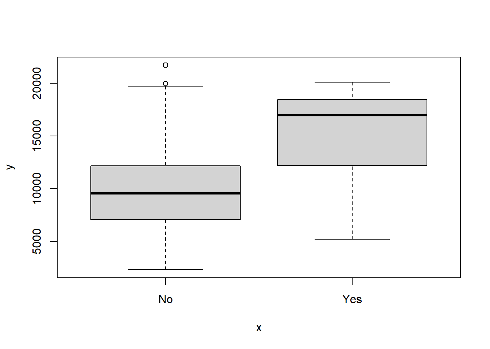
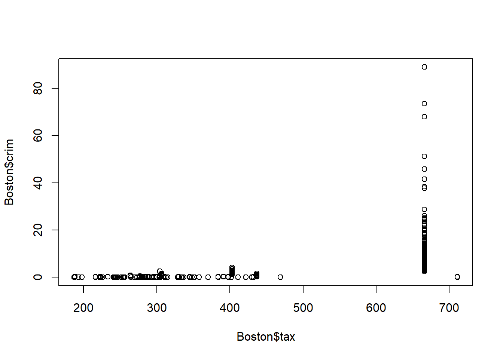

# (PART\*) Section 1 {.unnumbered}

# Overview {.unnumbered}

::: {style="color: #333; font-size: 24px; font-style: italic; text-align: justify;"}
Section 1: Introduction to Data Science: The Basics of Statistical Learning
:::

**In this section, we will cover the following functions:**

|   Function    |               Description               | Package |
|:-------------:|:---------------------------------------:|:-------:|
|     `c()`     |               concatenate               | base R  |
|    `ls()`     | provides names of object in environment | base R  |
|    `rm()`     |             remove objects              | base R  |
|   `View()`    | viewing data objects spreadsheet-style  | base R  |


::: ilos
**Learning Outcomes:**  
-   
:::

# Practical 1 {-}

<script>
document.addEventListener('DOMContentLoaded', function() {
    // Find all <details> elements as potential containers of R input
    var detailElements = document.querySelectorAll('details.chunk-details');

    detailElements.forEach(function(details) {
        var nextElement = details.nextElementSibling;
        var elementToToggle = null;

        // Check if the nextElement is a textual R output
        if (nextElement && nextElement.matches('pre') && nextElement.textContent.trim().startsWith('##')) {
            elementToToggle = nextElement;
        }
        // Alternatively, check if the nextElement contains a graphical R output (plot)
        else if (nextElement && nextElement.querySelector('img')) {
            elementToToggle = nextElement;
        }

        // Proceed to create a toggle button only if a matching element is found
        if (elementToToggle) {
            var button = document.createElement('button');
            button.className = 'toggle-button';
            button.textContent = 'Show R Output';
            button.style.display = 'block';

            // Initially hide the R output/plot
            elementToToggle.style.display = 'none';

            button.onclick = function() {
                var isHidden = elementToToggle.style.display === 'none';
                elementToToggle.style.display = isHidden ? 'block' : 'none';
                button.textContent = isHidden ? 'Hide R Output' : 'Show R Output';
            };

            // Insert the toggle button immediately after the <details>
            details.parentNode.insertBefore(button, details.nextSibling);
        }
    });
});
</script>

<script>
document.addEventListener('DOMContentLoaded', function() {
    var answers = document.querySelectorAll('.answers');

    answers.forEach(function(answer) {
        // Create the toggle button
        var button = document.createElement('button');
        button.className = 'toggle-answer-button';
        button.textContent = 'Show Answer'; // Updated text content
        button.style.display = 'block'; // Ensure button is visible
        answer.style.display = 'none'; // Initially hide the answer

        // Add click event listener to the button
        button.onclick = function() {
            if (answer.style.display === 'none') {
                answer.style.display = 'block'; // Show the answer
                button.textContent = 'Hide Answer'; // Update button text
            } else {
                answer.style.display = 'none'; // Hide the answer
                button.textContent = 'Show Answer'; // Reset button text
            }
        };

        // Insert the button before the answer
        answer.parentNode.insertBefore(button, answer);
    });
});

</script>


This practical consists of two parts, both of which will use datasets and exercises adapted from the core textbook for this course.   

::: reference
*Reference*  
James, G., Witten, D., Hastie, T. and Tibshirani, R. (2021). *An Introduction to Statistical Learning with Applications in R*. 2nd ed. New York: Springer.  https://www.statlearning.com/      
::: 

## PART I {-}

::: file
For the tasks below, you will require the **College** dataset.  

Click here to download the file: <a href="data/College.csv" download="College.csv"> College.csv </a>.    

*Remember to place your data file in a separate subfolder within your R project working directory.*
:::

This data file contains 18 variables for 777 different universities and colleges in the United States. The variables are: 

-   Private : Public/private indicator
-   Apps : Number of applications received
-   Accept : Number of applicants accepted 
-   Enroll : Number of new students enrolled  
-   Top10perc : New students from top 10% of high school class
-   Top25perc : New students from top 25% of high school class
-   F.Undergrad : Number of full-time undergraduates
-   P.Undergrad : Number of part-time undergraduates
-   Outstate : Out-of-state tuition
-   Room.Board : Room and board costs
-   Books : Estimated book costs
-   Personal : Estimated personal spending
-   PhD : Percent of faculty with Ph.D.’s
-   Terminal : Percent of faculty with terminal degree
-   S.F.Ratio: Student/faculty ratio
-   perc.alumni : Percent of alumni who donate
-   Expend : Instructional expenditure per student
-   Grad.Rate : Graduation rate


### Task 1 {-}

Import the dataset using a suitable tidyverse function and name this object `college`.


```r
# Remember to load tidyverse first

library(tidyverse)

college <- read_csv("data/College.csv")
```

If you have a look at the contents of the data object using `View()`, you will notice that the first column contains the names of all of the universities in the dataset. You will also notice that it has a strange name.

::: image

:::


Actually, these data should not be treated as a variable (column) since it is just a list of university names. 

### Task 2 {-}

Keeping the list of names in the data object, transform this column such that the university names in the column become row names. Hint: use the  `column_to_rownames()` function from `dplyr`.


```r
college <- college %>% column_to_rownames(var = "...1") 
```

::: question
How would have your approach to this task differed if you would have imported the dataset using base R? Try it!
:::

::: answers
The data file could have instead been imported using `read.csv()`:  
 
`college <- read.csv("data/College.csv")`   


Using the base R approach, the first column containing the university names would have been named "X", as shown below using `View()`.

   

Now, how would be go about transforming the contents of the first column into row names?

This would require two steps.   

First, we assign the column contents to rows names. 

`rownames(college) <- college[, 1]`     

If you have another look at the data object, you will see that the rows have now been renamed using the university names in the "X" column, but the column is still part of the dataset. We therefore need to tell R to delete the column. 

`college <- college[, -1]`
:::


### Task 3 {-}

Create a scatterplot matrix of the first three numeric variables. 


```r
pairs(college[,2:4])
```


```r
summary(college)
```

```
##    Private               Apps           Accept          Enroll    
##  Length:777         Min.   :   81   Min.   :   72   Min.   :  35  
##  Class :character   1st Qu.:  776   1st Qu.:  604   1st Qu.: 242  
##  Mode  :character   Median : 1558   Median : 1110   Median : 434  
##                     Mean   : 3002   Mean   : 2019   Mean   : 780  
##                     3rd Qu.: 3624   3rd Qu.: 2424   3rd Qu.: 902  
##                     Max.   :48094   Max.   :26330   Max.   :6392  
##    Top10perc       Top25perc      F.Undergrad     P.Undergrad     
##  Min.   : 1.00   Min.   :  9.0   Min.   :  139   Min.   :    1.0  
##  1st Qu.:15.00   1st Qu.: 41.0   1st Qu.:  992   1st Qu.:   95.0  
##  Median :23.00   Median : 54.0   Median : 1707   Median :  353.0  
##  Mean   :27.56   Mean   : 55.8   Mean   : 3700   Mean   :  855.3  
##  3rd Qu.:35.00   3rd Qu.: 69.0   3rd Qu.: 4005   3rd Qu.:  967.0  
##  Max.   :96.00   Max.   :100.0   Max.   :31643   Max.   :21836.0  
##     Outstate       Room.Board       Books           Personal   
##  Min.   : 2340   Min.   :1780   Min.   :  96.0   Min.   : 250  
##  1st Qu.: 7320   1st Qu.:3597   1st Qu.: 470.0   1st Qu.: 850  
##  Median : 9990   Median :4200   Median : 500.0   Median :1200  
##  Mean   :10441   Mean   :4358   Mean   : 549.4   Mean   :1341  
##  3rd Qu.:12925   3rd Qu.:5050   3rd Qu.: 600.0   3rd Qu.:1700  
##  Max.   :21700   Max.   :8124   Max.   :2340.0   Max.   :6800  
##       PhD            Terminal       S.F.Ratio      perc.alumni   
##  Min.   :  8.00   Min.   : 24.0   Min.   : 2.50   Min.   : 0.00  
##  1st Qu.: 62.00   1st Qu.: 71.0   1st Qu.:11.50   1st Qu.:13.00  
##  Median : 75.00   Median : 82.0   Median :13.60   Median :21.00  
##  Mean   : 72.66   Mean   : 79.7   Mean   :14.09   Mean   :22.74  
##  3rd Qu.: 85.00   3rd Qu.: 92.0   3rd Qu.:16.50   3rd Qu.:31.00  
##  Max.   :103.00   Max.   :100.0   Max.   :39.80   Max.   :64.00  
##      Expend        Grad.Rate     
##  Min.   : 3186   Min.   : 10.00  
##  1st Qu.: 6751   1st Qu.: 53.00  
##  Median : 8377   Median : 65.00  
##  Mean   : 9660   Mean   : 65.46  
##  3rd Qu.:10830   3rd Qu.: 78.00  
##  Max.   :56233   Max.   :118.00
```


```r
#iii) plot side by side boxplots of Outstate versus Private (Private universities have more out of state students):

class(college$Private)
```

```
## [1] "character"
```

```r
#Character vectors cannot be used in most statistical functions in R, since they don't define groups.
college$Private <- ifelse(college$Private=="Yes", 1, 0)
#we need to convert the Character vector 'private' to numerical vector.
plot(college$Private, college$Outstate)
```


```r
#iv)
Elite <- rep("No", nrow(college))
Elite[college$Top10perc > 50] <- "Yes"
Elite <- as.factor(Elite)
college <- data.frame(college, Elite)

summary(Elite)
```

```
##  No Yes 
## 699  78
```

```r
# plot side by side boxplots of Outstate versus Elite (Elite universities have more out of state students):
plot(college$Elite, college$Outstate)
```



```r
#v)

par(mfrow=c(2,2))
hist(college$Apps)
hist(college$perc.alumni, col=2)
hist(college$S.F.Ratio, col=3, breaks=10)
hist(college$Expend, breaks=100)
```


```r
#vi)
#for example

college[which.max(college$Top10perc), ]  # what is the university with the most students in the top 10% of class
```

```
##                                       Private Apps Accept Enroll Top10perc
## Massachusetts Institute of Technology       1 6411   2140   1078        96
##                                       Top25perc F.Undergrad P.Undergrad
## Massachusetts Institute of Technology        99        4481          28
##                                       Outstate Room.Board Books Personal PhD
## Massachusetts Institute of Technology    20100       5975   725     1600  99
##                                       Terminal S.F.Ratio perc.alumni Expend
## Massachusetts Institute of Technology       99      10.1          35  33541
##                                       Grad.Rate Elite
## Massachusetts Institute of Technology        94   Yes
```

```r
acceptance_rate <- college$Accept/college$Apps

college[which.min(acceptance_rate), ]  # what university has the smallest acceptance rate
```

```
##                      Private  Apps Accept Enroll Top10perc Top25perc
## Princeton University       1 13218   2042   1153        90        98
##                      F.Undergrad P.Undergrad Outstate Room.Board Books Personal
## Princeton University        4540         146    19900       5910   675     1575
##                      PhD Terminal S.F.Ratio perc.alumni Expend Grad.Rate Elite
## Princeton University  91       96       8.4          54  28320        99   Yes
```

```r
college[which.max(acceptance_rate), ]  # what university has the most liberal acceptance rate
```

```
##                          Private Apps Accept Enroll Top10perc Top25perc
## Emporia State University       0 1256   1256    853        43        79
##                          F.Undergrad P.Undergrad Outstate Room.Board Books
## Emporia State University        3957         588     5401       3144   450
##                          Personal PhD Terminal S.F.Ratio perc.alumni Expend
## Emporia State University     1888  72       75      19.3           4   5527
##                          Grad.Rate Elite
## Emporia State University        50    No
```

## PART II {-}


For the exercises below, you will require the **Boston** dataset. 

Click here to download the file: <a href="data/Boston.csv" download="Boston.csv"> Boston.csv </a>.   
In this practical, you will revise and practice your R programming skills using some sample data from universities and colleges in the United States.   

Click on the following link to download the file: <a href="data/boston.csv" download="boston.csv"> boston.csv </a>. 


```r
#Q(a)-(d)
```


```r
#a
library(MASS)
```

```
## Warning: package 'MASS' was built under R version 4.2.3
```

```
## 
## Attaching package: 'MASS'
```

```
## The following object is masked from 'package:dplyr':
## 
##     select
```

```r
#b
pairs(Boston)
```


```r
#c
plot(Boston$age, Boston$crim)
```


```r
# Older homes, more crime
plot(Boston$dis, Boston$crim)
```


```r
# Closer to work-area, more crime
plot(Boston$rad, Boston$crim)
```


```r
# Higher index of accessibility to radial highways, more crime
plot(Boston$tax, Boston$crim)
```



```r
# Higher tax rate, more crime
plot(Boston$ptratio, Boston$crim)
```


```r
#d
par(mfrow=c(1,3))
hist(Boston$crim[Boston$crim>1], breaks=25)
# most cities have low crime rates, but there is a long tail: 18 suburbs appear
# to have a crime rate > 20, reaching to above 80
hist(Boston$tax, breaks=25)
# there is a large divide between suburbs with low tax rates and a peak at 660-680
hist(Boston$ptratio, breaks=25)
```


```r
# a skew towards high ratios, but no particularly high ratios
```


```r
#Q(e)-(h)
```


```r
# (e)
dim(subset(Boston, chas == 1))
```

```
## [1] 35 14
```

```r
# (f)
median(Boston$ptratio)
```

```
## [1] 19.05
```

```r
# (g)
t(subset(Boston, medv == min(Boston$medv)))
```

```
##              399      406
## crim     38.3518  67.9208
## zn        0.0000   0.0000
## indus    18.1000  18.1000
## chas      0.0000   0.0000
## nox       0.6930   0.6930
## rm        5.4530   5.6830
## age     100.0000 100.0000
## dis       1.4896   1.4254
## rad      24.0000  24.0000
## tax     666.0000 666.0000
## ptratio  20.2000  20.2000
## black   396.9000 384.9700
## lstat    30.5900  22.9800
## medv      5.0000   5.0000
```

```r
summary(Boston)
```

```
##       crim                zn             indus            chas        
##  Min.   : 0.00632   Min.   :  0.00   Min.   : 0.46   Min.   :0.00000  
##  1st Qu.: 0.08205   1st Qu.:  0.00   1st Qu.: 5.19   1st Qu.:0.00000  
##  Median : 0.25651   Median :  0.00   Median : 9.69   Median :0.00000  
##  Mean   : 3.61352   Mean   : 11.36   Mean   :11.14   Mean   :0.06917  
##  3rd Qu.: 3.67708   3rd Qu.: 12.50   3rd Qu.:18.10   3rd Qu.:0.00000  
##  Max.   :88.97620   Max.   :100.00   Max.   :27.74   Max.   :1.00000  
##       nox               rm             age              dis        
##  Min.   :0.3850   Min.   :3.561   Min.   :  2.90   Min.   : 1.130  
##  1st Qu.:0.4490   1st Qu.:5.886   1st Qu.: 45.02   1st Qu.: 2.100  
##  Median :0.5380   Median :6.208   Median : 77.50   Median : 3.207  
##  Mean   :0.5547   Mean   :6.285   Mean   : 68.57   Mean   : 3.795  
##  3rd Qu.:0.6240   3rd Qu.:6.623   3rd Qu.: 94.08   3rd Qu.: 5.188  
##  Max.   :0.8710   Max.   :8.780   Max.   :100.00   Max.   :12.127  
##       rad              tax           ptratio          black       
##  Min.   : 1.000   Min.   :187.0   Min.   :12.60   Min.   :  0.32  
##  1st Qu.: 4.000   1st Qu.:279.0   1st Qu.:17.40   1st Qu.:375.38  
##  Median : 5.000   Median :330.0   Median :19.05   Median :391.44  
##  Mean   : 9.549   Mean   :408.2   Mean   :18.46   Mean   :356.67  
##  3rd Qu.:24.000   3rd Qu.:666.0   3rd Qu.:20.20   3rd Qu.:396.23  
##  Max.   :24.000   Max.   :711.0   Max.   :22.00   Max.   :396.90  
##      lstat            medv      
##  Min.   : 1.73   Min.   : 5.00  
##  1st Qu.: 6.95   1st Qu.:17.02  
##  Median :11.36   Median :21.20  
##  Mean   :12.65   Mean   :22.53  
##  3rd Qu.:16.95   3rd Qu.:25.00  
##  Max.   :37.97   Max.   :50.00
```

```r
# Not the best place to live, but certainly not the worst.

# (h)
dim(subset(Boston, rm > 7))
```

```
## [1] 64 14
```

```r
dim(subset(Boston, rm > 8))
```

```
## [1] 13 14
```

```r
summary(subset(Boston, rm > 8))
```

```
##       crim               zn            indus             chas       
##  Min.   :0.02009   Min.   : 0.00   Min.   : 2.680   Min.   :0.0000  
##  1st Qu.:0.33147   1st Qu.: 0.00   1st Qu.: 3.970   1st Qu.:0.0000  
##  Median :0.52014   Median : 0.00   Median : 6.200   Median :0.0000  
##  Mean   :0.71879   Mean   :13.62   Mean   : 7.078   Mean   :0.1538  
##  3rd Qu.:0.57834   3rd Qu.:20.00   3rd Qu.: 6.200   3rd Qu.:0.0000  
##  Max.   :3.47428   Max.   :95.00   Max.   :19.580   Max.   :1.0000  
##       nox               rm             age             dis       
##  Min.   :0.4161   Min.   :8.034   Min.   : 8.40   Min.   :1.801  
##  1st Qu.:0.5040   1st Qu.:8.247   1st Qu.:70.40   1st Qu.:2.288  
##  Median :0.5070   Median :8.297   Median :78.30   Median :2.894  
##  Mean   :0.5392   Mean   :8.349   Mean   :71.54   Mean   :3.430  
##  3rd Qu.:0.6050   3rd Qu.:8.398   3rd Qu.:86.50   3rd Qu.:3.652  
##  Max.   :0.7180   Max.   :8.780   Max.   :93.90   Max.   :8.907  
##       rad              tax           ptratio          black      
##  Min.   : 2.000   Min.   :224.0   Min.   :13.00   Min.   :354.6  
##  1st Qu.: 5.000   1st Qu.:264.0   1st Qu.:14.70   1st Qu.:384.5  
##  Median : 7.000   Median :307.0   Median :17.40   Median :386.9  
##  Mean   : 7.462   Mean   :325.1   Mean   :16.36   Mean   :385.2  
##  3rd Qu.: 8.000   3rd Qu.:307.0   3rd Qu.:17.40   3rd Qu.:389.7  
##  Max.   :24.000   Max.   :666.0   Max.   :20.20   Max.   :396.9  
##      lstat           medv     
##  Min.   :2.47   Min.   :21.9  
##  1st Qu.:3.32   1st Qu.:41.7  
##  Median :4.14   Median :48.3  
##  Mean   :4.31   Mean   :44.2  
##  3rd Qu.:5.12   3rd Qu.:50.0  
##  Max.   :7.44   Max.   :50.0
```

```r
summary(Boston)
```

```
##       crim                zn             indus            chas        
##  Min.   : 0.00632   Min.   :  0.00   Min.   : 0.46   Min.   :0.00000  
##  1st Qu.: 0.08205   1st Qu.:  0.00   1st Qu.: 5.19   1st Qu.:0.00000  
##  Median : 0.25651   Median :  0.00   Median : 9.69   Median :0.00000  
##  Mean   : 3.61352   Mean   : 11.36   Mean   :11.14   Mean   :0.06917  
##  3rd Qu.: 3.67708   3rd Qu.: 12.50   3rd Qu.:18.10   3rd Qu.:0.00000  
##  Max.   :88.97620   Max.   :100.00   Max.   :27.74   Max.   :1.00000  
##       nox               rm             age              dis        
##  Min.   :0.3850   Min.   :3.561   Min.   :  2.90   Min.   : 1.130  
##  1st Qu.:0.4490   1st Qu.:5.886   1st Qu.: 45.02   1st Qu.: 2.100  
##  Median :0.5380   Median :6.208   Median : 77.50   Median : 3.207  
##  Mean   :0.5547   Mean   :6.285   Mean   : 68.57   Mean   : 3.795  
##  3rd Qu.:0.6240   3rd Qu.:6.623   3rd Qu.: 94.08   3rd Qu.: 5.188  
##  Max.   :0.8710   Max.   :8.780   Max.   :100.00   Max.   :12.127  
##       rad              tax           ptratio          black       
##  Min.   : 1.000   Min.   :187.0   Min.   :12.60   Min.   :  0.32  
##  1st Qu.: 4.000   1st Qu.:279.0   1st Qu.:17.40   1st Qu.:375.38  
##  Median : 5.000   Median :330.0   Median :19.05   Median :391.44  
##  Mean   : 9.549   Mean   :408.2   Mean   :18.46   Mean   :356.67  
##  3rd Qu.:24.000   3rd Qu.:666.0   3rd Qu.:20.20   3rd Qu.:396.23  
##  Max.   :24.000   Max.   :711.0   Max.   :22.00   Max.   :396.90  
##      lstat            medv      
##  Min.   : 1.73   Min.   : 5.00  
##  1st Qu.: 6.95   1st Qu.:17.02  
##  Median :11.36   Median :21.20  
##  Mean   :12.65   Mean   :22.53  
##  3rd Qu.:16.95   3rd Qu.:25.00  
##  Max.   :37.97   Max.   :50.00
```

```r
# relatively lower crime (comparing range), lower lstat (comparing range)
```
