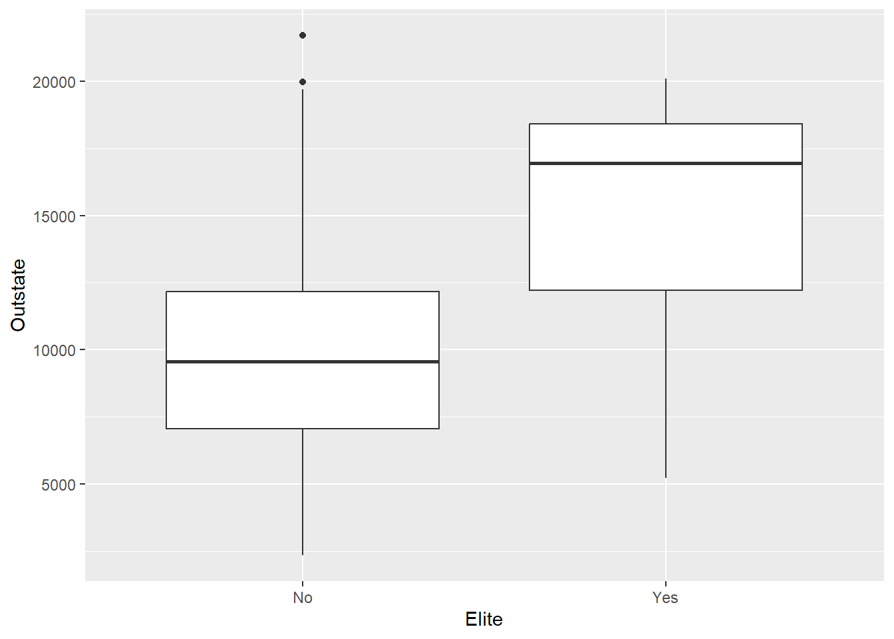

# (PART\*) Section 1 {.unnumbered}

# Overview {.unnumbered}

::: {style="color: #333; font-size: 24px; font-style: italic; text-align: justify;"}
Section 1: Introduction to Data Science - The Basics of Statistical
Learning
:::

This section consists of two practicals, both of which will use
exercises adapted from the core textbook for this course:

James, G., Witten, D., Hastie, T. and Tibshirani, R. (2021). *An
Introduction to Statistical Learning with Applications in R*. 2nd ed.
New York: Springer. <https://www.statlearning.com/>

::: ilos
**Learning Outcomes:**

-   indexing using base R;
-   creating scatterplot matrices;
-   creating new variables;
-   transforming existing variables;
-   using functionals;
-   'calling' on masked functions from specific packages;
-   translating base R code to `tidyverse` and vice versa.
:::

**Throughout these two practicals, you will practice using the functions
below. It is highly recommended that you explore these functions further
using the Help tab in your RStudio console. You can access the R
documentation in the Help tab using ? (e.g. `?read.csv`)**

+---------------------+---------------------+---------------------+
| Function            | Description         | Package             |
+:===================:+:===================:+:===================:+
| `read.csv()`        | read csv files      | base R              |
+---------------------+---------------------+---------------------+
| `read_csv()`        | read csv files      | tidyverse           |
+---------------------+---------------------+---------------------+
| `co                 | convert column to   | tidyverse           |
| lumn_to_rownames()` | row names           |                     |
+---------------------+---------------------+---------------------+
| `rownames()`        | obtain names of     | base R              |
|                     | rows                |                     |
+---------------------+---------------------+---------------------+
| `summary()`         | obtain summary      | base R              |
|                     | statistics          |                     |
+---------------------+---------------------+---------------------+
| `summarise()`       | object summaries    | tidyverse (dplyr)   |
+---------------------+---------------------+---------------------+
| `group_by()`        | group by one or     | tidyverse (dplyr)   |
|                     | more variables      |                     |
+---------------------+---------------------+---------------------+
| `pairs()`           | produce a matrix of | base R              |
|                     | scatterplots        |                     |
+---------------------+---------------------+---------------------+
| `plot()`            | create a plot       | base R              |
+---------------------+---------------------+---------------------+
| `ggplot()`          | generic function    | tidyverse (ggplot2) |
|                     | for creating a plot |                     |
+---------------------+---------------------+---------------------+
| `mutate()`          | create, modify, and | tidyverse (dplyr)   |
|                     | delete columns      |                     |
+---------------------+---------------------+---------------------+
| `if_else()`         | condition-based     | tidyverse (dplyr)   |
|                     | function            |                     |
+---------------------+---------------------+---------------------+
| `as_factor()`       | create factor using | tidyverse (forcats) |
|                     | existing levels     |                     |
+---------------------+---------------------+---------------------+
| `par()`             | set graphical       | base R              |
|                     | parameters          |                     |
+---------------------+---------------------+---------------------+
| `mfrow()`           | `par()` parameter   | base R              |
+---------------------+---------------------+---------------------+
| `slice_min()` and   | index rows by       | tidyverse (dplyr)   |
| `slice_max()`       | location (smallest  |                     |
|                     | and largest values  |                     |
|                     | of a variable       |                     |
|                     | respectively)       |                     |
+---------------------+---------------------+---------------------+
| `sapply()`          | applying a function | base R              |
|                     | over list or vector |                     |
+---------------------+---------------------+---------------------+
| `select()`          | keep or drop        | tidyverse (dplyr)   |
|                     | columns             |                     |
|                     |                     | *note that this     |
|                     |                     | function is also    |
|                     |                     | available through   |
|                     |                     | the MASS package    |
|                     |                     | (we will not cover  |
|                     |                     | this in this        |
|                     |                     | section)*           |
+---------------------+---------------------+---------------------+
| `pivot_longer()`    | lengthen data       | tidyverse (tidyr)   |
+---------------------+---------------------+---------------------+
| `where()`           | selection helper    | tidyverse           |
+---------------------+---------------------+---------------------+
| `median()`,         | median, mean,       | base R              |
| `mean()`, `sd()`    | standard deviation  |                     |
+---------------------+---------------------+---------------------+

# Practical 1 {.unnumbered}

<script>
document.addEventListener('DOMContentLoaded', function() {
    // Find all <details> elements as potential containers of R input
    var detailElements = document.querySelectorAll('details.chunk-details');

    detailElements.forEach(function(details) {
        var nextElement = details.nextElementSibling;
        var elementToToggle = null;

        // Check if the nextElement is a textual R output
        if (nextElement && nextElement.matches('pre') && nextElement.textContent.trim().startsWith('##')) {
            elementToToggle = nextElement;
        }
        // Alternatively, check if the nextElement contains a graphical R output (plot)
        else if (nextElement && nextElement.querySelector('img')) {
            elementToToggle = nextElement;
        }

        // Proceed to create a toggle button only if a matching element is found
        if (elementToToggle) {
            var button = document.createElement('button');
            button.className = 'toggle-button';
            button.textContent = 'Show R Output';
            button.style.display = 'block';

            // Initially hide the R output/plot
            elementToToggle.style.display = 'none';

            button.onclick = function() {
                var isHidden = elementToToggle.style.display === 'none';
                elementToToggle.style.display = isHidden ? 'block' : 'none';
                button.textContent = isHidden ? 'Hide R Output' : 'Show R Output';
            };

            // Insert the toggle button immediately after the <details>
            details.parentNode.insertBefore(button, details.nextSibling);
        }
    });
});
</script>

<script>
document.addEventListener('DOMContentLoaded', function() {
    var answers = document.querySelectorAll('.answers');

    answers.forEach(function(answer) {
        // Create the toggle button
        var button = document.createElement('button');
        button.className = 'toggle-answer-button';
        button.textContent = 'Show Answer'; // Updated text content
        button.style.display = 'block'; // Ensure button is visible
        answer.style.display = 'none'; // Initially hide the answer

        // Add click event listener to the button
        button.onclick = function() {
            if (answer.style.display === 'none') {
                answer.style.display = 'block'; // Show the answer
                button.textContent = 'Hide Answer'; // Update button text
            } else {
                answer.style.display = 'none'; // Hide the answer
                button.textContent = 'Show Answer'; // Reset button text
            }
        };

        // Insert the button before the answer
        answer.parentNode.insertBefore(button, answer);
    });
});

</script>

::: file
For the tasks below, you will require the **College** dataset from the
core textbook (James et. al 2021).

Click here to download the file:
<a href="data/College.csv" download="College.csv"> College.csv </a>.

*Remember to place your data file in a separate subfolder within your R
project working directory.*
:::

This data file contains 18 variables for 777 different universities and
colleges in the United States. The variables are:

-   Private : Public/private indicator
-   Apps : Number of applications received
-   Accept : Number of applicants accepted
-   Enroll : Number of new students enrolled\
-   Top10perc : New students from top 10% of high school class
-   Top25perc : New students from top 25% of high school class
-   F.Undergrad : Number of full-time undergraduates
-   P.Undergrad : Number of part-time undergraduates
-   Outstate : Out-of-state tuition
-   Room.Board : Room and board costs
-   Books : Estimated book costs
-   Personal : Estimated personal spending
-   PhD : Percent of faculty with Ph.D.’s
-   Terminal : Percent of faculty with terminal degree
-   S.F.Ratio: Student/faculty ratio
-   perc.alumni : Percent of alumni who donate
-   Expend : Instructional expenditure per student
-   Grad.Rate : Graduation rate

### Task 1 {.unnumbered}

Import the dataset in an object called `college` using a suitable
tidyverse function.


```r
# Remember to load tidyverse first

library(tidyverse)

college <- read_csv("data/College.csv")
```

If you have a look at the contents of the data object using `View()`,
you will notice that the first column contains the names of all of the
universities in the dataset. You will also notice that it has a strange
name.


Actually, these data should not be treated as a variable (column) since
it is just a list of university names.

### Task 2 {.unnumbered}

Keeping the list of names in the data object, transform this column such
that the university names in the column become row names. Hint: use the
`column_to_rownames()` function from `dplyr`.


```r
college <- college %>% column_to_rownames(var = "...1") 
```

::: question
How would have your approach to this task differed if you would have
imported the dataset using base R? Try it!
:::

::: answers
The data file could have instead been imported using `read.csv()`:

`college <- read.csv("data/College.csv")`

Using the base R approach, the first column containing the university
names would have been named "X", as shown below using `View()`.


Now, how would be go about transforming the contents of the first column
into row names?

This would require two steps.

First, we assign the column contents to rows names.

`rownames(college) <- college[, 1]`

If you have another look at the data object, you will see that the rows
have now been renamed using the university names in the "X" column, but
the column is still part of the dataset. We therefore need to tell R to
delete the column.

`college <- college[, -1]`
:::

### Task 3 {.unnumbered}

Produce summary statistics for all variables in the data object.


```r
summary(college)
```

```
##    Private               Apps           Accept          Enroll    
##  Length:777         Min.   :   81   Min.   :   72   Min.   :  35  
##  Class :character   1st Qu.:  776   1st Qu.:  604   1st Qu.: 242  
##  Mode  :character   Median : 1558   Median : 1110   Median : 434  
##                     Mean   : 3002   Mean   : 2019   Mean   : 780  
##                     3rd Qu.: 3624   3rd Qu.: 2424   3rd Qu.: 902  
##                     Max.   :48094   Max.   :26330   Max.   :6392  
##    Top10perc       Top25perc      F.Undergrad     P.Undergrad     
##  Min.   : 1.00   Min.   :  9.0   Min.   :  139   Min.   :    1.0  
##  1st Qu.:15.00   1st Qu.: 41.0   1st Qu.:  992   1st Qu.:   95.0  
##  Median :23.00   Median : 54.0   Median : 1707   Median :  353.0  
##  Mean   :27.56   Mean   : 55.8   Mean   : 3700   Mean   :  855.3  
##  3rd Qu.:35.00   3rd Qu.: 69.0   3rd Qu.: 4005   3rd Qu.:  967.0  
##  Max.   :96.00   Max.   :100.0   Max.   :31643   Max.   :21836.0  
##     Outstate       Room.Board       Books           Personal   
##  Min.   : 2340   Min.   :1780   Min.   :  96.0   Min.   : 250  
##  1st Qu.: 7320   1st Qu.:3597   1st Qu.: 470.0   1st Qu.: 850  
##  Median : 9990   Median :4200   Median : 500.0   Median :1200  
##  Mean   :10441   Mean   :4358   Mean   : 549.4   Mean   :1341  
##  3rd Qu.:12925   3rd Qu.:5050   3rd Qu.: 600.0   3rd Qu.:1700  
##  Max.   :21700   Max.   :8124   Max.   :2340.0   Max.   :6800  
##       PhD            Terminal       S.F.Ratio      perc.alumni   
##  Min.   :  8.00   Min.   : 24.0   Min.   : 2.50   Min.   : 0.00  
##  1st Qu.: 62.00   1st Qu.: 71.0   1st Qu.:11.50   1st Qu.:13.00  
##  Median : 75.00   Median : 82.0   Median :13.60   Median :21.00  
##  Mean   : 72.66   Mean   : 79.7   Mean   :14.09   Mean   :22.74  
##  3rd Qu.: 85.00   3rd Qu.: 92.0   3rd Qu.:16.50   3rd Qu.:31.00  
##  Max.   :103.00   Max.   :100.0   Max.   :39.80   Max.   :64.00  
##      Expend        Grad.Rate     
##  Min.   : 3186   Min.   : 10.00  
##  1st Qu.: 6751   1st Qu.: 53.00  
##  Median : 8377   Median : 65.00  
##  Mean   : 9660   Mean   : 65.46  
##  3rd Qu.:10830   3rd Qu.: 78.00  
##  Max.   :56233   Max.   :118.00
```

### Task 4 {.unnumbered}

Create a scatterplot matrix of the first three numeric variables.


```r
pairs(college[,2:4])
```


### Task 5 {.unnumbered}

Produce side by side box plots of `Outstate` versus `Private` using base
R.


```r
plot(college$Private, college$Outstate, xlab = "Private", ylab = "Outstate")
```

::: question
Did this work? Why?
:::

::: answers
Using the `plot()` base R function to produce a box plot would produce
an error since the `Private` variable is of class character. Most
statistical functions will not work with character vectors.

`Error in plot.window(...) : need finite 'xlim' values`\
`In addition: Warning messages:`\
`1: In xy.coords(x, y, xlabel, ylabel, log) : NAs introduced by coercion`\
`2: In min(x) : no non-missing arguments to min; returning Inf`\
`3: In max(x) : no non-missing arguments to max; returning -Inf`

Creating a box plot with `tidyverse` would work.

`college %>%       ggplot(aes(x = Private, y = Outstate)) +        geom_boxplot()`


However, it is important to note that if a variable is not of the right
class, then this might have unintended consequences for example, when
building models. In this case, the `Private` variable must be
transformed into a factor.
:::

### Task 6 {.unnumbered}

Using the `Top10perc` variable, create a new categorical variable called
`Elite` such that universities are divided into two groups based on
whether or not the proportion of students coming from the top 10% of
their high school classes exceeds 50%. Hint: use a combination of
`mutate()` and `if_else()`.


```r
college <- college %>%
  mutate(Elite = if_else(Top10perc > 50, "Yes", "No"),
         Elite = as_factor(Elite))
#do not forget the factor transformation step (categorical variables are factors in R)
```

### Task 7 {.unnumbered}

Produce side by side box plots of the new `Elite` variable and
`Outstate`.


```r
college %>%  
  ggplot(aes(x = Elite, y = Outstate)) +   
  geom_boxplot()
```



::: question
How would you produce a similar plot using base R?
:::

::: answers
`plot(college$Elite, college$Outstate,  xlab = "Elite", ylab = "Outstate")`
:::

### Task 8 {.unnumbered}

Use base R to produce a multipanel plot that displays histograms of the
following variables: `Apps`, `perc.alumni`, `S.F.Ratio`, `Expend`. Hint:
use `par(mfrow=c(2,2))` to set up a 2x2 panel. Try to adjust the
specifications (e.g. breaks).


```r
# An example is shown below. Note that the purpose of the mfrow parameter is to change the default way in which R displays plots which is in a single panel display. Once applied, all plots you create later will also be displayed in a 2x2 grid. To revert back, you need to enter par(mfrow=c(1,1)) into the console.

par(mfrow=c(2,2))
hist(college$Apps)
hist(college$perc.alumni, col=2)
hist(college$S.F.Ratio, col=3, breaks=10)
hist(college$Expend, breaks=100)
```


### Task 9 {.unnumbered}

Using `Accept` and `Apps`, create a new variable that describes
acceptance rate. Name this variable `acceptance_rate`. Hint: use
`mutate()`.


```r
college <- college %>%
  mutate(acceptance_rate = Accept / Apps)
```

### Task 10 {.unnumbered}

Using the `acceptance_rate` variable, find out which university has the
lowest acceptance rate. Hint: for a `tidyverse` approach, you can use
`slice_min()`.


```r
college %>%
  slice_min(order_by = acceptance_rate, n = 1)
```

```
##                      Private  Apps Accept Enroll Top10perc Top25perc
## Princeton University     Yes 13218   2042   1153        90        98
##                      F.Undergrad P.Undergrad Outstate Room.Board Books Personal
## Princeton University        4540         146    19900       5910   675     1575
##                      PhD Terminal S.F.Ratio perc.alumni Expend Grad.Rate Elite
## Princeton University  91       96       8.4          54  28320        99   Yes
##                      acceptance_rate
## Princeton University       0.1544863
```

### Task 11 {.unnumbered}

Using the `acceptance_rate` variable, find out which university has the
highest acceptance rate.


```r
college %>%
  slice_max(order_by = acceptance_rate, n = 1)
```

```
##                                  Private Apps Accept Enroll Top10perc Top25perc
## Emporia State University              No 1256   1256    853        43        79
## Mayville State University             No  233    233    153         5        12
## MidAmerica Nazarene College          Yes  331    331    225        15        36
## Southwest Baptist University         Yes 1093   1093    642        12        32
## University of Wisconsin-Superior      No  910    910    342        14        53
## Wayne State College                   No 1373   1373    724         6        21
##                                  F.Undergrad P.Undergrad Outstate Room.Board
## Emporia State University                3957         588     5401       3144
## Mayville State University                658          58     4486       2516
## MidAmerica Nazarene College             1100         166     6840       3720
## Southwest Baptist University            1770         967     7070       2500
## University of Wisconsin-Superior        1434         417     7032       2780
## Wayne State College                     2754         474     2700       2660
##                                  Books Personal PhD Terminal S.F.Ratio
## Emporia State University           450     1888  72       75      19.3
## Mayville State University          600     1900  68       68      15.7
## MidAmerica Nazarene College       1100     4913  33       33      15.4
## Southwest Baptist University       400     1000  52       54      15.9
## University of Wisconsin-Superior   550     1960  75       81      15.2
## Wayne State College                540     1660  60       68      20.3
##                                  perc.alumni Expend Grad.Rate Elite
## Emporia State University                   4   5527        50    No
## Mayville State University                 11   6971        51    No
## MidAmerica Nazarene College               20   5524        49    No
## Southwest Baptist University              13   4718        71    No
## University of Wisconsin-Superior          15   6490        36    No
## Wayne State College                       29   4550        52    No
##                                  acceptance_rate
## Emporia State University                       1
## Mayville State University                      1
## MidAmerica Nazarene College                    1
## Southwest Baptist University                   1
## University of Wisconsin-Superior               1
## Wayne State College                            1
```

# Practical 2 {.unnumbered}

<script>
document.addEventListener('DOMContentLoaded', function() {
    // Find all <details> elements as potential containers of R input
    var detailElements = document.querySelectorAll('details.chunk-details');

    detailElements.forEach(function(details) {
        var nextElement = details.nextElementSibling;
        var elementToToggle = null;

        // Check if the nextElement is a textual R output
        if (nextElement && nextElement.matches('pre') && nextElement.textContent.trim().startsWith('##')) {
            elementToToggle = nextElement;
        }
        // Alternatively, check if the nextElement contains a graphical R output (plot)
        else if (nextElement && nextElement.querySelector('img')) {
            elementToToggle = nextElement;
        }

        // Proceed to create a toggle button only if a matching element is found
        if (elementToToggle) {
            var button = document.createElement('button');
            button.className = 'toggle-button';
            button.textContent = 'Show R Output';
            button.style.display = 'block';

            // Initially hide the R output/plot
            elementToToggle.style.display = 'none';

            button.onclick = function() {
                var isHidden = elementToToggle.style.display === 'none';
                elementToToggle.style.display = isHidden ? 'block' : 'none';
                button.textContent = isHidden ? 'Hide R Output' : 'Show R Output';
            };

            // Insert the toggle button immediately after the <details>
            details.parentNode.insertBefore(button, details.nextSibling);
        }
    });
});
</script>

<script>
document.addEventListener('DOMContentLoaded', function() {
    var answers = document.querySelectorAll('.answers');

    answers.forEach(function(answer) {
        // Create the toggle button
        var button = document.createElement('button');
        button.className = 'toggle-answer-button';
        button.textContent = 'Show Answer'; // Updated text content
        button.style.display = 'block'; // Ensure button is visible
        answer.style.display = 'none'; // Initially hide the answer

        // Add click event listener to the button
        button.onclick = function() {
            if (answer.style.display === 'none') {
                answer.style.display = 'block'; // Show the answer
                button.textContent = 'Hide Answer'; // Update button text
            } else {
                answer.style.display = 'none'; // Hide the answer
                button.textContent = 'Show Answer'; // Reset button text
            }
        };

        // Insert the button before the answer
        answer.parentNode.insertBefore(button, answer);
    });
});

</script>

::: file
For the tasks below, you will require the **Boston** dataset. This
dataset is part of the `MASS` R package.

To access the dataset, load the `MASS` package (install the package
first, if you have not done so previously).
:::

### Task 1 {.unnumbered}

Install and load the `MASS` package. You will also require `tidyverse`.


```r
# if you haven't already, install the MASS package before loading
install.packages("MASS")
library(MASS)
library(tidyverse)
```


::: question
Does R provide any message when loading `MASS`? Why does this matter?
:::

::: answers
One important message that R provides when loading `MASS` is that this
package masks the `select()` function from `tidyverse`.

`Attaching package: ‘MASS’`

`The following object is masked from ‘package:dplyr’:`

```         
`select`  
```

When masking occurs, this means that both packages contain the same
function. If you were to use the `select()` function, R will call the
function from the `MASS` package, rather than from `tidyverse (dplyr)`
package. This is because the `MASS` package is the one masking the
function. If you intend to use the `select()` function as defined by the
`tidyverse` package, it may not work as intended and/or you may be
prompted by an error message such as:

`Error in select(...): unused argument (...)`

To avoid such issues, you must 'call' on the package from which you want
R to use the masked function (e.g. `dplyr::select()`). This is why it is
important to read through all warnings and messages provided in the
console.
:::

### Task 2 {.unnumbered}

Find out more about the `Boston` dataset variables by accessing the R
Documentation.


```r
?Boston
```

To explore the `Boston` dataset, simply type the name of the data object
into the console or use `View()`

::: question
What type of data structure is the `Boston` dataset? What are its
dimensions? How many categorical and quantitative variables are there?
:::

::: answers
The `Boston` dataset is a data frame with 506 rows (observations) and 14
columns (variables). There is one categorical variable (`chas`), and 13
quantitative variables.
:::

### Task 3 {.unnumbered}

Find the class of all 14 variables. Hint: use `sapply`.


```r
sapply(Boston, class)
```

```
##      crim        zn     indus      chas       nox        rm       age       dis 
## "numeric" "numeric" "numeric" "integer" "numeric" "numeric" "numeric" "numeric" 
##       rad       tax   ptratio     black     lstat      medv 
## "integer" "numeric" "numeric" "numeric" "numeric" "numeric"
```

### Task 4 {.unnumbered}

Using a `tidyverse` approach, calculate the mean, median, and standard
deviation of all variables of class *numeric*.


```r
Boston %>%
  dplyr::select(dplyr::where(is.numeric)) %>%
  pivot_longer(everything()) %>%
  group_by(name) %>%
  summarise(Mean = mean(value, na.rm = TRUE),
            SD = sd(value, na.rm = TRUE), 
            Median = median(value, na.rm = TRUE))
```

```
## # A tibble: 14 × 4
##    name        Mean      SD  Median
##    <chr>      <dbl>   <dbl>   <dbl>
##  1 age      68.6     28.1    77.5  
##  2 black   357.      91.3   391.   
##  3 chas      0.0692   0.254   0    
##  4 crim      3.61     8.60    0.257
##  5 dis       3.80     2.11    3.21 
##  6 indus    11.1      6.86    9.69 
##  7 lstat    12.7      7.14   11.4  
##  8 medv     22.5      9.20   21.2  
##  9 nox       0.555    0.116   0.538
## 10 ptratio  18.5      2.16   19.0  
## 11 rad       9.55     8.71    5    
## 12 rm        6.28     0.703   6.21 
## 13 tax     408.     169.    330    
## 14 zn       11.4     23.3     0
```

::: question
What is the mean pupil-teacher ratio? What is the median and mean per
capita crime rate? Which value do you think is more suitable to describe
per capita crime rate?
:::

::: answers
The mean pupil-teacher ratio is about 19. The median crime rate is 0.257
whilst the mean is larger at 3.61. Given the difference between the
median and the mean, a skewed distribution is expected, therefore, the
median may be a more a suitable summary statistic to describe crime rate
(a histogram would be needed)
:::

### Task 5 {.unnumbered}

Using a base R approach, create a 2x2 multipanel plot of `crim` versus
`age`, `dis`, `rad`, `tax` and `ptratio`.


```r
par(mfrow = c(2,2))
plot(Boston$age, Boston$crim)
plot(Boston$dis, Boston$crim)
plot(Boston$rad, Boston$crim)
plot(Boston$tax, Boston$crim)
```


::: question
What can you say about the relationships between `age`, `dis`, `rad`,
`tax`, and `crim`?
:::

::: answers
As the age of the home increases (`age`), crime also increases. There is
also higher crime around employment centers (`dis`). With very high
index of accessibility to radial highways (`rad`), and tax rates (`tax`)
there also appears to be high crime rates.
:::

### Task 6 {.unnumbered}

Using a base R approach, create and display histograms of `crim`, `tax`
and `ptratio` in a 1x2 multipanel plot. Set the `breaks` argument to
**25** .


```r
par(mfrow=c(1,2))
hist(Boston$crim, breaks=25)
hist(Boston$tax, breaks=25)
```


::: question
What do these histograms indicate?
:::

::: answers
Most areas have low crime rates, but there is a rather long tail showing
high crime rates (although the frequency seems to be very low). Given
the degree of skew, the mean would not be a good measure of central
tendency. With respect to tax rates, there appears to be a large divide
between low taxation and high taxation, with the highest peak at around
670.

*Remember to revert back to single panel display.*
:::
