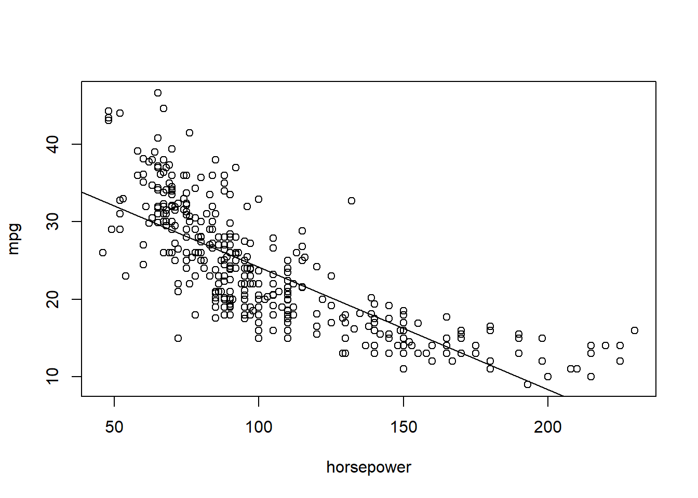
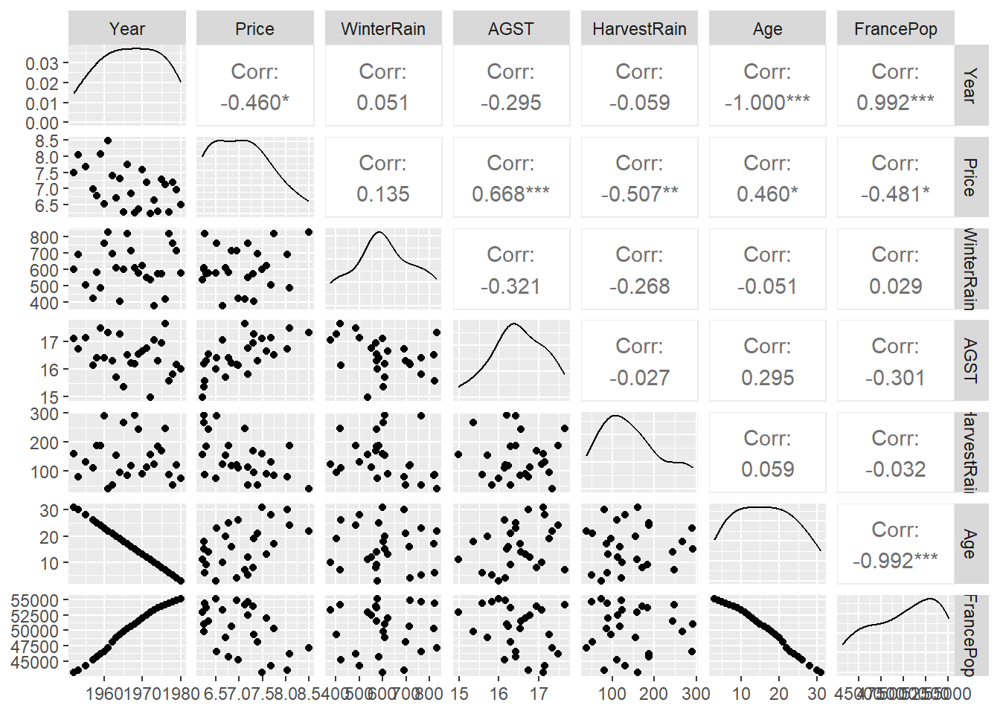

---
editor_options:
  markdown:
    wrap: 72
---

# Answers {.unnumbered}

## Practical 1 {-}

::: file
For the tasks below, you will require the **Auto** dataset from the core
textbook (James et. al 2021).

This dataset is part of the `ISRL2` package. By loading the package, the
**Auto** dataset loads automatically:

`library(ISLR2)`

Remember to install it first

`install.packages("ISLR2")`
:::

This data file (text format) contains 398 observations of 9 variables.
The variables are:

-   mpg: miles per gallon
-   cylinders: Number of cylinders between 4 and 8
-   displacement: Engine displacement (cu. inches)
-   horsepower: Engine horsepower
-   weight: Vehicle weight (lbs.)
-   acceleration: Time to accelerate from 0 to 60 mph (sec.)
-   year: Model year
-   origin: Origin of car (1. American, 2. European, 3. Japanese)
-   name: Vehicle name

### Task 1 {.unnumbered}

Use the `lm()` function to perform simple linear regression with **mpg**
as the response and **horsepower** as the predictor. Store the output in
an object called **fit**.


```r
fit <- lm(mpg ~ horsepower, data = Auto)
```

### Task 2 {.unnumbered}

Have a look at the results of the model.


```r
summary(fit)
```

```
## 
## Call:
## lm(formula = mpg ~ horsepower, data = Auto)
## 
## Residuals:
##      Min       1Q   Median       3Q      Max 
## -13.5710  -3.2592  -0.3435   2.7630  16.9240 
## 
## Coefficients:
##              Estimate Std. Error t value Pr(>|t|)    
## (Intercept) 39.935861   0.717499   55.66   <2e-16 ***
## horsepower  -0.157845   0.006446  -24.49   <2e-16 ***
## ---
## Signif. codes:  0 '***' 0.001 '**' 0.01 '*' 0.05 '.' 0.1 ' ' 1
## 
## Residual standard error: 4.906 on 390 degrees of freedom
## Multiple R-squared:  0.6059,	Adjusted R-squared:  0.6049 
## F-statistic: 599.7 on 1 and 390 DF,  p-value: < 2.2e-16
```

::: question
Is there a relationship between the predictor and the response?
:::

::: answers
The slope coefficient (`-0.157845`) is statistically significant
(`<2e-16 ***`). We can conclude that there is evidence to suggest a
negative relationship between miles per gallon and engine horsepower.
For a one-unit increase in engine horsepower, miles per gallon are
reduced by 0.16.
:::

### Task 3 {.unnumbered}

What is the associated 95% confidence intervals for predicted miles per
gallon associated with an engine horsepower of 98? Hint: use the
`predict()` function. For confidence intervals, set the `interval`
argument to `confidence`.


```r
predict(fit, data.frame(horsepower = 98), interval = "confidence")
```

```
##        fit      lwr      upr
## 1 24.46708 23.97308 24.96108
```

### Task 4 {.unnumbered}

How about the prediction interval for the same value?


```r
predict(fit, data.frame(horsepower = 98), interval = "prediction")
```

```
##        fit     lwr      upr
## 1 24.46708 14.8094 34.12476
```

::: question
Are the two intervals different? Why?
:::

::: answers
The prediction interval (lower limit 14.8094 and upper limit 34.12476)
is wider (and therefore less precise) than the confidence interval
(lower limit 23.97308 and upper limit 24.96108). The confidence interval
measures the uncertainty around the estimate of the conditional mean
whilst the prediction interval takes into account not only uncertainty
but also the variability of the conditional distribution.
:::

### Task 5 {.unnumbered}

Using base R, plot the response and the predictor as well as the least
squares regression line. Add suitable labels to the X and Y axes.


```r
plot(Auto$horsepower, Auto$mpg, xlab = "horsepower", ylab = "mpg")
abline(fit)
```



### Task 6 {.unnumbered}

Use base R to produce diagnostic plots of the least squares regression
fit. Display these in a 2X2 grid.


```r
par(mfrow = c(2, 2))
plot(fit, cex = 0.2)
```


### Task 7 {.unnumbered}

Subset the **Auto** dataset such that it excludes the **name** and
**origin** variables and store this subsetted dataset in a new object
called **quant_vars**.


```r
quant_vars <- subset(Auto, select = -c(name, origin))
```

### Task 8 {.unnumbered}

Compute a correlation matrix of all variables.


```r
cor(quant_vars)
```

```
##                     mpg  cylinders displacement horsepower     weight
## mpg           1.0000000 -0.7776175   -0.8051269 -0.7784268 -0.8322442
## cylinders    -0.7776175  1.0000000    0.9508233  0.8429834  0.8975273
## displacement -0.8051269  0.9508233    1.0000000  0.8972570  0.9329944
## horsepower   -0.7784268  0.8429834    0.8972570  1.0000000  0.8645377
## weight       -0.8322442  0.8975273    0.9329944  0.8645377  1.0000000
## acceleration  0.4233285 -0.5046834   -0.5438005 -0.6891955 -0.4168392
## year          0.5805410 -0.3456474   -0.3698552 -0.4163615 -0.3091199
##              acceleration       year
## mpg             0.4233285  0.5805410
## cylinders      -0.5046834 -0.3456474
## displacement   -0.5438005 -0.3698552
## horsepower     -0.6891955 -0.4163615
## weight         -0.4168392 -0.3091199
## acceleration    1.0000000  0.2903161
## year            0.2903161  1.0000000
```

::: question
Did you use the **Auto** dataset or the **quant_vars** object? Why does
it matter which data object you use?
:::

::: answers
To compute the correlation matrix using all variables of a data object,
these variables must all be numeric. In the **Auto** data object, the
**name** variable is coded as a factor.

`class(Auto$name)`\
`[1] "factor"`

Therefore, if you try to use the `cor()` function with **Auto** dataset
without excluding the **name** variable, you will get an error.

`cor(Auto)`\
`Error in cor(Auto) : 'x' must be numeric`.

Also, whilst the **origin** variable is of class integer and will not
pose a problem when you apply the `cor()` function, you'll remember from
the variable description list that this is a nominal variable with its
categories numerically labelled.

Compute the correlation matrix using **quant_vars**.
:::

### Task 9 {.unnumbered}

Using the **quant_vars** object, perform multiple linear regression with
miles per gallon as the response and all other variables as the
predictors.

Store the results in an object called **fit2**.


```r
fit2 <- lm(mpg ~ ., data = quant_vars)
```

### Task 10 {.unnumbered}

Have a look at the results of the multiple regression model.


```r
summary(fit2)
```

```
## 
## Call:
## lm(formula = mpg ~ ., data = quant_vars)
## 
## Residuals:
##     Min      1Q  Median      3Q     Max 
## -8.6927 -2.3864 -0.0801  2.0291 14.3607 
## 
## Coefficients:
##                Estimate Std. Error t value Pr(>|t|)    
## (Intercept)  -1.454e+01  4.764e+00  -3.051  0.00244 ** 
## cylinders    -3.299e-01  3.321e-01  -0.993  0.32122    
## displacement  7.678e-03  7.358e-03   1.044  0.29733    
## horsepower   -3.914e-04  1.384e-02  -0.028  0.97745    
## weight       -6.795e-03  6.700e-04 -10.141  < 2e-16 ***
## acceleration  8.527e-02  1.020e-01   0.836  0.40383    
## year          7.534e-01  5.262e-02  14.318  < 2e-16 ***
## ---
## Signif. codes:  0 '***' 0.001 '**' 0.01 '*' 0.05 '.' 0.1 ' ' 1
## 
## Residual standard error: 3.435 on 385 degrees of freedom
## Multiple R-squared:  0.8093,	Adjusted R-squared:  0.8063 
## F-statistic: 272.2 on 6 and 385 DF,  p-value: < 2.2e-16
```

::: question
Is there a relationship between the predictors and the response? Which
predictors appear to have a statistically significant relationship to
the response? What does the coefficient for the year variable suggest?
:::

::: answers
Two of the predictors are statistically significant: **weight** and
**year**. The relationship between **weight** and **mpg** is negative
which suggests that for a one pound increase in weight of vehicle, the
number of miles per gallon the vehicle can travel decreases, whilst that
of **mpg** and **year** is positive which suggests that the more recent
the vehicle is, the higher the number of miles per gallon it can travel.
:::

### Task 11 {.unnumbered}

Produce diagnostic plots of the multiple linear regression fit in a 2x2
grid.


```r
par(mfrow = c(2, 2))
plot(fit2, cex = 0.2)
```


::: question
Do the residual plots suggest any unusually large outliers? Does the
leverage plot identify any observations with unusually high leverage?
:::

::: answers
One point has high leverage, the residuals also show a trend with fitted
values.
:::

### Task 12 {.unnumbered}

Fit separate linear regression models with interaction effect terms for:
weight and horsepower, acceleration and horsepower, and cylinders and
weight.


```r
summary(lm(mpg ~ . + weight:horsepower, data = quant_vars))
summary(lm(mpg ~ . + acceleration:horsepower, data = quant_vars))
summary(lm(mpg ~ . + cylinders:weight, data = quant_vars))
```

::: question
Are any of the interaction terms statistically significant?
:::

::: answers
For each model, the interaction term is statistically significant.
:::

### Task 13 {.unnumbered}

Using the **Auto** data object, apply transformations for the
**horsepower** variable and plot the relationship between **horsepower**
and **mpg** in a 2x2 grid.

-   First plot: use the original variable;\
-   Second plot: apply log transform;\
-   Third plot: raise it to the power of two.


```r
par(mfrow = c(2, 2))
plot(Auto$horsepower, Auto$mpg, cex = 0.2)
plot(log(Auto$horsepower), Auto$mpg, cex = 0.2)
plot(Auto$horsepower ^ 2, Auto$mpg, cex = 0.2)
```

::: question
Which of these transformations is most suitable?
:::

::: answers
The relationship between horsepower and miles per gallon is clearly
non-linear (plot 1). The log transform seems to address this best.
:::

### Task 14 {.unnumbered}

Now run a multiple regression model with all variables as before but
this time, apply a log transformation of the **horsepower** variable.


```r
quant_vars$horsepower <- log(quant_vars$horsepower)
fit3 <- lm(mpg ~ ., data = quant_vars)
```

### Task 15 {.unnumbered}

Have a look at the results.


```r
summary(fit3)
```

```
## 
## Call:
## lm(formula = mpg ~ ., data = quant_vars)
## 
## Residuals:
##     Min      1Q  Median      3Q     Max 
## -8.6778 -2.0080 -0.3142  1.9262 14.0979 
## 
## Coefficients:
##                Estimate Std. Error t value Pr(>|t|)    
## (Intercept)  29.1713000  8.9291383   3.267  0.00118 ** 
## cylinders    -0.3563199  0.3181815  -1.120  0.26347    
## displacement  0.0088277  0.0068866   1.282  0.20066    
## horsepower   -8.7568129  1.5958761  -5.487 7.42e-08 ***
## weight       -0.0044304  0.0007213  -6.142 2.03e-09 ***
## acceleration -0.3317439  0.1077476  -3.079  0.00223 ** 
## year          0.6979715  0.0503916  13.851  < 2e-16 ***
## ---
## Signif. codes:  0 '***' 0.001 '**' 0.01 '*' 0.05 '.' 0.1 ' ' 1
## 
## Residual standard error: 3.308 on 385 degrees of freedom
## Multiple R-squared:  0.8231,	Adjusted R-squared:  0.8203 
## F-statistic: 298.5 on 6 and 385 DF,  p-value: < 2.2e-16
```

::: question
How do the results of model **fit3** differ from those of model
**fit2**?
:::

::: answers
The **fit2** model results showed that only two predictors were
statistically significant: **weight** and **year**. The **fit3** model
has two additional predictors that are statistically significant:
**acceleration** as well as **horsepower**.Also, the coefficient values
can now be interpreted more easily.
:::

### Task 16 {.unnumbered}

Produce diagnostic plots for the **fit3** object and display them in a
2x2 grid.


```r
par(mfrow = c(2, 2))
plot(fit3, cex = 0.2)
```


::: question
How do the diagnostic plots differ?
:::

::: answers
A log transformation of **horsepower** appears to give a more linear
relationship with **mpg** but this difference does not seem to be
substantial.
:::

## Practical 2 {-}

::: file
For the tasks below, you will require the **Carseats** dataset from the
core textbook (James et. al 2021).

This dataset is part of the `ISRL2` package. By loading the package, the
**Carseats** dataset loads automatically:

`library(ISLR2)`
:::

This dataframe object contains a simulated dataset of sales of child car
seats at 400 different stores.

The 9 variables are:

-   Sales: Unit sales (thousands of dollars) at each location\
-   CompPrice: Price charged by competitor at each location\
-   Income: Community income level (thousands of dollars)\
-   Advertising: Local advertising budget for company at each location
    (thousands of dollars)\
-   Population: Population size in region (thousands of dollars)\
-   Price: Price company charges for car seats at each site\
-   ShelveLoc: Quality of the shelving location for the car seats at
    each site\
-   Age: Average age of the local population\
-   Education: Education level at each location\
-   Urban: Whether the store is in an urban or rural location\
-   US: Whether the store is in the US or not


### Task 1 {.unnumbered}

Fit a multiple regression model to predict unit sales at each location
based on price company charges for car seats, whether the store is in an
urban or rural location, and whether the store is in the US or not.


```r
fit <- lm(Sales ~ Price + Urban + US, data = Carseats)
```

### Task 2 {.unnumbered}

Have a look at the results and interpret the coefficients.


```r
summary(fit)
```

```
## 
## Call:
## lm(formula = Sales ~ Price + Urban + US, data = Carseats)
## 
## Residuals:
##     Min      1Q  Median      3Q     Max 
## -6.9206 -1.6220 -0.0564  1.5786  7.0581 
## 
## Coefficients:
##              Estimate Std. Error t value Pr(>|t|)    
## (Intercept) 13.043469   0.651012  20.036  < 2e-16 ***
## Price       -0.054459   0.005242 -10.389  < 2e-16 ***
## UrbanYes    -0.021916   0.271650  -0.081    0.936    
## USYes        1.200573   0.259042   4.635 4.86e-06 ***
## ---
## Signif. codes:  0 '***' 0.001 '**' 0.01 '*' 0.05 '.' 0.1 ' ' 1
## 
## Residual standard error: 2.472 on 396 degrees of freedom
## Multiple R-squared:  0.2393,	Adjusted R-squared:  0.2335 
## F-statistic: 41.52 on 3 and 396 DF,  p-value: < 2.2e-16
```

::: question
Which coefficients are statistically significant? What do they indicate?
:::

::: answers
The null hypothesis for the slope being zero is rejected for the
**Price** and **US** variables. The coefficient for **Price** is
statistically significant; since it is negative, as price increases by a
thousand dollars (i.e. one unit increase), the sales of child decrease
by about 0.05. The slope for the **US** variable is also statistically
significant but it is positive. Also, this is a binary factor variable
coded as Yes and No (No is the reference category). Therefore, sales of
child car seats are higher by 1.2 for car seat products that are
produced in the US than for car seat products not produced in the US.
:::

### Task 3 {.unnumbered}

Based on the conclusions you have drawn in Task 2, now fit a smaller
model that only uses the predictors for which there is evidence of
association with sales.


```r
fit2 <- lm(Sales ~ Price + US, data = Carseats)
```

### Task 4 {.unnumbered}

Compare the two models (*fit* and *fit2*).


```r
anova(fit, fit2)
```

```
## Analysis of Variance Table
## 
## Model 1: Sales ~ Price + Urban + US
## Model 2: Sales ~ Price + US
##   Res.Df    RSS Df Sum of Sq      F Pr(>F)
## 1    396 2420.8                           
## 2    397 2420.9 -1  -0.03979 0.0065 0.9357
```

::: question
Which model is the better fit?
:::

::: answers
They have similar r-squared values, and the *fit* model (containing the
extra variable **Urban**) is non-significantly better.
:::

### Task 5 {.unnumbered}

Produce diagnostic plots for *fit2* and display these in a 2x2 grid.


```r
par(mfrow = c(2, 2))
plot(fit2, cex = 0.2)
```


::: question
Is there evidence of outliers or high leverage observations in the
*fit2* model?
:::

::: answers
Yes, there is evidence of outliers and high leverage observations for
*fit2*.
:::


## Practical 3: The Quality of Red Bordeaux Vintages {.unnumbered}

*This demonstration was developed by Dr. Tatjana Kecojevic, Lecturer in Social Statistics.*

We would like to analyse the quality of a vintage that has been quantified as the price and make the interpretation of our statistical findings. 

We are going to use `wine.csv` available from Eduardo García Portugués’s book: *Notes for Predictive Modelling; https://bookdown.org/egarpor/PM-UC3M/*. 

The **wine** dataset is formed by the auction price of 27 red Bordeaux vintages, five vintage descriptors (WinterRain, AGST, HarvestRain, Age, Year), and the population of France in the year of the vintage, FrancePop.
  
- Year: year in which grapes were harvested to make wine   
- Price: logarithm of the average market price for Bordeaux vintages according to 1990–1991 auctions. The price is relative to the price of the 1961 vintage, regarded as the best one ever recorded  
- WinterRain: winter rainfall (in mm)  
- AGST: Average Growing Season Temperature (in degrees Celsius)  
- HarvestRain: harvest rainfall (in mm)  
- Age: age of the wine measured as the number of years stored in a cask   
- FrancePop: population of France at Year (in thousands)  

You will require the `GGally` package; please make sure to install it first. 


```r
library(GGally)
```

And now let's import the data.


```r
wine <- read.csv("https://raw.githubusercontent.com/egarpor/handy/master/datasets/wine.csv")
```

Let's first obtain some summary statistics.  


```r
summary(wine)
```

```
##       Year          Price         WinterRain         AGST        HarvestRain   
##  Min.   :1952   Min.   :6.205   Min.   :376.0   Min.   :14.98   Min.   : 38.0  
##  1st Qu.:1960   1st Qu.:6.508   1st Qu.:543.5   1st Qu.:16.15   1st Qu.: 88.0  
##  Median :1967   Median :6.984   Median :600.0   Median :16.42   Median :123.0  
##  Mean   :1967   Mean   :7.042   Mean   :608.4   Mean   :16.48   Mean   :144.8  
##  3rd Qu.:1974   3rd Qu.:7.441   3rd Qu.:705.5   3rd Qu.:17.01   3rd Qu.:185.5  
##  Max.   :1980   Max.   :8.494   Max.   :830.0   Max.   :17.65   Max.   :292.0  
##       Age          FrancePop    
##  Min.   : 3.00   Min.   :43184  
##  1st Qu.: 9.50   1st Qu.:46856  
##  Median :16.00   Median :50650  
##  Mean   :16.19   Mean   :50085  
##  3rd Qu.:22.50   3rd Qu.:53511  
##  Max.   :31.00   Max.   :55110
```

And a matrix of plots.


```r
ggpairs(wine)
```




:::question
What conclusions can you draw based on the above information?
:::

:::answers
We can notice a perfect relationship between the variables Year and Age. This is to be expected since this data was collected in 1983 and Age was calculated as: Age = 1983 - Year. Knowing this, we are going to remove Year from the analysis and use Age as it will be easier to interpret.

There is a strong relationship between Year, ie. Age and FrancePop and since we want to impose our viewpoint that the total population does not influence the quality of the wine we will not consider this variable in the model.
:::

We are going to investigate possible interactions between the rainfall (WinterRain) and the growing season temperature (AGST). We will start with the most complicated model that includes the highest-order interaction. In R we will specify the three-way interaction, which will automatically add all combinations of two-way interactions.  


```r
model1 <- lm(Price ~ WinterRain + AGST + HarvestRain + Age + WinterRain * AGST * HarvestRain, data = wine)

summary(model1)
```

```
## 
## Call:
## lm(formula = Price ~ WinterRain + AGST + HarvestRain + Age + 
##     WinterRain * AGST * HarvestRain, data = wine)
## 
## Residuals:
##      Min       1Q   Median       3Q      Max 
## -0.35058 -0.19462 -0.02645  0.17194  0.52079 
## 
## Coefficients:
##                               Estimate Std. Error t value Pr(>|t|)   
## (Intercept)                  8.582e+00  1.924e+01   0.446   0.6609   
## WinterRain                  -1.858e-02  2.896e-02  -0.642   0.5292   
## AGST                        -1.748e-01  1.137e+00  -0.154   0.8795   
## HarvestRain                 -4.713e-02  1.540e-01  -0.306   0.7631   
## Age                          2.476e-02  8.288e-03   2.987   0.0079 **
## WinterRain:AGST              1.272e-03  1.712e-03   0.743   0.4671   
## WinterRain:HarvestRain       7.836e-05  2.600e-04   0.301   0.7665   
## AGST:HarvestRain             3.059e-03  9.079e-03   0.337   0.7401   
## WinterRain:AGST:HarvestRain -5.446e-06  1.540e-05  -0.354   0.7278   
## ---
## Signif. codes:  0 '***' 0.001 '**' 0.01 '*' 0.05 '.' 0.1 ' ' 1
## 
## Residual standard error: 0.2833 on 18 degrees of freedom
## Multiple R-squared:  0.8621,	Adjusted R-squared:  0.8007 
## F-statistic: 14.06 on 8 and 18 DF,  p-value: 2.675e-06
```

:::question
What can you say about the explained variability of the model? Which coefficients are statistically significant? Simplify the model in stages and decide on the final model. 
:::

The model explains well over 80% of variability and is clearly a strong model, but the key question is whether we can simplify it. 

We will start the process of this model simplification by removing the three-way interaction as it is clearly not significant.


```r
model2 <- update(model1, ~. -WinterRain:AGST:HarvestRain, data = wine)
summary(model2)
```

```
## 
## Call:
## lm(formula = Price ~ WinterRain + AGST + HarvestRain + Age + 
##     WinterRain:AGST + WinterRain:HarvestRain + AGST:HarvestRain, 
##     data = wine)
## 
## Residuals:
##      Min       1Q   Median       3Q      Max 
## -0.35245 -0.19452  0.01643  0.17289  0.51420 
## 
## Coefficients:
##                          Estimate Std. Error t value Pr(>|t|)   
## (Intercept)             2.980e+00  1.066e+01   0.279  0.78293   
## WinterRain             -9.699e-03  1.408e-02  -0.689  0.49930   
## AGST                    1.542e-01  6.383e-01   0.242  0.81168   
## HarvestRain             6.496e-03  2.610e-02   0.249  0.80610   
## Age                     2.441e-02  8.037e-03   3.037  0.00678 **
## WinterRain:AGST         7.490e-04  8.420e-04   0.890  0.38484   
## WinterRain:HarvestRain -1.350e-05  7.338e-06  -1.840  0.08144 . 
## AGST:HarvestRain       -1.032e-04  1.520e-03  -0.068  0.94656   
## ---
## Signif. codes:  0 '***' 0.001 '**' 0.01 '*' 0.05 '.' 0.1 ' ' 1
## 
## Residual standard error: 0.2767 on 19 degrees of freedom
## Multiple R-squared:  0.8611,	Adjusted R-squared:  0.8099 
## F-statistic: 16.83 on 7 and 19 DF,  p-value: 6.523e-07
```

The $\overline{R}^2$ has slightly increased in value. Next, we remove the least significant two-way interaction term.


```r
model3 <- update(model2, ~. -AGST:HarvestRain, data = wine)
summary(model3)
```

```
## 
## Call:
## lm(formula = Price ~ WinterRain + AGST + HarvestRain + Age + 
##     WinterRain:AGST + WinterRain:HarvestRain, data = wine)
## 
## Residuals:
##      Min       1Q   Median       3Q      Max 
## -0.35424 -0.19343  0.01176  0.17161  0.51218 
## 
## Coefficients:
##                          Estimate Std. Error t value Pr(>|t|)   
## (Intercept)             3.518e+00  6.946e+00   0.507  0.61802   
## WinterRain             -1.017e-02  1.195e-02  -0.851  0.40488   
## AGST                    1.218e-01  4.138e-01   0.294  0.77147   
## HarvestRain             4.752e-03  4.553e-03   1.044  0.30901   
## Age                     2.451e-02  7.710e-03   3.179  0.00472 **
## WinterRain:AGST         7.769e-04  7.166e-04   1.084  0.29119   
## WinterRain:HarvestRain -1.342e-05  7.059e-06  -1.902  0.07174 . 
## ---
## Signif. codes:  0 '***' 0.001 '**' 0.01 '*' 0.05 '.' 0.1 ' ' 1
## 
## Residual standard error: 0.2697 on 20 degrees of freedom
## Multiple R-squared:  0.8611,	Adjusted R-squared:  0.8194 
## F-statistic: 20.66 on 6 and 20 DF,  p-value: 1.35e-07
```

Again, it is reassuring to notice an increase in the $\overline{R}^2$, but we can still simplify the model further by removing another least significant two-way interaction term.


```r
model4 <- update(model3, ~. -WinterRain:AGST, data = wine)
summary(model4)
```

```
## 
## Call:
## lm(formula = Price ~ WinterRain + AGST + HarvestRain + Age + 
##     WinterRain:HarvestRain, data = wine)
## 
## Residuals:
##     Min      1Q  Median      3Q     Max 
## -0.5032 -0.1934  0.0109  0.1771  0.4621 
## 
## Coefficients:
##                          Estimate Std. Error t value Pr(>|t|)    
## (Intercept)            -3.812e+00  1.598e+00  -2.386 0.026553 *  
## WinterRain              2.747e-03  9.471e-04   2.900 0.008560 ** 
## AGST                    5.586e-01  9.495e-02   5.883 7.71e-06 ***
## HarvestRain             4.717e-03  4.572e-03   1.032 0.313877    
## Age                     2.785e-02  7.094e-03   3.926 0.000774 ***
## WinterRain:HarvestRain -1.349e-05  7.088e-06  -1.903 0.070835 .  
## ---
## Signif. codes:  0 '***' 0.001 '**' 0.01 '*' 0.05 '.' 0.1 ' ' 1
## 
## Residual standard error: 0.2708 on 21 degrees of freedom
## Multiple R-squared:  0.8529,	Adjusted R-squared:  0.8179 
## F-statistic: 24.35 on 5 and 21 DF,  p-value: 4.438e-08
```

There is an insignificant decrease in $\overline{R}^2$. We notice HarvestRain is now the least significant term, but it is used for the WinterRain:HarvestRain interaction, which is significant at $\alpha = 0.05$ and therefore we should keep it. However, as the concept of parsimony prefers a model without interactions to a model containing interactions between variables, we will remove the remaining interaction term and see if it significantly affects the explanatory power of the model.


```r
model5 <- update(model4, ~. -WinterRain:HarvestRain, data = wine)
summary(model5)
```

```
## 
## Call:
## lm(formula = Price ~ WinterRain + AGST + HarvestRain + Age, data = wine)
## 
## Residuals:
##      Min       1Q   Median       3Q      Max 
## -0.46024 -0.23862  0.01347  0.18601  0.53443 
## 
## Coefficients:
##               Estimate Std. Error t value Pr(>|t|)    
## (Intercept) -3.6515703  1.6880876  -2.163  0.04167 *  
## WinterRain   0.0011667  0.0004820   2.420  0.02421 *  
## AGST         0.6163916  0.0951747   6.476 1.63e-06 ***
## HarvestRain -0.0038606  0.0008075  -4.781 8.97e-05 ***
## Age          0.0238480  0.0071667   3.328  0.00305 ** 
## ---
## Signif. codes:  0 '***' 0.001 '**' 0.01 '*' 0.05 '.' 0.1 ' ' 1
## 
## Residual standard error: 0.2865 on 22 degrees of freedom
## Multiple R-squared:  0.8275,	Adjusted R-squared:  0.7962 
## F-statistic: 26.39 on 4 and 22 DF,  p-value: 4.057e-08
```

The $\overline{R}^2$ is reduced by around 2%, but it has all the significant terms and it is easier to interpret. For those reasons and in the spirit of parsimony that argues that a model should be as simple as possible, we can suggest that this should be regarded as the best final fitted model.

We realise that for the large numbers of explanatory variables, and many interactions and non-linear terms, the process of model simplification can take a very long time. There are many algorithms for automatic variable selection that can help us to choose the variables to include in a regression model. *Stepwise* regression and *Best Subsets* regression are two of the more common variable selection methods.

The *stepwise* procedure starts from the saturated model (or the maximal model, whichever is appropriate) through a series of simplifications to the minimal adequate model. This progression is made on the basis of deletion tests: F tests, AIC, t-tests or chi-squared tests that assess the significance of the increase in deviance that results when a given term is removed from the current model.

The best subset regression (BREG), also known as “all possible regressions”, as the name of the procedure indicates, fits a separate least squares regression for each possible combination of the p predictors, i.e. explanatory variables. After fitting all of the models, BREG then displays the best fitted models with one explanatory variable, two explanatory variables, three explanatory variables, and so on. Usually, either adjusted R-squared or Mallows Cp is the criterion for picking the best fitting models for this process. The result is a display of the best fitted models of different sizes up to the full/maximal model and the final fitted model can be selected by comparing displayed models based on the criteria of parsimony. **You will learn more about variable selection later in the course**. 

"These methods are frequently abused by naive researchers who seek to interpret the order of entry of variables into the regression equation as an index of their 'importance'. This practice is potentially misleading." *J. Fox and S. Weisberg’s book: An R Companion to Applied Regression, Third Edition, Sage (2019)*


*'Parsimony says that, other things being equal, we prefer:*  

- *a model with n−1 parameters to a model with n parameters*  
- *a model with k−1 explanatory variables to a model with k explanatory variables a linear model to a model which is curved*
- *a model without a hump to a model with a hump*
- *a model without interactions to a model containing interactions between factors'* 

*Crawley, M.J. 2013, The R Book. 2nd Edition. John Wiley, New York*

