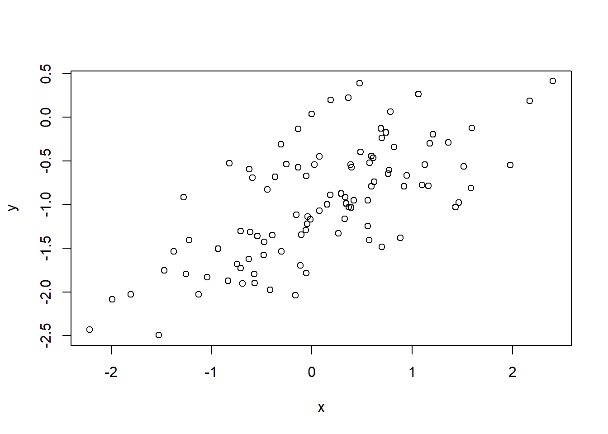
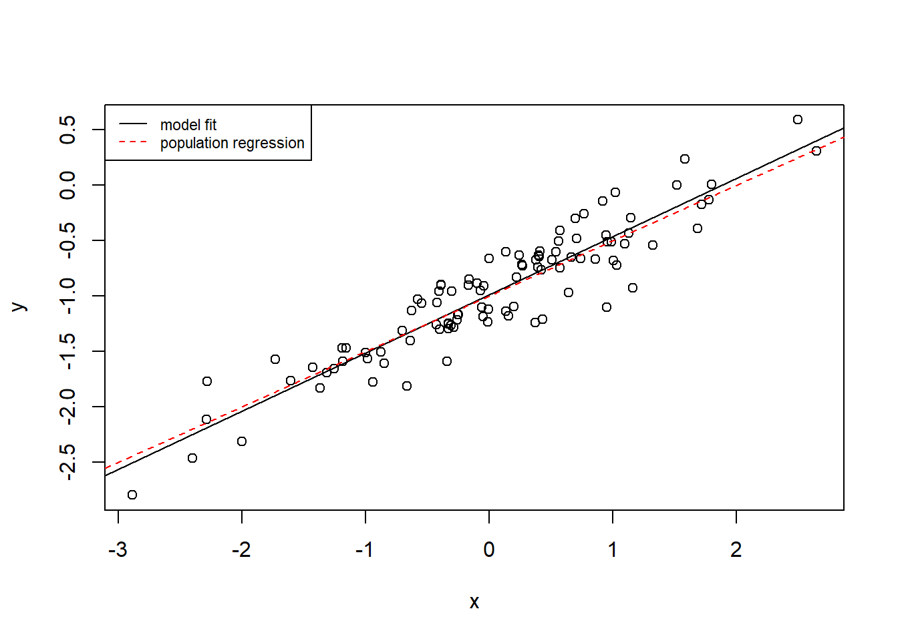
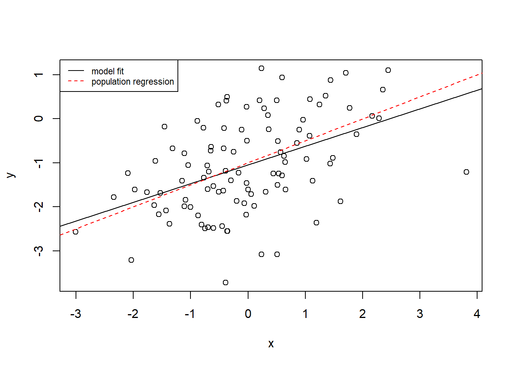

---
editor_options:
  markdown:
    wrap: 72
---

# Demonstration 2 {-}

## Population Parameters and Estimated Coefficients {-}

Let's explore the differences between population parameters and estimated coefficients.  

We will generate a "true" population dataset.  

We create a variable $X$ with 100 observations drawn from a normal distribution. To be more specific about the characteristic of our variable $X$, we will not only specify the total number of observations (100), but also the mean (0), and standard deviation (1). This will be our *predictor*.


```r
set.seed(1)
x <- rnorm(100, 0, 1)
```

We now create another vector called **eps** containing 100 observations drawn from a normal distribution with a mean of zero and a variance of 0.25. This will be the our error term $\epsilon$.


```r
eps <- rnorm(100, 0, sqrt(0.25))
```

Using $X$ and $\epsilon$, we now generate a vector $Y$ according to the following formula: $Y = -1 + 0.5X + \epsilon$. Essentially, we specify our intercept, the slope coefficient, the predictor variable and the error to obtain our *response* variable.


```r
y <- -1 + 0.5 * x + eps
```

The values $-1$ and $0.5$ represent the "true" population values for the intercept $\beta_{0}$ and slope $\beta_{1}$ respectively.

Now we can create a scatterplot to observe the association between $X$ and $Y$.


```r
plot(x, y)
```



The plot indicates a linear relationship between $X$ and $Y$. The relationship is clearly not perfectly linear due to noise.  

**If we were to instead estimate the intercept and slope, to what degree do you think these estimated coefficients will differ from the true population values?**

Ok, so we have the variables we generated, so our predictor **X** and our response **X** and we run a regression model.


```r
fit <- lm(y ~ x)
summary(fit)
```

```
## 
## Call:
## lm(formula = y ~ x)
## 
## Residuals:
##      Min       1Q   Median       3Q      Max 
## -0.93842 -0.30688 -0.06975  0.26970  1.17309 
## 
## Coefficients:
##             Estimate Std. Error t value Pr(>|t|)    
## (Intercept) -1.01885    0.04849 -21.010  < 2e-16 ***
## x            0.49947    0.05386   9.273 4.58e-15 ***
## ---
## Signif. codes:  0 '***' 0.001 '**' 0.01 '*' 0.05 '.' 0.1 ' ' 1
## 
## Residual standard error: 0.4814 on 98 degrees of freedom
## Multiple R-squared:  0.4674,	Adjusted R-squared:  0.4619 
## F-statistic: 85.99 on 1 and 98 DF,  p-value: 4.583e-15
```

The results of the model show an estimated slope coefficient ($\hat{\beta_{1}}$) for $x$ of $0.49947$. This is very close to the population value ($\beta_{1}$) which is $0.5$.   

We see a similar estimated value for the intercept ($\hat{\beta_{0}}$) which is $-1.01885$, again very close to the true value for the intercept ($\beta_{0}$) which is $-1$.  

Therefore, if we were to plot the population regression line and the estimated regression line, we would see that the two are difficult to distinguish (given the similarity of the estimated and true values for the coefficients).


```r
plot(x, y)
abline(fit)
abline(-1, 0.5, col = "red", lty = 2)
legend("topleft",
  c("model fit", "population regression"),
  col = c("black", "red"),
  lty = c(1, 2), 
  cex = 0.72,
)
```


What if we were to fit a polynomial regression model? Would there be any evidence that adding a quadratic term improves the model fit?   

To add a polynomial term of degree two, we can use the `poly` base R function directly in the code for the model.   

Since the F-test is not statistically significant, there is no evidence that adding a quadratic term improves the model fit.   


```r
fit2 <- lm(y ~ poly(x, 2))
anova(fit, fit2)
```

```
## Analysis of Variance Table
## 
## Model 1: y ~ x
## Model 2: y ~ poly(x, 2)
##   Res.Df    RSS Df Sum of Sq      F Pr(>F)
## 1     98 22.709                           
## 2     97 22.257  1   0.45163 1.9682 0.1638
```

## What happens if we *reduce* noise? {-}

For our first model (**fit**), we specified a variance of $0.5$ (standard deviation 0.25) for $\epsilon$ and we noted an $R^2$ value of $0.4674$. 


```r
set.seed(1)
x <- rnorm(100, 0, 1)
eps <- rnorm(100, 0, sqrt(0.25))
y <- -1 + 0.5 * x + eps
fit <- lm(y ~ x)
summary(fit)
```

```
## 
## Call:
## lm(formula = y ~ x)
## 
## Residuals:
##      Min       1Q   Median       3Q      Max 
## -0.93842 -0.30688 -0.06975  0.26970  1.17309 
## 
## Coefficients:
##             Estimate Std. Error t value Pr(>|t|)    
## (Intercept) -1.01885    0.04849 -21.010  < 2e-16 ***
## x            0.49947    0.05386   9.273 4.58e-15 ***
## ---
## Signif. codes:  0 '***' 0.001 '**' 0.01 '*' 0.05 '.' 0.1 ' ' 1
## 
## Residual standard error: 0.4814 on 98 degrees of freedom
## Multiple R-squared:  0.4674,	Adjusted R-squared:  0.4619 
## F-statistic: 85.99 on 1 and 98 DF,  p-value: 4.583e-15
```

Now, let's observe what happens to the $R^2$ value if we *reduce* noise from 0.25 to 0.05. We can do so directly when we generate data for our variable $y$ without needing to create a new **eps** object.  

The results show that the $R^{2}$ value for **fit3** is much higher than the $R^{2}$ value for **fit**. 


```r
x <- rnorm(100, 0, 1)
y <- -1 + 0.5 * x + rnorm(100, 0, sqrt(0.05))

fit3 <- lm(y ~ x)
summary(fit3)
```

```
## 
## Call:
## lm(formula = y ~ x)
## 
## Residuals:
##      Min       1Q   Median       3Q      Max 
## -0.61308 -0.12553 -0.00391  0.15199  0.41332 
## 
## Coefficients:
##             Estimate Std. Error t value Pr(>|t|)    
## (Intercept) -0.98917    0.02216  -44.64   <2e-16 ***
## x            0.52375    0.02152   24.33   <2e-16 ***
## ---
## Signif. codes:  0 '***' 0.001 '**' 0.01 '*' 0.05 '.' 0.1 ' ' 1
## 
## Residual standard error: 0.2215 on 98 degrees of freedom
## Multiple R-squared:  0.858,	Adjusted R-squared:  0.8565 
## F-statistic: 592.1 on 1 and 98 DF,  p-value: < 2.2e-16
```

By plotting the data we can clearly see that the data points are less dispersed than before and therefore, the association between x and y appears more linear. We can also observe that the estimated regression line deviates slightly from the population regression line (particularly at lowest and highest values).


```r
plot(x, y)
abline(fit3)
abline(-1, 0.5, col = "red", lty = 2)
legend("topleft",
  c("model fit", "population regression"),
  col = c("black", "red"),
  lty = c(1, 2), 
  cex = 0.72
)
```



## What happens if we *increase* noise? {-}

Using the same approach as before, we now increase the standard deviation to 1.  

Now, the $R^{2}$ value for **fit4** is much *lower* than that of either **fit3** or **fit**.


```r
x <- rnorm(100, 0, 1)
y <- -1 + 0.5 * x + rnorm(100, 0, 1)

fit4 <- lm(y ~ x)
summary(fit4)
```

```
## 
## Call:
## lm(formula = y ~ x)
## 
## Residuals:
##      Min       1Q   Median       3Q      Max 
## -2.51014 -0.60549  0.02065  0.70483  2.08980 
## 
## Coefficients:
##             Estimate Std. Error t value Pr(>|t|)    
## (Intercept) -1.04745    0.09676 -10.825  < 2e-16 ***
## x            0.42505    0.08310   5.115 1.56e-06 ***
## ---
## Signif. codes:  0 '***' 0.001 '**' 0.01 '*' 0.05 '.' 0.1 ' ' 1
## 
## Residual standard error: 0.9671 on 98 degrees of freedom
## Multiple R-squared:  0.2107,	Adjusted R-squared:  0.2027 
## F-statistic: 26.16 on 1 and 98 DF,  p-value: 1.56e-06
```

If we plot the data, we can observe that the data points are more dispersed and therefore, the estimated regression line deviates to a greater extent from the population regression line.


```r
plot(x, y)
abline(fit4)
abline(-1, 0.5, col = "red", lty = 2)
legend("topleft",
  c("model fit", "population regression"),
  col = c("black", "red"),
  lty = c(1, 2), 
  cex = 0.72,
)
```



## How does noise affect confidence intervals for the coefficients? {-}

The **fit3** model is the model with the lowest amount of noise (standard deviation of 0.05), whilst **fit4** is the model with the largest amount of noise (standard deviation of 1). 

The confidence interval for the coefficient for the model with the *highest* noise is the widest. The larger the amount of noise, the wider the interval and therefore, the less precise the coefficient estimates will be. 

Conversely, the narrowest interval is that of the model with the *lowest* noise which yielded the most precise estimates. 


```r
confint(fit)
```

```
##                  2.5 %     97.5 %
## (Intercept) -1.1150804 -0.9226122
## x            0.3925794  0.6063602
```

```r
confint(fit3)
```

```
##                 2.5 %     97.5 %
## (Intercept) -1.033141 -0.9451916
## x            0.481037  0.5664653
```

```r
confint(fit4)
```

```
##                  2.5 %     97.5 %
## (Intercept) -1.2394772 -0.8554276
## x            0.2601391  0.5899632
```


