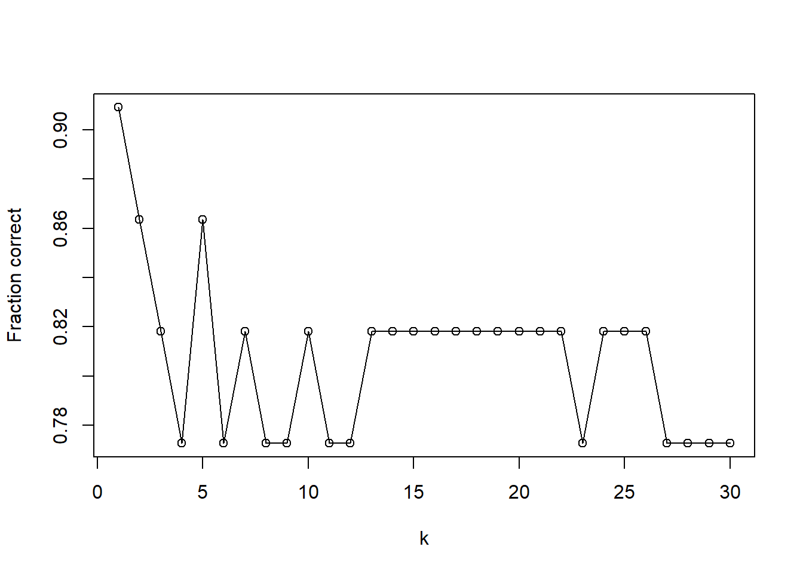

# Answers {-}

## Practical: Predicting a company’s bankruptcy {-}

*This practical is adapted from a demonstration created by Dr. Tatjana Kecojevic, Lecturer in Social Statistics.*

::: file
For the tasks below, you will require the **four_ratios** dataset.  

Click here to download the file:
<a href="data/four_ratios.csv" download="four_ratios.csv"> four_ratios.csv </a>.

Remember to place your data file in a separate subfolder within your R
project working directory.
:::

### Data and Variables {-}

In order to build a model to predict a company’s bankruptcy, an analyst has collected a sample of data as follows:  
 
Four financial ratios (predictors):    

- x1: Retained Earnings / Total Assets   
- x2: Earnings Before Interest and Taxes / Total Assets   
- x3: Sales / Total Assets   
- x4: Cash Flow / Total Debt 

And a binary response variable y:

-   0 - if the company went bankrupt

-   1 - if the company stayed solvent  

### Importing the data {-}


```r
four_ratios <- read.csv("data/four_ratios.csv", header = TRUE)
```

### Loading required packages {-}


```r
library(MASS)
library(class)
library(tidyverse)
library(corrplot)
library(ISLR2)
library(e1071)
```

We can see that the predictors are all of class double. The response is of class integer, despite this being a binary categorical variable. There are a total of 111 observations, so quite a small dataset.


```r
glimpse(four_ratios)
```

```
## Rows: 111
## Columns: 5
## $ x1 <dbl> 0.3778, 0.2783, 0.1192, 0.6070, 0.5334, 0.3868, 0.3312, 0.0130, 0.6…
## $ x2 <dbl> 0.1316, 0.1166, 0.2035, 0.2040, 0.1650, 0.0681, 0.2157, 0.2366, 0.2…
## $ x3 <dbl> 1.0911, 1.3441, 0.8130, 14.4090, 8.0734, 0.5755, 3.0679, 2.4709, 5.…
## $ x4 <dbl> 1.2784, 0.2216, 1.6702, 0.9844, 1.3474, 1.0579, 2.0899, 1.2230, 1.7…
## $ y  <int> 1, 1, 1, 1, 1, 1, 1, 1, 1, 1, 1, 1, 1, 1, 1, 1, 1, 1, 1, 1, 1, 1, 1…
```

We therefore transform the response to a factor. 


```r
four_ratios$y <- as_factor(four_ratios$y)
```

### Correlation Matrix and Plot {-}

Let's now produce a correlation plot between all pairs of variables in the dataset. 


```r
cor_matrix <- cor(four_ratios[,-5])

corrplot(cor_matrix, type = "lower", diag = FALSE)
```


We observe a strong positive correlation between $X_1$ and $X_2$. The correlations between other variables are quite weak. 

Before we consider the model, we split the data into training and test sets as we will later on assess model accuracy in correct prediction using the test data set. We consider a basic fixed split of 80:20. Since there are a total of 111 observations, we split at row 89


```r
set.seed(123)
split_idx = sample(nrow(four_ratios), 89)
train = four_ratios[split_idx, ]
test = four_ratios[-split_idx, ]
```

### Logistic Regression {-}

Now let's first consider logistic regression and build the model. Given the high correlation between $x_1$ and $x_2$ (this is to be expected, given what they measure), we have to reflect on how we want to address this. Assuming we have knowledge of important factors that can predict bankruptcy, we can decide to drop one of the two financial ratios. In this case, we drop $x_2$.


```r
fit <- glm(y ~ x1 + x3 + x4,
           data = train, family = binomial)

summary(fit)
```

```
## 
## Call:
## glm(formula = y ~ x1 + x3 + x4, family = binomial, data = train)
## 
## Deviance Residuals: 
##     Min       1Q   Median       3Q      Max  
## -2.1151  -0.4682   0.0000   0.3720   2.2542  
## 
## Coefficients:
##             Estimate Std. Error z value Pr(>|z|)    
## (Intercept)  -2.6970     0.8896  -3.032  0.00243 ** 
## x1           12.6569     3.0942   4.090  4.3e-05 ***
## x3            1.6400     0.5764   2.845  0.00444 ** 
## x4           -0.5247     0.3297  -1.591  0.11151    
## ---
## Signif. codes:  0 '***' 0.001 '**' 0.01 '*' 0.05 '.' 0.1 ' ' 1
## 
## (Dispersion parameter for binomial family taken to be 1)
## 
##     Null deviance: 123.369  on 88  degrees of freedom
## Residual deviance:  54.552  on 85  degrees of freedom
## AIC: 62.552
## 
## Number of Fisher Scoring iterations: 7
```

We now need to make a proper assessment to check if the variables collectively contribute in explaining the logit. 

Therefore, we calculate the G statistic. 


```r
G_calc <- fit$null.deviance - fit$deviance

G_calc
```

```
## [1] 68.81702
```

Then the degrees of freedom of the predictors. 


```r
Gdf <- fit$df.null - fit$df.residual

Gdf
```

```
## [1] 3
```

We find the critical value for the G statistic. 


```r
qchisq(.95, df = Gdf) 
```

```
## [1] 7.814728
```

And finally, the p-value associated with the G statistic.

```r
1 - pchisq(G_calc, Gdf)
```

```
## [1] 7.660539e-15
```

Now, we have to decide whether our model is a statistically valid one. 
Since $G_{calc} = 68.82 > G_{crit} = 7.81 ⇒ H1,$ (and the p-value is much smaller than 0.05), we can conclude that this is a statistically valid model and that the variables collectively have explanatory power.   

**However, do we need ALL three variables?**   


Rather than fitting individual models and doing a manual comparison we can make use of the anova function for comparing the nested model using the chi-square test.


```r
anova(fit, test="Chisq")
```

```
## Analysis of Deviance Table
## 
## Model: binomial, link: logit
## 
## Response: y
## 
## Terms added sequentially (first to last)
## 
## 
##      Df Deviance Resid. Df Resid. Dev  Pr(>Chi)    
## NULL                    88    123.369              
## x1    1   54.441        87     68.928 1.602e-13 ***
## x3    1   12.044        86     56.884 0.0005197 ***
## x4    1    2.332        85     54.552 0.1267323    
## ---
## Signif. codes:  0 '***' 0.001 '**' 0.01 '*' 0.05 '.' 0.1 ' ' 1
```

Based on the output, we can remove $X_4$ ratio variable from the model and we update our model (we also know that $X_4$ is not statistically significant from the summary of the model results earlier).


```r
fit2 <- update(fit, ~. -x4, data = train)

summary(fit2)
```

```
## 
## Call:
## glm(formula = y ~ x1 + x3, family = binomial, data = train)
## 
## Deviance Residuals: 
##     Min       1Q   Median       3Q      Max  
## -2.2116  -0.4985   0.0000   0.4300   2.3366  
## 
## Coefficients:
##             Estimate Std. Error z value Pr(>|z|)    
## (Intercept)  -3.4779     0.8117  -4.285 1.83e-05 ***
## x1           11.6639     2.7793   4.197 2.71e-05 ***
## x3            1.6202     0.5754   2.816  0.00487 ** 
## ---
## Signif. codes:  0 '***' 0.001 '**' 0.01 '*' 0.05 '.' 0.1 ' ' 1
## 
## (Dispersion parameter for binomial family taken to be 1)
## 
##     Null deviance: 123.369  on 88  degrees of freedom
## Residual deviance:  56.884  on 86  degrees of freedom
## AIC: 62.884
## 
## Number of Fisher Scoring iterations: 7
```

To compare the fit of the new model we will use the Akaike Information Criterion (AIC), which is an index of fit that takes account of parsimony of the model by penalising for the number of parameters. 


```r
summary(fit2)
```

```
## 
## Call:
## glm(formula = y ~ x1 + x3, family = binomial, data = train)
## 
## Deviance Residuals: 
##     Min       1Q   Median       3Q      Max  
## -2.2116  -0.4985   0.0000   0.4300   2.3366  
## 
## Coefficients:
##             Estimate Std. Error z value Pr(>|z|)    
## (Intercept)  -3.4779     0.8117  -4.285 1.83e-05 ***
## x1           11.6639     2.7793   4.197 2.71e-05 ***
## x3            1.6202     0.5754   2.816  0.00487 ** 
## ---
## Signif. codes:  0 '***' 0.001 '**' 0.01 '*' 0.05 '.' 0.1 ' ' 1
## 
## (Dispersion parameter for binomial family taken to be 1)
## 
##     Null deviance: 123.369  on 88  degrees of freedom
## Residual deviance:  56.884  on 86  degrees of freedom
## AIC: 62.884
## 
## Number of Fisher Scoring iterations: 7
```

The AIC of our initial model is 62.552 and of the new model 62.884 (very little difference). Checking the new model, we can see that it consists of the variables that all significantly contribute in explaining the logits. *So, in the spirit of parsimony we can choose the second model to be a better fit.* You will learn more about the AIC and other similar metrics later in the course.  


To obtain the overall accuracy rate we need to find the predicted probabilities of the observations kept aside in the test subset.


```r
pred <- predict(fit2, test, type = "response") > 0.5
```

Now let's compute the confusion matrix such that we can compare our predictions on the test data against the actual values in our dataset. We can see that our model predicts one instance incorrectly (it predicts *bankrupt* when in fact it should predict *solvent*)


```r
(t <- table(ifelse(pred, "Solvent (pred)", "Bankrupt (pred)"), test$y))
```

```
##                  
##                    0  1
##   Bankrupt (pred) 11  1
##   Solvent (pred)   0 10
```

If we then compute the overall fraction of correct predictions, we can see that this is extremely high (0.955) which means that our model is performing extremely well. *In practice*: Although the overall accuracy rate might be easy to compute and to interpret, it makes no distinction about the type of errors being made. Although we did remove one the variables due to high correlation, other variables do show some degree of correlation and so we must be cautious about the strength of the relationship and therefore, the overall predictive performance. 


```r
sum(diag(t)) / sum(t)
```

```
## [1] 0.9545455
```

*Do note that if you performing any rounding of the probabilities prior to classification, values near the threshold of 0.5 may be classified differently than if you were not to round the probabilities.*  


### Linear Discriminant Analysis {-}

#### Task 1 {-}

Build a LDA classifier for the final logistic model with two predictors and explain what the output means.


```r
fit_lda <- lda(y ~ x1 + x3, data = train)

fit_lda
```

```
## Call:
## lda(y ~ x1 + x3, data = train)
## 
## Prior probabilities of groups:
##        0        1 
## 0.494382 0.505618 
## 
## Group means:
##            x1        x3
## 0 0.009738636 0.4628477
## 1 0.341413333 2.6057978
## 
## Coefficients of linear discriminants:
##           LD1
## x1 4.61295546
## x3 0.06590811
```

-  prior probabilities of groups: these tells us the way in which the two classes are distributed in our *training data* (i.e. 49.4 % of the observations correspond to bankruptcy whilst 50.6 % to solvency).  
-  group means: the average of the two predictors within each class which are used by LDA as an estimate of $μ_{k}$.  
-  coefficient(s) of linear discriminants: tells us how our predictor(s) influence the score that is used to classify the observations into one of the two categories. Here, the coefficients both predictors are positive and so this indicates that higher values for $x_1$ and $x_2$ will make the model more likely classify an observation as belonging to the **solvent** class; also, the larger the absolute value of the coefficient, the stronger the influence on the model. 


```r
fit_lda
```

```
## Call:
## lda(y ~ x1 + x3, data = train)
## 
## Prior probabilities of groups:
##        0        1 
## 0.494382 0.505618 
## 
## Group means:
##            x1        x3
## 0 0.009738636 0.4628477
## 1 0.341413333 2.6057978
## 
## Coefficients of linear discriminants:
##           LD1
## x1 4.61295546
## x3 0.06590811
```


#### Task 2 {-}

Compute the predictions and explain what the results mean. 


```r
result_lda <- predict(fit_lda, test)
```

The `class` component is a factor that contains the predictions for bankruptcy status (solvent/bankrupt).


```r
result_lda$class
```

```
##  [1] 1 1 1 1 1 1 1 1 1 0 0 0 0 0 0 0 0 0 1 0 0 0
## Levels: 0 1
```

The `posterior` component is matrix that contains the posterior probability that the corresponding observation belongs to a given class.


```r
result_lda$posterior
```

```
##              0            1
## 1   0.17760365 8.223963e-01
## 2   0.31142722 6.885728e-01
## 10  0.07228194 9.277181e-01
## 11  0.33538335 6.646166e-01
## 19  0.04495309 9.550469e-01
## 20  0.17728895 8.227110e-01
## 24  0.40407718 5.959228e-01
## 28  0.22738932 7.726107e-01
## 29  0.14095907 8.590409e-01
## 37  0.53834405 4.616560e-01
## 40  0.70105814 2.989419e-01
## 44  0.85424906 1.457509e-01
## 45  0.73762416 2.623758e-01
## 49  0.95002382 4.997618e-02
## 56  0.99999946 5.413229e-07
## 58  0.83468414 1.653159e-01
## 62  0.87475890 1.252411e-01
## 64  0.94351212 5.648788e-02
## 66  0.25093559 7.490644e-01
## 85  0.61062622 3.893738e-01
## 105 0.99988023 1.197708e-04
## 109 0.96722224 3.277776e-02
```

The `x` component contains the linear discriminants.


```r
result_lda$x
```

```
##            LD1
## 1    0.8942494
## 2    0.4519351
## 10   1.5042674
## 11   0.3864033
## 19   1.8058326
## 20   0.8955396
## 24   0.2096297
## 28   0.7090237
## 29   1.0586059
## 37  -0.1147903
## 40  -0.5328419
## 44  -1.0809275
## 45  -0.6413331
## 49  -1.7849665
## 56  -8.6567024
## 58  -0.9916955
## 62  -1.1858701
## 64  -1.7075644
## 66   0.6315464
## 85  -0.2920645
## 105 -5.4259016
## 109 -2.0480872
```

To obtain our predictions, we can simply extract the `class` element. 


```r
pred_lda <- result_lda$class
```

#### Task 3 {-}

Compute the confusion matrix for the LDA classifier and calculate the fraction of correct predictions. Explain the results.


```r
(t <- table(pred_lda, test$y))
```

```
##         
## pred_lda  0  1
##        0 11  1
##        1  0 10
```

And now the fraction of correct predictions which, we can see is identical to that obtained for logistic regression. 


```r
sum(diag(t)) / sum(t)
```

```
## [1] 0.9545455
```

LDA performs identically to logistic regression. 

### Quadratic Discriminant Analysis {-}

#### Task 1 {-}

Build a QDA clasifier and describe the output. 


```r
fit_qda <- qda(y ~ x1 + x3, data = train)

fit_qda
```

```
## Call:
## qda(y ~ x1 + x3, data = train)
## 
## Prior probabilities of groups:
##        0        1 
## 0.494382 0.505618 
## 
## Group means:
##            x1        x3
## 0 0.009738636 0.4628477
## 1 0.341413333 2.6057978
```

In terms of prior probabilities and group means, the output is identical to that of linear discriminant analysis. However, the output does not include the coefficients of the *linear* discriminants for obvious reasons. 

#### Task 2 {-}

Compute the predictions, the confusion matrix, and the fraction of correct predictions and explain what the results mean. 


```r
pred_qda <- predict(fit_qda, test, type = "response")$class

(t <- table(pred_qda, test$y))
```

```
##         
## pred_qda  0  1
##        0 11  6
##        1  0  5
```


```r
sum(diag(t)) / sum(t)
```

```
## [1] 0.7272727
```

The fraction of correct predictions is lower (0.73) than that for logistic regression and for LDA (0.95). We therefore conclude that in this context, QDA does not perform well in comparison to the previous two approaches.

### $K$-nearest neighbours {-}

#### Task 1 {-}

Perform KNN regression on the same model as in the previous tasks.


```r
fit_knn <- knn(train[, c("x1", "x3"), drop = FALSE],
               test[, c("x1", "x3"), drop = FALSE],
               train$y, 
               k = 1
               )
```

#### Task 2 {-} 

Produce a confusion matrix and compute the fraction of correct predictions. Comment on the results. 


```r
(t <- table(fit_knn, test$y))
```

```
##        
## fit_knn  0  1
##       0 10  1
##       1  1 10
```


```r
sum(diag(t)) / sum(t)
```

```
## [1] 0.9090909
```

Our overall fraction of correct predictions is 0.91. Therefore, the KNN classifier ($k = 1$) performs better than QDA (0.73), but worse than logistic regression and and LDA (0.95).

#### Task 3 {-} 

Fit KNN for up to $k = 30$ and then calculate the overall fraction of correct prediction. 


```r
set.seed(1)
knn_k <- sapply(1:30, function(k) {
  fit_knn <- knn(train[, c("x1", "x3"), drop = FALSE],
                 test[, c("x1", "x3"), drop = FALSE],
                 train$y, k = k)
  mean(fit_knn == test$y)
})
```

#### Task 4 {-} 

Create a plot to observe at what value for `k` the overall fraction of correct predictions is highest. 


```r
plot(1:30, knn_k, type = "o", xlab = "k", ylab = "Fraction correct")
```



As you can see, the highest fraction of correct predictions is when $k = 1$ (also confirmed by using `which.max`). 


```r
(k <- which.max(knn_k))
```

```
## [1] 1
```

The behaviour you observe results from several reasons, one of which is the size of the dataset.

### Naive Bayes {-}

#### Task 1 {-}

Build a Naive Bayes classifier for the model used previously and describe the output. 


```r
fit_NBayes <- naiveBayes(y~ x1 + x3, data = train)

fit_NBayes
```

```
## 
## Naive Bayes Classifier for Discrete Predictors
## 
## Call:
## naiveBayes.default(x = X, y = Y, laplace = laplace)
## 
## A-priori probabilities:
## Y
##        0        1 
## 0.494382 0.505618 
## 
## Conditional probabilities:
##    x1
## Y          [,1]      [,2]
##   0 0.009738636 0.2458544
##   1 0.341413333 0.1529747
## 
##    x3
## Y        [,1]      [,2]
##   0 0.4628477 0.5992219
##   1 2.6057978 5.0402790
```

- A-priori probabilities: i.e. prior probabilities (distribution of the classes for the response variable)  
- Conditional probabilities: parameters of the model for each predictor by class. Since the predictors are numeric variables, the parameters shown are the mean `[,1]` and standard deviation `[,2]` for the predictor values in each class.  


#### Task 2 {-}

Compute the predictions, build a confusion matrix, calculate the fraction of correct predictions and interpret the results. 


```r
pred_NBayes <- predict(fit_NBayes, test, type = "class")
```

And finally, generate our confusion matrix. 


```r
(t <- table(pred_NBayes, test$y))
```

```
##            
## pred_NBayes  0  1
##           0 11  8
##           1  0  3
```

Our overall fraction of correct predictions is $0.64$. 


```r
sum(diag(t)) / sum(t)
```

```
## [1] 0.6363636
```

Naive Bayes performs the worst out of all classifiers we have explored.

*Based on the approaches we have implemented in this demonstration, logistic regression and LDA perform best.*
