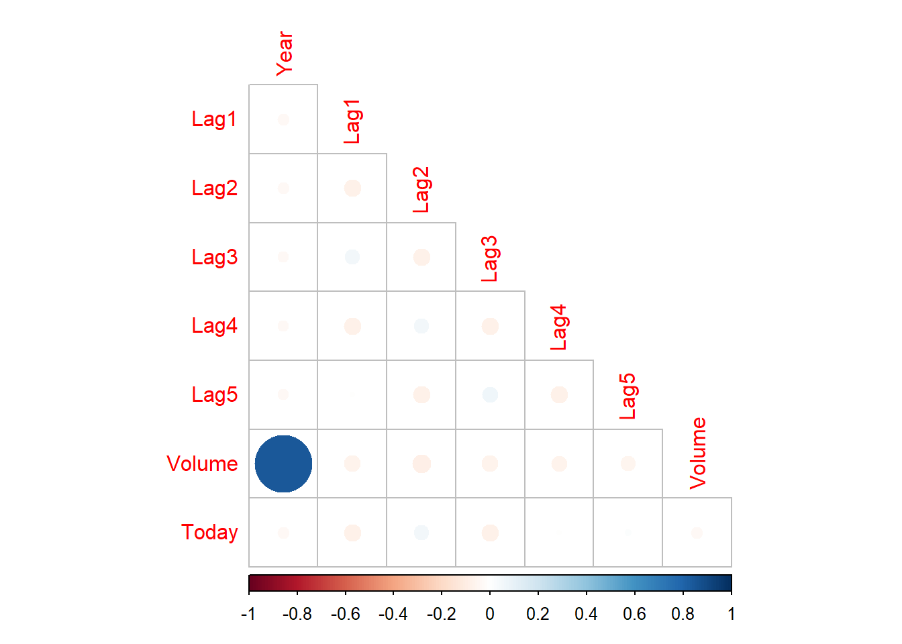

# Demonstration: Classification Problems {-}

In this demonstration, you will learn how to address classification problems using logistic regression, discriminant analysis, KNN, and Naive Bayes.

You will need the **Weekly** dataset, part of the `ISRL2` package. By loading the package, the **Weekly** dataset loads automatically.

In addition to the `ISLR2` package, will also require the following:  


```r
library(MASS)
library(class)
library(tidyverse)
library(corrplot)
library(ISLR2)
library(e1071)
```

## Dataset and Variables {-}

The **Weekly** dataset contains weekly percentage returns for the S&P 500 stock index between 1990 and 2010. It is a dataframe with 1098 observations and 9 variables. The variables are:   

-  Year: year observation was recorded  
-  Lag1: Percentage return for previous week  
-  Lag2: Percentage return for 2 weeks previous  
-  Lag3: Percentage return for 3 weeks previous  
-  Lag4: Percentage return for 4 weeks previous  
-  Lag5: Percentage return for 5 weeks previous  
-  Volume: Volume of shares traded (average number of daily shares traded in billions)   
-  Today: percentage return for current week  
-  Direction: whether the market had a positive (up) or negative (down) return on a given week.     

In this demonstration, the goal is to predict whether the market had a positive (up) or negative (down) return on a given week. Therefore, **Direction** will be our response variable. 

Before we consider the model, let's first explore our dataset.  

By exploring the structure of the dataframe, we find out that all variables are numeric, with the exception of the **Direction** variable. 


```r
str(Weekly)
```

```
## 'data.frame':	1089 obs. of  9 variables:
##  $ Year     : num  1990 1990 1990 1990 1990 1990 1990 1990 1990 1990 ...
##  $ Lag1     : num  0.816 -0.27 -2.576 3.514 0.712 ...
##  $ Lag2     : num  1.572 0.816 -0.27 -2.576 3.514 ...
##  $ Lag3     : num  -3.936 1.572 0.816 -0.27 -2.576 ...
##  $ Lag4     : num  -0.229 -3.936 1.572 0.816 -0.27 ...
##  $ Lag5     : num  -3.484 -0.229 -3.936 1.572 0.816 ...
##  $ Volume   : num  0.155 0.149 0.16 0.162 0.154 ...
##  $ Today    : num  -0.27 -2.576 3.514 0.712 1.178 ...
##  $ Direction: Factor w/ 2 levels "Down","Up": 1 1 2 2 2 1 2 2 2 1 ...
```

## Correlation Matrix and Plot {-}

Let's now produce a correlation plot between all pairs of *numeric* variables in the dataset. 

Using the base R `cor()` function, we exclude the 9th variable (which is a factor) and compute the correlation among all pairs of numeric variables. 


```r
cor(Weekly[, -9])
```

```
##               Year         Lag1        Lag2        Lag3         Lag4
## Year    1.00000000 -0.032289274 -0.03339001 -0.03000649 -0.031127923
## Lag1   -0.03228927  1.000000000 -0.07485305  0.05863568 -0.071273876
## Lag2   -0.03339001 -0.074853051  1.00000000 -0.07572091  0.058381535
## Lag3   -0.03000649  0.058635682 -0.07572091  1.00000000 -0.075395865
## Lag4   -0.03112792 -0.071273876  0.05838153 -0.07539587  1.000000000
## Lag5   -0.03051910 -0.008183096 -0.07249948  0.06065717 -0.075675027
## Volume  0.84194162 -0.064951313 -0.08551314 -0.06928771 -0.061074617
## Today  -0.03245989 -0.075031842  0.05916672 -0.07124364 -0.007825873
##                Lag5      Volume        Today
## Year   -0.030519101  0.84194162 -0.032459894
## Lag1   -0.008183096 -0.06495131 -0.075031842
## Lag2   -0.072499482 -0.08551314  0.059166717
## Lag3    0.060657175 -0.06928771 -0.071243639
## Lag4   -0.075675027 -0.06107462 -0.007825873
## Lag5    1.000000000 -0.05851741  0.011012698
## Volume -0.058517414  1.00000000 -0.033077783
## Today   0.011012698 -0.03307778  1.000000000
```

We store the computed correlation matrix in a new object which we will then use to create a correlation matrix plot with the `corrplot()` function from the `corrplot` package. 


```r
cor_matrix <- cor(Weekly[, -9])

corrplot(cor_matrix)
```


By using the default arguments, we obtain the correlation matrix in full, with each circle representing the correlation between each variable. The size of the circle represents the magnitude of the correlation, whilst the shade corresponds to both strength and direction of the correlation. As the legend illustrates, a perfect negative correlation (-1) is represented by dark red and a perfect positive correlation (+1) in dark blue. As you already know, the correlation matrix is symmetric around its diagonal. The diagonal area represents the correlation of each variable with itself, and therefore, this corresponds to a perfect correlation (dark blue).

To facilitate interpretation, particularly when we are dealing with a large number of variables, we can set the `diag` argument to `FALSE` to remove the correlation of each variable with itself from the plot. Because of its symmetric property, we can also display just half of the square since the parts on either side of the diagonal are mirror images. We can achieve this using the `type` argument. We can either choose to display the area above the diagonal or the area below the diagonal, as I did below. There are many other options if you want to further customise your correlation plot such using a different visualisation method of the direction and strength of the correlation using the `method` argument. Have a look at the documentaion of the `corrplot` function using ?.


```r
corrplot(cor_matrix, type = "lower", diag = FALSE)
```



Now, the correlation plot only displays the correlations between the 8 numeric variables. We observe a strong positive correlation between volume of daily shares traded and the year the observation was recorded (dark blue). The correlations between other variables are quite weak but notably, we see that Lag1 and Lag3, Lag 2 and Lag4, Lag3 and Lag5, and Today and Lag2 are positively correlated with one another (albeit weakly). Other variables also appear weakly negatively correlated, such as Lag1 and Lag2.   

*Ok, so what was the purpose of computing the correlation matrix? You'll remember that multicollinearity is an issue in model building which can lead to inflated variances of the estimated coefficients. As a result of the shared variance between two highly correlated predictors, our ability to adequately evaluate the effect of the predictors on the outcome will be affected (e.g. increased risk of overfitting). One way to deal with multicollinearity is to eliminate one of the highly correlated predictors.*

## "Classic" Logistic Regression {-}

Now let's build our logistic regression model the classic way.   

Given the high correlation between **Year** and **Volume**, we have to reflect on how we want to address this. Assuming we have knowledge of important factors that can predict market movement (**Direction**), we decide to drop the **Year** variable rather than **Volume*** since the latter measures average number of daily shares traded (in billions).    

You may remember that in R, these models are built using the base R `glm` function within which the `family` argument must be set to `binomial`.    

Note that in this dataset, the **Direction** variable is already a factor so there is no need to perform any recoding/transformations but remember to ALWAYS explore your data in detail before you build any model. 


```r
fit <- glm(Direction ~ Lag1 + Lag2 + Lag3 + Lag4 + Lag5 + Volume,
           data = Weekly, family = binomial)
summary(fit)
```

```
## 
## Call:
## glm(formula = Direction ~ Lag1 + Lag2 + Lag3 + Lag4 + Lag5 + 
##     Volume, family = binomial, data = Weekly)
## 
## Deviance Residuals: 
##     Min       1Q   Median       3Q      Max  
## -1.6949  -1.2565   0.9913   1.0849   1.4579  
## 
## Coefficients:
##             Estimate Std. Error z value Pr(>|z|)   
## (Intercept)  0.26686    0.08593   3.106   0.0019 **
## Lag1        -0.04127    0.02641  -1.563   0.1181   
## Lag2         0.05844    0.02686   2.175   0.0296 * 
## Lag3        -0.01606    0.02666  -0.602   0.5469   
## Lag4        -0.02779    0.02646  -1.050   0.2937   
## Lag5        -0.01447    0.02638  -0.549   0.5833   
## Volume      -0.02274    0.03690  -0.616   0.5377   
## ---
## Signif. codes:  0 '***' 0.001 '**' 0.01 '*' 0.05 '.' 0.1 ' ' 1
## 
## (Dispersion parameter for binomial family taken to be 1)
## 
##     Null deviance: 1496.2  on 1088  degrees of freedom
## Residual deviance: 1486.4  on 1082  degrees of freedom
## AIC: 1500.4
## 
## Number of Fisher Scoring iterations: 4
```

The results show that only **Lag2** is significant at an alpha level of 0.05.  

Ok, so let's see now how well our model predicts whether the market had a positive or negative return in a given week.   

### Confusion Matrix {-}

Now, let's assess the effectiveness of our model by comparing the actual values with those predicted by the model. We can do so using a *confusion matrix* which compares the model predictions with the true values.  

Using `predict(fit, type = "response")`, we generate predictions from our model (`fit`) on the scale of the response variable (`type = "response"`). In this case, our response variable is measured on a probability scale. 

We choose the standard threshold of 0.5 such that we label an observation as belonging to the **Up** category if its posterior probability is above 0.5 or as **Down** if the posterior probability is below 0.5. Hence, in this context, the `> 0.5` argument transforms the predicted probabilities into a binary form such that predictions greater than 0.5 are labelled TRUE (so representing upward market movement), whilst the rest are labelled FALSE (representing downward market movement). 


```r
pred <- predict(fit, type = "response") > 0.5
```

Now that we have the frequencies of the TRUE and FALSE instances, let's build our two-way confusion matrix using the base R `table()` function. The `ifelse` function nested inside `table()` converts the logical TRUE and FALSE values in the **pred** object intro descriptive labels to facilitate interpretation; so, if **pred** is TRUE (> 0.5), it becomes labelled as `Up (pred)`, whilst it is is FALSE, it is labelled as `"Down (pred)"`. To also include the actual values of market movement from the dataset, we also need to add `Weekly$Direction`as our argument.  

Finally to 'force' R to display the `conf_matrix` object we just created, we can place the entire code in single parentheses. 


```r
(conf_matrix <- table(ifelse(pred, "Up (pred)", "Down (pred)"), Weekly$Direction))
```

```
##              
##               Down  Up
##   Down (pred)   54  48
##   Up (pred)    430 557
```

Now let's interpret the results. The results in diagonal represent correct predictions of market movement whilst those in the off-diagonal represent misclassified observations. We can see that our model incorrectly classified 430 instances of market movement as upward movement when in fact they represented downward movement and 48 instances as downward movement when in fact they represented upward movement. Overall, our logistic regression model correctly predicts upwards movements well but it performs poorly at predicting downward movements.  

We can also compute the overall fraction of correct predictions by dividing the number of correct predictions by total number of predictions. We therefore divide the sum of the diagonal values in our confusion matrix (numerator) by the sum of all elements of the matrix (denominator). We extract the diagonal values from the matrix using the base R `diag()` function.


```r
sum(diag(conf_matrix)) / sum(conf_matrix)
```

```
## [1] 0.5610652
```

The overall fraction of correct predictions is 0.561 (so our model makes correct predictions about 56.1% of the time).  

**Right, so does that mean that this model will make correct predictions 56% of the time on a new, unseen dataset?**

You already know the answer :)! We used our entire dataset to fit our model. This means that we cannot say anything about how our model will perform on a different dataset and we no longer have any 'unseen' data left to test this out.

## Logistic Regression in Statistical Learning {-}

Now, let's consider logistic regression as applied in statistical learning. 

We will again consider a basic fixed split. In this example, we will fit our model using data from 1990 up to 2008 and set the data from 2009 and 2010 aside; this will be our test dataset. 

This is easily achieved by creating a vector of logical values from the data according to our **Year** criterion. 


```r
train <- Weekly$Year < 2009
```

In our previous model, we observed that **Lag2** was the only statistically significant predictor. To exemplify how we can use logistic regression in statistical learning, we will build a simple simple with only one predictor.

The approach to building the model is the same as the one with which you are already familiar. The exception, of course, is that we will only use part of the dataset to build our model (which in this case is referred to as *training the model*). To subset our dataset to only include data from years previous to 2009, we use the logical vector **train** we just created.


```r
fit_log_SL <- glm(Direction ~ Lag2, data = Weekly[train, ], family = binomial)
```

Now let's generate predictions; the function and the overall structure of the code is the same as discussed earlier in the demonstration. The exception is that we used the trained model `fit_log_SL` to make predictions on the *test* dataset (`Weekly[!train, ]`). Using `!`, we tell R to not include the training data when generating predictions. 


```r
pred <- predict(fit_log_SL, Weekly[!train, ], type = "response") > 0.5
```

Now let's compute the confusion matrix such that we can compare our predictions on the test data (`pred`) against the actual values in our dataset (`Weekly[!train, ]$Direction)`).


```r
(t <- table(ifelse(pred, "Up (pred)", "Down (pred)"), Weekly[!train, ]$Direction))
```

```
##              
##               Down Up
##   Down (pred)    9  5
##   Up (pred)     34 56
```

If we then compute the overall fraction of correct predictions for the test data we can see that this is higher than the value we obtained using the classical approach ($0.561$).


```r
sum(diag(t)) / sum(t)
```

```
## [1] 0.625
```

## Linear Discriminant Analysis {-}

How well would linear discriminant analysis address our binary classification problem?

In R, LDA can be performed using the `lda()` function from the `MASS` package. The basic structure of the function is similar to the other models you have built. 


```r
fit_lda <- lda(Direction ~ Lag2, data = Weekly[train, ])
```

The output is, of course, different. 

-  prior probabilities of groups: these tells us the way in which the two classes are distributed in our *training data* (i.e. 44.8 % of the observations correspond to downward market movement whilst 55.2% to upward market movement).  
-  group means: the average of our single predictor **Lag2** within each class, and are used by LDA as an estimate of $μ_{k}$.  
-  coefficient(s) of linear discriminants: tells us how our predictor(s) influence the score that is used to classify the observations into one of the two categories. Here, the coefficient is positive 0.44 and so this indicates that higher values for **Lag2** will make the modelmore likely classify an observation as belonging to the **Up** class; also, the larger the absolute value of the coefficient, the stronger the influence on the model. 


```r
fit_lda
```

```
## Call:
## lda(Direction ~ Lag2, data = Weekly[train, ])
## 
## Prior probabilities of groups:
##      Down        Up 
## 0.4477157 0.5522843 
## 
## Group means:
##             Lag2
## Down -0.03568254
## Up    0.26036581
## 
## Coefficients of linear discriminants:
##            LD1
## Lag2 0.4414162
```

Now let's consider what the `predict()` function does when applied in the context of LDA.  


```r
result_lda <- predict(fit_lda, Weekly[!train, ])
```

The output will contain three components: `class`, `posterior`, and `x`, each of which can be accessed using `$`.

The `class` component is a factor that contains the predictions for market movement (up/down).


```r
result_lda$class
```

```
##   [1] Up   Up   Down Down Up   Up   Up   Down Down Down Down Up   Up   Up   Up  
##  [16] Up   Up   Up   Up   Up   Down Up   Up   Up   Up   Up   Up   Up   Up   Up  
##  [31] Up   Up   Up   Up   Up   Up   Up   Up   Up   Up   Up   Up   Up   Up   Down
##  [46] Up   Up   Up   Up   Up   Up   Up   Up   Up   Up   Up   Down Up   Up   Up  
##  [61] Up   Up   Up   Up   Up   Up   Up   Up   Up   Up   Up   Down Up   Down Up  
##  [76] Up   Up   Up   Down Down Up   Up   Up   Up   Up   Down Up   Up   Up   Up  
##  [91] Up   Up   Up   Up   Up   Up   Up   Up   Up   Up   Up   Up   Up   Up  
## Levels: Down Up
```

The `posterior` component is matrix that contains the posterior probability that the corresponding observation belongs to a given class.


```r
result_lda$posterior
```

```
##           Down        Up
## 986  0.4736555 0.5263445
## 987  0.3558617 0.6441383
## 988  0.5132860 0.4867140
## 989  0.5142948 0.4857052
## 990  0.4799727 0.5200273
## 991  0.4597586 0.5402414
## 992  0.3771117 0.6228883
## 993  0.5184724 0.4815276
## 994  0.5480397 0.4519603
## 995  0.5146118 0.4853882
## 996  0.5504246 0.4495754
## 997  0.3055404 0.6944596
## 998  0.4268160 0.5731840
## 999  0.3637275 0.6362725
## 1000 0.4034316 0.5965684
## 1001 0.4256310 0.5743690
## 1002 0.4277053 0.5722947
## 1003 0.4548626 0.5451374
## 1004 0.4308002 0.5691998
## 1005 0.3674066 0.6325934
## 1006 0.5210641 0.4789359
## 1007 0.4426627 0.5573373
## 1008 0.3983332 0.6016668
## 1009 0.4170520 0.5829480
## 1010 0.4400457 0.5599543
## 1011 0.4872186 0.5127814
## 1012 0.4529323 0.5470677
## 1013 0.4844231 0.5155769
## 1014 0.4769786 0.5230214
## 1015 0.3531293 0.6468707
## 1016 0.3912903 0.6087097
## 1017 0.4373753 0.5626247
## 1018 0.4163510 0.5836490
## 1019 0.4583549 0.5416451
## 1020 0.4182305 0.5817695
## 1021 0.4454253 0.5545747
## 1022 0.4667580 0.5332420
## 1023 0.4126831 0.5873169
## 1024 0.4146279 0.5853721
## 1025 0.4814414 0.5185586
## 1026 0.4756405 0.5243595
## 1027 0.3860819 0.6139181
## 1028 0.4278606 0.5721394
## 1029 0.4599449 0.5400551
## 1030 0.5071309 0.4928691
## 1031 0.4042648 0.5957352
## 1032 0.4173045 0.5826955
## 1033 0.4520606 0.5479394
## 1034 0.4491759 0.5508241
## 1035 0.4304467 0.5695533
## 1036 0.4487621 0.5512379
## 1037 0.4544049 0.5455951
## 1038 0.4184691 0.5815309
## 1039 0.4637729 0.5362271
## 1040 0.4114393 0.5885607
## 1041 0.4605038 0.5394962
## 1042 0.5053429 0.4946571
## 1043 0.4728071 0.5271929
## 1044 0.4595437 0.5404563
## 1045 0.4368785 0.5631215
## 1046 0.4051682 0.5948318
## 1047 0.4553490 0.5446510
## 1048 0.4056270 0.5943730
## 1049 0.4352188 0.5647812
## 1050 0.4370488 0.5629512
## 1051 0.4410978 0.5589022
## 1052 0.4352756 0.5647244
## 1053 0.4296973 0.5703027
## 1054 0.4520034 0.5479966
## 1055 0.4194240 0.5805760
## 1056 0.4853885 0.5146115
## 1057 0.5411727 0.4588273
## 1058 0.4177113 0.5822887
## 1059 0.5100863 0.4899137
## 1060 0.4470646 0.5529354
## 1061 0.4816287 0.5183713
## 1062 0.4138300 0.5861700
## 1063 0.4157203 0.5842797
## 1064 0.5017234 0.4982766
## 1065 0.5216975 0.4783025
## 1066 0.3738247 0.6261753
## 1067 0.4666863 0.5333137
## 1068 0.3993705 0.6006295
## 1069 0.4506892 0.5493108
## 1070 0.4235170 0.5764830
## 1071 0.5036414 0.4963586
## 1072 0.4593288 0.5406712
## 1073 0.4587988 0.5412012
## 1074 0.3965787 0.6034213
## 1075 0.4428192 0.5571808
## 1076 0.4287787 0.5712213
## 1077 0.4202670 0.5797330
## 1078 0.4523464 0.5476536
## 1079 0.4258989 0.5741011
## 1080 0.4358286 0.5641714
## 1081 0.4409698 0.5590302
## 1082 0.4491046 0.5508954
## 1083 0.3986650 0.6013350
## 1084 0.4804910 0.5195090
## 1085 0.4487050 0.5512950
## 1086 0.4616361 0.5383639
## 1087 0.4074084 0.5925916
## 1088 0.4311115 0.5688885
## 1089 0.4452828 0.5547172
```

The `x` component contains the linear discriminants.


```r
result_lda$x
```

```
##              LD1
## 986  -0.80594669
## 987   2.92755168
## 988  -2.01984129
## 989  -2.05074043
## 990  -0.99972841
## 991  -0.37865579
## 992   2.22702414
## 993  -2.17875113
## 994  -3.08806854
## 995  -2.06045158
## 996  -3.16178505
## 997   4.66982149
## 998   0.64322275
## 999   2.66623327
## 1000  1.38038783
## 1001  0.68030171
## 1002  0.61541353
## 1003 -0.22769145
## 1004  0.51874338
## 1005  2.54484381
## 1006 -2.25820605
## 1007  0.14971942
## 1008  1.54282900
## 1009  0.94956560
## 1010  0.23094000
## 1011 -1.22176077
## 1012 -0.16810026
## 1013 -1.13612602
## 1014 -0.90791384
## 1015  3.01892483
## 1016  1.76839269
## 1017  0.31392625
## 1018  0.97163642
## 1019 -0.33539700
## 1020  0.91248664
## 1021  0.06408467
## 1022 -0.59406691
## 1023  1.08728746
## 1024  1.02593061
## 1025 -1.04475287
## 1026 -0.86686213
## 1027  1.93613085
## 1028  0.61055795
## 1029 -0.38439421
## 1030 -1.83135657
## 1031  1.35390286
## 1032  0.94162011
## 1033 -0.14117387
## 1034 -0.05200779
## 1035  0.52977878
## 1036 -0.03920672
## 1037 -0.21356613
## 1038  0.90498257
## 1039 -0.50225234
## 1040  1.12657351
## 1041 -0.40160944
## 1042 -1.77662096
## 1043 -0.77990314
## 1044 -0.37203455
## 1045  0.32937582
## 1046  1.32521081
## 1047 -0.24269960
## 1048  1.31064407
## 1049  0.38102152
## 1050  0.32407882
## 1051  0.19827520
## 1052  0.37925585
## 1053  0.55317384
## 1054 -0.13940820
## 1055  0.87496626
## 1056 -1.16570091
## 1057 -2.87618875
## 1058  0.92881904
## 1059 -1.92184689
## 1060  0.01332181
## 1061 -1.05049128
## 1062  1.05109133
## 1063  0.99150015
## 1064 -1.66582548
## 1065 -2.27762836
## 1066  2.33428828
## 1067 -0.59185983
## 1068  1.50972278
## 1069 -0.09879791
## 1070  0.74651414
## 1071 -1.72453384
## 1072 -0.36541331
## 1073 -0.34908091
## 1074  1.59888886
## 1075  0.14486384
## 1076  0.58186590
## 1077  0.84848129
## 1078 -0.15000219
## 1079  0.67191480
## 1080  0.36204062
## 1081  0.20224795
## 1082 -0.04980071
## 1083  1.53223501
## 1084 -1.01561940
## 1085 -0.03744106
## 1086 -0.43648132
## 1087  1.25414279
## 1088  0.50903222
## 1089  0.06849883
```

To obtain our predictions, we can simply extract the `class` element. 

Alternatively, if we want to directly extract just the predictions from the `class` element, we can use the `predict` function as we did earlier in the demonstration. 


```r
#either 
pred_lda <- result_lda$class

#or
pred_lda <- predict(fit_lda, Weekly[!train, ], type = "response")$class
```

Now let's compute the confusion matrix for our LDA classifier such that we can compare our predictions on the test data against the actual values in our dataset.


```r
(t <- table(pred_lda, Weekly[!train, ]$Direction))
```

```
##         
## pred_lda Down Up
##     Down    9  5
##     Up     34 56
```

And now the fraction of correct predictions which, we can see is identical to that obtained for logistic regression. 


```r
sum(diag(t)) / sum(t)
```

```
## [1] 0.625
```

## Quadratic Discriminant Analysis {-}

Let's now consider how quadratic discriminant analysis would address our binary classification problem. The code syntax is identical to that for linear discriminant analysis and the `qda` function is also part of the `MASS` package.


```r
fit_qda <- qda(Direction ~ Lag2, data = Weekly[train, ])
```

In terms of prior probabilities and group means, the output is identical to that of linear discriminant analysis. However, the output does not include the coefficients of the *linear* discriminants for obvious reasons. 


```r
fit_qda
```

```
## Call:
## qda(Direction ~ Lag2, data = Weekly[train, ])
## 
## Prior probabilities of groups:
##      Down        Up 
## 0.4477157 0.5522843 
## 
## Group means:
##             Lag2
## Down -0.03568254
## Up    0.26036581
```

The prediction function works in the same way as for LDA, except that it will produce only two elements (`class`, and `posterior`); again, the `x` element will not be included since we are dealing with a quadratic function. 


```r
pred_qda <- predict(fit_qda, Weekly[!train, ], type = "response")$class
```

The confusion matrix is computed in the same way. 


```r
(t <- table(pred_qda, Weekly[!train, ]$Direction))
```

```
##         
## pred_qda Down Up
##     Down    0  0
##     Up     43 61
```

The fraction of correct predictions is lower than that for logistic regression and for LDA. We therefore conclude that in this context, QDA does not perform well in comparison to the previous two approaches.


```r
sum(diag(t)) / sum(t)
```

```
## [1] 0.5865385
```

## $K$-nearest neighbours {-}

Earlier in the course, we covered K-nearest neighbour classification. Let's now explore how this approach is used in R and how it performs in the context of our market movement problem. 

To implement KNN in R, the most commonly used package is `class`.

:::attention
Note that it is possible to be confronted with the following error when loading the package:   

`Error: (converted from warning) package ‘class’ was built under R version ...`   

This will occur if you are using an older version of R than that under which the package was built. The best option is to update RStudio. If that is not possible (e.g. due to system requirements), then another option is to suppress it using `suppressWarnings(library(class))` in your console. This should allow you to use the functions from the package.
:::

In R, we build our model using the `knn()` function from the `class` package. This function works differently to those we have covered so far for linear and logistic regression, and for LDA and QDA.  

This is because the `knn()` function both fits the model AND generates predictions. There are four arguments required: 

- argument 1: predictors in our *training* data,  
- argument 2: predictors in our *test* data,  
- argument 3: outcome variable in our *training* data,  
- argument 4: the value for $k$; note the function specifies 1 nearest neighbour by default but I added it here for illustration purposes (this value needs to be added only when using a value other than 1).  

Now, you may wonder why I also included the `drop = FALSE` argument when I subsetting the dataset. 


```r
fit_knn <- knn(Weekly[train, "Lag2", drop = FALSE],
               Weekly[!train, "Lag2", drop = FALSE],
               Weekly$Direction[train], 
               k = 1
               )
```

Before we proceed to interpret the results, let's see what output we would produce if we subsetted our dataset such that we extract our predictor from the training data without the `drop = FALSE` argument. This looks like a vector, right?


```r
Weekly[train, "Lag2"]
```

```
##   [1]   1.572   0.816  -0.270  -2.576   3.514   0.712   1.178  -1.372   0.807
##  [10]   0.041   1.253  -2.678  -1.793   2.820   4.022   0.750  -0.017   2.420
##  [19]  -1.225   1.171  -2.061   0.729   0.112   2.480  -1.552  -2.259  -2.428
##  [28]  -2.708  -2.292  -4.978   3.547   0.260  -2.032  -1.739  -1.693   1.781
##  [37]  -3.682   4.150  -2.487   2.343   0.606   1.077  -0.637   2.260   1.716
##  [46]  -0.284   1.508  -0.913  -2.349  -1.798   5.393   1.156   2.077   4.751
##  [55]   2.702  -0.924   1.318   1.209  -0.363  -1.635   2.106   0.037   1.343
##  [64]   0.999  -1.348   0.470  -1.329  -0.892   1.370   3.269  -2.668   0.754
##  [73]  -1.188  -1.745   0.787   1.649   1.044  -0.856   1.641  -0.015  -0.398
##  [82]   2.228   0.320  -1.601  -1.416   1.129  -0.521  -1.205   0.052   2.897
##  [91]  -2.115   1.853   0.401  -2.614  -1.694  -0.245   1.034   1.417   0.668
## [100]   5.018   3.169  -1.011   0.906  -0.807  -1.613   0.565   0.338  -0.255
## [109]   0.309  -2.001   0.346   1.345  -1.896  -0.483   0.682   2.906  -1.687
## [118]   0.858   0.853  -1.433   0.958   0.321  -0.450  -0.900  -1.486  -0.054
## [127]   2.062   0.692   0.241  -0.967   3.064  -1.256   0.246  -1.205  -0.002
## [136]   0.540   0.599   0.798  -2.029  -0.936  -1.903   2.253   0.576   1.106
## [145]  -0.263   1.161   0.999   0.823   0.442   0.387   1.741  -0.342  -0.923
## [154]  -1.529   1.888  -0.238   0.612   2.313  -0.969  -2.330   2.110   0.616
## [163]   0.834   0.078  -0.533  -1.427   0.102   1.607  -2.653   0.723   0.482
## [172]  -0.622   1.429   0.976  -0.029  -0.622  -0.800   0.884  -0.393   0.509
## [181]  -0.527   0.303   0.230   0.123   0.325   1.337   0.960   0.174   0.082
## [190]  -0.626  -0.262   0.798  -0.210   1.996  -1.327   0.984  -1.766   1.266
## [199]  -0.599   0.099   0.395  -0.207   0.528   0.214  -0.199   0.740   1.066
## [208]  -0.040   0.838  -1.857   0.079  -0.530  -0.346  -0.285   0.366   0.990
## [217]  -2.225  -3.216   0.298  -0.206   0.325   0.733  -0.685  -0.822   2.427
## [226]   0.530   0.612  -0.317  -0.048  -3.414   0.768   0.751   1.025  -0.231
## [235]   1.137  -0.255   1.061   0.377   2.183  -0.593  -0.597   0.643  -2.445
## [244]   0.661  -1.645   3.076  -0.897   1.910  -2.425   0.015  -0.190  -1.989
## [253]   0.223  -1.399   2.649   0.224  -0.122   0.307   1.148  -0.255   1.207
## [262]   1.756   0.587   0.106   1.274  -0.551   0.855   1.215   1.100  -0.052
## [271]   1.140   0.555  -0.145   1.223   1.051   1.044  -1.210   0.859   1.692
## [280]  -0.858   2.252   1.830  -0.902   2.133   0.633  -1.120   1.682  -0.709
## [289]  -0.685   0.739   0.159   0.668   1.568   1.863  -0.278   0.461  -0.329
## [298]   0.345   0.506  -1.321   1.875   0.364   1.240  -0.017   1.168   1.730
## [307]  -0.185  -0.712   0.650   0.127  -2.416   1.665   1.600   2.288   3.229
## [316]  -1.278   1.713  -2.232  -1.687   1.252   1.433  -0.787   1.605  -2.920
## [325]   1.313   1.301  -1.810   1.630   2.579   1.435  -1.384   0.626  -1.108
## [334]   0.149   0.568  -1.967  -1.711  -1.154  -0.443   4.181  -0.059   0.470
## [343]   0.274  -2.255   0.566   3.791   0.954  -0.122   2.225  -0.114   1.450
## [352]  -1.393   0.407   3.844   0.930   1.506   1.107  -2.301  -1.482   2.776
## [361]   1.058  -1.158   1.533   2.195  -0.728   2.030   0.432   2.396  -0.830
## [370]  -1.366   1.789  -1.466  -1.144  -1.303  -2.065  -2.672   3.889  -0.127
## [379]   6.219   1.453   0.603   2.083   0.148   1.147   4.110   0.608  -1.268
## [388]   3.338  -0.026  -0.151   2.566   0.889  -1.436  -3.506   2.523  -2.606
## [397]   3.289  -0.553   2.879  -0.557   2.096   0.202  -2.360  -0.267  -2.869
## [406]   1.409   0.091   3.742  -0.798   2.972  -3.090  -0.693  -1.090   4.120
## [415]  -4.856   3.646  -0.408   2.369   3.283   0.754   1.384   1.463   0.605
## [424]   1.224   2.859  -0.338   2.488  -1.072   1.085  -1.320   1.182  -1.147
## [433]   0.053   0.157  -1.770   2.112  -1.348   0.165   2.957   1.167   1.562
## [442]   1.926  -3.872  -1.765  -2.786  -2.451   1.740  -5.004  -5.184   3.611
## [451]   1.093   2.417  -4.034  -1.816   7.317   1.349   2.615   3.854  -1.340
## [460]   3.361   2.473  -1.308  -0.874   1.849   3.219   0.241   3.731  -2.496
## [469]  -1.453   4.444  -3.145  -0.748   0.739  -0.072   2.999   1.499   0.363
## [478]  -1.269   0.851   4.223  -2.177   2.870  -1.597   0.735  -0.535  -0.561
## [487]  -2.139   1.990  -2.569   3.803  -2.050   5.771   0.867   1.105  -4.359
## [496]  -2.080  -2.140   2.106   0.673   0.872   0.665  -0.411  -1.201  -4.348
## [505]   0.427   4.148  -6.632   4.348   4.708   0.536   1.885   1.858  -0.378
## [514]   1.177  -1.134   0.282   2.626   0.748  -1.891   1.643  -1.624  -5.634
## [523]   4.721  -2.615  -2.958  -0.946   5.686  -1.001   4.975   4.301  -1.891
## [532]   1.186 -10.538   5.748   1.247  -1.363  -0.815  -0.986  -2.056   7.202
## [541]  -1.375   0.515  -1.569   0.910   1.671   2.102  -1.973  -4.074   3.031
## [550]   0.609   1.351   0.987   0.951  -1.727  -1.920  -1.166  -0.843  -1.916
## [559]  -2.471   1.656  -1.242   3.415  -4.255   0.127  -1.897  -1.978   4.156
## [568]  -4.215  -0.473   1.097  -1.661   1.556   1.819   0.924  -0.404  -2.572
## [577]  -1.006  -4.277  -0.938  -0.062  -6.720  -0.930   1.799  -2.749   4.880
## [586]   5.026   0.810   1.082  -1.653   3.716  -1.089  -1.348   0.340  -4.000
## [595]   0.905  -0.079  -2.760   2.107  -0.397  -0.415   0.707  -1.992  -2.369
## [604]   1.976  -4.334  -4.217 -11.050   7.780   2.924   1.892  -1.664   2.900
## [613]  -1.576   3.045   1.637   1.027  -0.947   1.655  -3.041   1.941   1.409
## [622]   0.990  -2.295  -1.573   0.506  -0.978  -2.315   0.726  -1.299   3.848
## [631]   2.874   0.159  -1.497  -0.114  -2.149  -1.044   1.275  -4.342  -0.269
## [640]  -1.718   4.891  -2.058  -1.539  -3.712  -1.972  -1.800   0.069  -0.080
## [649]  -6.839  -7.992   0.600   1.337   5.137   2.215   1.302  -2.635  -2.418
## [658]  -0.460  -4.992  -2.132  -3.238   4.339   5.874   1.499   0.369  -0.690
## [667]   1.687   2.277   0.619  -2.572  -2.494   0.706  -2.273   3.791   2.089
## [676]  -2.780  -4.478  -0.662  -3.040   0.627   1.591  -0.828  -1.458   0.528
## [685]   7.503  -3.605   1.778  -1.200   2.911   0.585   3.479   0.358   1.167
## [694]  -1.173   3.254   2.508   0.086   0.716  -1.955   0.971   1.262  -0.483
## [703]   0.540  -1.855  -0.261   1.338   0.241   1.505   1.327  -0.270   1.735
## [712]  -3.807   3.310   0.797   0.121  -1.002   2.119   0.238  -0.272  -1.435
## [721]   2.214   0.312   1.191   1.352   0.664   1.149   1.207   1.602   0.151
## [730]  -0.913   1.028   0.267  -0.148   0.073   1.041  -3.137  -0.963  -0.155
## [739]   3.046  -0.218  -0.413   0.528  -2.920  -0.777  -0.273  -0.195   2.480
## [748]   0.162   1.245  -0.128  -0.052  -0.798  -1.117  -1.026  -1.379   1.429
## [757]  -3.426   0.078   3.151   0.858   0.529   0.924   0.412  -1.634   1.927
## [766]  -0.827  -1.242  -1.124   3.145   3.183   1.544  -1.168   1.052   0.720
## [775]  -0.266   0.522   1.334   0.148  -2.123  -0.141  -1.406   0.299   2.704
## [784]   0.189  -0.308   0.814   0.887  -1.803  -0.869  -1.532   0.128   0.706
## [793]  -3.266   0.831   0.411   1.253  -1.477   3.053   0.799  -0.230   0.175
## [802]   1.573  -2.086   0.241   1.458   1.325   0.469   0.041  -0.629   0.324
## [811]  -0.868  -1.198   1.072   1.926  -0.288  -1.827   1.112  -2.678  -0.780
## [820]  -0.588   1.595   1.813   1.195   1.097   1.601  -0.250  -0.451   0.631
## [829]   0.106  -1.606   2.977   0.168  -2.029   1.762  -1.534   0.234   1.598
## [838]   0.170  -0.171  -0.451   2.016  -0.329  -0.620   0.049  -0.492   1.719
## [847]  -0.051   1.156  -2.604  -1.875   1.036   0.630  -2.788  -0.061  -0.563
## [856]   2.065  -0.372  -2.314   0.331   3.085   0.063  -0.986   2.807  -0.554
## [865]   1.229  -0.922   1.597  -0.370   1.603   1.029   1.188   0.218   0.639
## [874]  -0.947   1.217   1.470  -0.018  -0.303   0.940   1.224  -1.144   0.534
## [883]  -0.606   1.491  -0.016  -0.582   1.843  -0.713   1.216  -0.299  -4.412
## [892]   1.130  -1.133   3.544  -1.062   1.612   0.630   2.168   0.655   0.773
## [901]   0.015   1.122  -0.461   1.360  -1.866   1.674  -1.980   0.053   1.802
## [910]   1.441  -1.185  -4.899  -1.775   1.436  -0.530   2.312  -0.364  -1.387
## [919]   2.112   2.796   0.066   2.020   0.270  -3.917   2.309  -1.669  -3.706
## [928]   0.347  -1.237   2.807   1.588  -2.440   1.125  -0.402  -4.522  -0.752
## [937]  -5.412   0.409   4.871  -4.596   1.405   0.231  -1.661  -2.800  -0.404
## [946]   3.212  -1.075   4.195  -2.742   4.314   0.540   1.149  -1.812   2.670
## [955]  -3.467   1.777  -2.835  -0.048  -3.096  -3.001  -1.211  -1.854   1.710
## [964]  -0.232   0.203   2.857   0.145  -0.462  -0.725  -3.159   0.756   0.270
## [973]  -3.331  -9.399 -18.195   4.596  -6.781  10.491  -3.898  -6.198  -8.389
## [982]  12.026  -2.251   0.418   0.926
```

If you wrap the code within the `class` function you can indeed confirm that the output is a vector.


```r
class(Weekly[train, "Lag2"])
```

```
## [1] "numeric"
```

The `knn()` requires that the training and test data be specified as either a matrix or a dataframe.  

If we set the `drop` argument to `FALSE`, then we are essentially telling R NOT to delete the dimensions of our object when we are subsetting it such that it keeps the row numbers, thereby producing a dataframe. 


```r
class(Weekly[train, "Lag2", drop = FALSE])
```

```
## [1] "data.frame"
```

:::attention
You must pay close attention to the requirements and specifications for the functions with which you build your models. Often, you will be prompted by error messages in the console. 

For example, the `knn()` function expects either a matrix or a dataframe. If you do not set `drop = FALSE` you will not be able to proceed:  

`Error in knn(Weekly[train, "Lag2"], Weekly[!train, "Lag2"], Weekly$Direction[train], : dims of 'test' and 'train' differ`   

Other times, the error may be not so severe as to impede the function from working, but incorrectly structured data or improperly coded variables will lead to the function producing invalid results. Remember to carefully explore the arguments using the Help tab (e.g. ?knn).
:::

Now let's return to our results and produce a confusion matrix. 


```r
(t <- table(fit_knn, Weekly[!train, ]$Direction))
```

```
##        
## fit_knn Down Up
##    Down   21 29
##    Up     22 32
```

Our overall fraction of correct predictions is 0.5. Therefore, the KNN classifier ($k = 1$) performs the worst out of all other classifiers we have explored so far (but only slightly worse than QDA). 


```r
sum(diag(t)) / sum(t)
```

```
## [1] 0.5096154
```

But before we move on to our next classifier, let's consider other values for $k$ for illustration purposes. To ensure consistent results, we also set the seed (to 1 in this case).

We fit KNN for up to $k = 30$ by using the base R `sapply` to apply the `knn()` function to every integer from 1 to 30 and to then calculate the overall fraction of correct prediction. 


```r
set.seed(1)
knn_k <- sapply(1:30, function(k) {
  fit <- knn(Weekly[train, "Lag2", drop = FALSE],
             Weekly[!train, "Lag2", drop = FALSE],
             Weekly$Direction[train],
             k = k
             )
  mean(fit == Weekly[!train, ]$Direction)
  })
```

We can then create a plot to observe at what value for `k` the overall fraction of correct predictions is highest. This fraction stabilises at a value for $k$ somewhere between $k = 10$ and $k = 15$.


```r
plot(1:30, knn_k, type = "o", xlab = "k", ylab = "Fraction correct")
```


We can find this out directly by asking R the index of the first time a maximum value among all other values appears. Our classifier appears to perform best when $k = 12$. 


```r
(k <- which.max(knn_k))
```

```
## [1] 12
```

Now let's re-evaluate our KNN classifier on the test data using `$k = 12$ and compute the confusion matrix. 


```r
fit_knn <- knn(Weekly[train, "Lag2", drop = FALSE],
               Weekly[!train, "Lag2", drop = FALSE],
               Weekly$Direction[train], 
               k = 12
               )

table(fit_knn , Weekly[!train, ]$Direction)
```

```
##        
## fit_knn Down Up
##    Down   18 18
##    Up     25 43
```

Now, the overall fraction of correct predictions is higher than it was for $k = 1$ but this fraction still does not outperform logistic regression and LDA.


```r
mean(fit_knn == Weekly[!train, ]$Direction)
```

```
## [1] 0.5865385
```

## Naive Bayes {-}

Finally, let's evaluate the performance of Naive Bayes and conclude which approach performs best for our market movement classification problem. 

A useful package for Naive Bayes is `e1071`. Like the `class` package, do note that you may be prompted with a similar error when loading the package (this can also be addressed by either updating RStudio or suppressing the warning). 


```r
fit_NBayes <- naiveBayes(Direction ~ Lag2, data = Weekly, subset = train)
```

Before generating the predictions, let's explore the output of the fit. There are two important components: 
- A-priori probabilities: i.e. prior probabilities (distribution of the classes for the response variable)  
- Conditional probabilities: parameters of the model for the predictor by class. For a numeric variable (as is our predictor in this case), the parameters shown are the mean `[,1]` and standard deviation `[,2]` for the predictor values in each class; for a categorical variable, these would be conditional probabilities for the predictor in each class.   

The a priori probabilities can be extracted by specifying `fit_NBayes$apriori` and the conditional probabilities can be extracted using `fit_NBayes$tables`. 


```r
fit_NBayes
```

```
## 
## Naive Bayes Classifier for Discrete Predictors
## 
## Call:
## naiveBayes.default(x = X, y = Y, laplace = laplace)
## 
## A-priori probabilities:
## Y
##      Down        Up 
## 0.4477157 0.5522843 
## 
## Conditional probabilities:
##       Lag2
## Y             [,1]     [,2]
##   Down -0.03568254 2.199504
##   Up    0.26036581 2.317485
```

Now let's predict market movement. 


```r
pred_NBayes <- predict(fit_NBayes, Weekly[!train, ], type = "class")
```

And finally, generate our confusion matrix. 


```r
(t <- table(pred_NBayes, Weekly[!train, ]$Direction))
```

```
##            
## pred_NBayes Down Up
##        Down    0  0
##        Up     43 61
```

Our overall fraction of correct predictions is $0.5865385$. Naive Bayes performs slightly better than KNN with $k = 1$ ($0.5$) and the same as QDA ($0.5865385$).


```r
sum(diag(t)) / sum(t)
```

```
## [1] 0.5865385
```

*Based on the approaches we have implemented in this demonstration, logistic regression and LDA perform best.*
