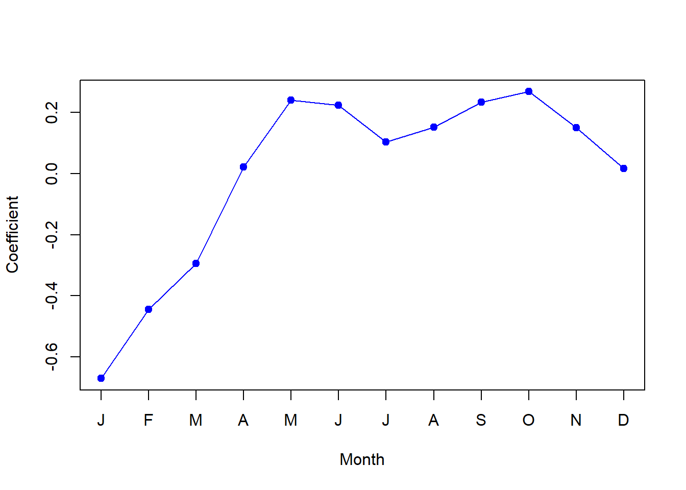
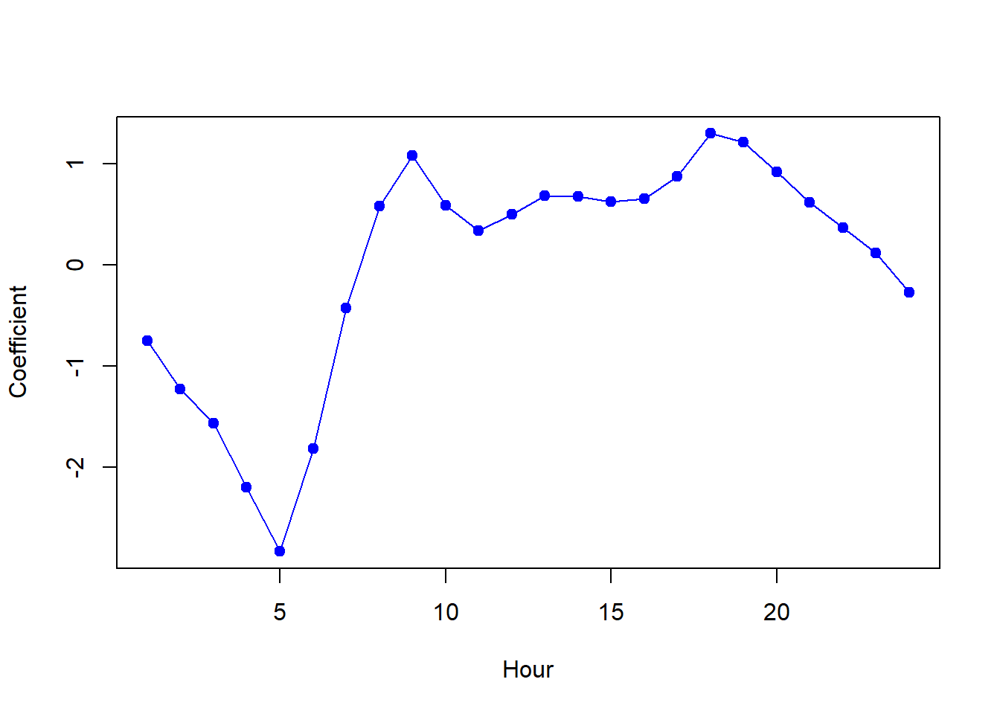

---
editor_options:
  markdown:
    wrap: 72
---

# Demonstration 2: Poisson versus Linear Regression {.unnumbered}

In this demonstration, we will cover the basics of building and
interpreting a Poisson regression model.

You will need the **Bikeshare** dataset, part of the `ISRL2` package. By
loading the package, the **Weekly** dataset loads automatically.

This dataset measures the number of bike rentals (`bikers`) per hour in
Washington, DC. It contains 8645 observations on several variables. The
variables we will use in this practical and their descriptions are
listed below. For further information on additional variables, type
`?Bikeshare` in your R console after loading the `ISLR2` package.

-   mnth: Month of the year, coded as a factor.

-   hr: Hour of the day, coded as a factor from 0 to 23.

-   workingday: Is it a work day? Yes=1, No=0.

-   temp: Normalised temperature in Celsius. The values are derived via
    (t-t_min)/(t_max-t_min), t_min=-8, t_max=+39;

-   weathersit: Weather, coded as a factor.

Loading the necessary packages:


```r
library(ISLR2)
```

```
## Warning: package 'ISLR2' was built under R version 4.2.3
```

Once you load the `ISLR2` package, the **Bikeshare** dataset will be
'loaded' too and can be accessed without needing to assign it to a
separate object.


```r
head(Bikeshare)
```

```
##   season mnth day hr holiday weekday workingday   weathersit temp  atemp  hum
## 1      1  Jan   1  0       0       6          0        clear 0.24 0.2879 0.81
## 2      1  Jan   1  1       0       6          0        clear 0.22 0.2727 0.80
## 3      1  Jan   1  2       0       6          0        clear 0.22 0.2727 0.80
## 4      1  Jan   1  3       0       6          0        clear 0.24 0.2879 0.75
## 5      1  Jan   1  4       0       6          0        clear 0.24 0.2879 0.75
## 6      1  Jan   1  5       0       6          0 cloudy/misty 0.24 0.2576 0.75
##   windspeed casual registered bikers
## 1    0.0000      3         13     16
## 2    0.0000      8         32     40
## 3    0.0000      5         27     32
## 4    0.0000      3         10     13
## 5    0.0000      0          1      1
## 6    0.0896      0          1      1
```

As usual, we can access variables within the dataset by indexing them.


```r
Bikeshare$temp
```

```
##    [1] 0.24 0.22 0.22 0.24 0.24 0.24 0.22 0.20 0.24 0.32 0.38 0.36 0.42 0.46
##   [15] 0.46 0.44 0.42 0.44 0.42 0.42 0.40 0.40 0.40 0.46 0.46 0.44 0.42 0.46
##   [29] 0.46 0.42 0.40 0.40 0.38 0.36 0.36 0.36 0.36 0.36 0.34 0.34 0.34 0.36
##   [43] 0.32 0.30 0.26 0.24 0.22 0.22 0.20 0.16 0.16 0.14 0.14 0.14 0.16 0.18
##   [57] 0.20 0.22 0.24 0.26 0.26 0.26 0.24 0.24 0.20 0.20 0.18 0.14 0.18 0.16
##   [71] 0.16 0.14 0.14 0.12 0.12 0.12 0.14 0.16 0.16 0.22 0.22 0.24 0.26 0.28
##   [85] 0.30 0.28 0.26 0.24 0.24 0.22 0.22 0.20 0.20 0.16 0.16 0.24 0.22 0.20
##   [99] 0.18 0.20 0.22 0.22 0.26 0.26 0.28 0.30 0.30 0.30 0.24 0.24 0.24 0.22
##  [113] 0.20 0.18 0.20 0.18 0.16 0.16 0.16 0.14 0.14 0.16 0.16 0.18 0.20 0.22
##  [127] 0.26 0.26 0.28 0.28 0.26 0.22 0.22 0.22 0.20 0.22 0.22 0.20 0.20 0.20
##  [141] 0.20 0.20 0.22 0.20 0.20 0.20 0.20 0.22 0.20 0.20 0.20 0.20 0.20 0.20
##  [155] 0.20 0.20 0.16 0.18 0.18 0.18 0.18 0.18 0.18 0.18 0.18 0.18 0.16 0.16
##  [169] 0.16 0.16 0.16 0.18 0.20 0.20 0.20 0.20 0.20 0.18 0.16 0.14 0.14 0.12
##  [183] 0.12 0.12 0.10 0.10 0.10 0.10 0.10 0.08 0.08 0.10 0.08 0.10 0.12 0.14
##  [197] 0.16 0.18 0.20 0.22 0.22 0.20 0.18 0.16 0.16 0.14 0.14 0.14 0.12 0.12
##  [211] 0.12 0.12 0.12 0.10 0.10 0.12 0.12 0.12 0.14 0.14 0.16 0.20 0.20 0.20
##  [225] 0.20 0.20 0.20 0.20 0.16 0.16 0.14 0.14 0.14 0.14 0.14 0.16 0.16 0.16
##  [239] 0.16 0.18 0.18 0.20 0.20 0.20 0.20 0.20 0.16 0.16 0.16 0.16 0.16 0.16
##  [253] 0.16 0.16 0.16 0.16 0.16 0.14 0.14 0.12 0.14 0.16 0.16 0.18 0.20 0.20
##  [267] 0.22 0.20 0.20 0.22 0.20 0.20 0.18 0.16 0.16 0.16 0.14 0.14 0.14 0.14
##  [281] 0.14 0.14 0.14 0.12 0.12 0.14 0.14 0.16 0.20 0.20 0.22 0.22 0.24 0.24
##  [295] 0.20 0.20 0.16 0.16 0.14 0.14 0.12 0.12 0.10 0.10 0.10 0.10 0.10 0.10
##  [309] 0.12 0.14 0.18 0.18 0.20 0.22 0.22 0.24 0.22 0.22 0.20 0.16 0.18 0.16
##  [323] 0.16 0.18 0.18 0.16 0.16 0.16 0.16 0.16 0.14 0.14 0.14 0.16 0.18 0.20
##  [337] 0.24 0.28 0.30 0.32 0.34 0.32 0.30 0.32 0.32 0.32 0.30 0.30 0.26 0.26
##  [351] 0.26 0.22 0.26 0.26 0.26 0.24 0.22 0.22 0.22 0.24 0.24 0.26 0.28 0.26
##  [365] 0.24 0.22 0.20 0.18 0.18 0.18 0.20 0.20 0.20 0.20 0.18 0.18 0.18 0.18
##  [379] 0.18 0.16 0.16 0.16 0.16 0.16 0.18 0.18 0.18 0.20 0.20 0.20 0.18 0.18
##  [393] 0.16 0.16 0.14 0.16 0.20 0.20 0.22 0.22 0.22 0.22 0.22 0.22 0.22 0.22
##  [407] 0.22 0.22 0.22 0.22 0.22 0.22 0.22 0.22 0.24 0.24 0.24 0.26 0.28 0.30
##  [421] 0.40 0.40 0.40 0.38 0.36 0.34 0.32 0.32 0.32 0.30 0.30 0.26 0.26 0.26
##  [435] 0.26 0.26 0.24 0.22 0.22 0.22 0.24 0.26 0.28 0.30 0.28 0.30 0.32 0.30
##  [449] 0.30 0.26 0.26 0.26 0.24 0.24 0.24 0.24 0.24 0.24 0.22 0.22 0.24 0.22
##  [463] 0.20 0.20 0.20 0.20 0.22 0.22 0.20 0.20 0.16 0.16 0.14 0.12 0.12 0.10
##  [477] 0.08 0.06 0.06 0.04 0.04 0.04 0.04 0.02 0.02 0.02 0.02 0.04 0.04 0.06
##  [491] 0.06 0.08 0.10 0.12 0.12 0.12 0.08 0.08 0.06 0.06 0.06 0.04 0.04 0.04
##  [505] 0.02 0.02 0.04 0.04 0.08 0.06 0.10 0.14 0.14 0.16 0.14 0.16 0.16 0.16
##  [519] 0.14 0.12 0.12 0.10 0.10 0.08 0.06 0.06 0.04 0.04 0.02 0.02 0.02 0.02
##  [533] 0.04 0.06 0.10 0.10 0.12 0.14 0.14 0.16 0.16 0.14 0.14 0.14 0.14 0.14
##  [547] 0.14 0.16 0.16 0.16 0.16 0.14 0.14 0.16 0.16 0.16 0.20 0.22 0.24 0.26
##  [561] 0.26 0.30 0.32 0.32 0.30 0.30 0.26 0.24 0.24 0.22 0.22 0.22 0.24 0.22
##  [575] 0.20 0.20 0.22 0.22 0.22 0.22 0.22 0.22 0.22 0.22 0.22 0.22 0.20 0.22
##  [589] 0.22 0.20 0.20 0.18 0.18 0.18 0.18 0.20 0.20 0.20 0.20 0.18 0.18 0.16
##  [603] 0.16 0.18 0.18 0.18 0.18 0.18 0.22 0.20 0.22 0.24 0.24 0.24 0.24 0.22
##  [617] 0.24 0.24 0.22 0.22 0.22 0.20 0.16 0.16 0.16 0.18 0.18 0.18 0.18 0.20
##  [631] 0.22 0.22 0.22 0.24 0.24 0.22 0.22 0.18 0.18 0.16 0.16 0.16 0.14 0.16
##  [645] 0.14 0.14 0.14 0.14 0.14 0.16 0.18 0.22 0.30 0.28 0.28 0.30 0.30 0.30
##  [659] 0.26 0.26 0.26 0.24 0.24 0.24 0.24 0.22 0.22 0.22 0.20 0.18 0.16 0.16
##  [673] 0.16 0.16 0.16 0.16 0.18 0.16 0.18 0.16 0.16 0.16 0.16 0.30 0.16 0.16
##  [687] 0.16 0.16 0.16 0.16 0.16 0.16 0.14 0.14 0.16 0.16 0.16 0.16 0.18 0.20
##  [701] 0.20 0.22 0.24 0.24 0.24 0.24 0.24 0.22 0.22 0.22 0.20 0.22 0.22 0.22
##  [715] 0.22 0.22 0.22 0.22 0.22 0.22 0.24 0.22 0.24 0.24 0.34 0.38 0.38 0.36
##  [729] 0.36 0.34 0.28 0.24 0.22 0.22 0.20 0.20 0.20 0.18 0.18 0.16 0.16 0.14
##  [743] 0.14 0.16 0.18 0.18 0.20 0.20 0.22 0.22 0.22 0.20 0.20 0.20 0.20 0.18
##  [757] 0.18 0.20 0.20 0.16 0.14 0.14 0.14 0.16 0.14 0.14 0.16 0.20 0.22 0.24
##  [771] 0.26 0.28 0.28 0.30 0.26 0.24 0.24 0.24 0.24 0.24 0.24 0.24 0.24 0.24
##  [785] 0.24 0.22 0.20 0.20 0.22 0.20 0.20 0.20 0.22 0.22 0.22 0.22 0.22 0.22
##  [799] 0.24 0.28 0.28 0.30 0.26 0.26 0.26 0.26 0.26 0.26 0.26 0.26 0.26 0.26
##  [813] 0.24 0.24 0.28 0.30 0.32 0.34 0.34 0.34 0.34 0.34 0.34 0.30 0.28 0.28
##  [827] 0.26 0.26 0.24 0.24 0.22 0.20 0.20 0.20 0.20 0.18 0.18 0.16 0.22 0.24
##  [841] 0.30 0.32 0.36 0.36 0.38 0.36 0.32 0.34 0.32 0.32 0.32 0.28 0.30 0.28
##  [855] 0.28 0.26 0.28 0.26 0.26 0.26 0.24 0.24 0.24 0.22 0.22 0.24 0.24 0.22
##  [869] 0.22 0.22 0.22 0.20 0.16 0.16 0.14 0.12 0.12 0.10 0.10 0.08 0.06 0.06
##  [883] 0.06 0.06 0.10 0.12 0.14 0.14 0.18 0.18 0.20 0.20 0.20 0.20 0.18 0.14
##  [897] 0.14 0.14 0.16 0.16 0.14 0.14 0.14 0.14 0.12 0.12 0.10 0.10 0.12 0.12
##  [911] 0.14 0.16 0.18 0.20 0.20 0.20 0.18 0.16 0.14 0.14 0.14 0.12 0.12 0.10
##  [925] 0.10 0.10 0.08 0.10 0.08 0.10 0.12 0.14 0.22 0.22 0.24 0.30 0.32 0.30
##  [939] 0.30 0.28 0.26 0.22 0.20 0.20 0.18 0.16 0.14 0.14 0.12 0.12 0.12 0.12
##  [953] 0.12 0.14 0.16 0.22 0.30 0.30 0.30 0.34 0.34 0.34 0.32 0.28 0.28 0.26
##  [967] 0.26 0.24 0.22 0.20 0.20 0.20 0.20 0.20 0.20 0.22 0.22 0.24 0.30 0.32
##  [981] 0.36 0.38 0.40 0.40 0.42 0.42 0.40 0.40 0.40 0.40 0.40 0.40 0.38 0.38
##  [995] 0.36 0.34 0.32 0.32 0.34 0.34 0.38 0.40 0.44 0.52 0.56 0.58 0.60 0.56
## [1009] 0.52 0.46 0.40 0.38 0.36 0.36 0.34 0.32 0.30 0.30 0.28 0.22 0.22 0.20
## [1023] 0.20 0.20 0.22 0.24 0.26 0.28 0.32 0.34 0.34 0.34 0.32 0.30 0.28 0.26
## [1037] 0.24 0.24 0.22 0.22 0.20 0.20 0.20 0.20 0.20 0.20 0.22 0.24 0.26 0.34
## [1051] 0.38 0.42 0.46 0.46 0.46 0.46 0.40 0.34 0.38 0.36 0.34 0.38 0.34 0.34
## [1065] 0.34 0.34 0.32 0.32 0.30 0.32 0.32 0.36 0.38 0.44 0.48 0.54 0.60 0.60
## [1079] 0.56 0.58 0.54 0.48 0.48 0.52 0.50 0.46 0.44 0.44 0.44 0.46 0.46 0.46
## [1093] 0.44 0.42 0.42 0.42 0.44 0.44 0.50 0.60 0.66 0.66 0.66 0.66 0.64 0.62
## [1107] 0.60 0.58 0.54 0.52 0.48 0.46 0.44 0.42 0.40 0.40 0.40 0.38 0.38 0.40
## [1121] 0.42 0.44 0.44 0.44 0.46 0.44 0.44 0.42 0.36 0.34 0.32 0.32 0.30 0.28
## [1135] 0.26 0.24 0.24 0.22 0.22 0.20 0.18 0.20 0.22 0.26 0.30 0.30 0.34 0.36
## [1149] 0.36 0.36 0.34 0.34 0.34 0.34 0.32 0.32 0.30 0.34 0.34 0.34 0.34 0.32
## [1163] 0.34 0.42 0.42 0.32 0.32 0.32 0.32 0.32 0.30 0.32 0.30 0.28 0.28 0.24
## [1177] 0.24 0.24 0.22 0.20 0.20 0.12 0.12 0.12 0.14 0.16 0.16 0.20 0.22 0.22
## [1191] 0.24 0.22 0.22 0.22 0.20 0.20 0.20 0.16 0.16 0.14 0.14 0.12 0.12 0.12
## [1205] 0.12 0.12 0.14 0.18 0.20 0.24 0.26 0.30 0.32 0.34 0.34 0.34 0.32 0.30
## [1219] 0.24 0.24 0.24 0.22 0.22 0.22 0.20 0.20 0.20 0.20 0.20 0.24 0.24 0.26
## [1233] 0.32 0.36 0.38 0.40 0.40 0.38 0.36 0.34 0.34 0.34 0.34 0.34 0.32 0.32
## [1247] 0.32 0.32 0.32 0.32 0.34 0.34 0.36 0.34 0.42 0.52 0.54 0.54 0.56 0.46
## [1261] 0.32 0.32 0.32 0.30 0.30 0.28 0.26 0.26 0.24 0.24 0.22 0.22 0.22 0.22
## [1275] 0.22 0.22 0.24 0.26 0.30 0.30 0.32 0.34 0.34 0.36 0.36 0.36 0.34 0.32
## [1289] 0.30 0.28 0.28 0.28 0.26 0.26 0.26 0.26 0.24 0.24 0.24 0.26 0.28 0.30
## [1303] 0.36 0.40 0.42 0.44 0.46 0.48 0.42 0.40 0.40 0.40 0.38 0.38 0.36 0.36
## [1317] 0.34 0.32 0.34 0.34 0.36 0.34 0.42 0.52 0.56 0.56 0.46 0.42 0.42 0.42
## [1331] 0.40 0.46 0.44 0.44 0.38 0.34 0.32 0.30 0.26 0.24 0.22 0.22 0.20 0.20
## [1345] 0.20 0.20 0.22 0.24 0.28 0.30 0.32 0.32 0.34 0.34 0.34 0.32 0.30 0.30
## [1359] 0.26 0.24 0.24 0.22 0.22 0.22 0.22 0.20 0.22 0.22 0.22 0.24 0.28 0.32
## [1373] 0.34 0.40 0.50 0.52 0.54 0.54 0.50 0.46 0.40 0.36 0.34 0.30 0.26 0.24
## [1387] 0.24 0.20 0.20 0.16 0.14 0.14 0.12 0.14 0.16 0.18 0.20 0.22 0.22 0.24
## [1401] 0.24 0.26 0.26 0.24 0.20 0.20 0.18 0.20 0.18 0.20 0.18 0.18 0.18 0.18
## [1415] 0.16 0.16 0.16 0.18 0.22 0.24 0.28 0.32 0.34 0.36 0.36 0.36 0.36 0.34
## [1429] 0.32 0.30 0.30 0.30 0.30 0.28 0.30 0.30 0.30 0.30 0.30 0.30 0.30 0.30
## [1443] 0.32 0.34 0.40 0.44 0.46 0.48 0.46 0.48 0.48 0.48 0.46 0.44 0.44 0.42
## [1457] 0.44 0.42 0.42 0.40 0.42 0.42 0.42 0.42 0.40 0.42 0.42 0.42 0.46 0.46
## [1471] 0.44 0.44 0.36 0.34 0.32 0.30 0.28 0.24 0.22 0.22 0.20 0.20 0.20 0.20
## [1485] 0.20 0.20 0.20 0.20 0.22 0.24 0.26 0.30 0.32 0.32 0.34 0.34 0.34 0.32
## [1499] 0.30 0.30 0.28 0.26 0.28 0.26 0.24 0.24 0.24 0.22 0.20 0.20 0.18 0.22
## [1513] 0.26 0.30 0.36 0.36 0.38 0.38 0.36 0.38 0.36 0.34 0.34 0.32 0.30 0.30
## [1527] 0.28 0.26 0.26 0.26 0.24 0.24 0.24 0.24 0.24 0.24 0.26 0.30 0.32 0.32
## [1541] 0.32 0.34 0.36 0.34 0.34 0.34 0.34 0.32 0.32 0.32 0.34 0.34 0.34 0.34
## [1555] 0.36 0.36 0.38 0.38 0.40 0.40 0.40 0.42 0.42 0.44 0.44 0.42 0.44 0.44
## [1569] 0.44 0.36 0.36 0.34 0.34 0.34 0.34 0.34 0.32 0.30 0.26 0.26 0.28 0.30
## [1583] 0.32 0.32 0.34 0.36 0.36 0.34 0.34 0.34 0.32 0.30 0.30 0.30 0.30 0.30
## [1597] 0.26 0.24 0.24 0.24 0.24 0.22 0.22 0.24 0.26 0.28 0.32 0.34 0.34 0.36
## [1611] 0.40 0.42 0.46 0.46 0.42 0.42 0.40 0.38 0.36 0.38 0.38 0.36 0.34 0.34
## [1625] 0.36 0.34 0.36 0.40 0.40 0.42 0.44 0.46 0.46 0.46 0.48 0.46 0.44 0.40
## [1639] 0.36 0.32 0.30 0.30 0.26 0.26 0.26 0.26 0.26 0.24 0.26 0.28 0.30 0.32
## [1653] 0.34 0.36 0.38 0.38 0.38 0.38 0.40 0.38 0.36 0.36 0.34 0.34 0.32 0.32
## [1667] 0.32 0.30 0.30 0.24 0.24 0.22 0.24 0.26 0.30 0.32 0.34 0.36 0.36 0.38
## [1681] 0.38 0.38 0.36 0.36 0.34 0.34 0.32 0.32 0.32 0.30 0.30 0.28 0.30 0.30
## [1695] 0.30 0.30 0.32 0.32 0.36 0.36 0.40 0.40 0.40 0.40 0.40 0.44 0.44 0.44
## [1709] 0.42 0.42 0.40 0.40 0.38 0.36 0.34 0.34 0.34 0.32 0.32 0.32 0.36 0.40
## [1723] 0.44 0.44 0.50 0.52 0.50 0.52 0.50 0.50 0.46 0.44 0.42 0.42 0.40 0.42
## [1737] 0.42 0.40 0.40 0.36 0.38 0.40 0.40 0.42 0.46 0.52 0.54 0.56 0.64 0.66
## [1751] 0.68 0.68 0.70 0.68 0.66 0.62 0.62 0.62 0.60 0.60 0.58 0.56 0.54 0.52
## [1765] 0.52 0.44 0.40 0.42 0.42 0.44 0.46 0.46 0.50 0.50 0.50 0.50 0.48 0.46
## [1779] 0.44 0.42 0.40 0.40 0.38 0.34 0.32 0.30 0.28 0.26 0.26 0.26 0.24 0.28
## [1793] 0.30 0.32 0.34 0.36 0.38 0.40 0.40 0.42 0.40 0.38 0.36 0.36 0.34 0.34
## [1807] 0.34 0.34 0.34 0.34 0.34 0.32 0.32 0.30 0.30 0.34 0.38 0.42 0.44 0.50
## [1821] 0.54 0.56 0.54 0.54 0.52 0.58 0.56 0.46 0.46 0.46 0.46 0.42 0.44 0.44
## [1835] 0.42 0.40 0.40 0.40 0.40 0.40 0.44 0.44 0.46 0.50 0.50 0.50 0.50 0.50
## [1849] 0.48 0.44 0.44 0.42 0.40 0.40 0.36 0.34 0.34 0.34 0.32 0.34 0.32 0.32
## [1863] 0.32 0.34 0.34 0.34 0.34 0.36 0.38 0.40 0.40 0.38 0.38 0.36 0.32 0.32
## [1877] 0.32 0.32 0.30 0.30 0.28 0.28 0.28 0.28 0.26 0.26 0.26 0.26 0.30 0.30
## [1891] 0.32 0.30 0.30 0.30 0.30 0.30 0.30 0.28 0.26 0.26 0.24 0.24 0.20 0.20
## [1905] 0.20 0.18 0.18 0.18 0.20 0.22 0.24 0.26 0.30 0.32 0.32 0.36 0.34 0.34
## [1919] 0.32 0.30 0.30 0.30 0.30 0.28 0.26 0.26 0.26 0.22 0.20 0.22 0.20 0.18
## [1933] 0.20 0.22 0.24 0.26 0.28 0.30 0.32 0.34 0.34 0.34 0.32 0.32 0.28 0.28
## [1947] 0.26 0.28 0.26 0.26 0.24 0.22 0.20 0.18 0.16 0.16 0.20 0.22 0.22 0.24
## [1961] 0.26 0.30 0.32 0.32 0.34 0.32 0.30 0.30 0.28 0.26 0.26 0.26 0.22 0.22
## [1975] 0.22 0.22 0.18 0.18 0.20 0.20 0.22 0.24 0.26 0.26 0.30 0.32 0.32 0.34
## [1989] 0.34 0.32 0.30 0.32 0.32 0.30 0.28 0.26 0.24 0.24 0.24 0.20 0.22 0.22
## [2003] 0.22 0.24 0.28 0.30 0.34 0.34 0.34 0.36 0.38 0.38 0.40 0.36 0.34 0.36
## [2017] 0.34 0.34 0.32 0.32 0.32 0.32 0.32 0.32 0.30 0.30 0.32 0.32 0.32 0.34
## [2031] 0.34 0.34 0.36 0.36 0.28 0.28 0.26 0.26 0.26 0.24 0.24 0.24 0.24 0.24
## [2045] 0.24 0.24 0.24 0.24 0.24 0.24 0.24 0.24 0.26 0.26 0.28 0.28 0.30 0.30
## [2059] 0.30 0.30 0.30 0.30 0.30 0.28 0.28 0.28 0.26 0.26 0.26 0.26 0.24 0.24
## [2073] 0.24 0.24 0.24 0.26 0.32 0.32 0.32 0.34 0.36 0.36 0.34 0.34 0.34 0.34
## [2087] 0.34 0.32 0.32 0.30 0.30 0.30 0.26 0.24 0.24 0.24 0.24 0.26 0.26 0.30
## [2101] 0.34 0.36 0.40 0.32 0.34 0.32 0.34 0.38 0.38 0.38 0.36 0.34 0.32 0.32
## [2115] 0.32 0.30 0.30 0.26 0.30 0.28 0.28 0.28 0.32 0.34 0.36 0.40 0.42 0.44
## [2129] 0.44 0.46 0.46 0.46 0.46 0.46 0.42 0.42 0.42 0.40 0.40 0.40 0.40 0.38
## [2143] 0.38 0.38 0.40 0.42 0.44 0.46 0.50 0.54 0.60 0.64 0.68 0.74 0.76 0.76
## [2157] 0.74 0.72 0.70 0.70 0.70 0.68 0.64 0.62 0.62 0.54 0.54 0.50 0.46 0.48
## [2171] 0.48 0.38 0.36 0.34 0.32 0.34 0.36 0.36 0.40 0.38 0.42 0.38 0.36 0.34
## [2185] 0.34 0.32 0.30 0.30 0.26 0.24 0.26 0.24 0.24 0.24 0.26 0.32 0.36 0.40
## [2199] 0.42 0.44 0.46 0.50 0.52 0.54 0.52 0.52 0.50 0.46 0.46 0.46 0.46 0.46
## [2213] 0.42 0.42 0.36 0.34 0.34 0.32 0.34 0.36 0.40 0.42 0.46 0.46 0.52 0.56
## [2227] 0.60 0.60 0.52 0.48 0.46 0.44 0.44 0.40 0.38 0.36 0.34 0.34 0.34 0.34
## [2241] 0.32 0.34 0.34 0.34 0.36 0.36 0.40 0.38 0.36 0.34 0.34 0.32 0.32 0.32
## [2255] 0.30 0.30 0.30 0.30 0.30 0.30 0.30 0.32 0.30 0.30 0.30 0.30 0.30 0.32
## [2269] 0.34 0.34 0.36 0.36 0.36 0.36 0.36 0.38 0.38 0.38 0.38 0.38 0.36 0.36
## [2283] 0.38 0.38 0.38 0.38 0.38 0.36 0.36 0.36 0.36 0.38 0.38 0.40 0.40 0.42
## [2297] 0.46 0.50 0.50 0.52 0.52 0.50 0.50 0.46 0.44 0.44 0.46 0.48 0.46 0.46
## [2311] 0.46 0.46 0.46 0.50 0.52 0.56 0.56 0.60 0.60 0.64 0.72 0.74 0.74 0.74
## [2325] 0.72 0.72 0.68 0.66 0.64 0.58 0.62 0.62 0.60 0.58 0.56 0.54 0.54 0.54
## [2339] 0.48 0.46 0.50 0.52 0.56 0.54 0.50 0.48 0.48 0.44 0.44 0.42 0.42 0.42
## [2353] 0.40 0.40 0.40 0.40 0.40 0.40 0.40 0.38 0.38 0.36 0.38 0.38 0.40 0.42
## [2367] 0.42 0.44 0.42 0.44 0.46 0.46 0.44 0.44 0.44 0.42 0.42 0.40 0.38 0.38
## [2381] 0.36 0.34 0.34 0.34 0.34 0.38 0.42 0.46 0.50 0.52 0.54 0.56 0.56 0.60
## [2395] 0.60 0.60 0.56 0.54 0.50 0.46 0.48 0.46 0.44 0.44 0.40 0.40 0.38 0.36
## [2409] 0.36 0.40 0.44 0.50 0.50 0.52 0.52 0.54 0.54 0.54 0.52 0.50 0.46 0.42
## [2423] 0.40 0.40 0.38 0.36 0.36 0.36 0.36 0.36 0.36 0.38 0.40 0.40 0.40 0.40
## [2437] 0.42 0.42 0.46 0.46 0.52 0.52 0.50 0.50 0.50 0.52 0.44 0.44 0.42 0.44
## [2451] 0.44 0.42 0.40 0.40 0.36 0.36 0.36 0.36 0.38 0.40 0.42 0.46 0.46 0.50
## [2465] 0.52 0.54 0.54 0.56 0.56 0.56 0.52 0.50 0.50 0.44 0.46 0.46 0.42 0.42
## [2479] 0.40 0.40 0.40 0.46 0.46 0.50 0.52 0.54 0.56 0.56 0.58 0.60 0.60 0.58
## [2493] 0.64 0.56 0.60 0.56 0.52 0.50 0.50 0.46 0.46 0.48 0.46 0.46 0.48 0.52
## [2507] 0.50 0.52 0.50 0.54 0.54 0.54 0.54 0.54 0.56 0.56 0.54 0.50 0.50 0.50
## [2521] 0.48 0.46 0.44 0.42 0.42 0.42 0.40 0.40 0.42 0.44 0.62 0.66 0.62 0.62
## [2535] 0.70 0.70 0.74 0.76 0.76 0.74 0.74 0.70 0.68 0.66 0.62 0.60 0.56 0.52
## [2549] 0.50 0.46 0.44 0.42 0.40 0.42 0.40 0.42 0.42 0.44 0.46 0.48 0.50 0.52
## [2563] 0.52 0.50 0.50 0.46 0.44 0.42 0.42 0.40 0.36 0.36 0.36 0.36 0.34 0.34
## [2577] 0.34 0.34 0.34 0.34 0.36 0.34 0.34 0.34 0.34 0.34 0.34 0.32 0.32 0.32
## [2591] 0.32 0.30 0.30 0.32 0.32 0.32 0.32 0.32 0.34 0.34 0.34 0.34 0.36 0.38
## [2605] 0.42 0.46 0.52 0.52 0.58 0.60 0.60 0.60 0.58 0.56 0.54 0.56 0.58 0.54
## [2619] 0.52 0.50 0.50 0.50 0.50 0.50 0.50 0.50 0.52 0.56 0.60 0.66 0.68 0.70
## [2633] 0.70 0.66 0.74 0.66 0.64 0.60 0.60 0.54 0.54 0.54 0.52 0.54 0.54 0.50
## [2647] 0.52 0.46 0.50 0.52 0.56 0.60 0.64 0.64 0.66 0.70 0.72 0.74 0.70 0.70
## [2661] 0.68 0.66 0.66 0.62 0.60 0.58 0.62 0.62 0.56 0.54 0.56 0.54 0.56 0.58
## [2675] 0.58 0.64 0.66 0.68 0.70 0.74 0.72 0.70 0.70 0.68 0.68 0.64 0.64 0.62
## [2689] 0.60 0.60 0.60 0.60 0.58 0.58 0.56 0.56 0.56 0.58 0.58 0.60 0.62 0.64
## [2703] 0.66 0.64 0.68 0.70 0.70 0.66 0.66 0.62 0.64 0.62 0.62 0.62 0.64 0.62
## [2717] 0.62 0.64 0.62 0.62 0.64 0.64 0.66 0.62 0.62 0.62 0.62 0.62 0.62 0.66
## [2731] 0.62 0.64 0.64 0.62 0.58 0.56 0.54 0.54 0.52 0.50 0.46 0.46 0.46 0.46
## [2745] 0.50 0.52 0.54 0.54 0.56 0.60 0.56 0.56 0.60 0.56 0.54 0.52 0.52 0.46
## [2759] 0.48 0.46 0.42 0.44 0.44 0.44 0.44 0.42 0.42 0.42 0.40 0.40 0.40 0.44
## [2773] 0.48 0.50 0.52 0.54 0.54 0.56 0.58 0.56 0.54 0.54 0.44 0.44 0.44 0.44
## [2787] 0.42 0.42 0.42 0.40 0.40 0.40 0.40 0.42 0.44 0.46 0.48 0.46 0.48 0.50
## [2801] 0.50 0.50 0.50 0.48 0.46 0.46 0.46 0.46 0.46 0.46 0.46 0.46 0.44 0.44
## [2815] 0.44 0.44 0.44 0.46 0.48 0.50 0.54 0.58 0.62 0.62 0.64 0.66 0.66 0.66
## [2829] 0.64 0.62 0.62 0.60 0.60 0.56 0.56 0.56 0.56 0.54 0.52 0.52 0.52 0.54
## [2843] 0.56 0.60 0.64 0.66 0.68 0.70 0.70 0.70 0.72 0.70 0.70 0.68 0.66 0.64
## [2857] 0.58 0.56 0.52 0.50 0.50 0.42 0.38 0.36 0.34 0.34 0.34 0.34 0.34 0.40
## [2871] 0.44 0.46 0.50 0.48 0.50 0.40 0.42 0.42 0.40 0.40 0.38 0.36 0.36 0.34
## [2885] 0.34 0.34 0.34 0.34 0.34 0.38 0.42 0.46 0.50 0.52 0.52 0.54 0.54 0.56
## [2899] 0.58 0.56 0.56 0.54 0.50 0.50 0.48 0.46 0.44 0.40 0.38 0.36 0.36 0.34
## [2913] 0.36 0.40 0.42 0.46 0.54 0.54 0.56 0.58 0.60 0.60 0.60 0.58 0.54 0.54
## [2927] 0.52 0.48 0.46 0.44 0.42 0.42 0.42 0.42 0.40 0.46 0.42 0.48 0.52 0.54
## [2941] 0.56 0.56 0.60 0.60 0.60 0.60 0.60 0.58 0.58 0.56 0.56 0.54 0.54 0.50
## [2955] 0.50 0.52 0.48 0.46 0.42 0.44 0.44 0.46 0.52 0.56 0.58 0.58 0.60 0.60
## [2969] 0.60 0.60 0.60 0.58 0.58 0.56 0.52 0.52 0.50 0.46 0.46 0.44 0.44 0.46
## [2983] 0.42 0.42 0.44 0.48 0.52 0.54 0.56 0.60 0.60 0.62 0.62 0.62 0.64 0.62
## [2997] 0.62 0.58 0.54 0.52 0.52 0.50 0.48 0.46 0.44 0.44 0.42 0.40 0.42 0.44
## [3011] 0.50 0.52 0.56 0.56 0.60 0.62 0.62 0.64 0.66 0.64 0.64 0.60 0.54 0.54
## [3025] 0.52 0.52 0.52 0.50 0.52 0.50 0.48 0.46 0.46 0.48 0.48 0.52 0.54 0.56
## [3039] 0.60 0.62 0.62 0.64 0.66 0.64 0.62 0.56 0.54 0.54 0.50 0.46 0.46 0.46
## [3053] 0.44 0.44 0.42 0.42 0.44 0.46 0.48 0.50 0.54 0.58 0.58 0.62 0.62 0.64
## [3067] 0.64 0.64 0.62 0.60 0.60 0.56 0.54 0.54 0.52 0.52 0.50 0.50 0.50 0.50
## [3081] 0.50 0.50 0.50 0.50 0.52 0.52 0.52 0.52 0.52 0.52 0.52 0.52 0.52 0.52
## [3095] 0.52 0.52 0.52 0.50 0.50 0.50 0.50 0.50 0.50 0.50 0.50 0.48 0.50 0.52
## [3109] 0.52 0.52 0.52 0.52 0.54 0.54 0.54 0.56 0.56 0.54 0.54 0.54 0.54 0.52
## [3123] 0.52 0.52 0.52 0.52 0.52 0.52 0.52 0.52 0.54 0.58 0.58 0.60 0.62 0.62
## [3137] 0.64 0.66 0.64 0.56 0.56 0.56 0.54 0.54 0.56 0.54 0.52 0.52 0.50 0.50
## [3151] 0.50 0.50 0.52 0.52 0.56 0.60 0.62 0.64 0.66 0.68 0.68 0.72 0.60 0.58
## [3165] 0.58 0.58 0.58 0.58 0.56 0.56 0.56 0.56 0.56 0.54 0.54 0.52 0.52 0.52
## [3179] 0.52 0.54 0.54 0.56 0.56 0.56 0.62 0.62 0.62 0.62 0.60 0.60 0.58 0.54
## [3193] 0.54 0.54 0.54 0.54 0.52 0.52 0.52 0.52 0.52 0.54 0.56 0.56 0.54 0.54
## [3207] 0.56 0.56 0.58 0.60 0.60 0.60 0.60 0.56 0.56 0.52 0.52 0.52 0.52 0.50
## [3221] 0.50 0.48 0.48 0.48 0.50 0.50 0.52 0.54 0.54 0.54 0.58 0.58 0.54 0.56
## [3235] 0.58 0.56 0.60 0.58 0.54 0.54 0.50 0.48 0.46 0.46 0.44 0.44 0.44 0.44
## [3249] 0.46 0.50 0.54 0.54 0.56 0.58 0.60 0.60 0.62 0.60 0.60 0.62 0.60 0.58
## [3263] 0.58 0.56 0.54 0.52 0.52 0.52 0.52 0.48 0.46 0.46 0.50 0.54 0.56 0.60
## [3277] 0.62 0.64 0.66 0.70 0.72 0.72 0.72 0.72 0.70 0.68 0.62 0.62 0.60 0.58
## [3291] 0.54 0.52 0.52 0.50 0.50 0.50 0.52 0.54 0.60 0.62 0.64 0.70 0.72 0.66
## [3305] 0.62 0.66 0.68 0.70 0.66 0.66 0.64 0.62 0.60 0.58 0.56 0.56 0.56 0.54
## [3319] 0.54 0.54 0.54 0.56 0.60 0.60 0.66 0.68 0.68 0.74 0.72 0.72 0.72 0.72
## [3333] 0.70 0.70 0.64 0.64 0.62 0.62 0.60 0.60 0.60 0.58 0.60 0.58 0.58 0.64
## [3347] 0.62 0.64 0.70 0.74 0.76 0.78 0.78 0.74 0.66 0.70 0.70 0.66 0.66 0.64
## [3361] 0.62 0.66 0.60 0.58 0.56 0.54 0.54 0.56 0.56 0.62 0.64 0.68 0.70 0.74
## [3375] 0.74 0.74 0.74 0.76 0.74 0.74 0.72 0.70 0.70 0.66 0.66 0.64 0.64 0.64
## [3389] 0.62 0.60 0.60 0.60 0.60 0.62 0.66 0.72 0.70 0.74 0.78 0.82 0.82 0.82
## [3403] 0.80 0.80 0.80 0.78 0.72 0.72 0.70 0.70 0.68 0.70 0.68 0.66 0.64 0.64
## [3417] 0.64 0.64 0.66 0.70 0.72 0.74 0.76 0.74 0.76 0.78 0.76 0.74 0.72 0.60
## [3431] 0.62 0.60 0.60 0.58 0.58 0.58 0.56 0.56 0.56 0.56 0.58 0.60 0.62 0.64
## [3445] 0.70 0.70 0.72 0.72 0.74 0.74 0.76 0.74 0.72 0.70 0.70 0.66 0.66 0.64
## [3459] 0.64 0.62 0.62 0.62 0.60 0.60 0.62 0.62 0.62 0.62 0.66 0.66 0.70 0.72
## [3473] 0.74 0.74 0.74 0.74 0.72 0.72 0.70 0.68 0.66 0.66 0.64 0.64 0.64 0.64
## [3487] 0.62 0.62 0.64 0.64 0.66 0.72 0.80 0.82 0.86 0.86 0.88 0.88 0.88 0.86
## [3501] 0.86 0.52 0.76 0.74 0.72 0.70 0.70 0.68 0.66 0.64 0.66 0.66 0.68 0.74
## [3515] 0.78 0.80 0.82 0.86 0.86 0.90 0.90 0.90 0.90 0.84 0.84 0.78 0.78 0.76
## [3529] 0.74 0.72 0.70 0.70 0.70 0.68 0.68 0.66 0.68 0.70 0.72 0.74 0.76 0.82
## [3543] 0.86 0.90 0.90 0.90 0.86 0.86 0.82 0.74 0.74 0.74 0.74 0.74 0.74 0.72
## [3557] 0.70 0.66 0.66 0.66 0.66 0.70 0.70 0.72 0.72 0.74 0.76 0.80 0.78 0.80
## [3571] 0.80 0.76 0.74 0.72 0.70 0.66 0.64 0.62 0.62 0.60 0.56 0.54 0.52 0.52
## [3585] 0.54 0.54 0.56 0.58 0.62 0.64 0.66 0.68 0.70 0.70 0.72 0.72 0.70 0.68
## [3599] 0.64 0.64 0.62 0.58 0.56 0.54 0.54 0.52 0.52 0.50 0.54 0.56 0.60 0.62
## [3613] 0.64 0.66 0.70 0.74 0.74 0.74 0.72 0.72 0.74 0.70 0.70 0.66 0.64 0.64
## [3627] 0.64 0.64 0.64 0.62 0.62 0.62 0.62 0.60 0.60 0.60 0.62 0.64 0.64 0.66
## [3641] 0.70 0.70 0.72 0.74 0.70 0.68 0.66 0.64 0.64 0.62 0.62 0.60 0.58 0.58
## [3655] 0.56 0.56 0.58 0.62 0.64 0.70 0.72 0.74 0.76 0.78 0.78 0.80 0.76 0.78
## [3669] 0.76 0.72 0.68 0.66 0.66 0.64 0.64 0.62 0.60 0.60 0.58 0.58 0.60 0.64
## [3683] 0.68 0.72 0.76 0.76 0.80 0.80 0.80 0.82 0.80 0.80 0.78 0.76 0.74 0.72
## [3697] 0.70 0.68 0.66 0.66 0.64 0.64 0.62 0.62 0.64 0.66 0.76 0.76 0.82 0.84
## [3711] 0.88 0.90 0.92 0.92 0.92 0.92 0.90 0.82 0.80 0.80 0.76 0.76 0.74 0.74
## [3725] 0.72 0.72 0.72 0.70 0.72 0.72 0.76 0.84 0.86 0.90 0.92 0.90 0.92 0.94
## [3739] 0.92 0.90 0.88 0.84 0.80 0.76 0.74 0.74 0.70 0.70 0.68 0.68 0.66 0.66
## [3753] 0.66 0.72 0.74 0.76 0.78 0.82 0.84 0.84 0.86 0.84 0.82 0.82 0.80 0.78
## [3767] 0.76 0.76 0.72 0.72 0.70 0.70 0.70 0.68 0.68 0.68 0.70 0.72 0.74 0.74
## [3781] 0.74 0.76 0.80 0.80 0.82 0.82 0.80 0.74 0.72 0.70 0.68 0.66 0.66 0.66
## [3795] 0.66 0.64 0.64 0.64 0.62 0.62 0.62 0.64 0.70 0.72 0.76 0.78 0.82 0.78
## [3809] 0.82 0.80 0.68 0.68 0.70 0.70 0.66 0.66 0.64 0.64 0.64 0.64 0.62 0.60
## [3823] 0.56 0.54 0.54 0.56 0.58 0.62 0.64 0.66 0.66 0.70 0.70 0.70 0.70 0.70
## [3837] 0.70 0.66 0.64 0.64 0.62 0.62 0.60 0.60 0.60 0.58 0.54 0.54 0.54 0.56
## [3851] 0.58 0.62 0.62 0.64 0.64 0.64 0.64 0.64 0.68 0.64 0.62 0.64 0.60 0.60
## [3865] 0.58 0.56 0.56 0.54 0.52 0.50 0.50 0.48 0.50 0.54 0.58 0.60 0.64 0.68
## [3879] 0.70 0.74 0.74 0.76 0.76 0.74 0.72 0.70 0.66 0.64 0.62 0.62 0.60 0.58
## [3893] 0.60 0.56 0.56 0.60 0.58 0.56 0.60 0.62 0.66 0.68 0.72 0.72 0.72 0.70
## [3907] 0.66 0.64 0.64 0.62 0.62 0.62 0.62 0.60 0.56 0.56 0.56 0.56 0.54 0.54
## [3921] 0.56 0.60 0.60 0.70 0.70 0.68 0.70 0.74 0.76 0.78 0.76 0.76 0.76 0.64
## [3935] 0.64 0.64 0.62 0.62 0.62 0.62 0.60 0.60 0.60 0.62 0.62 0.64 0.66 0.70
## [3949] 0.72 0.72 0.74 0.76 0.80 0.82 0.76 0.76 0.74 0.74 0.72 0.72 0.72 0.72
## [3963] 0.70 0.70 0.68 0.66 0.66 0.66 0.66 0.66 0.68 0.68 0.70 0.72 0.74 0.74
## [3977] 0.74 0.74 0.76 0.74 0.74 0.72 0.70 0.68 0.66 0.66 0.66 0.64 0.64 0.64
## [3991] 0.62 0.62 0.60 0.56 0.56 0.60 0.60 0.60 0.62 0.64 0.66 0.66 0.70 0.70
## [4005] 0.70 0.66 0.66 0.64 0.64 0.62 0.62 0.62 0.62 0.62 0.60 0.60 0.60 0.60
## [4019] 0.62 0.62 0.64 0.66 0.70 0.74 0.76 0.78 0.80 0.78 0.76 0.74 0.74 0.72
## [4033] 0.70 0.70 0.66 0.66 0.66 0.66 0.64 0.64 0.66 0.70 0.72 0.72 0.74 0.74
## [4047] 0.80 0.82 0.82 0.82 0.82 0.80 0.80 0.80 0.74 0.74 0.72 0.72 0.72 0.72
## [4061] 0.72 0.72 0.70 0.72 0.72 0.72 0.74 0.74 0.76 0.76 0.76 0.76 0.76 0.76
## [4075] 0.74 0.72 0.72 0.72 0.70 0.70 0.70 0.70 0.68 0.66 0.66 0.66 0.66 0.64
## [4089] 0.66 0.66 0.70 0.74 0.80 0.80 0.80 0.80 0.78 0.82 0.80 0.76 0.76 0.74
## [4103] 0.72 0.70 0.70 0.68 0.68 0.66 0.66 0.64 0.64 0.62 0.64 0.64 0.70 0.72
## [4117] 0.72 0.74 0.74 0.74 0.74 0.74 0.76 0.74 0.72 0.72 0.70 0.68 0.68 0.66
## [4131] 0.64 0.64 0.62 0.60 0.60 0.60 0.60 0.62 0.64 0.66 0.72 0.72 0.74 0.74
## [4145] 0.74 0.74 0.74 0.72 0.72 0.72 0.70 0.70 0.70 0.70 0.64 0.62 0.62 0.62
## [4159] 0.60 0.62 0.62 0.64 0.66 0.72 0.72 0.70 0.72 0.72 0.72 0.74 0.74 0.74
## [4173] 0.74 0.72 0.70 0.70 0.68 0.68 0.66 0.66 0.66 0.66 0.66 0.66 0.66 0.68
## [4187] 0.70 0.74 0.80 0.82 0.84 0.84 0.86 0.86 0.86 0.82 0.80 0.74 0.74 0.74
## [4201] 0.70 0.70 0.68 0.68 0.66 0.66 0.66 0.64 0.66 0.70 0.70 0.72 0.74 0.76
## [4215] 0.76 0.80 0.80 0.82 0.82 0.82 0.80 0.76 0.74 0.72 0.70 0.68 0.66 0.64
## [4229] 0.62 0.60 0.58 0.58 0.60 0.62 0.68 0.70 0.72 0.74 0.76 0.76 0.78 0.78
## [4243] 0.80 0.78 0.76 0.74 0.74 0.72 0.70 0.66 0.66 0.66 0.62 0.64 0.62 0.60
## [4257] 0.62 0.66 0.70 0.74 0.76 0.80 0.80 0.80 0.82 0.82 0.82 0.82 0.80 0.78
## [4271] 0.72 0.70 0.70 0.68 0.68 0.66 0.64 0.64 0.62 0.58 0.62 0.64 0.68 0.74
## [4285] 0.80 0.80 0.82 0.82 0.84 0.86 0.88 0.84 0.82 0.80 0.76 0.74 0.72 0.72
## [4299] 0.70 0.70 0.70 0.68 0.68 0.62 0.62 0.64 0.68 0.70 0.74 0.76 0.80 0.80
## [4313] 0.82 0.84 0.84 0.80 0.80 0.66 0.66 0.66 0.66 0.64 0.64 0.64 0.64 0.64
## [4327] 0.66 0.64 0.64 0.66 0.70 0.72 0.76 0.76 0.78 0.78 0.80 0.82 0.82 0.80
## [4341] 0.80 0.78 0.76 0.74 0.74 0.72 0.70 0.70 0.66 0.66 0.66 0.66 0.66 0.70
## [4355] 0.72 0.74 0.76 0.78 0.80 0.82 0.80 0.82 0.82 0.82 0.80 0.80 0.76 0.78
## [4369] 0.76 0.74 0.72 0.70 0.70 0.70 0.68 0.68 0.70 0.72 0.72 0.70 0.70 0.72
## [4383] 0.74 0.74 0.76 0.76 0.76 0.78 0.76 0.74 0.72 0.70 0.70 0.68 0.66 0.66
## [4397] 0.66 0.64 0.64 0.64 0.64 0.66 0.70 0.74 0.78 0.82 0.84 0.86 0.86 0.86
## [4411] 0.86 0.86 0.84 0.82 0.76 0.74 0.74 0.72 0.74 0.72 0.70 0.68 0.70 0.68
## [4425] 0.70 0.70 0.72 0.76 0.74 0.74 0.76 0.78 0.80 0.80 0.68 0.66 0.66 0.66
## [4439] 0.66 0.66 0.66 0.66 0.66 0.64 0.64 0.64 0.64 0.62 0.64 0.66 0.70 0.74
## [4453] 0.76 0.78 0.80 0.82 0.84 0.84 0.82 0.84 0.82 0.76 0.76 0.74 0.72 0.72
## [4467] 0.70 0.70 0.68 0.66 0.66 0.66 0.64 0.70 0.72 0.74 0.76 0.78 0.82 0.80
## [4481] 0.82 0.84 0.84 0.84 0.82 0.80 0.76 0.74 0.74 0.72 0.70 0.70 0.70 0.68
## [4495] 0.66 0.66 0.68 0.70 0.74 0.78 0.80 0.82 0.84 0.86 0.86 0.86 0.86 0.86
## [4509] 0.86 0.84 0.72 0.70 0.72 0.70 0.70 0.70 0.70 0.70 0.70 0.70 0.74 0.76
## [4523] 0.76 0.78 0.82 0.82 0.86 0.86 0.90 0.90 0.86 0.88 0.86 0.84 0.82 0.82
## [4537] 0.80 0.78 0.76 0.76 0.76 0.74 0.74 0.74 0.74 0.76 0.80 0.82 0.82 0.84
## [4551] 0.84 0.82 0.82 0.64 0.66 0.70 0.72 0.70 0.70 0.70 0.68 0.66 0.66 0.66
## [4565] 0.64 0.62 0.62 0.60 0.60 0.62 0.64 0.68 0.70 0.72 0.74 0.76 0.74 0.76
## [4579] 0.76 0.74 0.72 0.72 0.70 0.66 0.64 0.64 0.62 0.62 0.60 0.60 0.60 0.60
## [4593] 0.60 0.64 0.64 0.68 0.66 0.70 0.70 0.70 0.70 0.72 0.72 0.74 0.72 0.70
## [4607] 0.70 0.66 0.66 0.64 0.62 0.60 0.60 0.60 0.60 0.58 0.60 0.62 0.66 0.70
## [4621] 0.72 0.74 0.76 0.76 0.74 0.76 0.76 0.76 0.76 0.74 0.72 0.70 0.70 0.68
## [4635] 0.66 0.64 0.64 0.64 0.62 0.64 0.62 0.64 0.68 0.72 0.74 0.76 0.76 0.80
## [4649] 0.80 0.82 0.80 0.80 0.80 0.76 0.76 0.74 0.72 0.70 0.70 0.70 0.66 0.66
## [4663] 0.64 0.64 0.64 0.68 0.70 0.74 0.76 0.80 0.80 0.82 0.82 0.84 0.84 0.84
## [4677] 0.82 0.80 0.78 0.74 0.76 0.74 0.74 0.74 0.72 0.72 0.72 0.70 0.72 0.74
## [4691] 0.76 0.80 0.82 0.82 0.84 0.86 0.86 0.88 0.90 0.80 0.80 0.76 0.74 0.74
## [4705] 0.74 0.72 0.70 0.70 0.70 0.70 0.68 0.68 0.68 0.70 0.74 0.74 0.76 0.80
## [4719] 0.82 0.84 0.86 0.86 0.84 0.84 0.84 0.82 0.80 0.80 0.78 0.76 0.76 0.74
## [4733] 0.74 0.74 0.72 0.72 0.72 0.74 0.76 0.80 0.82 0.86 0.88 0.88 0.90 0.90
## [4747] 0.92 0.92 0.90 0.86 0.84 0.82 0.82 0.80 0.82 0.80 0.78 0.78 0.76 0.74
## [4761] 0.76 0.80 0.84 0.86 0.90 0.90 0.94 0.94 0.96 0.94 0.90 0.88 0.90 0.86
## [4775] 0.84 0.82 0.84 0.80 0.82 0.82 0.82 0.78 0.76 0.76 0.80 0.80 0.84 0.84
## [4789] 0.86 0.90 0.92 0.94 0.92 0.94 0.94 0.94 0.92 0.82 0.82 0.82 0.80 0.80
## [4803] 0.80 0.78 0.80 0.80 0.78 0.78 0.80 0.80 0.82 0.82 0.86 0.84 0.90 0.86
## [4817] 0.86 0.90 0.90 0.90 0.88 0.86 0.84 0.80 0.78 0.76 0.76 0.76 0.74 0.74
## [4831] 0.72 0.72 0.72 0.74 0.76 0.80 0.82 0.84 0.84 0.74 0.72 0.70 0.70 0.72
## [4845] 0.74 0.74 0.72 0.70 0.70 0.70 0.70 0.70 0.68 0.68 0.68 0.66 0.68 0.72
## [4859] 0.74 0.76 0.80 0.82 0.84 0.84 0.86 0.88 0.86 0.86 0.84 0.82 0.80 0.78
## [4873] 0.76 0.76 0.78 0.78 0.76 0.72 0.72 0.70 0.70 0.72 0.74 0.76 0.78 0.80
## [4887] 0.82 0.84 0.84 0.86 0.86 0.84 0.82 0.80 0.76 0.74 0.72 0.74 0.70 0.72
## [4901] 0.72 0.72 0.70 0.70 0.70 0.72 0.74 0.78 0.80 0.84 0.84 0.86 0.84 0.86
## [4915] 0.86 0.84 0.84 0.82 0.80 0.78 0.76 0.76 0.74 0.74 0.74 0.74 0.72 0.72
## [4929] 0.72 0.74 0.76 0.86 0.90 0.92 0.96 0.94 0.96 0.96 0.96 0.96 0.92 0.90
## [4943] 0.86 0.82 0.80 0.78 0.76 0.76 0.76 0.74 0.72 0.72 0.72 0.76 0.78 0.82
## [4957] 0.82 0.84 0.84 0.88 0.90 0.90 0.90 0.90 0.88 0.74 0.82 0.80 0.78 0.76
## [4971] 0.76 0.74 0.74 0.74 0.72 0.72 0.74 0.74 0.76 0.80 0.84 0.86 0.90 0.90
## [4985] 0.90 0.92 0.92 0.92 0.86 0.80 0.80 0.78 0.74 0.74 0.72 0.72 0.70 0.70
## [4999] 0.66 0.66 0.66 0.74 0.80 0.82 0.86 0.88 0.90 0.90 0.92 0.90 0.90 0.76
## [5013] 0.78 0.74 0.72 0.70 0.70 0.68 0.66 0.66 0.68 0.66 0.66 0.66 0.68 0.72
## [5027] 0.74 0.78 0.82 0.84 0.86 0.86 0.90 0.90 0.90 0.90 0.86 0.86 0.82 0.80
## [5041] 0.78 0.80 0.80 0.78 0.78 0.76 0.76 0.76 0.72 0.74 0.74 0.74 0.74 0.74
## [5055] 0.76 0.76 0.76 0.70 0.68 0.70 0.70 0.70 0.70 0.68 0.68 0.68 0.68 0.66
## [5069] 0.66 0.66 0.68 0.68 0.68 0.68 0.70 0.72 0.72 0.74 0.76 0.76 0.80 0.80
## [5083] 0.76 0.76 0.70 0.70 0.70 0.70 0.68 0.66 0.66 0.64 0.66 0.64 0.64 0.64
## [5097] 0.64 0.66 0.70 0.72 0.74 0.76 0.76 0.78 0.78 0.76 0.80 0.78 0.76 0.74
## [5111] 0.72 0.70 0.70 0.68 0.66 0.66 0.66 0.66 0.66 0.64 0.64 0.68 0.68 0.74
## [5125] 0.74 0.78 0.80 0.80 0.82 0.84 0.74 0.74 0.72 0.72 0.72 0.70 0.70 0.70
## [5139] 0.70 0.70 0.70 0.70 0.70 0.70 0.70 0.70 0.72 0.76 0.80 0.82 0.90 0.90
## [5153] 0.86 0.72 0.72 0.74 0.72 0.72 0.72 0.72 0.70 0.70 0.70 0.68 0.66 0.66
## [5167] 0.66 0.70 0.70 0.72 0.74 0.76 0.80 0.82 0.82 0.84 0.82 0.84 0.86 0.86
## [5181] 0.84 0.82 0.80 0.76 0.76 0.74 0.72 0.72 0.72 0.72 0.70 0.70 0.72 0.72
## [5195] 0.74 0.78 0.80 0.80 0.82 0.84 0.86 0.86 0.86 0.80 0.80 0.80 0.80 0.78
## [5209] 0.78 0.76 0.74 0.72 0.72 0.70 0.70 0.68 0.68 0.70 0.74 0.76 0.80 0.80
## [5223] 0.82 0.82 0.84 0.86 0.86 0.84 0.82 0.80 0.76 0.76 0.74 0.74 0.70 0.70
## [5237] 0.66 0.64 0.64 0.64 0.62 0.66 0.70 0.72 0.74 0.76 0.78 0.76 0.80 0.80
## [5251] 0.80 0.80 0.78 0.74 0.72 0.70 0.70 0.66 0.64 0.64 0.62 0.62 0.62 0.60
## [5265] 0.62 0.64 0.68 0.72 0.74 0.76 0.80 0.78 0.80 0.80 0.82 0.82 0.76 0.74
## [5279] 0.72 0.70 0.68 0.68 0.68 0.68 0.68 0.66 0.64 0.64 0.64 0.66 0.70 0.70
## [5293] 0.72 0.74 0.66 0.74 0.74 0.68 0.70 0.72 0.70 0.68 0.68 0.68 0.68 0.66
## [5307] 0.66 0.64 0.64 0.64 0.64 0.64 0.64 0.66 0.66 0.66 0.70 0.70 0.70 0.72
## [5321] 0.74 0.74 0.74 0.76 0.74 0.72 0.70 0.60 0.60 0.60 0.60 0.60 0.60 0.60
## [5335] 0.60 0.60 0.60 0.60 0.64 0.64 0.68 0.72 0.74 0.78 0.74 0.74 0.74 0.74
## [5349] 0.70 0.70 0.66 0.66 0.66 0.64 0.64 0.64 0.62 0.62 0.64 0.62 0.62 0.64
## [5363] 0.70 0.68 0.70 0.74 0.76 0.76 0.76 0.80 0.80 0.76 0.76 0.74 0.74 0.72
## [5377] 0.70 0.66 0.66 0.64 0.66 0.64 0.64 0.64 0.62 0.66 0.70 0.74 0.76 0.78
## [5391] 0.80 0.80 0.82 0.80 0.82 0.80 0.76 0.76 0.74 0.72 0.70 0.70 0.68 0.66
## [5405] 0.66 0.66 0.64 0.64 0.64 0.64 0.66 0.72 0.74 0.76 0.80 0.80 0.82 0.80
## [5419] 0.80 0.80 0.76 0.66 0.66 0.68 0.70 0.70 0.68 0.64 0.64 0.64 0.64 0.64
## [5433] 0.64 0.66 0.66 0.70 0.72 0.72 0.74 0.76 0.78 0.80 0.80 0.76 0.76 0.62
## [5447] 0.62 0.62 0.60 0.60 0.60 0.62 0.62 0.62 0.60 0.60 0.60 0.62 0.66 0.70
## [5461] 0.72 0.72 0.74 0.76 0.80 0.80 0.80 0.80 0.76 0.74 0.74 0.72 0.70 0.70
## [5475] 0.70 0.68 0.68 0.66 0.68 0.66 0.66 0.68 0.70 0.72 0.74 0.80 0.82 0.80
## [5489] 0.70 0.70 0.72 0.72 0.72 0.72 0.70 0.70 0.70 0.70 0.68 0.68 0.70 0.70
## [5503] 0.68 0.66 0.66 0.66 0.66 0.68 0.70 0.72 0.74 0.74 0.74 0.74 0.74 0.74
## [5517] 0.72 0.70 0.66 0.64 0.64 0.62 0.60 0.58 0.56 0.56 0.54 0.54 0.54 0.60
## [5531] 0.62 0.66 0.70 0.70 0.70 0.72 0.72 0.72 0.72 0.72 0.72 0.66 0.64 0.62
## [5545] 0.62 0.62 0.62 0.60 0.58 0.58 0.56 0.56 0.56 0.60 0.62 0.64 0.70 0.72
## [5559] 0.74 0.76 0.76 0.76 0.76 0.76 0.74 0.74 0.72 0.70 0.70 0.68 0.68 0.68
## [5573] 0.68 0.66 0.66 0.66 0.66 0.68 0.70 0.72 0.74 0.70 0.70 0.70 0.72 0.74
## [5587] 0.72 0.72 0.72 0.66 0.64 0.64 0.62 0.62 0.62 0.62 0.62 0.60 0.62 0.62
## [5601] 0.62 0.64 0.66 0.70 0.74 0.76 0.76 0.78 0.80 0.80 0.78 0.74 0.74 0.72
## [5615] 0.72 0.72 0.72 0.70 0.70 0.70 0.70 0.70 0.70 0.70 0.70 0.70 0.70 0.70
## [5629] 0.70 0.66 0.66 0.66 0.64 0.64 0.64 0.64 0.62 0.62 0.66 0.70 0.70 0.74
## [5643] 0.76 0.78 0.78 0.80 0.76 0.74 0.72 0.72 0.66 0.64 0.62 0.62 0.60 0.60
## [5657] 0.60 0.56 0.56 0.56 0.60 0.62 0.62 0.66 0.66 0.68 0.70 0.70 0.70 0.72
## [5671] 0.70 0.66 0.66 0.64 0.64 0.62 0.60 0.56 0.56 0.54 0.54 0.52 0.52 0.54
## [5685] 0.56 0.62 0.66 0.70 0.72 0.72 0.74 0.74 0.74 0.74 0.72 0.70 0.66 0.66
## [5699] 0.64 0.62 0.62 0.60 0.60 0.56 0.56 0.56 0.54 0.54 0.60 0.62 0.64 0.70
## [5713] 0.72 0.74 0.74 0.74 0.74 0.74 0.72 0.70 0.84 0.66 0.66 0.64 0.60 0.60
## [5727] 0.60 0.58 0.58 0.56 0.56 0.60 0.60 0.62 0.64 0.68 0.72 0.72 0.72 0.72
## [5741] 0.72 0.74 0.72 0.72 0.70 0.66 0.66 0.66 0.64 0.64 0.62 0.62 0.60 0.60
## [5755] 0.60 0.60 0.60 0.62 0.62 0.64 0.66 0.66 0.68 0.70 0.70 0.70 0.68 0.68
## [5769] 0.66 0.64 0.64 0.64 0.64 0.64 0.64 0.64 0.62 0.62 0.62 0.62 0.62 0.64
## [5783] 0.66 0.66 0.66 0.70 0.70 0.72 0.72 0.72 0.72 0.72 0.70 0.70 0.68 0.68
## [5797] 0.66 0.66 0.66 0.66 0.64 0.64 0.64 0.64 0.66 0.66 0.66 0.70 0.74 0.76
## [5811] 0.78 0.78 0.78 0.80 0.76 0.76 0.74 0.74 0.72 0.72 0.72 0.70 0.68 0.68
## [5825] 0.68 0.68 0.66 0.66 0.66 0.66 0.68 0.70 0.70 0.72 0.74 0.74 0.68 0.68
## [5839] 0.66 0.66 0.66 0.66 0.66 0.60 0.56 0.54 0.54 0.54 0.54 0.54 0.54 0.54
## [5853] 0.54 0.54 0.54 0.54 0.54 0.54 0.54 0.54 0.54 0.54 0.54 0.54 0.54 0.54
## [5867] 0.54 0.54 0.54 0.54 0.54 0.56 0.56 0.56 0.60 0.60 0.62 0.60 0.60 0.60
## [5881] 0.56 0.60 0.60 0.62 0.64 0.64 0.64 0.64 0.64 0.64 0.62 0.62 0.60 0.62
## [5895] 0.62 0.62 0.62 0.62 0.62 0.62 0.62 0.64 0.64 0.66 0.68 0.70 0.66 0.64
## [5909] 0.64 0.64 0.62 0.62 0.64 0.62 0.62 0.64 0.62 0.62 0.62 0.62 0.62 0.62
## [5923] 0.62 0.62 0.62 0.62 0.62 0.64 0.70 0.72 0.74 0.74 0.70 0.70 0.66 0.64
## [5937] 0.66 0.62 0.62 0.62 0.62 0.60 0.58 0.58 0.58 0.58 0.60 0.62 0.64 0.70
## [5951] 0.72 0.72 0.74 0.74 0.74 0.74 0.74 0.72 0.70 0.66 0.64 0.64 0.62 0.62
## [5965] 0.62 0.62 0.62 0.60 0.60 0.58 0.60 0.64 0.66 0.70 0.70 0.70 0.74 0.72
## [5979] 0.74 0.72 0.72 0.68 0.64 0.62 0.64 0.62 0.58 0.56 0.56 0.56 0.54 0.56
## [5993] 0.56 0.58 0.60 0.64 0.68 0.70 0.72 0.72 0.74 0.74 0.72 0.72 0.70 0.68
## [6007] 0.66 0.64 0.62 0.62 0.60 0.58 0.60 0.58 0.56 0.56 0.56 0.58 0.60 0.64
## [6021] 0.68 0.70 0.72 0.74 0.74 0.74 0.74 0.74 0.70 0.68 0.66 0.64 0.64 0.64
## [6035] 0.62 0.62 0.60 0.60 0.60 0.58 0.58 0.60 0.62 0.64 0.70 0.72 0.74 0.76
## [6049] 0.78 0.78 0.76 0.76 0.72 0.70 0.72 0.66 0.66 0.64 0.64 0.64 0.62 0.62
## [6063] 0.60 0.60 0.60 0.62 0.64 0.64 0.66 0.68 0.66 0.64 0.64 0.60 0.54 0.48
## [6077] 0.48 0.46 0.46 0.46 0.44 0.44 0.42 0.42 0.40 0.40 0.40 0.38 0.38 0.40
## [6091] 0.42 0.46 0.50 0.50 0.52 0.54 0.54 0.54 0.52 0.52 0.52 0.50 0.50 0.50
## [6105] 0.48 0.50 0.46 0.46 0.46 0.46 0.46 0.46 0.46 0.46 0.46 0.48 0.50 0.52
## [6119] 0.52 0.52 0.52 0.52 0.54 0.52 0.52 0.52 0.52 0.50 0.50 0.46 0.46 0.46
## [6133] 0.44 0.44 0.44 0.44 0.44 0.46 0.46 0.48 0.50 0.52 0.54 0.56 0.58 0.58
## [6147] 0.56 0.56 0.56 0.54 0.54 0.54 0.54 0.54 0.52 0.52 0.52 0.50 0.50 0.50
## [6161] 0.50 0.50 0.52 0.54 0.56 0.58 0.58 0.60 0.60 0.60 0.60 0.58 0.56 0.56
## [6175] 0.56 0.56 0.56 0.56 0.56 0.54 0.54 0.54 0.54 0.54 0.54 0.54 0.54 0.54
## [6189] 0.56 0.56 0.56 0.56 0.58 0.62 0.60 0.60 0.60 0.58 0.56 0.56 0.56 0.56
## [6203] 0.54 0.54 0.54 0.54 0.54 0.54 0.54 0.54 0.54 0.56 0.60 0.62 0.64 0.66
## [6217] 0.66 0.66 0.66 0.66 0.64 0.62 0.62 0.60 0.62 0.60 0.60 0.60 0.60 0.60
## [6231] 0.60 0.60 0.60 0.60 0.60 0.62 0.64 0.64 0.66 0.66 0.66 0.68 0.68 0.66
## [6245] 0.64 0.64 0.62 0.64 0.62 0.62 0.62 0.60 0.60 0.60 0.60 0.62 0.62 0.62
## [6259] 0.62 0.62 0.62 0.62 0.62 0.60 0.60 0.62 0.62 0.60 0.60 0.62 0.60 0.60
## [6273] 0.60 0.58 0.58 0.58 0.58 0.58 0.56 0.56 0.56 0.56 0.58 0.60 0.60 0.62
## [6287] 0.62 0.64 0.66 0.66 0.64 0.66 0.64 0.62 0.62 0.62 0.62 0.60 0.60 0.60
## [6301] 0.60 0.60 0.60 0.60 0.60 0.60 0.62 0.64 0.64 0.66 0.66 0.68 0.66 0.66
## [6315] 0.70 0.68 0.68 0.64 0.64 0.62 0.62 0.62 0.62 0.62 0.62 0.62 0.62 0.62
## [6329] 0.62 0.62 0.62 0.64 0.64 0.68 0.68 0.70 0.70 0.72 0.70 0.70 0.66 0.66
## [6343] 0.64 0.64 0.62 0.62 0.62 0.62 0.62 0.62 0.62 0.62 0.62 0.62 0.64 0.64
## [6357] 0.64 0.66 0.66 0.70 0.68 0.68 0.66 0.66 0.64 0.64 0.62 0.60 0.60 0.60
## [6371] 0.60 0.60 0.60 0.60 0.60 0.60 0.60 0.60 0.62 0.62 0.62 0.66 0.68 0.70
## [6385] 0.72 0.70 0.70 0.70 0.66 0.66 0.60 0.60 0.60 0.60 0.60 0.60 0.60 0.60
## [6399] 0.60 0.60 0.60 0.60 0.60 0.62 0.64 0.62 0.66 0.64 0.68 0.68 0.68 0.66
## [6413] 0.64 0.62 0.60 0.58 0.56 0.52 0.52 0.52 0.52 0.52 0.52 0.52 0.52 0.52
## [6427] 0.54 0.56 0.60 0.64 0.64 0.66 0.64 0.64 0.62 0.62 0.58 0.54 0.54 0.52
## [6441] 0.52 0.52 0.50 0.48 0.46 0.46 0.44 0.44 0.42 0.42 0.40 0.40 0.40 0.38
## [6455] 0.40 0.40 0.42 0.42 0.40 0.40 0.38 0.38 0.36 0.36 0.36 0.36 0.36 0.34
## [6469] 0.34 0.34 0.34 0.32 0.32 0.34 0.34 0.36 0.36 0.38 0.40 0.40 0.36 0.36
## [6483] 0.36 0.36 0.36 0.38 0.36 0.36 0.36 0.36 0.34 0.36 0.36 0.36 0.34 0.36
## [6497] 0.36 0.36 0.36 0.40 0.40 0.40 0.40 0.42 0.40 0.40 0.40 0.40 0.40 0.40
## [6511] 0.40 0.40 0.40 0.40 0.40 0.40 0.40 0.40 0.40 0.40 0.40 0.42 0.44 0.46
## [6525] 0.48 0.54 0.56 0.56 0.58 0.58 0.58 0.56 0.54 0.52 0.52 0.50 0.50 0.48
## [6539] 0.48 0.48 0.46 0.46 0.44 0.44 0.44 0.46 0.52 0.54 0.56 0.60 0.62 0.64
## [6553] 0.64 0.64 0.64 0.64 0.60 0.58 0.52 0.50 0.52 0.50 0.50 0.48 0.46 0.44
## [6567] 0.44 0.42 0.40 0.42 0.44 0.46 0.52 0.54 0.56 0.56 0.58 0.58 0.58 0.56
## [6581] 0.54 0.52 0.50 0.46 0.46 0.44 0.44 0.44 0.42 0.40 0.40 0.42 0.42 0.42
## [6595] 0.46 0.48 0.52 0.56 0.60 0.60 0.62 0.66 0.64 0.60 0.56 0.56 0.54 0.50
## [6609] 0.50 0.50 0.48 0.46 0.46 0.44 0.42 0.42 0.42 0.42 0.46 0.50 0.52 0.58
## [6623] 0.62 0.62 0.62 0.66 0.64 0.62 0.60 0.54 0.52 0.52 0.50 0.48 0.46 0.46
## [6637] 0.46 0.44 0.44 0.44 0.44 0.44 0.46 0.50 0.56 0.62 0.64 0.66 0.68 0.68
## [6651] 0.66 0.62 0.64 0.56 0.56 0.54 0.52 0.50 0.50 0.48 0.48 0.46 0.46 0.46
## [6665] 0.44 0.46 0.52 0.54 0.56 0.62 0.70 0.72 0.74 0.72 0.70 0.66 0.64 0.58
## [6679] 0.60 0.56 0.56 0.54 0.54 0.52 0.52 0.52 0.52 0.52 0.52 0.52 0.56 0.60
## [6693] 0.60 0.60 0.60 0.60 0.60 0.60 0.60 0.60 0.60 0.58 0.58 0.58 0.56 0.56
## [6707] 0.56 0.56 0.56 0.54 0.54 0.54 0.54 0.54 0.54 0.54 0.54 0.54 0.54 0.54
## [6721] 0.54 0.54 0.56 0.54 0.54 0.54 0.54 0.54 0.54 0.54 0.54 0.54 0.54 0.54
## [6735] 0.54 0.54 0.54 0.54 0.54 0.56 0.56 0.62 0.62 0.64 0.66 0.66 0.66 0.62
## [6749] 0.62 0.62 0.62 0.62 0.62 0.58 0.58 0.58 0.56 0.56 0.56 0.56 0.56 0.56
## [6763] 0.56 0.56 0.54 0.52 0.52 0.56 0.62 0.62 0.60 0.58 0.54 0.54 0.52 0.50
## [6777] 0.46 0.46 0.46 0.46 0.46 0.44 0.42 0.42 0.40 0.40 0.46 0.52 0.54 0.56
## [6791] 0.58 0.60 0.60 0.62 0.62 0.58 0.54 0.50 0.50 0.50 0.50 0.48 0.46 0.44
## [6805] 0.42 0.42 0.42 0.42 0.38 0.40 0.44 0.50 0.54 0.56 0.58 0.60 0.60 0.62
## [6819] 0.60 0.58 0.56 0.54 0.54 0.54 0.56 0.56 0.54 0.56 0.56 0.56 0.52 0.50
## [6833] 0.50 0.50 0.50 0.50 0.52 0.56 0.56 0.56 0.58 0.56 0.58 0.56 0.56 0.54
## [6847] 0.52 0.50 0.50 0.48 0.48 0.46 0.44 0.44 0.44 0.46 0.46 0.46 0.50 0.52
## [6861] 0.56 0.60 0.62 0.64 0.62 0.62 0.62 0.60 0.56 0.56 0.54 0.54 0.52 0.52
## [6875] 0.52 0.52 0.52 0.50 0.50 0.52 0.52 0.54 0.52 0.52 0.52 0.52 0.54 0.54
## [6889] 0.54 0.56 0.56 0.56 0.60 0.60 0.58 0.58 0.58 0.56 0.56 0.56 0.50 0.50
## [6903] 0.48 0.44 0.42 0.44 0.44 0.46 0.48 0.48 0.50 0.48 0.48 0.48 0.48 0.46
## [6917] 0.46 0.46 0.44 0.44 0.42 0.40 0.40 0.38 0.36 0.36 0.34 0.36 0.36 0.40
## [6931] 0.42 0.46 0.50 0.50 0.48 0.52 0.50 0.50 0.46 0.44 0.44 0.44 0.42 0.42
## [6945] 0.40 0.40 0.40 0.40 0.40 0.38 0.38 0.36 0.36 0.40 0.42 0.44 0.44 0.46
## [6959] 0.50 0.48 0.48 0.50 0.46 0.44 0.44 0.42 0.40 0.40 0.38 0.36 0.36 0.34
## [6973] 0.34 0.34 0.32 0.32 0.34 0.36 0.40 0.42 0.46 0.50 0.52 0.52 0.52 0.52
## [6987] 0.50 0.50 0.46 0.44 0.44 0.42 0.42 0.42 0.40 0.40 0.40 0.40 0.38 0.40
## [7001] 0.38 0.42 0.44 0.46 0.50 0.52 0.54 0.54 0.56 0.54 0.52 0.54 0.48 0.48
## [7015] 0.46 0.48 0.46 0.44 0.44 0.42 0.40 0.38 0.38 0.38 0.40 0.44 0.48 0.50
## [7029] 0.52 0.54 0.56 0.56 0.56 0.56 0.56 0.52 0.48 0.46 0.44 0.46 0.44 0.44
## [7043] 0.44 0.44 0.44 0.42 0.42 0.42 0.42 0.44 0.48 0.52 0.52 0.58 0.56 0.52
## [7057] 0.52 0.52 0.52 0.52 0.50 0.50 0.52 0.48 0.48 0.46 0.46 0.46 0.46 0.48
## [7071] 0.48 0.50 0.46 0.48 0.50 0.50 0.50 0.50 0.50 0.52 0.52 0.56 0.50 0.48
## [7085] 0.44 0.42 0.40 0.36 0.34 0.34 0.32 0.32 0.30 0.30 0.30 0.28 0.28 0.30
## [7099] 0.32 0.34 0.36 0.38 0.38 0.36 0.36 0.36 0.36 0.36 0.36 0.34 0.32 0.30
## [7113] 0.30 0.28 0.30 0.30 0.30 0.30 0.26 0.26 0.26 0.28 0.28 0.26 0.26 0.24
## [7127] 0.24 0.24 0.22 0.22 0.22 0.22 0.24 0.24 0.24 0.22 0.22 0.22 0.22 0.22
## [7141] 0.24 0.22 0.24 0.24 0.24 0.26 0.30 0.32 0.36 0.38 0.40 0.42 0.42 0.42
## [7155] 0.40 0.36 0.56 0.34 0.32 0.30 0.26 0.26 0.26 0.24 0.24 0.24 0.22 0.24
## [7169] 0.24 0.28 0.32 0.36 0.40 0.42 0.44 0.44 0.44 0.42 0.42 0.40 0.40 0.40
## [7183] 0.36 0.36 0.36 0.36 0.36 0.36 0.36 0.34 0.32 0.32 0.34 0.36 0.40 0.44
## [7197] 0.46 0.50 0.48 0.50 0.50 0.48 0.44 0.42 0.42 0.40 0.36 0.36 0.34 0.32
## [7211] 0.30 0.30 0.30 0.30 0.30 0.30 0.30 0.32 0.34 0.40 0.42 0.46 0.48 0.50
## [7225] 0.48 0.48 0.44 0.42 0.40 0.40 0.38 0.36 0.36 0.36 0.34 0.34 0.34 0.32
## [7239] 0.32 0.34 0.32 0.34 0.36 0.40 0.44 0.50 0.52 0.52 0.52 0.52 0.48 0.46
## [7253] 0.44 0.42 0.40 0.40 0.40 0.40 0.40 0.40 0.38 0.38 0.38 0.38 0.40 0.40
## [7267] 0.42 0.42 0.44 0.48 0.44 0.44 0.46 0.46 0.42 0.42 0.40 0.36 0.34 0.34
## [7281] 0.32 0.32 0.32 0.30 0.30 0.28 0.26 0.26 0.26 0.28 0.30 0.32 0.36 0.36
## [7295] 0.40 0.42 0.40 0.40 0.38 0.36 0.34 0.32 0.32 0.30 0.28 0.28 0.26 0.26
## [7309] 0.24 0.24 0.24 0.26 0.26 0.28 0.30 0.36 0.42 0.44 0.46 0.46 0.48 0.46
## [7323] 0.44 0.42 0.38 0.36 0.36 0.36 0.34 0.34 0.34 0.32 0.32 0.32 0.30 0.28
## [7337] 0.28 0.30 0.34 0.36 0.42 0.46 0.54 0.56 0.56 0.52 0.50 0.46 0.46 0.40
## [7351] 0.38 0.36 0.36 0.34 0.32 0.32 0.32 0.30 0.30 0.30 0.30 0.32 0.36 0.42
## [7365] 0.46 0.52 0.54 0.56 0.58 0.56 0.52 0.48 0.46 0.40 0.40 0.36 0.36 0.36
## [7379] 0.34 0.32 0.32 0.32 0.30 0.30 0.30 0.32 0.34 0.40 0.46 0.50 0.50 0.52
## [7393] 0.52 0.52 0.46 0.44 0.44 0.44 0.40 0.40 0.38 0.40 0.40 0.38 0.38 0.38
## [7407] 0.36 0.36 0.38 0.40 0.42 0.44 0.46 0.42 0.36 0.36 0.36 0.36 0.36 0.36
## [7421] 0.36 0.36 0.36 0.36 0.34 0.34 0.32 0.32 0.30 0.30 0.30 0.28 0.28 0.30
## [7435] 0.32 0.32 0.34 0.34 0.38 0.38 0.36 0.36 0.34 0.34 0.32 0.32 0.30 0.32
## [7449] 0.30 0.24 0.24 0.24 0.24 0.20 0.22 0.22 0.22 0.26 0.30 0.34 0.38 0.44
## [7463] 0.48 0.50 0.52 0.52 0.50 0.42 0.42 0.42 0.42 0.42 0.40 0.40 0.36 0.36
## [7477] 0.36 0.36 0.34 0.34 0.34 0.34 0.40 0.44 0.46 0.52 0.52 0.54 0.50 0.54
## [7491] 0.52 0.52 0.50 0.50 0.48 0.48 0.46 0.46 0.46 0.46 0.44 0.44 0.44 0.44
## [7505] 0.44 0.46 0.48 0.50 0.54 0.56 0.60 0.62 0.64 0.62 0.62 0.56 0.60 0.60
## [7519] 0.60 0.58 0.56 0.56 0.56 0.56 0.54 0.56 0.54 0.56 0.54 0.54 0.56 0.56
## [7533] 0.56 0.54 0.54 0.54 0.54 0.52 0.50 0.50 0.50 0.48 0.50 0.46 0.46 0.46
## [7547] 0.46 0.46 0.46 0.44 0.46 0.46 0.46 0.46 0.46 0.46 0.46 0.46 0.46 0.46
## [7561] 0.48 0.48 0.48 0.46 0.46 0.44 0.44 0.42 0.42 0.42 0.42 0.42 0.42 0.40
## [7575] 0.34 0.36 0.34 0.34 0.34 0.34 0.32 0.34 0.34 0.34 0.34 0.32 0.32 0.32
## [7589] 0.30 0.30 0.30 0.26 0.26 0.26 0.26 0.24 0.24 0.22 0.22 0.22 0.22 0.22
## [7603] 0.26 0.26 0.30 0.32 0.34 0.34 0.34 0.34 0.32 0.30 0.28 0.28 0.28 0.26
## [7617] 0.26 0.26 0.26 0.24 0.26 0.26 0.24 0.24 0.24 0.26 0.28 0.32 0.36 0.40
## [7631] 0.42 0.42 0.42 0.42 0.40 0.38 0.34 0.36 0.36 0.38 0.38 0.38 0.40 0.40
## [7645] 0.40 0.40 0.42 0.42 0.42 0.42 0.44 0.44 0.50 0.50 0.54 0.52 0.52 0.52
## [7659] 0.52 0.54 0.50 0.52 0.48 0.46 0.46 0.46 0.46 0.44 0.44 0.44 0.44 0.42
## [7673] 0.46 0.46 0.48 0.52 0.52 0.50 0.50 0.48 0.44 0.44 0.42 0.42 0.40 0.40
## [7687] 0.40 0.40 0.40 0.38 0.40 0.38 0.38 0.38 0.38 0.38 0.38 0.38 0.40 0.40
## [7701] 0.40 0.40 0.42 0.42 0.44 0.44 0.44 0.44 0.46 0.46 0.46 0.50 0.48 0.48
## [7715] 0.48 0.50 0.50 0.52 0.46 0.44 0.46 0.48 0.52 0.52 0.50 0.48 0.44 0.42
## [7729] 0.42 0.40 0.38 0.40 0.38 0.36 0.36 0.34 0.34 0.32 0.32 0.30 0.28 0.30
## [7743] 0.30 0.30 0.26 0.30 0.34 0.36 0.42 0.46 0.48 0.50 0.50 0.50 0.48 0.42
## [7757] 0.40 0.36 0.36 0.36 0.34 0.34 0.34 0.28 0.28 0.30 0.28 0.26 0.26 0.26
## [7771] 0.32 0.36 0.40 0.46 0.50 0.52 0.52 0.50 0.50 0.46 0.42 0.40 0.36 0.34
## [7785] 0.34 0.34 0.32 0.30 0.30 0.30 0.30 0.30 0.26 0.32 0.34 0.36 0.40 0.44
## [7799] 0.48 0.48 0.50 0.46 0.46 0.42 0.40 0.42 0.38 0.38 0.36 0.36 0.36 0.34
## [7813] 0.34 0.34 0.36 0.38 0.38 0.40 0.46 0.46 0.50 0.54 0.54 0.62 0.62 0.56
## [7827] 0.54 0.50 0.48 0.50 0.48 0.48 0.48 0.46 0.46 0.44 0.44 0.40 0.42 0.42
## [7841] 0.42 0.44 0.48 0.52 0.56 0.58 0.60 0.58 0.56 0.58 0.56 0.54 0.54 0.54
## [7855] 0.52 0.52 0.52 0.52 0.50 0.50 0.52 0.50 0.52 0.52 0.54 0.56 0.56 0.50
## [7869] 0.42 0.42 0.40 0.40 0.40 0.40 0.40 0.40 0.38 0.38 0.38 0.36 0.36 0.34
## [7883] 0.32 0.32 0.30 0.28 0.26 0.26 0.28 0.30 0.34 0.38 0.36 0.38 0.38 0.36
## [7897] 0.36 0.34 0.34 0.32 0.32 0.32 0.30 0.28 0.28 0.26 0.26 0.26 0.26 0.26
## [7911] 0.24 0.24 0.26 0.30 0.32 0.34 0.36 0.40 0.40 0.40 0.40 0.36 0.36 0.34
## [7925] 0.34 0.30 0.30 0.26 0.26 0.24 0.24 0.22 0.22 0.22 0.22 0.22 0.24 0.28
## [7939] 0.30 0.34 0.36 0.40 0.42 0.42 0.42 0.42 0.40 0.34 0.38 0.34 0.32 0.32
## [7953] 0.30 0.26 0.26 0.24 0.22 0.24 0.24 0.22 0.24 0.26 0.32 0.32 0.36 0.36
## [7967] 0.36 0.38 0.38 0.36 0.34 0.30 0.30 0.30 0.32 0.30 0.30 0.30 0.26 0.28
## [7981] 0.26 0.26 0.24 0.26 0.26 0.30 0.32 0.34 0.36 0.40 0.42 0.42 0.42 0.38
## [7995] 0.38 0.38 0.36 0.36 0.34 0.34 0.32 0.32 0.32 0.32 0.30 0.30 0.30 0.32
## [8009] 0.32 0.36 0.36 0.36 0.40 0.42 0.46 0.46 0.50 0.42 0.44 0.46 0.46 0.44
## [8023] 0.44 0.46 0.50 0.46 0.46 0.46 0.46 0.46 0.44 0.46 0.46 0.46 0.46 0.46
## [8037] 0.46 0.46 0.48 0.50 0.46 0.46 0.46 0.46 0.46 0.44 0.46 0.46 0.44 0.46
## [8051] 0.46 0.46 0.46 0.46 0.48 0.44 0.44 0.44 0.44 0.44 0.44 0.44 0.44 0.42
## [8065] 0.42 0.40 0.40 0.34 0.34 0.30 0.24 0.24 0.26 0.26 0.28 0.26 0.24 0.22
## [8079] 0.22 0.22 0.22 0.24 0.26 0.28 0.28 0.30 0.32 0.32 0.32 0.30 0.28 0.26
## [8093] 0.26 0.28 0.26 0.24 0.24 0.24 0.24 0.22 0.22 0.22 0.22 0.22 0.24 0.26
## [8107] 0.30 0.32 0.36 0.38 0.38 0.38 0.36 0.34 0.34 0.34 0.30 0.30 0.28 0.28
## [8121] 0.26 0.26 0.28 0.28 0.26 0.26 0.24 0.24 0.26 0.28 0.32 0.32 0.32 0.34
## [8135] 0.34 0.34 0.32 0.28 0.26 0.26 0.24 0.22 0.22 0.20 0.20 0.16 0.18 0.16
## [8149] 0.16 0.18 0.16 0.18 0.16 0.20 0.24 0.26 0.26 0.30 0.30 0.30 0.30 0.28
## [8163] 0.24 0.22 0.22 0.22 0.22 0.20 0.20 0.20 0.20 0.18 0.18 0.16 0.16 0.14
## [8177] 0.16 0.18 0.22 0.26 0.28 0.30 0.32 0.32 0.32 0.30 0.30 0.28 0.30 0.26
## [8191] 0.26 0.24 0.22 0.20 0.20 0.18 0.20 0.18 0.20 0.16 0.20 0.26 0.30 0.34
## [8205] 0.36 0.40 0.40 0.40 0.38 0.36 0.34 0.32 0.32 0.30 0.30 0.26 0.26 0.26
## [8219] 0.26 0.28 0.26 0.26 0.26 0.28 0.26 0.30 0.32 0.34 0.36 0.36 0.38 0.38
## [8233] 0.38 0.36 0.36 0.36 0.34 0.34 0.34 0.32 0.32 0.32 0.32 0.32 0.32 0.32
## [8247] 0.32 0.32 0.34 0.36 0.40 0.40 0.46 0.50 0.52 0.52 0.46 0.52 0.52 0.52
## [8261] 0.52 0.50 0.52 0.52 0.50 0.50 0.48 0.46 0.50 0.48 0.44 0.38 0.36 0.36
## [8275] 0.34 0.34 0.34 0.34 0.34 0.32 0.32 0.32 0.32 0.32 0.32 0.32 0.30 0.30
## [8289] 0.30 0.30 0.28 0.26 0.24 0.26 0.26 0.26 0.26 0.26 0.26 0.28 0.28 0.28
## [8303] 0.28 0.28 0.28 0.26 0.26 0.24 0.22 0.20 0.20 0.20 0.20 0.20 0.22 0.22
## [8317] 0.22 0.20 0.20 0.20 0.20 0.22 0.24 0.24 0.26 0.30 0.30 0.32 0.28 0.28
## [8331] 0.28 0.26 0.24 0.22 0.22 0.20 0.20 0.18 0.18 0.16 0.16 0.14 0.16 0.18
## [8345] 0.20 0.22 0.24 0.26 0.30 0.34 0.36 0.38 0.40 0.38 0.36 0.36 0.40 0.36
## [8359] 0.36 0.36 0.36 0.36 0.34 0.34 0.36 0.36 0.36 0.36 0.42 0.36 0.42 0.40
## [8373] 0.44 0.44 0.44 0.44 0.44 0.40 0.38 0.38 0.36 0.36 0.36 0.38 0.34 0.36
## [8387] 0.36 0.36 0.36 0.38 0.36 0.36 0.36 0.40 0.48 0.48 0.46 0.44 0.48 0.48
## [8401] 0.44 0.44 0.44 0.50 0.50 0.50 0.50 0.50 0.50 0.44 0.48 0.44 0.38 0.38
## [8415] 0.36 0.34 0.36 0.38 0.40 0.44 0.48 0.46 0.46 0.48 0.46 0.44 0.44 0.44
## [8429] 0.42 0.42 0.36 0.40 0.40 0.40 0.38 0.38 0.38 0.36 0.38 0.38 0.40 0.40
## [8443] 0.40 0.40 0.40 0.40 0.40 0.38 0.38 0.36 0.36 0.34 0.32 0.32 0.32 0.32
## [8457] 0.32 0.32 0.32 0.32 0.32 0.32 0.30 0.30 0.28 0.30 0.30 0.32 0.34 0.34
## [8471] 0.34 0.32 0.32 0.28 0.30 0.30 0.26 0.26 0.24 0.24 0.24 0.22 0.22 0.22
## [8485] 0.20 0.20 0.22 0.20 0.24 0.26 0.30 0.30 0.32 0.34 0.34 0.36 0.34 0.32
## [8499] 0.32 0.32 0.30 0.28 0.26 0.22 0.28 0.34 0.34 0.34 0.32 0.32 0.32 0.34
## [8513] 0.34 0.34 0.36 0.38 0.38 0.38 0.36 0.34 0.32 0.30 0.30 0.26 0.26 0.26
## [8527] 0.26 0.26 0.26 0.30 0.30 0.30 0.30 0.30 0.30 0.32 0.32 0.32 0.30 0.30
## [8541] 0.42 0.42 0.44 0.40 0.38 0.34 0.32 0.32 0.32 0.30 0.32 0.32 0.32 0.32
## [8555] 0.32 0.32 0.32 0.32 0.32 0.34 0.36 0.34 0.34 0.32 0.32 0.30 0.28 0.26
## [8569] 0.24 0.24 0.22 0.22 0.22 0.22 0.22 0.20 0.20 0.20 0.20 0.20 0.18 0.20
## [8583] 0.20 0.22 0.24 0.26 0.28 0.30 0.30 0.30 0.30 0.30 0.30 0.28 0.28 0.28
## [8597] 0.30 0.28 0.26 0.24 0.24 0.24 0.22 0.24 0.24 0.24 0.26 0.30 0.32 0.32
## [8611] 0.36 0.40 0.42 0.42 0.38 0.36 0.34 0.34 0.36 0.34 0.36 0.38 0.40 0.40
## [8625] 0.40 0.38 0.36 0.40 0.38 0.34 0.38 0.40 0.42 0.52 0.50 0.46 0.46 0.44
## [8639] 0.42 0.42 0.42 0.42 0.40 0.38 0.36
```

However, if we want to access variables within the dataset without
needing to index them we can use the base R `attach()` function.


```r
attach(Bikeshare)
```

So now, we can call on the variables from the dataset directly (if we do
not have other datasets loaded in the R environment with variables named
in the same way).


```r
temp
```

```
##    [1] 0.24 0.22 0.22 0.24 0.24 0.24 0.22 0.20 0.24 0.32 0.38 0.36 0.42 0.46
##   [15] 0.46 0.44 0.42 0.44 0.42 0.42 0.40 0.40 0.40 0.46 0.46 0.44 0.42 0.46
##   [29] 0.46 0.42 0.40 0.40 0.38 0.36 0.36 0.36 0.36 0.36 0.34 0.34 0.34 0.36
##   [43] 0.32 0.30 0.26 0.24 0.22 0.22 0.20 0.16 0.16 0.14 0.14 0.14 0.16 0.18
##   [57] 0.20 0.22 0.24 0.26 0.26 0.26 0.24 0.24 0.20 0.20 0.18 0.14 0.18 0.16
##   [71] 0.16 0.14 0.14 0.12 0.12 0.12 0.14 0.16 0.16 0.22 0.22 0.24 0.26 0.28
##   [85] 0.30 0.28 0.26 0.24 0.24 0.22 0.22 0.20 0.20 0.16 0.16 0.24 0.22 0.20
##   [99] 0.18 0.20 0.22 0.22 0.26 0.26 0.28 0.30 0.30 0.30 0.24 0.24 0.24 0.22
##  [113] 0.20 0.18 0.20 0.18 0.16 0.16 0.16 0.14 0.14 0.16 0.16 0.18 0.20 0.22
##  [127] 0.26 0.26 0.28 0.28 0.26 0.22 0.22 0.22 0.20 0.22 0.22 0.20 0.20 0.20
##  [141] 0.20 0.20 0.22 0.20 0.20 0.20 0.20 0.22 0.20 0.20 0.20 0.20 0.20 0.20
##  [155] 0.20 0.20 0.16 0.18 0.18 0.18 0.18 0.18 0.18 0.18 0.18 0.18 0.16 0.16
##  [169] 0.16 0.16 0.16 0.18 0.20 0.20 0.20 0.20 0.20 0.18 0.16 0.14 0.14 0.12
##  [183] 0.12 0.12 0.10 0.10 0.10 0.10 0.10 0.08 0.08 0.10 0.08 0.10 0.12 0.14
##  [197] 0.16 0.18 0.20 0.22 0.22 0.20 0.18 0.16 0.16 0.14 0.14 0.14 0.12 0.12
##  [211] 0.12 0.12 0.12 0.10 0.10 0.12 0.12 0.12 0.14 0.14 0.16 0.20 0.20 0.20
##  [225] 0.20 0.20 0.20 0.20 0.16 0.16 0.14 0.14 0.14 0.14 0.14 0.16 0.16 0.16
##  [239] 0.16 0.18 0.18 0.20 0.20 0.20 0.20 0.20 0.16 0.16 0.16 0.16 0.16 0.16
##  [253] 0.16 0.16 0.16 0.16 0.16 0.14 0.14 0.12 0.14 0.16 0.16 0.18 0.20 0.20
##  [267] 0.22 0.20 0.20 0.22 0.20 0.20 0.18 0.16 0.16 0.16 0.14 0.14 0.14 0.14
##  [281] 0.14 0.14 0.14 0.12 0.12 0.14 0.14 0.16 0.20 0.20 0.22 0.22 0.24 0.24
##  [295] 0.20 0.20 0.16 0.16 0.14 0.14 0.12 0.12 0.10 0.10 0.10 0.10 0.10 0.10
##  [309] 0.12 0.14 0.18 0.18 0.20 0.22 0.22 0.24 0.22 0.22 0.20 0.16 0.18 0.16
##  [323] 0.16 0.18 0.18 0.16 0.16 0.16 0.16 0.16 0.14 0.14 0.14 0.16 0.18 0.20
##  [337] 0.24 0.28 0.30 0.32 0.34 0.32 0.30 0.32 0.32 0.32 0.30 0.30 0.26 0.26
##  [351] 0.26 0.22 0.26 0.26 0.26 0.24 0.22 0.22 0.22 0.24 0.24 0.26 0.28 0.26
##  [365] 0.24 0.22 0.20 0.18 0.18 0.18 0.20 0.20 0.20 0.20 0.18 0.18 0.18 0.18
##  [379] 0.18 0.16 0.16 0.16 0.16 0.16 0.18 0.18 0.18 0.20 0.20 0.20 0.18 0.18
##  [393] 0.16 0.16 0.14 0.16 0.20 0.20 0.22 0.22 0.22 0.22 0.22 0.22 0.22 0.22
##  [407] 0.22 0.22 0.22 0.22 0.22 0.22 0.22 0.22 0.24 0.24 0.24 0.26 0.28 0.30
##  [421] 0.40 0.40 0.40 0.38 0.36 0.34 0.32 0.32 0.32 0.30 0.30 0.26 0.26 0.26
##  [435] 0.26 0.26 0.24 0.22 0.22 0.22 0.24 0.26 0.28 0.30 0.28 0.30 0.32 0.30
##  [449] 0.30 0.26 0.26 0.26 0.24 0.24 0.24 0.24 0.24 0.24 0.22 0.22 0.24 0.22
##  [463] 0.20 0.20 0.20 0.20 0.22 0.22 0.20 0.20 0.16 0.16 0.14 0.12 0.12 0.10
##  [477] 0.08 0.06 0.06 0.04 0.04 0.04 0.04 0.02 0.02 0.02 0.02 0.04 0.04 0.06
##  [491] 0.06 0.08 0.10 0.12 0.12 0.12 0.08 0.08 0.06 0.06 0.06 0.04 0.04 0.04
##  [505] 0.02 0.02 0.04 0.04 0.08 0.06 0.10 0.14 0.14 0.16 0.14 0.16 0.16 0.16
##  [519] 0.14 0.12 0.12 0.10 0.10 0.08 0.06 0.06 0.04 0.04 0.02 0.02 0.02 0.02
##  [533] 0.04 0.06 0.10 0.10 0.12 0.14 0.14 0.16 0.16 0.14 0.14 0.14 0.14 0.14
##  [547] 0.14 0.16 0.16 0.16 0.16 0.14 0.14 0.16 0.16 0.16 0.20 0.22 0.24 0.26
##  [561] 0.26 0.30 0.32 0.32 0.30 0.30 0.26 0.24 0.24 0.22 0.22 0.22 0.24 0.22
##  [575] 0.20 0.20 0.22 0.22 0.22 0.22 0.22 0.22 0.22 0.22 0.22 0.22 0.20 0.22
##  [589] 0.22 0.20 0.20 0.18 0.18 0.18 0.18 0.20 0.20 0.20 0.20 0.18 0.18 0.16
##  [603] 0.16 0.18 0.18 0.18 0.18 0.18 0.22 0.20 0.22 0.24 0.24 0.24 0.24 0.22
##  [617] 0.24 0.24 0.22 0.22 0.22 0.20 0.16 0.16 0.16 0.18 0.18 0.18 0.18 0.20
##  [631] 0.22 0.22 0.22 0.24 0.24 0.22 0.22 0.18 0.18 0.16 0.16 0.16 0.14 0.16
##  [645] 0.14 0.14 0.14 0.14 0.14 0.16 0.18 0.22 0.30 0.28 0.28 0.30 0.30 0.30
##  [659] 0.26 0.26 0.26 0.24 0.24 0.24 0.24 0.22 0.22 0.22 0.20 0.18 0.16 0.16
##  [673] 0.16 0.16 0.16 0.16 0.18 0.16 0.18 0.16 0.16 0.16 0.16 0.30 0.16 0.16
##  [687] 0.16 0.16 0.16 0.16 0.16 0.16 0.14 0.14 0.16 0.16 0.16 0.16 0.18 0.20
##  [701] 0.20 0.22 0.24 0.24 0.24 0.24 0.24 0.22 0.22 0.22 0.20 0.22 0.22 0.22
##  [715] 0.22 0.22 0.22 0.22 0.22 0.22 0.24 0.22 0.24 0.24 0.34 0.38 0.38 0.36
##  [729] 0.36 0.34 0.28 0.24 0.22 0.22 0.20 0.20 0.20 0.18 0.18 0.16 0.16 0.14
##  [743] 0.14 0.16 0.18 0.18 0.20 0.20 0.22 0.22 0.22 0.20 0.20 0.20 0.20 0.18
##  [757] 0.18 0.20 0.20 0.16 0.14 0.14 0.14 0.16 0.14 0.14 0.16 0.20 0.22 0.24
##  [771] 0.26 0.28 0.28 0.30 0.26 0.24 0.24 0.24 0.24 0.24 0.24 0.24 0.24 0.24
##  [785] 0.24 0.22 0.20 0.20 0.22 0.20 0.20 0.20 0.22 0.22 0.22 0.22 0.22 0.22
##  [799] 0.24 0.28 0.28 0.30 0.26 0.26 0.26 0.26 0.26 0.26 0.26 0.26 0.26 0.26
##  [813] 0.24 0.24 0.28 0.30 0.32 0.34 0.34 0.34 0.34 0.34 0.34 0.30 0.28 0.28
##  [827] 0.26 0.26 0.24 0.24 0.22 0.20 0.20 0.20 0.20 0.18 0.18 0.16 0.22 0.24
##  [841] 0.30 0.32 0.36 0.36 0.38 0.36 0.32 0.34 0.32 0.32 0.32 0.28 0.30 0.28
##  [855] 0.28 0.26 0.28 0.26 0.26 0.26 0.24 0.24 0.24 0.22 0.22 0.24 0.24 0.22
##  [869] 0.22 0.22 0.22 0.20 0.16 0.16 0.14 0.12 0.12 0.10 0.10 0.08 0.06 0.06
##  [883] 0.06 0.06 0.10 0.12 0.14 0.14 0.18 0.18 0.20 0.20 0.20 0.20 0.18 0.14
##  [897] 0.14 0.14 0.16 0.16 0.14 0.14 0.14 0.14 0.12 0.12 0.10 0.10 0.12 0.12
##  [911] 0.14 0.16 0.18 0.20 0.20 0.20 0.18 0.16 0.14 0.14 0.14 0.12 0.12 0.10
##  [925] 0.10 0.10 0.08 0.10 0.08 0.10 0.12 0.14 0.22 0.22 0.24 0.30 0.32 0.30
##  [939] 0.30 0.28 0.26 0.22 0.20 0.20 0.18 0.16 0.14 0.14 0.12 0.12 0.12 0.12
##  [953] 0.12 0.14 0.16 0.22 0.30 0.30 0.30 0.34 0.34 0.34 0.32 0.28 0.28 0.26
##  [967] 0.26 0.24 0.22 0.20 0.20 0.20 0.20 0.20 0.20 0.22 0.22 0.24 0.30 0.32
##  [981] 0.36 0.38 0.40 0.40 0.42 0.42 0.40 0.40 0.40 0.40 0.40 0.40 0.38 0.38
##  [995] 0.36 0.34 0.32 0.32 0.34 0.34 0.38 0.40 0.44 0.52 0.56 0.58 0.60 0.56
## [1009] 0.52 0.46 0.40 0.38 0.36 0.36 0.34 0.32 0.30 0.30 0.28 0.22 0.22 0.20
## [1023] 0.20 0.20 0.22 0.24 0.26 0.28 0.32 0.34 0.34 0.34 0.32 0.30 0.28 0.26
## [1037] 0.24 0.24 0.22 0.22 0.20 0.20 0.20 0.20 0.20 0.20 0.22 0.24 0.26 0.34
## [1051] 0.38 0.42 0.46 0.46 0.46 0.46 0.40 0.34 0.38 0.36 0.34 0.38 0.34 0.34
## [1065] 0.34 0.34 0.32 0.32 0.30 0.32 0.32 0.36 0.38 0.44 0.48 0.54 0.60 0.60
## [1079] 0.56 0.58 0.54 0.48 0.48 0.52 0.50 0.46 0.44 0.44 0.44 0.46 0.46 0.46
## [1093] 0.44 0.42 0.42 0.42 0.44 0.44 0.50 0.60 0.66 0.66 0.66 0.66 0.64 0.62
## [1107] 0.60 0.58 0.54 0.52 0.48 0.46 0.44 0.42 0.40 0.40 0.40 0.38 0.38 0.40
## [1121] 0.42 0.44 0.44 0.44 0.46 0.44 0.44 0.42 0.36 0.34 0.32 0.32 0.30 0.28
## [1135] 0.26 0.24 0.24 0.22 0.22 0.20 0.18 0.20 0.22 0.26 0.30 0.30 0.34 0.36
## [1149] 0.36 0.36 0.34 0.34 0.34 0.34 0.32 0.32 0.30 0.34 0.34 0.34 0.34 0.32
## [1163] 0.34 0.42 0.42 0.32 0.32 0.32 0.32 0.32 0.30 0.32 0.30 0.28 0.28 0.24
## [1177] 0.24 0.24 0.22 0.20 0.20 0.12 0.12 0.12 0.14 0.16 0.16 0.20 0.22 0.22
## [1191] 0.24 0.22 0.22 0.22 0.20 0.20 0.20 0.16 0.16 0.14 0.14 0.12 0.12 0.12
## [1205] 0.12 0.12 0.14 0.18 0.20 0.24 0.26 0.30 0.32 0.34 0.34 0.34 0.32 0.30
## [1219] 0.24 0.24 0.24 0.22 0.22 0.22 0.20 0.20 0.20 0.20 0.20 0.24 0.24 0.26
## [1233] 0.32 0.36 0.38 0.40 0.40 0.38 0.36 0.34 0.34 0.34 0.34 0.34 0.32 0.32
## [1247] 0.32 0.32 0.32 0.32 0.34 0.34 0.36 0.34 0.42 0.52 0.54 0.54 0.56 0.46
## [1261] 0.32 0.32 0.32 0.30 0.30 0.28 0.26 0.26 0.24 0.24 0.22 0.22 0.22 0.22
## [1275] 0.22 0.22 0.24 0.26 0.30 0.30 0.32 0.34 0.34 0.36 0.36 0.36 0.34 0.32
## [1289] 0.30 0.28 0.28 0.28 0.26 0.26 0.26 0.26 0.24 0.24 0.24 0.26 0.28 0.30
## [1303] 0.36 0.40 0.42 0.44 0.46 0.48 0.42 0.40 0.40 0.40 0.38 0.38 0.36 0.36
## [1317] 0.34 0.32 0.34 0.34 0.36 0.34 0.42 0.52 0.56 0.56 0.46 0.42 0.42 0.42
## [1331] 0.40 0.46 0.44 0.44 0.38 0.34 0.32 0.30 0.26 0.24 0.22 0.22 0.20 0.20
## [1345] 0.20 0.20 0.22 0.24 0.28 0.30 0.32 0.32 0.34 0.34 0.34 0.32 0.30 0.30
## [1359] 0.26 0.24 0.24 0.22 0.22 0.22 0.22 0.20 0.22 0.22 0.22 0.24 0.28 0.32
## [1373] 0.34 0.40 0.50 0.52 0.54 0.54 0.50 0.46 0.40 0.36 0.34 0.30 0.26 0.24
## [1387] 0.24 0.20 0.20 0.16 0.14 0.14 0.12 0.14 0.16 0.18 0.20 0.22 0.22 0.24
## [1401] 0.24 0.26 0.26 0.24 0.20 0.20 0.18 0.20 0.18 0.20 0.18 0.18 0.18 0.18
## [1415] 0.16 0.16 0.16 0.18 0.22 0.24 0.28 0.32 0.34 0.36 0.36 0.36 0.36 0.34
## [1429] 0.32 0.30 0.30 0.30 0.30 0.28 0.30 0.30 0.30 0.30 0.30 0.30 0.30 0.30
## [1443] 0.32 0.34 0.40 0.44 0.46 0.48 0.46 0.48 0.48 0.48 0.46 0.44 0.44 0.42
## [1457] 0.44 0.42 0.42 0.40 0.42 0.42 0.42 0.42 0.40 0.42 0.42 0.42 0.46 0.46
## [1471] 0.44 0.44 0.36 0.34 0.32 0.30 0.28 0.24 0.22 0.22 0.20 0.20 0.20 0.20
## [1485] 0.20 0.20 0.20 0.20 0.22 0.24 0.26 0.30 0.32 0.32 0.34 0.34 0.34 0.32
## [1499] 0.30 0.30 0.28 0.26 0.28 0.26 0.24 0.24 0.24 0.22 0.20 0.20 0.18 0.22
## [1513] 0.26 0.30 0.36 0.36 0.38 0.38 0.36 0.38 0.36 0.34 0.34 0.32 0.30 0.30
## [1527] 0.28 0.26 0.26 0.26 0.24 0.24 0.24 0.24 0.24 0.24 0.26 0.30 0.32 0.32
## [1541] 0.32 0.34 0.36 0.34 0.34 0.34 0.34 0.32 0.32 0.32 0.34 0.34 0.34 0.34
## [1555] 0.36 0.36 0.38 0.38 0.40 0.40 0.40 0.42 0.42 0.44 0.44 0.42 0.44 0.44
## [1569] 0.44 0.36 0.36 0.34 0.34 0.34 0.34 0.34 0.32 0.30 0.26 0.26 0.28 0.30
## [1583] 0.32 0.32 0.34 0.36 0.36 0.34 0.34 0.34 0.32 0.30 0.30 0.30 0.30 0.30
## [1597] 0.26 0.24 0.24 0.24 0.24 0.22 0.22 0.24 0.26 0.28 0.32 0.34 0.34 0.36
## [1611] 0.40 0.42 0.46 0.46 0.42 0.42 0.40 0.38 0.36 0.38 0.38 0.36 0.34 0.34
## [1625] 0.36 0.34 0.36 0.40 0.40 0.42 0.44 0.46 0.46 0.46 0.48 0.46 0.44 0.40
## [1639] 0.36 0.32 0.30 0.30 0.26 0.26 0.26 0.26 0.26 0.24 0.26 0.28 0.30 0.32
## [1653] 0.34 0.36 0.38 0.38 0.38 0.38 0.40 0.38 0.36 0.36 0.34 0.34 0.32 0.32
## [1667] 0.32 0.30 0.30 0.24 0.24 0.22 0.24 0.26 0.30 0.32 0.34 0.36 0.36 0.38
## [1681] 0.38 0.38 0.36 0.36 0.34 0.34 0.32 0.32 0.32 0.30 0.30 0.28 0.30 0.30
## [1695] 0.30 0.30 0.32 0.32 0.36 0.36 0.40 0.40 0.40 0.40 0.40 0.44 0.44 0.44
## [1709] 0.42 0.42 0.40 0.40 0.38 0.36 0.34 0.34 0.34 0.32 0.32 0.32 0.36 0.40
## [1723] 0.44 0.44 0.50 0.52 0.50 0.52 0.50 0.50 0.46 0.44 0.42 0.42 0.40 0.42
## [1737] 0.42 0.40 0.40 0.36 0.38 0.40 0.40 0.42 0.46 0.52 0.54 0.56 0.64 0.66
## [1751] 0.68 0.68 0.70 0.68 0.66 0.62 0.62 0.62 0.60 0.60 0.58 0.56 0.54 0.52
## [1765] 0.52 0.44 0.40 0.42 0.42 0.44 0.46 0.46 0.50 0.50 0.50 0.50 0.48 0.46
## [1779] 0.44 0.42 0.40 0.40 0.38 0.34 0.32 0.30 0.28 0.26 0.26 0.26 0.24 0.28
## [1793] 0.30 0.32 0.34 0.36 0.38 0.40 0.40 0.42 0.40 0.38 0.36 0.36 0.34 0.34
## [1807] 0.34 0.34 0.34 0.34 0.34 0.32 0.32 0.30 0.30 0.34 0.38 0.42 0.44 0.50
## [1821] 0.54 0.56 0.54 0.54 0.52 0.58 0.56 0.46 0.46 0.46 0.46 0.42 0.44 0.44
## [1835] 0.42 0.40 0.40 0.40 0.40 0.40 0.44 0.44 0.46 0.50 0.50 0.50 0.50 0.50
## [1849] 0.48 0.44 0.44 0.42 0.40 0.40 0.36 0.34 0.34 0.34 0.32 0.34 0.32 0.32
## [1863] 0.32 0.34 0.34 0.34 0.34 0.36 0.38 0.40 0.40 0.38 0.38 0.36 0.32 0.32
## [1877] 0.32 0.32 0.30 0.30 0.28 0.28 0.28 0.28 0.26 0.26 0.26 0.26 0.30 0.30
## [1891] 0.32 0.30 0.30 0.30 0.30 0.30 0.30 0.28 0.26 0.26 0.24 0.24 0.20 0.20
## [1905] 0.20 0.18 0.18 0.18 0.20 0.22 0.24 0.26 0.30 0.32 0.32 0.36 0.34 0.34
## [1919] 0.32 0.30 0.30 0.30 0.30 0.28 0.26 0.26 0.26 0.22 0.20 0.22 0.20 0.18
## [1933] 0.20 0.22 0.24 0.26 0.28 0.30 0.32 0.34 0.34 0.34 0.32 0.32 0.28 0.28
## [1947] 0.26 0.28 0.26 0.26 0.24 0.22 0.20 0.18 0.16 0.16 0.20 0.22 0.22 0.24
## [1961] 0.26 0.30 0.32 0.32 0.34 0.32 0.30 0.30 0.28 0.26 0.26 0.26 0.22 0.22
## [1975] 0.22 0.22 0.18 0.18 0.20 0.20 0.22 0.24 0.26 0.26 0.30 0.32 0.32 0.34
## [1989] 0.34 0.32 0.30 0.32 0.32 0.30 0.28 0.26 0.24 0.24 0.24 0.20 0.22 0.22
## [2003] 0.22 0.24 0.28 0.30 0.34 0.34 0.34 0.36 0.38 0.38 0.40 0.36 0.34 0.36
## [2017] 0.34 0.34 0.32 0.32 0.32 0.32 0.32 0.32 0.30 0.30 0.32 0.32 0.32 0.34
## [2031] 0.34 0.34 0.36 0.36 0.28 0.28 0.26 0.26 0.26 0.24 0.24 0.24 0.24 0.24
## [2045] 0.24 0.24 0.24 0.24 0.24 0.24 0.24 0.24 0.26 0.26 0.28 0.28 0.30 0.30
## [2059] 0.30 0.30 0.30 0.30 0.30 0.28 0.28 0.28 0.26 0.26 0.26 0.26 0.24 0.24
## [2073] 0.24 0.24 0.24 0.26 0.32 0.32 0.32 0.34 0.36 0.36 0.34 0.34 0.34 0.34
## [2087] 0.34 0.32 0.32 0.30 0.30 0.30 0.26 0.24 0.24 0.24 0.24 0.26 0.26 0.30
## [2101] 0.34 0.36 0.40 0.32 0.34 0.32 0.34 0.38 0.38 0.38 0.36 0.34 0.32 0.32
## [2115] 0.32 0.30 0.30 0.26 0.30 0.28 0.28 0.28 0.32 0.34 0.36 0.40 0.42 0.44
## [2129] 0.44 0.46 0.46 0.46 0.46 0.46 0.42 0.42 0.42 0.40 0.40 0.40 0.40 0.38
## [2143] 0.38 0.38 0.40 0.42 0.44 0.46 0.50 0.54 0.60 0.64 0.68 0.74 0.76 0.76
## [2157] 0.74 0.72 0.70 0.70 0.70 0.68 0.64 0.62 0.62 0.54 0.54 0.50 0.46 0.48
## [2171] 0.48 0.38 0.36 0.34 0.32 0.34 0.36 0.36 0.40 0.38 0.42 0.38 0.36 0.34
## [2185] 0.34 0.32 0.30 0.30 0.26 0.24 0.26 0.24 0.24 0.24 0.26 0.32 0.36 0.40
## [2199] 0.42 0.44 0.46 0.50 0.52 0.54 0.52 0.52 0.50 0.46 0.46 0.46 0.46 0.46
## [2213] 0.42 0.42 0.36 0.34 0.34 0.32 0.34 0.36 0.40 0.42 0.46 0.46 0.52 0.56
## [2227] 0.60 0.60 0.52 0.48 0.46 0.44 0.44 0.40 0.38 0.36 0.34 0.34 0.34 0.34
## [2241] 0.32 0.34 0.34 0.34 0.36 0.36 0.40 0.38 0.36 0.34 0.34 0.32 0.32 0.32
## [2255] 0.30 0.30 0.30 0.30 0.30 0.30 0.30 0.32 0.30 0.30 0.30 0.30 0.30 0.32
## [2269] 0.34 0.34 0.36 0.36 0.36 0.36 0.36 0.38 0.38 0.38 0.38 0.38 0.36 0.36
## [2283] 0.38 0.38 0.38 0.38 0.38 0.36 0.36 0.36 0.36 0.38 0.38 0.40 0.40 0.42
## [2297] 0.46 0.50 0.50 0.52 0.52 0.50 0.50 0.46 0.44 0.44 0.46 0.48 0.46 0.46
## [2311] 0.46 0.46 0.46 0.50 0.52 0.56 0.56 0.60 0.60 0.64 0.72 0.74 0.74 0.74
## [2325] 0.72 0.72 0.68 0.66 0.64 0.58 0.62 0.62 0.60 0.58 0.56 0.54 0.54 0.54
## [2339] 0.48 0.46 0.50 0.52 0.56 0.54 0.50 0.48 0.48 0.44 0.44 0.42 0.42 0.42
## [2353] 0.40 0.40 0.40 0.40 0.40 0.40 0.40 0.38 0.38 0.36 0.38 0.38 0.40 0.42
## [2367] 0.42 0.44 0.42 0.44 0.46 0.46 0.44 0.44 0.44 0.42 0.42 0.40 0.38 0.38
## [2381] 0.36 0.34 0.34 0.34 0.34 0.38 0.42 0.46 0.50 0.52 0.54 0.56 0.56 0.60
## [2395] 0.60 0.60 0.56 0.54 0.50 0.46 0.48 0.46 0.44 0.44 0.40 0.40 0.38 0.36
## [2409] 0.36 0.40 0.44 0.50 0.50 0.52 0.52 0.54 0.54 0.54 0.52 0.50 0.46 0.42
## [2423] 0.40 0.40 0.38 0.36 0.36 0.36 0.36 0.36 0.36 0.38 0.40 0.40 0.40 0.40
## [2437] 0.42 0.42 0.46 0.46 0.52 0.52 0.50 0.50 0.50 0.52 0.44 0.44 0.42 0.44
## [2451] 0.44 0.42 0.40 0.40 0.36 0.36 0.36 0.36 0.38 0.40 0.42 0.46 0.46 0.50
## [2465] 0.52 0.54 0.54 0.56 0.56 0.56 0.52 0.50 0.50 0.44 0.46 0.46 0.42 0.42
## [2479] 0.40 0.40 0.40 0.46 0.46 0.50 0.52 0.54 0.56 0.56 0.58 0.60 0.60 0.58
## [2493] 0.64 0.56 0.60 0.56 0.52 0.50 0.50 0.46 0.46 0.48 0.46 0.46 0.48 0.52
## [2507] 0.50 0.52 0.50 0.54 0.54 0.54 0.54 0.54 0.56 0.56 0.54 0.50 0.50 0.50
## [2521] 0.48 0.46 0.44 0.42 0.42 0.42 0.40 0.40 0.42 0.44 0.62 0.66 0.62 0.62
## [2535] 0.70 0.70 0.74 0.76 0.76 0.74 0.74 0.70 0.68 0.66 0.62 0.60 0.56 0.52
## [2549] 0.50 0.46 0.44 0.42 0.40 0.42 0.40 0.42 0.42 0.44 0.46 0.48 0.50 0.52
## [2563] 0.52 0.50 0.50 0.46 0.44 0.42 0.42 0.40 0.36 0.36 0.36 0.36 0.34 0.34
## [2577] 0.34 0.34 0.34 0.34 0.36 0.34 0.34 0.34 0.34 0.34 0.34 0.32 0.32 0.32
## [2591] 0.32 0.30 0.30 0.32 0.32 0.32 0.32 0.32 0.34 0.34 0.34 0.34 0.36 0.38
## [2605] 0.42 0.46 0.52 0.52 0.58 0.60 0.60 0.60 0.58 0.56 0.54 0.56 0.58 0.54
## [2619] 0.52 0.50 0.50 0.50 0.50 0.50 0.50 0.50 0.52 0.56 0.60 0.66 0.68 0.70
## [2633] 0.70 0.66 0.74 0.66 0.64 0.60 0.60 0.54 0.54 0.54 0.52 0.54 0.54 0.50
## [2647] 0.52 0.46 0.50 0.52 0.56 0.60 0.64 0.64 0.66 0.70 0.72 0.74 0.70 0.70
## [2661] 0.68 0.66 0.66 0.62 0.60 0.58 0.62 0.62 0.56 0.54 0.56 0.54 0.56 0.58
## [2675] 0.58 0.64 0.66 0.68 0.70 0.74 0.72 0.70 0.70 0.68 0.68 0.64 0.64 0.62
## [2689] 0.60 0.60 0.60 0.60 0.58 0.58 0.56 0.56 0.56 0.58 0.58 0.60 0.62 0.64
## [2703] 0.66 0.64 0.68 0.70 0.70 0.66 0.66 0.62 0.64 0.62 0.62 0.62 0.64 0.62
## [2717] 0.62 0.64 0.62 0.62 0.64 0.64 0.66 0.62 0.62 0.62 0.62 0.62 0.62 0.66
## [2731] 0.62 0.64 0.64 0.62 0.58 0.56 0.54 0.54 0.52 0.50 0.46 0.46 0.46 0.46
## [2745] 0.50 0.52 0.54 0.54 0.56 0.60 0.56 0.56 0.60 0.56 0.54 0.52 0.52 0.46
## [2759] 0.48 0.46 0.42 0.44 0.44 0.44 0.44 0.42 0.42 0.42 0.40 0.40 0.40 0.44
## [2773] 0.48 0.50 0.52 0.54 0.54 0.56 0.58 0.56 0.54 0.54 0.44 0.44 0.44 0.44
## [2787] 0.42 0.42 0.42 0.40 0.40 0.40 0.40 0.42 0.44 0.46 0.48 0.46 0.48 0.50
## [2801] 0.50 0.50 0.50 0.48 0.46 0.46 0.46 0.46 0.46 0.46 0.46 0.46 0.44 0.44
## [2815] 0.44 0.44 0.44 0.46 0.48 0.50 0.54 0.58 0.62 0.62 0.64 0.66 0.66 0.66
## [2829] 0.64 0.62 0.62 0.60 0.60 0.56 0.56 0.56 0.56 0.54 0.52 0.52 0.52 0.54
## [2843] 0.56 0.60 0.64 0.66 0.68 0.70 0.70 0.70 0.72 0.70 0.70 0.68 0.66 0.64
## [2857] 0.58 0.56 0.52 0.50 0.50 0.42 0.38 0.36 0.34 0.34 0.34 0.34 0.34 0.40
## [2871] 0.44 0.46 0.50 0.48 0.50 0.40 0.42 0.42 0.40 0.40 0.38 0.36 0.36 0.34
## [2885] 0.34 0.34 0.34 0.34 0.34 0.38 0.42 0.46 0.50 0.52 0.52 0.54 0.54 0.56
## [2899] 0.58 0.56 0.56 0.54 0.50 0.50 0.48 0.46 0.44 0.40 0.38 0.36 0.36 0.34
## [2913] 0.36 0.40 0.42 0.46 0.54 0.54 0.56 0.58 0.60 0.60 0.60 0.58 0.54 0.54
## [2927] 0.52 0.48 0.46 0.44 0.42 0.42 0.42 0.42 0.40 0.46 0.42 0.48 0.52 0.54
## [2941] 0.56 0.56 0.60 0.60 0.60 0.60 0.60 0.58 0.58 0.56 0.56 0.54 0.54 0.50
## [2955] 0.50 0.52 0.48 0.46 0.42 0.44 0.44 0.46 0.52 0.56 0.58 0.58 0.60 0.60
## [2969] 0.60 0.60 0.60 0.58 0.58 0.56 0.52 0.52 0.50 0.46 0.46 0.44 0.44 0.46
## [2983] 0.42 0.42 0.44 0.48 0.52 0.54 0.56 0.60 0.60 0.62 0.62 0.62 0.64 0.62
## [2997] 0.62 0.58 0.54 0.52 0.52 0.50 0.48 0.46 0.44 0.44 0.42 0.40 0.42 0.44
## [3011] 0.50 0.52 0.56 0.56 0.60 0.62 0.62 0.64 0.66 0.64 0.64 0.60 0.54 0.54
## [3025] 0.52 0.52 0.52 0.50 0.52 0.50 0.48 0.46 0.46 0.48 0.48 0.52 0.54 0.56
## [3039] 0.60 0.62 0.62 0.64 0.66 0.64 0.62 0.56 0.54 0.54 0.50 0.46 0.46 0.46
## [3053] 0.44 0.44 0.42 0.42 0.44 0.46 0.48 0.50 0.54 0.58 0.58 0.62 0.62 0.64
## [3067] 0.64 0.64 0.62 0.60 0.60 0.56 0.54 0.54 0.52 0.52 0.50 0.50 0.50 0.50
## [3081] 0.50 0.50 0.50 0.50 0.52 0.52 0.52 0.52 0.52 0.52 0.52 0.52 0.52 0.52
## [3095] 0.52 0.52 0.52 0.50 0.50 0.50 0.50 0.50 0.50 0.50 0.50 0.48 0.50 0.52
## [3109] 0.52 0.52 0.52 0.52 0.54 0.54 0.54 0.56 0.56 0.54 0.54 0.54 0.54 0.52
## [3123] 0.52 0.52 0.52 0.52 0.52 0.52 0.52 0.52 0.54 0.58 0.58 0.60 0.62 0.62
## [3137] 0.64 0.66 0.64 0.56 0.56 0.56 0.54 0.54 0.56 0.54 0.52 0.52 0.50 0.50
## [3151] 0.50 0.50 0.52 0.52 0.56 0.60 0.62 0.64 0.66 0.68 0.68 0.72 0.60 0.58
## [3165] 0.58 0.58 0.58 0.58 0.56 0.56 0.56 0.56 0.56 0.54 0.54 0.52 0.52 0.52
## [3179] 0.52 0.54 0.54 0.56 0.56 0.56 0.62 0.62 0.62 0.62 0.60 0.60 0.58 0.54
## [3193] 0.54 0.54 0.54 0.54 0.52 0.52 0.52 0.52 0.52 0.54 0.56 0.56 0.54 0.54
## [3207] 0.56 0.56 0.58 0.60 0.60 0.60 0.60 0.56 0.56 0.52 0.52 0.52 0.52 0.50
## [3221] 0.50 0.48 0.48 0.48 0.50 0.50 0.52 0.54 0.54 0.54 0.58 0.58 0.54 0.56
## [3235] 0.58 0.56 0.60 0.58 0.54 0.54 0.50 0.48 0.46 0.46 0.44 0.44 0.44 0.44
## [3249] 0.46 0.50 0.54 0.54 0.56 0.58 0.60 0.60 0.62 0.60 0.60 0.62 0.60 0.58
## [3263] 0.58 0.56 0.54 0.52 0.52 0.52 0.52 0.48 0.46 0.46 0.50 0.54 0.56 0.60
## [3277] 0.62 0.64 0.66 0.70 0.72 0.72 0.72 0.72 0.70 0.68 0.62 0.62 0.60 0.58
## [3291] 0.54 0.52 0.52 0.50 0.50 0.50 0.52 0.54 0.60 0.62 0.64 0.70 0.72 0.66
## [3305] 0.62 0.66 0.68 0.70 0.66 0.66 0.64 0.62 0.60 0.58 0.56 0.56 0.56 0.54
## [3319] 0.54 0.54 0.54 0.56 0.60 0.60 0.66 0.68 0.68 0.74 0.72 0.72 0.72 0.72
## [3333] 0.70 0.70 0.64 0.64 0.62 0.62 0.60 0.60 0.60 0.58 0.60 0.58 0.58 0.64
## [3347] 0.62 0.64 0.70 0.74 0.76 0.78 0.78 0.74 0.66 0.70 0.70 0.66 0.66 0.64
## [3361] 0.62 0.66 0.60 0.58 0.56 0.54 0.54 0.56 0.56 0.62 0.64 0.68 0.70 0.74
## [3375] 0.74 0.74 0.74 0.76 0.74 0.74 0.72 0.70 0.70 0.66 0.66 0.64 0.64 0.64
## [3389] 0.62 0.60 0.60 0.60 0.60 0.62 0.66 0.72 0.70 0.74 0.78 0.82 0.82 0.82
## [3403] 0.80 0.80 0.80 0.78 0.72 0.72 0.70 0.70 0.68 0.70 0.68 0.66 0.64 0.64
## [3417] 0.64 0.64 0.66 0.70 0.72 0.74 0.76 0.74 0.76 0.78 0.76 0.74 0.72 0.60
## [3431] 0.62 0.60 0.60 0.58 0.58 0.58 0.56 0.56 0.56 0.56 0.58 0.60 0.62 0.64
## [3445] 0.70 0.70 0.72 0.72 0.74 0.74 0.76 0.74 0.72 0.70 0.70 0.66 0.66 0.64
## [3459] 0.64 0.62 0.62 0.62 0.60 0.60 0.62 0.62 0.62 0.62 0.66 0.66 0.70 0.72
## [3473] 0.74 0.74 0.74 0.74 0.72 0.72 0.70 0.68 0.66 0.66 0.64 0.64 0.64 0.64
## [3487] 0.62 0.62 0.64 0.64 0.66 0.72 0.80 0.82 0.86 0.86 0.88 0.88 0.88 0.86
## [3501] 0.86 0.52 0.76 0.74 0.72 0.70 0.70 0.68 0.66 0.64 0.66 0.66 0.68 0.74
## [3515] 0.78 0.80 0.82 0.86 0.86 0.90 0.90 0.90 0.90 0.84 0.84 0.78 0.78 0.76
## [3529] 0.74 0.72 0.70 0.70 0.70 0.68 0.68 0.66 0.68 0.70 0.72 0.74 0.76 0.82
## [3543] 0.86 0.90 0.90 0.90 0.86 0.86 0.82 0.74 0.74 0.74 0.74 0.74 0.74 0.72
## [3557] 0.70 0.66 0.66 0.66 0.66 0.70 0.70 0.72 0.72 0.74 0.76 0.80 0.78 0.80
## [3571] 0.80 0.76 0.74 0.72 0.70 0.66 0.64 0.62 0.62 0.60 0.56 0.54 0.52 0.52
## [3585] 0.54 0.54 0.56 0.58 0.62 0.64 0.66 0.68 0.70 0.70 0.72 0.72 0.70 0.68
## [3599] 0.64 0.64 0.62 0.58 0.56 0.54 0.54 0.52 0.52 0.50 0.54 0.56 0.60 0.62
## [3613] 0.64 0.66 0.70 0.74 0.74 0.74 0.72 0.72 0.74 0.70 0.70 0.66 0.64 0.64
## [3627] 0.64 0.64 0.64 0.62 0.62 0.62 0.62 0.60 0.60 0.60 0.62 0.64 0.64 0.66
## [3641] 0.70 0.70 0.72 0.74 0.70 0.68 0.66 0.64 0.64 0.62 0.62 0.60 0.58 0.58
## [3655] 0.56 0.56 0.58 0.62 0.64 0.70 0.72 0.74 0.76 0.78 0.78 0.80 0.76 0.78
## [3669] 0.76 0.72 0.68 0.66 0.66 0.64 0.64 0.62 0.60 0.60 0.58 0.58 0.60 0.64
## [3683] 0.68 0.72 0.76 0.76 0.80 0.80 0.80 0.82 0.80 0.80 0.78 0.76 0.74 0.72
## [3697] 0.70 0.68 0.66 0.66 0.64 0.64 0.62 0.62 0.64 0.66 0.76 0.76 0.82 0.84
## [3711] 0.88 0.90 0.92 0.92 0.92 0.92 0.90 0.82 0.80 0.80 0.76 0.76 0.74 0.74
## [3725] 0.72 0.72 0.72 0.70 0.72 0.72 0.76 0.84 0.86 0.90 0.92 0.90 0.92 0.94
## [3739] 0.92 0.90 0.88 0.84 0.80 0.76 0.74 0.74 0.70 0.70 0.68 0.68 0.66 0.66
## [3753] 0.66 0.72 0.74 0.76 0.78 0.82 0.84 0.84 0.86 0.84 0.82 0.82 0.80 0.78
## [3767] 0.76 0.76 0.72 0.72 0.70 0.70 0.70 0.68 0.68 0.68 0.70 0.72 0.74 0.74
## [3781] 0.74 0.76 0.80 0.80 0.82 0.82 0.80 0.74 0.72 0.70 0.68 0.66 0.66 0.66
## [3795] 0.66 0.64 0.64 0.64 0.62 0.62 0.62 0.64 0.70 0.72 0.76 0.78 0.82 0.78
## [3809] 0.82 0.80 0.68 0.68 0.70 0.70 0.66 0.66 0.64 0.64 0.64 0.64 0.62 0.60
## [3823] 0.56 0.54 0.54 0.56 0.58 0.62 0.64 0.66 0.66 0.70 0.70 0.70 0.70 0.70
## [3837] 0.70 0.66 0.64 0.64 0.62 0.62 0.60 0.60 0.60 0.58 0.54 0.54 0.54 0.56
## [3851] 0.58 0.62 0.62 0.64 0.64 0.64 0.64 0.64 0.68 0.64 0.62 0.64 0.60 0.60
## [3865] 0.58 0.56 0.56 0.54 0.52 0.50 0.50 0.48 0.50 0.54 0.58 0.60 0.64 0.68
## [3879] 0.70 0.74 0.74 0.76 0.76 0.74 0.72 0.70 0.66 0.64 0.62 0.62 0.60 0.58
## [3893] 0.60 0.56 0.56 0.60 0.58 0.56 0.60 0.62 0.66 0.68 0.72 0.72 0.72 0.70
## [3907] 0.66 0.64 0.64 0.62 0.62 0.62 0.62 0.60 0.56 0.56 0.56 0.56 0.54 0.54
## [3921] 0.56 0.60 0.60 0.70 0.70 0.68 0.70 0.74 0.76 0.78 0.76 0.76 0.76 0.64
## [3935] 0.64 0.64 0.62 0.62 0.62 0.62 0.60 0.60 0.60 0.62 0.62 0.64 0.66 0.70
## [3949] 0.72 0.72 0.74 0.76 0.80 0.82 0.76 0.76 0.74 0.74 0.72 0.72 0.72 0.72
## [3963] 0.70 0.70 0.68 0.66 0.66 0.66 0.66 0.66 0.68 0.68 0.70 0.72 0.74 0.74
## [3977] 0.74 0.74 0.76 0.74 0.74 0.72 0.70 0.68 0.66 0.66 0.66 0.64 0.64 0.64
## [3991] 0.62 0.62 0.60 0.56 0.56 0.60 0.60 0.60 0.62 0.64 0.66 0.66 0.70 0.70
## [4005] 0.70 0.66 0.66 0.64 0.64 0.62 0.62 0.62 0.62 0.62 0.60 0.60 0.60 0.60
## [4019] 0.62 0.62 0.64 0.66 0.70 0.74 0.76 0.78 0.80 0.78 0.76 0.74 0.74 0.72
## [4033] 0.70 0.70 0.66 0.66 0.66 0.66 0.64 0.64 0.66 0.70 0.72 0.72 0.74 0.74
## [4047] 0.80 0.82 0.82 0.82 0.82 0.80 0.80 0.80 0.74 0.74 0.72 0.72 0.72 0.72
## [4061] 0.72 0.72 0.70 0.72 0.72 0.72 0.74 0.74 0.76 0.76 0.76 0.76 0.76 0.76
## [4075] 0.74 0.72 0.72 0.72 0.70 0.70 0.70 0.70 0.68 0.66 0.66 0.66 0.66 0.64
## [4089] 0.66 0.66 0.70 0.74 0.80 0.80 0.80 0.80 0.78 0.82 0.80 0.76 0.76 0.74
## [4103] 0.72 0.70 0.70 0.68 0.68 0.66 0.66 0.64 0.64 0.62 0.64 0.64 0.70 0.72
## [4117] 0.72 0.74 0.74 0.74 0.74 0.74 0.76 0.74 0.72 0.72 0.70 0.68 0.68 0.66
## [4131] 0.64 0.64 0.62 0.60 0.60 0.60 0.60 0.62 0.64 0.66 0.72 0.72 0.74 0.74
## [4145] 0.74 0.74 0.74 0.72 0.72 0.72 0.70 0.70 0.70 0.70 0.64 0.62 0.62 0.62
## [4159] 0.60 0.62 0.62 0.64 0.66 0.72 0.72 0.70 0.72 0.72 0.72 0.74 0.74 0.74
## [4173] 0.74 0.72 0.70 0.70 0.68 0.68 0.66 0.66 0.66 0.66 0.66 0.66 0.66 0.68
## [4187] 0.70 0.74 0.80 0.82 0.84 0.84 0.86 0.86 0.86 0.82 0.80 0.74 0.74 0.74
## [4201] 0.70 0.70 0.68 0.68 0.66 0.66 0.66 0.64 0.66 0.70 0.70 0.72 0.74 0.76
## [4215] 0.76 0.80 0.80 0.82 0.82 0.82 0.80 0.76 0.74 0.72 0.70 0.68 0.66 0.64
## [4229] 0.62 0.60 0.58 0.58 0.60 0.62 0.68 0.70 0.72 0.74 0.76 0.76 0.78 0.78
## [4243] 0.80 0.78 0.76 0.74 0.74 0.72 0.70 0.66 0.66 0.66 0.62 0.64 0.62 0.60
## [4257] 0.62 0.66 0.70 0.74 0.76 0.80 0.80 0.80 0.82 0.82 0.82 0.82 0.80 0.78
## [4271] 0.72 0.70 0.70 0.68 0.68 0.66 0.64 0.64 0.62 0.58 0.62 0.64 0.68 0.74
## [4285] 0.80 0.80 0.82 0.82 0.84 0.86 0.88 0.84 0.82 0.80 0.76 0.74 0.72 0.72
## [4299] 0.70 0.70 0.70 0.68 0.68 0.62 0.62 0.64 0.68 0.70 0.74 0.76 0.80 0.80
## [4313] 0.82 0.84 0.84 0.80 0.80 0.66 0.66 0.66 0.66 0.64 0.64 0.64 0.64 0.64
## [4327] 0.66 0.64 0.64 0.66 0.70 0.72 0.76 0.76 0.78 0.78 0.80 0.82 0.82 0.80
## [4341] 0.80 0.78 0.76 0.74 0.74 0.72 0.70 0.70 0.66 0.66 0.66 0.66 0.66 0.70
## [4355] 0.72 0.74 0.76 0.78 0.80 0.82 0.80 0.82 0.82 0.82 0.80 0.80 0.76 0.78
## [4369] 0.76 0.74 0.72 0.70 0.70 0.70 0.68 0.68 0.70 0.72 0.72 0.70 0.70 0.72
## [4383] 0.74 0.74 0.76 0.76 0.76 0.78 0.76 0.74 0.72 0.70 0.70 0.68 0.66 0.66
## [4397] 0.66 0.64 0.64 0.64 0.64 0.66 0.70 0.74 0.78 0.82 0.84 0.86 0.86 0.86
## [4411] 0.86 0.86 0.84 0.82 0.76 0.74 0.74 0.72 0.74 0.72 0.70 0.68 0.70 0.68
## [4425] 0.70 0.70 0.72 0.76 0.74 0.74 0.76 0.78 0.80 0.80 0.68 0.66 0.66 0.66
## [4439] 0.66 0.66 0.66 0.66 0.66 0.64 0.64 0.64 0.64 0.62 0.64 0.66 0.70 0.74
## [4453] 0.76 0.78 0.80 0.82 0.84 0.84 0.82 0.84 0.82 0.76 0.76 0.74 0.72 0.72
## [4467] 0.70 0.70 0.68 0.66 0.66 0.66 0.64 0.70 0.72 0.74 0.76 0.78 0.82 0.80
## [4481] 0.82 0.84 0.84 0.84 0.82 0.80 0.76 0.74 0.74 0.72 0.70 0.70 0.70 0.68
## [4495] 0.66 0.66 0.68 0.70 0.74 0.78 0.80 0.82 0.84 0.86 0.86 0.86 0.86 0.86
## [4509] 0.86 0.84 0.72 0.70 0.72 0.70 0.70 0.70 0.70 0.70 0.70 0.70 0.74 0.76
## [4523] 0.76 0.78 0.82 0.82 0.86 0.86 0.90 0.90 0.86 0.88 0.86 0.84 0.82 0.82
## [4537] 0.80 0.78 0.76 0.76 0.76 0.74 0.74 0.74 0.74 0.76 0.80 0.82 0.82 0.84
## [4551] 0.84 0.82 0.82 0.64 0.66 0.70 0.72 0.70 0.70 0.70 0.68 0.66 0.66 0.66
## [4565] 0.64 0.62 0.62 0.60 0.60 0.62 0.64 0.68 0.70 0.72 0.74 0.76 0.74 0.76
## [4579] 0.76 0.74 0.72 0.72 0.70 0.66 0.64 0.64 0.62 0.62 0.60 0.60 0.60 0.60
## [4593] 0.60 0.64 0.64 0.68 0.66 0.70 0.70 0.70 0.70 0.72 0.72 0.74 0.72 0.70
## [4607] 0.70 0.66 0.66 0.64 0.62 0.60 0.60 0.60 0.60 0.58 0.60 0.62 0.66 0.70
## [4621] 0.72 0.74 0.76 0.76 0.74 0.76 0.76 0.76 0.76 0.74 0.72 0.70 0.70 0.68
## [4635] 0.66 0.64 0.64 0.64 0.62 0.64 0.62 0.64 0.68 0.72 0.74 0.76 0.76 0.80
## [4649] 0.80 0.82 0.80 0.80 0.80 0.76 0.76 0.74 0.72 0.70 0.70 0.70 0.66 0.66
## [4663] 0.64 0.64 0.64 0.68 0.70 0.74 0.76 0.80 0.80 0.82 0.82 0.84 0.84 0.84
## [4677] 0.82 0.80 0.78 0.74 0.76 0.74 0.74 0.74 0.72 0.72 0.72 0.70 0.72 0.74
## [4691] 0.76 0.80 0.82 0.82 0.84 0.86 0.86 0.88 0.90 0.80 0.80 0.76 0.74 0.74
## [4705] 0.74 0.72 0.70 0.70 0.70 0.70 0.68 0.68 0.68 0.70 0.74 0.74 0.76 0.80
## [4719] 0.82 0.84 0.86 0.86 0.84 0.84 0.84 0.82 0.80 0.80 0.78 0.76 0.76 0.74
## [4733] 0.74 0.74 0.72 0.72 0.72 0.74 0.76 0.80 0.82 0.86 0.88 0.88 0.90 0.90
## [4747] 0.92 0.92 0.90 0.86 0.84 0.82 0.82 0.80 0.82 0.80 0.78 0.78 0.76 0.74
## [4761] 0.76 0.80 0.84 0.86 0.90 0.90 0.94 0.94 0.96 0.94 0.90 0.88 0.90 0.86
## [4775] 0.84 0.82 0.84 0.80 0.82 0.82 0.82 0.78 0.76 0.76 0.80 0.80 0.84 0.84
## [4789] 0.86 0.90 0.92 0.94 0.92 0.94 0.94 0.94 0.92 0.82 0.82 0.82 0.80 0.80
## [4803] 0.80 0.78 0.80 0.80 0.78 0.78 0.80 0.80 0.82 0.82 0.86 0.84 0.90 0.86
## [4817] 0.86 0.90 0.90 0.90 0.88 0.86 0.84 0.80 0.78 0.76 0.76 0.76 0.74 0.74
## [4831] 0.72 0.72 0.72 0.74 0.76 0.80 0.82 0.84 0.84 0.74 0.72 0.70 0.70 0.72
## [4845] 0.74 0.74 0.72 0.70 0.70 0.70 0.70 0.70 0.68 0.68 0.68 0.66 0.68 0.72
## [4859] 0.74 0.76 0.80 0.82 0.84 0.84 0.86 0.88 0.86 0.86 0.84 0.82 0.80 0.78
## [4873] 0.76 0.76 0.78 0.78 0.76 0.72 0.72 0.70 0.70 0.72 0.74 0.76 0.78 0.80
## [4887] 0.82 0.84 0.84 0.86 0.86 0.84 0.82 0.80 0.76 0.74 0.72 0.74 0.70 0.72
## [4901] 0.72 0.72 0.70 0.70 0.70 0.72 0.74 0.78 0.80 0.84 0.84 0.86 0.84 0.86
## [4915] 0.86 0.84 0.84 0.82 0.80 0.78 0.76 0.76 0.74 0.74 0.74 0.74 0.72 0.72
## [4929] 0.72 0.74 0.76 0.86 0.90 0.92 0.96 0.94 0.96 0.96 0.96 0.96 0.92 0.90
## [4943] 0.86 0.82 0.80 0.78 0.76 0.76 0.76 0.74 0.72 0.72 0.72 0.76 0.78 0.82
## [4957] 0.82 0.84 0.84 0.88 0.90 0.90 0.90 0.90 0.88 0.74 0.82 0.80 0.78 0.76
## [4971] 0.76 0.74 0.74 0.74 0.72 0.72 0.74 0.74 0.76 0.80 0.84 0.86 0.90 0.90
## [4985] 0.90 0.92 0.92 0.92 0.86 0.80 0.80 0.78 0.74 0.74 0.72 0.72 0.70 0.70
## [4999] 0.66 0.66 0.66 0.74 0.80 0.82 0.86 0.88 0.90 0.90 0.92 0.90 0.90 0.76
## [5013] 0.78 0.74 0.72 0.70 0.70 0.68 0.66 0.66 0.68 0.66 0.66 0.66 0.68 0.72
## [5027] 0.74 0.78 0.82 0.84 0.86 0.86 0.90 0.90 0.90 0.90 0.86 0.86 0.82 0.80
## [5041] 0.78 0.80 0.80 0.78 0.78 0.76 0.76 0.76 0.72 0.74 0.74 0.74 0.74 0.74
## [5055] 0.76 0.76 0.76 0.70 0.68 0.70 0.70 0.70 0.70 0.68 0.68 0.68 0.68 0.66
## [5069] 0.66 0.66 0.68 0.68 0.68 0.68 0.70 0.72 0.72 0.74 0.76 0.76 0.80 0.80
## [5083] 0.76 0.76 0.70 0.70 0.70 0.70 0.68 0.66 0.66 0.64 0.66 0.64 0.64 0.64
## [5097] 0.64 0.66 0.70 0.72 0.74 0.76 0.76 0.78 0.78 0.76 0.80 0.78 0.76 0.74
## [5111] 0.72 0.70 0.70 0.68 0.66 0.66 0.66 0.66 0.66 0.64 0.64 0.68 0.68 0.74
## [5125] 0.74 0.78 0.80 0.80 0.82 0.84 0.74 0.74 0.72 0.72 0.72 0.70 0.70 0.70
## [5139] 0.70 0.70 0.70 0.70 0.70 0.70 0.70 0.70 0.72 0.76 0.80 0.82 0.90 0.90
## [5153] 0.86 0.72 0.72 0.74 0.72 0.72 0.72 0.72 0.70 0.70 0.70 0.68 0.66 0.66
## [5167] 0.66 0.70 0.70 0.72 0.74 0.76 0.80 0.82 0.82 0.84 0.82 0.84 0.86 0.86
## [5181] 0.84 0.82 0.80 0.76 0.76 0.74 0.72 0.72 0.72 0.72 0.70 0.70 0.72 0.72
## [5195] 0.74 0.78 0.80 0.80 0.82 0.84 0.86 0.86 0.86 0.80 0.80 0.80 0.80 0.78
## [5209] 0.78 0.76 0.74 0.72 0.72 0.70 0.70 0.68 0.68 0.70 0.74 0.76 0.80 0.80
## [5223] 0.82 0.82 0.84 0.86 0.86 0.84 0.82 0.80 0.76 0.76 0.74 0.74 0.70 0.70
## [5237] 0.66 0.64 0.64 0.64 0.62 0.66 0.70 0.72 0.74 0.76 0.78 0.76 0.80 0.80
## [5251] 0.80 0.80 0.78 0.74 0.72 0.70 0.70 0.66 0.64 0.64 0.62 0.62 0.62 0.60
## [5265] 0.62 0.64 0.68 0.72 0.74 0.76 0.80 0.78 0.80 0.80 0.82 0.82 0.76 0.74
## [5279] 0.72 0.70 0.68 0.68 0.68 0.68 0.68 0.66 0.64 0.64 0.64 0.66 0.70 0.70
## [5293] 0.72 0.74 0.66 0.74 0.74 0.68 0.70 0.72 0.70 0.68 0.68 0.68 0.68 0.66
## [5307] 0.66 0.64 0.64 0.64 0.64 0.64 0.64 0.66 0.66 0.66 0.70 0.70 0.70 0.72
## [5321] 0.74 0.74 0.74 0.76 0.74 0.72 0.70 0.60 0.60 0.60 0.60 0.60 0.60 0.60
## [5335] 0.60 0.60 0.60 0.60 0.64 0.64 0.68 0.72 0.74 0.78 0.74 0.74 0.74 0.74
## [5349] 0.70 0.70 0.66 0.66 0.66 0.64 0.64 0.64 0.62 0.62 0.64 0.62 0.62 0.64
## [5363] 0.70 0.68 0.70 0.74 0.76 0.76 0.76 0.80 0.80 0.76 0.76 0.74 0.74 0.72
## [5377] 0.70 0.66 0.66 0.64 0.66 0.64 0.64 0.64 0.62 0.66 0.70 0.74 0.76 0.78
## [5391] 0.80 0.80 0.82 0.80 0.82 0.80 0.76 0.76 0.74 0.72 0.70 0.70 0.68 0.66
## [5405] 0.66 0.66 0.64 0.64 0.64 0.64 0.66 0.72 0.74 0.76 0.80 0.80 0.82 0.80
## [5419] 0.80 0.80 0.76 0.66 0.66 0.68 0.70 0.70 0.68 0.64 0.64 0.64 0.64 0.64
## [5433] 0.64 0.66 0.66 0.70 0.72 0.72 0.74 0.76 0.78 0.80 0.80 0.76 0.76 0.62
## [5447] 0.62 0.62 0.60 0.60 0.60 0.62 0.62 0.62 0.60 0.60 0.60 0.62 0.66 0.70
## [5461] 0.72 0.72 0.74 0.76 0.80 0.80 0.80 0.80 0.76 0.74 0.74 0.72 0.70 0.70
## [5475] 0.70 0.68 0.68 0.66 0.68 0.66 0.66 0.68 0.70 0.72 0.74 0.80 0.82 0.80
## [5489] 0.70 0.70 0.72 0.72 0.72 0.72 0.70 0.70 0.70 0.70 0.68 0.68 0.70 0.70
## [5503] 0.68 0.66 0.66 0.66 0.66 0.68 0.70 0.72 0.74 0.74 0.74 0.74 0.74 0.74
## [5517] 0.72 0.70 0.66 0.64 0.64 0.62 0.60 0.58 0.56 0.56 0.54 0.54 0.54 0.60
## [5531] 0.62 0.66 0.70 0.70 0.70 0.72 0.72 0.72 0.72 0.72 0.72 0.66 0.64 0.62
## [5545] 0.62 0.62 0.62 0.60 0.58 0.58 0.56 0.56 0.56 0.60 0.62 0.64 0.70 0.72
## [5559] 0.74 0.76 0.76 0.76 0.76 0.76 0.74 0.74 0.72 0.70 0.70 0.68 0.68 0.68
## [5573] 0.68 0.66 0.66 0.66 0.66 0.68 0.70 0.72 0.74 0.70 0.70 0.70 0.72 0.74
## [5587] 0.72 0.72 0.72 0.66 0.64 0.64 0.62 0.62 0.62 0.62 0.62 0.60 0.62 0.62
## [5601] 0.62 0.64 0.66 0.70 0.74 0.76 0.76 0.78 0.80 0.80 0.78 0.74 0.74 0.72
## [5615] 0.72 0.72 0.72 0.70 0.70 0.70 0.70 0.70 0.70 0.70 0.70 0.70 0.70 0.70
## [5629] 0.70 0.66 0.66 0.66 0.64 0.64 0.64 0.64 0.62 0.62 0.66 0.70 0.70 0.74
## [5643] 0.76 0.78 0.78 0.80 0.76 0.74 0.72 0.72 0.66 0.64 0.62 0.62 0.60 0.60
## [5657] 0.60 0.56 0.56 0.56 0.60 0.62 0.62 0.66 0.66 0.68 0.70 0.70 0.70 0.72
## [5671] 0.70 0.66 0.66 0.64 0.64 0.62 0.60 0.56 0.56 0.54 0.54 0.52 0.52 0.54
## [5685] 0.56 0.62 0.66 0.70 0.72 0.72 0.74 0.74 0.74 0.74 0.72 0.70 0.66 0.66
## [5699] 0.64 0.62 0.62 0.60 0.60 0.56 0.56 0.56 0.54 0.54 0.60 0.62 0.64 0.70
## [5713] 0.72 0.74 0.74 0.74 0.74 0.74 0.72 0.70 0.84 0.66 0.66 0.64 0.60 0.60
## [5727] 0.60 0.58 0.58 0.56 0.56 0.60 0.60 0.62 0.64 0.68 0.72 0.72 0.72 0.72
## [5741] 0.72 0.74 0.72 0.72 0.70 0.66 0.66 0.66 0.64 0.64 0.62 0.62 0.60 0.60
## [5755] 0.60 0.60 0.60 0.62 0.62 0.64 0.66 0.66 0.68 0.70 0.70 0.70 0.68 0.68
## [5769] 0.66 0.64 0.64 0.64 0.64 0.64 0.64 0.64 0.62 0.62 0.62 0.62 0.62 0.64
## [5783] 0.66 0.66 0.66 0.70 0.70 0.72 0.72 0.72 0.72 0.72 0.70 0.70 0.68 0.68
## [5797] 0.66 0.66 0.66 0.66 0.64 0.64 0.64 0.64 0.66 0.66 0.66 0.70 0.74 0.76
## [5811] 0.78 0.78 0.78 0.80 0.76 0.76 0.74 0.74 0.72 0.72 0.72 0.70 0.68 0.68
## [5825] 0.68 0.68 0.66 0.66 0.66 0.66 0.68 0.70 0.70 0.72 0.74 0.74 0.68 0.68
## [5839] 0.66 0.66 0.66 0.66 0.66 0.60 0.56 0.54 0.54 0.54 0.54 0.54 0.54 0.54
## [5853] 0.54 0.54 0.54 0.54 0.54 0.54 0.54 0.54 0.54 0.54 0.54 0.54 0.54 0.54
## [5867] 0.54 0.54 0.54 0.54 0.54 0.56 0.56 0.56 0.60 0.60 0.62 0.60 0.60 0.60
## [5881] 0.56 0.60 0.60 0.62 0.64 0.64 0.64 0.64 0.64 0.64 0.62 0.62 0.60 0.62
## [5895] 0.62 0.62 0.62 0.62 0.62 0.62 0.62 0.64 0.64 0.66 0.68 0.70 0.66 0.64
## [5909] 0.64 0.64 0.62 0.62 0.64 0.62 0.62 0.64 0.62 0.62 0.62 0.62 0.62 0.62
## [5923] 0.62 0.62 0.62 0.62 0.62 0.64 0.70 0.72 0.74 0.74 0.70 0.70 0.66 0.64
## [5937] 0.66 0.62 0.62 0.62 0.62 0.60 0.58 0.58 0.58 0.58 0.60 0.62 0.64 0.70
## [5951] 0.72 0.72 0.74 0.74 0.74 0.74 0.74 0.72 0.70 0.66 0.64 0.64 0.62 0.62
## [5965] 0.62 0.62 0.62 0.60 0.60 0.58 0.60 0.64 0.66 0.70 0.70 0.70 0.74 0.72
## [5979] 0.74 0.72 0.72 0.68 0.64 0.62 0.64 0.62 0.58 0.56 0.56 0.56 0.54 0.56
## [5993] 0.56 0.58 0.60 0.64 0.68 0.70 0.72 0.72 0.74 0.74 0.72 0.72 0.70 0.68
## [6007] 0.66 0.64 0.62 0.62 0.60 0.58 0.60 0.58 0.56 0.56 0.56 0.58 0.60 0.64
## [6021] 0.68 0.70 0.72 0.74 0.74 0.74 0.74 0.74 0.70 0.68 0.66 0.64 0.64 0.64
## [6035] 0.62 0.62 0.60 0.60 0.60 0.58 0.58 0.60 0.62 0.64 0.70 0.72 0.74 0.76
## [6049] 0.78 0.78 0.76 0.76 0.72 0.70 0.72 0.66 0.66 0.64 0.64 0.64 0.62 0.62
## [6063] 0.60 0.60 0.60 0.62 0.64 0.64 0.66 0.68 0.66 0.64 0.64 0.60 0.54 0.48
## [6077] 0.48 0.46 0.46 0.46 0.44 0.44 0.42 0.42 0.40 0.40 0.40 0.38 0.38 0.40
## [6091] 0.42 0.46 0.50 0.50 0.52 0.54 0.54 0.54 0.52 0.52 0.52 0.50 0.50 0.50
## [6105] 0.48 0.50 0.46 0.46 0.46 0.46 0.46 0.46 0.46 0.46 0.46 0.48 0.50 0.52
## [6119] 0.52 0.52 0.52 0.52 0.54 0.52 0.52 0.52 0.52 0.50 0.50 0.46 0.46 0.46
## [6133] 0.44 0.44 0.44 0.44 0.44 0.46 0.46 0.48 0.50 0.52 0.54 0.56 0.58 0.58
## [6147] 0.56 0.56 0.56 0.54 0.54 0.54 0.54 0.54 0.52 0.52 0.52 0.50 0.50 0.50
## [6161] 0.50 0.50 0.52 0.54 0.56 0.58 0.58 0.60 0.60 0.60 0.60 0.58 0.56 0.56
## [6175] 0.56 0.56 0.56 0.56 0.56 0.54 0.54 0.54 0.54 0.54 0.54 0.54 0.54 0.54
## [6189] 0.56 0.56 0.56 0.56 0.58 0.62 0.60 0.60 0.60 0.58 0.56 0.56 0.56 0.56
## [6203] 0.54 0.54 0.54 0.54 0.54 0.54 0.54 0.54 0.54 0.56 0.60 0.62 0.64 0.66
## [6217] 0.66 0.66 0.66 0.66 0.64 0.62 0.62 0.60 0.62 0.60 0.60 0.60 0.60 0.60
## [6231] 0.60 0.60 0.60 0.60 0.60 0.62 0.64 0.64 0.66 0.66 0.66 0.68 0.68 0.66
## [6245] 0.64 0.64 0.62 0.64 0.62 0.62 0.62 0.60 0.60 0.60 0.60 0.62 0.62 0.62
## [6259] 0.62 0.62 0.62 0.62 0.62 0.60 0.60 0.62 0.62 0.60 0.60 0.62 0.60 0.60
## [6273] 0.60 0.58 0.58 0.58 0.58 0.58 0.56 0.56 0.56 0.56 0.58 0.60 0.60 0.62
## [6287] 0.62 0.64 0.66 0.66 0.64 0.66 0.64 0.62 0.62 0.62 0.62 0.60 0.60 0.60
## [6301] 0.60 0.60 0.60 0.60 0.60 0.60 0.62 0.64 0.64 0.66 0.66 0.68 0.66 0.66
## [6315] 0.70 0.68 0.68 0.64 0.64 0.62 0.62 0.62 0.62 0.62 0.62 0.62 0.62 0.62
## [6329] 0.62 0.62 0.62 0.64 0.64 0.68 0.68 0.70 0.70 0.72 0.70 0.70 0.66 0.66
## [6343] 0.64 0.64 0.62 0.62 0.62 0.62 0.62 0.62 0.62 0.62 0.62 0.62 0.64 0.64
## [6357] 0.64 0.66 0.66 0.70 0.68 0.68 0.66 0.66 0.64 0.64 0.62 0.60 0.60 0.60
## [6371] 0.60 0.60 0.60 0.60 0.60 0.60 0.60 0.60 0.62 0.62 0.62 0.66 0.68 0.70
## [6385] 0.72 0.70 0.70 0.70 0.66 0.66 0.60 0.60 0.60 0.60 0.60 0.60 0.60 0.60
## [6399] 0.60 0.60 0.60 0.60 0.60 0.62 0.64 0.62 0.66 0.64 0.68 0.68 0.68 0.66
## [6413] 0.64 0.62 0.60 0.58 0.56 0.52 0.52 0.52 0.52 0.52 0.52 0.52 0.52 0.52
## [6427] 0.54 0.56 0.60 0.64 0.64 0.66 0.64 0.64 0.62 0.62 0.58 0.54 0.54 0.52
## [6441] 0.52 0.52 0.50 0.48 0.46 0.46 0.44 0.44 0.42 0.42 0.40 0.40 0.40 0.38
## [6455] 0.40 0.40 0.42 0.42 0.40 0.40 0.38 0.38 0.36 0.36 0.36 0.36 0.36 0.34
## [6469] 0.34 0.34 0.34 0.32 0.32 0.34 0.34 0.36 0.36 0.38 0.40 0.40 0.36 0.36
## [6483] 0.36 0.36 0.36 0.38 0.36 0.36 0.36 0.36 0.34 0.36 0.36 0.36 0.34 0.36
## [6497] 0.36 0.36 0.36 0.40 0.40 0.40 0.40 0.42 0.40 0.40 0.40 0.40 0.40 0.40
## [6511] 0.40 0.40 0.40 0.40 0.40 0.40 0.40 0.40 0.40 0.40 0.40 0.42 0.44 0.46
## [6525] 0.48 0.54 0.56 0.56 0.58 0.58 0.58 0.56 0.54 0.52 0.52 0.50 0.50 0.48
## [6539] 0.48 0.48 0.46 0.46 0.44 0.44 0.44 0.46 0.52 0.54 0.56 0.60 0.62 0.64
## [6553] 0.64 0.64 0.64 0.64 0.60 0.58 0.52 0.50 0.52 0.50 0.50 0.48 0.46 0.44
## [6567] 0.44 0.42 0.40 0.42 0.44 0.46 0.52 0.54 0.56 0.56 0.58 0.58 0.58 0.56
## [6581] 0.54 0.52 0.50 0.46 0.46 0.44 0.44 0.44 0.42 0.40 0.40 0.42 0.42 0.42
## [6595] 0.46 0.48 0.52 0.56 0.60 0.60 0.62 0.66 0.64 0.60 0.56 0.56 0.54 0.50
## [6609] 0.50 0.50 0.48 0.46 0.46 0.44 0.42 0.42 0.42 0.42 0.46 0.50 0.52 0.58
## [6623] 0.62 0.62 0.62 0.66 0.64 0.62 0.60 0.54 0.52 0.52 0.50 0.48 0.46 0.46
## [6637] 0.46 0.44 0.44 0.44 0.44 0.44 0.46 0.50 0.56 0.62 0.64 0.66 0.68 0.68
## [6651] 0.66 0.62 0.64 0.56 0.56 0.54 0.52 0.50 0.50 0.48 0.48 0.46 0.46 0.46
## [6665] 0.44 0.46 0.52 0.54 0.56 0.62 0.70 0.72 0.74 0.72 0.70 0.66 0.64 0.58
## [6679] 0.60 0.56 0.56 0.54 0.54 0.52 0.52 0.52 0.52 0.52 0.52 0.52 0.56 0.60
## [6693] 0.60 0.60 0.60 0.60 0.60 0.60 0.60 0.60 0.60 0.58 0.58 0.58 0.56 0.56
## [6707] 0.56 0.56 0.56 0.54 0.54 0.54 0.54 0.54 0.54 0.54 0.54 0.54 0.54 0.54
## [6721] 0.54 0.54 0.56 0.54 0.54 0.54 0.54 0.54 0.54 0.54 0.54 0.54 0.54 0.54
## [6735] 0.54 0.54 0.54 0.54 0.54 0.56 0.56 0.62 0.62 0.64 0.66 0.66 0.66 0.62
## [6749] 0.62 0.62 0.62 0.62 0.62 0.58 0.58 0.58 0.56 0.56 0.56 0.56 0.56 0.56
## [6763] 0.56 0.56 0.54 0.52 0.52 0.56 0.62 0.62 0.60 0.58 0.54 0.54 0.52 0.50
## [6777] 0.46 0.46 0.46 0.46 0.46 0.44 0.42 0.42 0.40 0.40 0.46 0.52 0.54 0.56
## [6791] 0.58 0.60 0.60 0.62 0.62 0.58 0.54 0.50 0.50 0.50 0.50 0.48 0.46 0.44
## [6805] 0.42 0.42 0.42 0.42 0.38 0.40 0.44 0.50 0.54 0.56 0.58 0.60 0.60 0.62
## [6819] 0.60 0.58 0.56 0.54 0.54 0.54 0.56 0.56 0.54 0.56 0.56 0.56 0.52 0.50
## [6833] 0.50 0.50 0.50 0.50 0.52 0.56 0.56 0.56 0.58 0.56 0.58 0.56 0.56 0.54
## [6847] 0.52 0.50 0.50 0.48 0.48 0.46 0.44 0.44 0.44 0.46 0.46 0.46 0.50 0.52
## [6861] 0.56 0.60 0.62 0.64 0.62 0.62 0.62 0.60 0.56 0.56 0.54 0.54 0.52 0.52
## [6875] 0.52 0.52 0.52 0.50 0.50 0.52 0.52 0.54 0.52 0.52 0.52 0.52 0.54 0.54
## [6889] 0.54 0.56 0.56 0.56 0.60 0.60 0.58 0.58 0.58 0.56 0.56 0.56 0.50 0.50
## [6903] 0.48 0.44 0.42 0.44 0.44 0.46 0.48 0.48 0.50 0.48 0.48 0.48 0.48 0.46
## [6917] 0.46 0.46 0.44 0.44 0.42 0.40 0.40 0.38 0.36 0.36 0.34 0.36 0.36 0.40
## [6931] 0.42 0.46 0.50 0.50 0.48 0.52 0.50 0.50 0.46 0.44 0.44 0.44 0.42 0.42
## [6945] 0.40 0.40 0.40 0.40 0.40 0.38 0.38 0.36 0.36 0.40 0.42 0.44 0.44 0.46
## [6959] 0.50 0.48 0.48 0.50 0.46 0.44 0.44 0.42 0.40 0.40 0.38 0.36 0.36 0.34
## [6973] 0.34 0.34 0.32 0.32 0.34 0.36 0.40 0.42 0.46 0.50 0.52 0.52 0.52 0.52
## [6987] 0.50 0.50 0.46 0.44 0.44 0.42 0.42 0.42 0.40 0.40 0.40 0.40 0.38 0.40
## [7001] 0.38 0.42 0.44 0.46 0.50 0.52 0.54 0.54 0.56 0.54 0.52 0.54 0.48 0.48
## [7015] 0.46 0.48 0.46 0.44 0.44 0.42 0.40 0.38 0.38 0.38 0.40 0.44 0.48 0.50
## [7029] 0.52 0.54 0.56 0.56 0.56 0.56 0.56 0.52 0.48 0.46 0.44 0.46 0.44 0.44
## [7043] 0.44 0.44 0.44 0.42 0.42 0.42 0.42 0.44 0.48 0.52 0.52 0.58 0.56 0.52
## [7057] 0.52 0.52 0.52 0.52 0.50 0.50 0.52 0.48 0.48 0.46 0.46 0.46 0.46 0.48
## [7071] 0.48 0.50 0.46 0.48 0.50 0.50 0.50 0.50 0.50 0.52 0.52 0.56 0.50 0.48
## [7085] 0.44 0.42 0.40 0.36 0.34 0.34 0.32 0.32 0.30 0.30 0.30 0.28 0.28 0.30
## [7099] 0.32 0.34 0.36 0.38 0.38 0.36 0.36 0.36 0.36 0.36 0.36 0.34 0.32 0.30
## [7113] 0.30 0.28 0.30 0.30 0.30 0.30 0.26 0.26 0.26 0.28 0.28 0.26 0.26 0.24
## [7127] 0.24 0.24 0.22 0.22 0.22 0.22 0.24 0.24 0.24 0.22 0.22 0.22 0.22 0.22
## [7141] 0.24 0.22 0.24 0.24 0.24 0.26 0.30 0.32 0.36 0.38 0.40 0.42 0.42 0.42
## [7155] 0.40 0.36 0.56 0.34 0.32 0.30 0.26 0.26 0.26 0.24 0.24 0.24 0.22 0.24
## [7169] 0.24 0.28 0.32 0.36 0.40 0.42 0.44 0.44 0.44 0.42 0.42 0.40 0.40 0.40
## [7183] 0.36 0.36 0.36 0.36 0.36 0.36 0.36 0.34 0.32 0.32 0.34 0.36 0.40 0.44
## [7197] 0.46 0.50 0.48 0.50 0.50 0.48 0.44 0.42 0.42 0.40 0.36 0.36 0.34 0.32
## [7211] 0.30 0.30 0.30 0.30 0.30 0.30 0.30 0.32 0.34 0.40 0.42 0.46 0.48 0.50
## [7225] 0.48 0.48 0.44 0.42 0.40 0.40 0.38 0.36 0.36 0.36 0.34 0.34 0.34 0.32
## [7239] 0.32 0.34 0.32 0.34 0.36 0.40 0.44 0.50 0.52 0.52 0.52 0.52 0.48 0.46
## [7253] 0.44 0.42 0.40 0.40 0.40 0.40 0.40 0.40 0.38 0.38 0.38 0.38 0.40 0.40
## [7267] 0.42 0.42 0.44 0.48 0.44 0.44 0.46 0.46 0.42 0.42 0.40 0.36 0.34 0.34
## [7281] 0.32 0.32 0.32 0.30 0.30 0.28 0.26 0.26 0.26 0.28 0.30 0.32 0.36 0.36
## [7295] 0.40 0.42 0.40 0.40 0.38 0.36 0.34 0.32 0.32 0.30 0.28 0.28 0.26 0.26
## [7309] 0.24 0.24 0.24 0.26 0.26 0.28 0.30 0.36 0.42 0.44 0.46 0.46 0.48 0.46
## [7323] 0.44 0.42 0.38 0.36 0.36 0.36 0.34 0.34 0.34 0.32 0.32 0.32 0.30 0.28
## [7337] 0.28 0.30 0.34 0.36 0.42 0.46 0.54 0.56 0.56 0.52 0.50 0.46 0.46 0.40
## [7351] 0.38 0.36 0.36 0.34 0.32 0.32 0.32 0.30 0.30 0.30 0.30 0.32 0.36 0.42
## [7365] 0.46 0.52 0.54 0.56 0.58 0.56 0.52 0.48 0.46 0.40 0.40 0.36 0.36 0.36
## [7379] 0.34 0.32 0.32 0.32 0.30 0.30 0.30 0.32 0.34 0.40 0.46 0.50 0.50 0.52
## [7393] 0.52 0.52 0.46 0.44 0.44 0.44 0.40 0.40 0.38 0.40 0.40 0.38 0.38 0.38
## [7407] 0.36 0.36 0.38 0.40 0.42 0.44 0.46 0.42 0.36 0.36 0.36 0.36 0.36 0.36
## [7421] 0.36 0.36 0.36 0.36 0.34 0.34 0.32 0.32 0.30 0.30 0.30 0.28 0.28 0.30
## [7435] 0.32 0.32 0.34 0.34 0.38 0.38 0.36 0.36 0.34 0.34 0.32 0.32 0.30 0.32
## [7449] 0.30 0.24 0.24 0.24 0.24 0.20 0.22 0.22 0.22 0.26 0.30 0.34 0.38 0.44
## [7463] 0.48 0.50 0.52 0.52 0.50 0.42 0.42 0.42 0.42 0.42 0.40 0.40 0.36 0.36
## [7477] 0.36 0.36 0.34 0.34 0.34 0.34 0.40 0.44 0.46 0.52 0.52 0.54 0.50 0.54
## [7491] 0.52 0.52 0.50 0.50 0.48 0.48 0.46 0.46 0.46 0.46 0.44 0.44 0.44 0.44
## [7505] 0.44 0.46 0.48 0.50 0.54 0.56 0.60 0.62 0.64 0.62 0.62 0.56 0.60 0.60
## [7519] 0.60 0.58 0.56 0.56 0.56 0.56 0.54 0.56 0.54 0.56 0.54 0.54 0.56 0.56
## [7533] 0.56 0.54 0.54 0.54 0.54 0.52 0.50 0.50 0.50 0.48 0.50 0.46 0.46 0.46
## [7547] 0.46 0.46 0.46 0.44 0.46 0.46 0.46 0.46 0.46 0.46 0.46 0.46 0.46 0.46
## [7561] 0.48 0.48 0.48 0.46 0.46 0.44 0.44 0.42 0.42 0.42 0.42 0.42 0.42 0.40
## [7575] 0.34 0.36 0.34 0.34 0.34 0.34 0.32 0.34 0.34 0.34 0.34 0.32 0.32 0.32
## [7589] 0.30 0.30 0.30 0.26 0.26 0.26 0.26 0.24 0.24 0.22 0.22 0.22 0.22 0.22
## [7603] 0.26 0.26 0.30 0.32 0.34 0.34 0.34 0.34 0.32 0.30 0.28 0.28 0.28 0.26
## [7617] 0.26 0.26 0.26 0.24 0.26 0.26 0.24 0.24 0.24 0.26 0.28 0.32 0.36 0.40
## [7631] 0.42 0.42 0.42 0.42 0.40 0.38 0.34 0.36 0.36 0.38 0.38 0.38 0.40 0.40
## [7645] 0.40 0.40 0.42 0.42 0.42 0.42 0.44 0.44 0.50 0.50 0.54 0.52 0.52 0.52
## [7659] 0.52 0.54 0.50 0.52 0.48 0.46 0.46 0.46 0.46 0.44 0.44 0.44 0.44 0.42
## [7673] 0.46 0.46 0.48 0.52 0.52 0.50 0.50 0.48 0.44 0.44 0.42 0.42 0.40 0.40
## [7687] 0.40 0.40 0.40 0.38 0.40 0.38 0.38 0.38 0.38 0.38 0.38 0.38 0.40 0.40
## [7701] 0.40 0.40 0.42 0.42 0.44 0.44 0.44 0.44 0.46 0.46 0.46 0.50 0.48 0.48
## [7715] 0.48 0.50 0.50 0.52 0.46 0.44 0.46 0.48 0.52 0.52 0.50 0.48 0.44 0.42
## [7729] 0.42 0.40 0.38 0.40 0.38 0.36 0.36 0.34 0.34 0.32 0.32 0.30 0.28 0.30
## [7743] 0.30 0.30 0.26 0.30 0.34 0.36 0.42 0.46 0.48 0.50 0.50 0.50 0.48 0.42
## [7757] 0.40 0.36 0.36 0.36 0.34 0.34 0.34 0.28 0.28 0.30 0.28 0.26 0.26 0.26
## [7771] 0.32 0.36 0.40 0.46 0.50 0.52 0.52 0.50 0.50 0.46 0.42 0.40 0.36 0.34
## [7785] 0.34 0.34 0.32 0.30 0.30 0.30 0.30 0.30 0.26 0.32 0.34 0.36 0.40 0.44
## [7799] 0.48 0.48 0.50 0.46 0.46 0.42 0.40 0.42 0.38 0.38 0.36 0.36 0.36 0.34
## [7813] 0.34 0.34 0.36 0.38 0.38 0.40 0.46 0.46 0.50 0.54 0.54 0.62 0.62 0.56
## [7827] 0.54 0.50 0.48 0.50 0.48 0.48 0.48 0.46 0.46 0.44 0.44 0.40 0.42 0.42
## [7841] 0.42 0.44 0.48 0.52 0.56 0.58 0.60 0.58 0.56 0.58 0.56 0.54 0.54 0.54
## [7855] 0.52 0.52 0.52 0.52 0.50 0.50 0.52 0.50 0.52 0.52 0.54 0.56 0.56 0.50
## [7869] 0.42 0.42 0.40 0.40 0.40 0.40 0.40 0.40 0.38 0.38 0.38 0.36 0.36 0.34
## [7883] 0.32 0.32 0.30 0.28 0.26 0.26 0.28 0.30 0.34 0.38 0.36 0.38 0.38 0.36
## [7897] 0.36 0.34 0.34 0.32 0.32 0.32 0.30 0.28 0.28 0.26 0.26 0.26 0.26 0.26
## [7911] 0.24 0.24 0.26 0.30 0.32 0.34 0.36 0.40 0.40 0.40 0.40 0.36 0.36 0.34
## [7925] 0.34 0.30 0.30 0.26 0.26 0.24 0.24 0.22 0.22 0.22 0.22 0.22 0.24 0.28
## [7939] 0.30 0.34 0.36 0.40 0.42 0.42 0.42 0.42 0.40 0.34 0.38 0.34 0.32 0.32
## [7953] 0.30 0.26 0.26 0.24 0.22 0.24 0.24 0.22 0.24 0.26 0.32 0.32 0.36 0.36
## [7967] 0.36 0.38 0.38 0.36 0.34 0.30 0.30 0.30 0.32 0.30 0.30 0.30 0.26 0.28
## [7981] 0.26 0.26 0.24 0.26 0.26 0.30 0.32 0.34 0.36 0.40 0.42 0.42 0.42 0.38
## [7995] 0.38 0.38 0.36 0.36 0.34 0.34 0.32 0.32 0.32 0.32 0.30 0.30 0.30 0.32
## [8009] 0.32 0.36 0.36 0.36 0.40 0.42 0.46 0.46 0.50 0.42 0.44 0.46 0.46 0.44
## [8023] 0.44 0.46 0.50 0.46 0.46 0.46 0.46 0.46 0.44 0.46 0.46 0.46 0.46 0.46
## [8037] 0.46 0.46 0.48 0.50 0.46 0.46 0.46 0.46 0.46 0.44 0.46 0.46 0.44 0.46
## [8051] 0.46 0.46 0.46 0.46 0.48 0.44 0.44 0.44 0.44 0.44 0.44 0.44 0.44 0.42
## [8065] 0.42 0.40 0.40 0.34 0.34 0.30 0.24 0.24 0.26 0.26 0.28 0.26 0.24 0.22
## [8079] 0.22 0.22 0.22 0.24 0.26 0.28 0.28 0.30 0.32 0.32 0.32 0.30 0.28 0.26
## [8093] 0.26 0.28 0.26 0.24 0.24 0.24 0.24 0.22 0.22 0.22 0.22 0.22 0.24 0.26
## [8107] 0.30 0.32 0.36 0.38 0.38 0.38 0.36 0.34 0.34 0.34 0.30 0.30 0.28 0.28
## [8121] 0.26 0.26 0.28 0.28 0.26 0.26 0.24 0.24 0.26 0.28 0.32 0.32 0.32 0.34
## [8135] 0.34 0.34 0.32 0.28 0.26 0.26 0.24 0.22 0.22 0.20 0.20 0.16 0.18 0.16
## [8149] 0.16 0.18 0.16 0.18 0.16 0.20 0.24 0.26 0.26 0.30 0.30 0.30 0.30 0.28
## [8163] 0.24 0.22 0.22 0.22 0.22 0.20 0.20 0.20 0.20 0.18 0.18 0.16 0.16 0.14
## [8177] 0.16 0.18 0.22 0.26 0.28 0.30 0.32 0.32 0.32 0.30 0.30 0.28 0.30 0.26
## [8191] 0.26 0.24 0.22 0.20 0.20 0.18 0.20 0.18 0.20 0.16 0.20 0.26 0.30 0.34
## [8205] 0.36 0.40 0.40 0.40 0.38 0.36 0.34 0.32 0.32 0.30 0.30 0.26 0.26 0.26
## [8219] 0.26 0.28 0.26 0.26 0.26 0.28 0.26 0.30 0.32 0.34 0.36 0.36 0.38 0.38
## [8233] 0.38 0.36 0.36 0.36 0.34 0.34 0.34 0.32 0.32 0.32 0.32 0.32 0.32 0.32
## [8247] 0.32 0.32 0.34 0.36 0.40 0.40 0.46 0.50 0.52 0.52 0.46 0.52 0.52 0.52
## [8261] 0.52 0.50 0.52 0.52 0.50 0.50 0.48 0.46 0.50 0.48 0.44 0.38 0.36 0.36
## [8275] 0.34 0.34 0.34 0.34 0.34 0.32 0.32 0.32 0.32 0.32 0.32 0.32 0.30 0.30
## [8289] 0.30 0.30 0.28 0.26 0.24 0.26 0.26 0.26 0.26 0.26 0.26 0.28 0.28 0.28
## [8303] 0.28 0.28 0.28 0.26 0.26 0.24 0.22 0.20 0.20 0.20 0.20 0.20 0.22 0.22
## [8317] 0.22 0.20 0.20 0.20 0.20 0.22 0.24 0.24 0.26 0.30 0.30 0.32 0.28 0.28
## [8331] 0.28 0.26 0.24 0.22 0.22 0.20 0.20 0.18 0.18 0.16 0.16 0.14 0.16 0.18
## [8345] 0.20 0.22 0.24 0.26 0.30 0.34 0.36 0.38 0.40 0.38 0.36 0.36 0.40 0.36
## [8359] 0.36 0.36 0.36 0.36 0.34 0.34 0.36 0.36 0.36 0.36 0.42 0.36 0.42 0.40
## [8373] 0.44 0.44 0.44 0.44 0.44 0.40 0.38 0.38 0.36 0.36 0.36 0.38 0.34 0.36
## [8387] 0.36 0.36 0.36 0.38 0.36 0.36 0.36 0.40 0.48 0.48 0.46 0.44 0.48 0.48
## [8401] 0.44 0.44 0.44 0.50 0.50 0.50 0.50 0.50 0.50 0.44 0.48 0.44 0.38 0.38
## [8415] 0.36 0.34 0.36 0.38 0.40 0.44 0.48 0.46 0.46 0.48 0.46 0.44 0.44 0.44
## [8429] 0.42 0.42 0.36 0.40 0.40 0.40 0.38 0.38 0.38 0.36 0.38 0.38 0.40 0.40
## [8443] 0.40 0.40 0.40 0.40 0.40 0.38 0.38 0.36 0.36 0.34 0.32 0.32 0.32 0.32
## [8457] 0.32 0.32 0.32 0.32 0.32 0.32 0.30 0.30 0.28 0.30 0.30 0.32 0.34 0.34
## [8471] 0.34 0.32 0.32 0.28 0.30 0.30 0.26 0.26 0.24 0.24 0.24 0.22 0.22 0.22
## [8485] 0.20 0.20 0.22 0.20 0.24 0.26 0.30 0.30 0.32 0.34 0.34 0.36 0.34 0.32
## [8499] 0.32 0.32 0.30 0.28 0.26 0.22 0.28 0.34 0.34 0.34 0.32 0.32 0.32 0.34
## [8513] 0.34 0.34 0.36 0.38 0.38 0.38 0.36 0.34 0.32 0.30 0.30 0.26 0.26 0.26
## [8527] 0.26 0.26 0.26 0.30 0.30 0.30 0.30 0.30 0.30 0.32 0.32 0.32 0.30 0.30
## [8541] 0.42 0.42 0.44 0.40 0.38 0.34 0.32 0.32 0.32 0.30 0.32 0.32 0.32 0.32
## [8555] 0.32 0.32 0.32 0.32 0.32 0.34 0.36 0.34 0.34 0.32 0.32 0.30 0.28 0.26
## [8569] 0.24 0.24 0.22 0.22 0.22 0.22 0.22 0.20 0.20 0.20 0.20 0.20 0.18 0.20
## [8583] 0.20 0.22 0.24 0.26 0.28 0.30 0.30 0.30 0.30 0.30 0.30 0.28 0.28 0.28
## [8597] 0.30 0.28 0.26 0.24 0.24 0.24 0.22 0.24 0.24 0.24 0.26 0.30 0.32 0.32
## [8611] 0.36 0.40 0.42 0.42 0.38 0.36 0.34 0.34 0.36 0.34 0.36 0.38 0.40 0.40
## [8625] 0.40 0.38 0.36 0.40 0.38 0.34 0.38 0.40 0.42 0.52 0.50 0.46 0.46 0.44
## [8639] 0.42 0.42 0.42 0.42 0.40 0.38 0.36
```

## The Linear Model {.unnumbered}

### Approaches to variable coding {.unnumbered}

The purpose of this task is to predict the number of bikers (bikers)
using month (mnth), hour (hr), whether it's a working day (workingday),
temperature (temp), and weather situation (weathersit).

We begin by fitting a least squares linear regression model to the data.


```r
mod.lm <- lm(bikers ~ mnth + hr + workingday + temp + weathersit)
summary(mod.lm)
```

```
## 
## Call:
## lm(formula = bikers ~ mnth + hr + workingday + temp + weathersit)
## 
## Residuals:
##     Min      1Q  Median      3Q     Max 
## -299.00  -45.70   -6.23   41.08  425.29 
## 
## Coefficients:
##                           Estimate Std. Error t value Pr(>|t|)    
## (Intercept)                -68.632      5.307 -12.932  < 2e-16 ***
## mnthFeb                      6.845      4.287   1.597 0.110398    
## mnthMarch                   16.551      4.301   3.848 0.000120 ***
## mnthApril                   41.425      4.972   8.331  < 2e-16 ***
## mnthMay                     72.557      5.641  12.862  < 2e-16 ***
## mnthJune                    67.819      6.544  10.364  < 2e-16 ***
## mnthJuly                    45.324      7.081   6.401 1.63e-10 ***
## mnthAug                     53.243      6.640   8.019 1.21e-15 ***
## mnthSept                    66.678      5.925  11.254  < 2e-16 ***
## mnthOct                     75.834      4.950  15.319  < 2e-16 ***
## mnthNov                     60.310      4.610  13.083  < 2e-16 ***
## mnthDec                     46.458      4.271  10.878  < 2e-16 ***
## hr1                        -14.579      5.699  -2.558 0.010536 *  
## hr2                        -21.579      5.733  -3.764 0.000168 ***
## hr3                        -31.141      5.778  -5.389 7.26e-08 ***
## hr4                        -36.908      5.802  -6.361 2.11e-10 ***
## hr5                        -24.135      5.737  -4.207 2.61e-05 ***
## hr6                         20.600      5.704   3.612 0.000306 ***
## hr7                        120.093      5.693  21.095  < 2e-16 ***
## hr8                        223.662      5.690  39.310  < 2e-16 ***
## hr9                        120.582      5.693  21.182  < 2e-16 ***
## hr10                        83.801      5.705  14.689  < 2e-16 ***
## hr11                       105.423      5.722  18.424  < 2e-16 ***
## hr12                       137.284      5.740  23.916  < 2e-16 ***
## hr13                       136.036      5.760  23.617  < 2e-16 ***
## hr14                       126.636      5.776  21.923  < 2e-16 ***
## hr15                       132.087      5.780  22.852  < 2e-16 ***
## hr16                       178.521      5.772  30.927  < 2e-16 ***
## hr17                       296.267      5.749  51.537  < 2e-16 ***
## hr18                       269.441      5.736  46.976  < 2e-16 ***
## hr19                       186.256      5.714  32.596  < 2e-16 ***
## hr20                       125.549      5.704  22.012  < 2e-16 ***
## hr21                        87.554      5.693  15.378  < 2e-16 ***
## hr22                        59.123      5.689  10.392  < 2e-16 ***
## hr23                        26.838      5.688   4.719 2.41e-06 ***
## workingday                   1.270      1.784   0.711 0.476810    
## temp                       157.209     10.261  15.321  < 2e-16 ***
## weathersitcloudy/misty     -12.890      1.964  -6.562 5.60e-11 ***
## weathersitlight rain/snow  -66.494      2.965 -22.425  < 2e-16 ***
## weathersitheavy rain/snow -109.745     76.667  -1.431 0.152341    
## ---
## Signif. codes:  0 '***' 0.001 '**' 0.01 '*' 0.05 '.' 0.1 ' ' 1
## 
## Residual standard error: 76.5 on 8605 degrees of freedom
## Multiple R-squared:  0.6745,	Adjusted R-squared:  0.6731 
## F-statistic: 457.3 on 39 and 8605 DF,  p-value: < 2.2e-16
```

In `mod.lm`, the first level of hr (0) and mnth (January) are treated as
baseline values, meaning no coefficient estimates are provided for them.
Implicitly, their coefficient estimates are zero, and all other levels
are measured relative to these baselines. For instance, the February
coefficient of $6.845$ indicates that, holding all other variables
constant, there are on average about 7 more riders in February than in
January. Similarly, there are about 16.5 more riders in March compared
to January.

However, what if we were to recode the **hr** and **mnth** variables?


```r
contrasts(Bikeshare$hr) = contr.sum(24)
contrasts(Bikeshare$mnth) = contr.sum(12)
mod.lm2 <- lm(bikers ~ mnth + hr + workingday + temp + weathersit,
              data = Bikeshare)
summary(mod.lm2)
```

```
## 
## Call:
## lm(formula = bikers ~ mnth + hr + workingday + temp + weathersit, 
##     data = Bikeshare)
## 
## Residuals:
##     Min      1Q  Median      3Q     Max 
## -299.00  -45.70   -6.23   41.08  425.29 
## 
## Coefficients:
##                            Estimate Std. Error t value Pr(>|t|)    
## (Intercept)                 73.5974     5.1322  14.340  < 2e-16 ***
## mnth1                      -46.0871     4.0855 -11.281  < 2e-16 ***
## mnth2                      -39.2419     3.5391 -11.088  < 2e-16 ***
## mnth3                      -29.5357     3.1552  -9.361  < 2e-16 ***
## mnth4                       -4.6622     2.7406  -1.701  0.08895 .  
## mnth5                       26.4700     2.8508   9.285  < 2e-16 ***
## mnth6                       21.7317     3.4651   6.272 3.75e-10 ***
## mnth7                       -0.7626     3.9084  -0.195  0.84530    
## mnth8                        7.1560     3.5347   2.024  0.04295 *  
## mnth9                       20.5912     3.0456   6.761 1.46e-11 ***
## mnth10                      29.7472     2.6995  11.019  < 2e-16 ***
## mnth11                      14.2229     2.8604   4.972 6.74e-07 ***
## hr1                        -96.1420     3.9554 -24.307  < 2e-16 ***
## hr2                       -110.7213     3.9662 -27.916  < 2e-16 ***
## hr3                       -117.7212     4.0165 -29.310  < 2e-16 ***
## hr4                       -127.2828     4.0808 -31.191  < 2e-16 ***
## hr5                       -133.0495     4.1168 -32.319  < 2e-16 ***
## hr6                       -120.2775     4.0370 -29.794  < 2e-16 ***
## hr7                        -75.5424     3.9916 -18.925  < 2e-16 ***
## hr8                         23.9511     3.9686   6.035 1.65e-09 ***
## hr9                        127.5199     3.9500  32.284  < 2e-16 ***
## hr10                        24.4399     3.9360   6.209 5.57e-10 ***
## hr11                       -12.3407     3.9361  -3.135  0.00172 ** 
## hr12                         9.2814     3.9447   2.353  0.01865 *  
## hr13                        41.1417     3.9571  10.397  < 2e-16 ***
## hr14                        39.8939     3.9750  10.036  < 2e-16 ***
## hr15                        30.4940     3.9910   7.641 2.39e-14 ***
## hr16                        35.9445     3.9949   8.998  < 2e-16 ***
## hr17                        82.3786     3.9883  20.655  < 2e-16 ***
## hr18                       200.1249     3.9638  50.488  < 2e-16 ***
## hr19                       173.2989     3.9561  43.806  < 2e-16 ***
## hr20                        90.1138     3.9400  22.872  < 2e-16 ***
## hr21                        29.4071     3.9362   7.471 8.74e-14 ***
## hr22                        -8.5883     3.9332  -2.184  0.02902 *  
## hr23                       -37.0194     3.9344  -9.409  < 2e-16 ***
## workingday                   1.2696     1.7845   0.711  0.47681    
## temp                       157.2094    10.2612  15.321  < 2e-16 ***
## weathersitcloudy/misty     -12.8903     1.9643  -6.562 5.60e-11 ***
## weathersitlight rain/snow  -66.4944     2.9652 -22.425  < 2e-16 ***
## weathersitheavy rain/snow -109.7446    76.6674  -1.431  0.15234    
## ---
## Signif. codes:  0 '***' 0.001 '**' 0.01 '*' 0.05 '.' 0.1 ' ' 1
## 
## Residual standard error: 76.5 on 8605 degrees of freedom
## Multiple R-squared:  0.6745,	Adjusted R-squared:  0.6731 
## F-statistic: 457.3 on 39 and 8605 DF,  p-value: < 2.2e-16
```

What is the difference between the two codings? In `mod.lm2`, a
coefficient estimate is reported for all but the last level of **hr**
and **mnth**. Importantly, in `mod.lm2`, the coefficient estimate for
the last level of **mnth** is not zero; instead, it equals the negative
of the sum of the coefficient estimates for all the other levels.
Similarly, in `mod.lm2`, the coefficient estimate for the last level of
**hr** is the negative of the sum of the coefficient estimates for all
the other levels. This means the coefficients of hr and **mnth** in
`mod.lm2` will always sum to zero and can be interpreted as the
difference from the mean level. For example, the coefficient for January
of $-46.087$ indicates that, holding all other variables constant, there
are typically 46 fewer riders in January compared to the yearly average.

The predictions from either of the two models is identical, as confirmed
below. However, the choice of coding is crucial for correct
interpretation of the model results.


```r
sum((predict(mod.lm) - predict(mod.lm2))^2)
```

```
## [1] 1.426274e-18
```

The sum of squared differences is zero. We can also see this using the
`all.equal()` function:


```r
all.equal(predict(mod.lm), predict(mod.lm2))
```

```
## [1] TRUE
```

### Plotting Coefficient Estimates {.unnumbered}

Let's plot the coefficient estimates for the variable **mnth**.

First we obtain the coefficients for January through November from the
`mod.lm2` object. The coefficient for December must be explicitly
computed as the negative sum of all the other months.


```r
coef.months <- c(coef(mod.lm2)[2:12], -sum(coef(mod.lm2)[2:12]))
```

To make the plot, we manually label the $x$-axis with the names of the
months.


```r
plot(coef.months, xlab = "Month", ylab = "Coefficient",
    xaxt = "n", col = "blue", pch = 19, type = "o")
axis(side = 1, at = 1:12, labels = c("J", "F", "M", "A",
    "M", "J", "J", "A", "S", "O", "N", "D"))
```


Now let's do the same for the variable **mhr**.


```r
coef.hours <- c(coef(mod.lm2)[13:35], -sum(coef(mod.lm2)[13:35]))

plot(coef.hours, xlab = "Hour", ylab = "Coefficient",
     col = "blue", pch = 19, type = "o")
```


::: question
What do these two plots show?
:::

## The Poisson Model {.unnumbered}

Now let's fit a Poisson model that is more appropriate given that we are
dealing with count data. The approach to fitting the model is very
similar to that of logistic regression except that we use the argument
`family = poisson`.

As with the linear model, the purpose is to predict the number of bikers
(bikers) using month (mnth), hour (hr), whether it's a working day
(workingday), temperature (temp), and weather situation (weathersit).


```r
mod.pois <- glm(bikers ~ mnth + hr + workingday + temp + weathersit,
                data = Bikeshare, family = poisson)

summary(mod.pois)
```

```
## 
## Call:
## glm(formula = bikers ~ mnth + hr + workingday + temp + weathersit, 
##     family = poisson, data = Bikeshare)
## 
## Deviance Residuals: 
##      Min        1Q    Median        3Q       Max  
## -20.7574   -3.3441   -0.6549    2.6999   21.9628  
## 
## Coefficients:
##                            Estimate Std. Error  z value Pr(>|z|)    
## (Intercept)                4.118245   0.006021  683.964  < 2e-16 ***
## mnth1                     -0.670170   0.005907 -113.445  < 2e-16 ***
## mnth2                     -0.444124   0.004860  -91.379  < 2e-16 ***
## mnth3                     -0.293733   0.004144  -70.886  < 2e-16 ***
## mnth4                      0.021523   0.003125    6.888 5.66e-12 ***
## mnth5                      0.240471   0.002916   82.462  < 2e-16 ***
## mnth6                      0.223235   0.003554   62.818  < 2e-16 ***
## mnth7                      0.103617   0.004125   25.121  < 2e-16 ***
## mnth8                      0.151171   0.003662   41.281  < 2e-16 ***
## mnth9                      0.233493   0.003102   75.281  < 2e-16 ***
## mnth10                     0.267573   0.002785   96.091  < 2e-16 ***
## mnth11                     0.150264   0.003180   47.248  < 2e-16 ***
## hr1                       -0.754386   0.007879  -95.744  < 2e-16 ***
## hr2                       -1.225979   0.009953 -123.173  < 2e-16 ***
## hr3                       -1.563147   0.011869 -131.702  < 2e-16 ***
## hr4                       -2.198304   0.016424 -133.846  < 2e-16 ***
## hr5                       -2.830484   0.022538 -125.586  < 2e-16 ***
## hr6                       -1.814657   0.013464 -134.775  < 2e-16 ***
## hr7                       -0.429888   0.006896  -62.341  < 2e-16 ***
## hr8                        0.575181   0.004406  130.544  < 2e-16 ***
## hr9                        1.076927   0.003563  302.220  < 2e-16 ***
## hr10                       0.581769   0.004286  135.727  < 2e-16 ***
## hr11                       0.336852   0.004720   71.372  < 2e-16 ***
## hr12                       0.494121   0.004392  112.494  < 2e-16 ***
## hr13                       0.679642   0.004069  167.040  < 2e-16 ***
## hr14                       0.673565   0.004089  164.722  < 2e-16 ***
## hr15                       0.624910   0.004178  149.570  < 2e-16 ***
## hr16                       0.653763   0.004132  158.205  < 2e-16 ***
## hr17                       0.874301   0.003784  231.040  < 2e-16 ***
## hr18                       1.294635   0.003254  397.848  < 2e-16 ***
## hr19                       1.212281   0.003321  365.084  < 2e-16 ***
## hr20                       0.914022   0.003700  247.065  < 2e-16 ***
## hr21                       0.616201   0.004191  147.045  < 2e-16 ***
## hr22                       0.364181   0.004659   78.173  < 2e-16 ***
## hr23                       0.117493   0.005225   22.488  < 2e-16 ***
## workingday                 0.014665   0.001955    7.502 6.27e-14 ***
## temp                       0.785292   0.011475   68.434  < 2e-16 ***
## weathersitcloudy/misty    -0.075231   0.002179  -34.528  < 2e-16 ***
## weathersitlight rain/snow -0.575800   0.004058 -141.905  < 2e-16 ***
## weathersitheavy rain/snow -0.926287   0.166782   -5.554 2.79e-08 ***
## ---
## Signif. codes:  0 '***' 0.001 '**' 0.01 '*' 0.05 '.' 0.1 ' ' 1
## 
## (Dispersion parameter for poisson family taken to be 1)
## 
##     Null deviance: 1052921  on 8644  degrees of freedom
## Residual deviance:  228041  on 8605  degrees of freedom
## AIC: 281159
## 
## Number of Fisher Scoring iterations: 5
```

Below is a table which summarises what the coefficients tell us:

+---------------+------------------------------------------------------+
| intercept     | baseline log count of bikers when all predictors are |
|               | at their reference levels                            |
+---------------+------------------------------------------------------+
| mnth          | effects of different months (1-11) relative to the   |
|               | reference month (mnth 12 - December)                 |
|               |                                                      |
|               | For example, the **estimate for January (mnth1)** is |
|               | $-0.670170$. This tells us that the log count of     |
|               | bikers in January is lower by approximately 0.67     |
|               | units compared to the reference month (December).    |
|               |                                                      |
|               | To facilitate interpretation, we exponentiate the    |
|               | coefficient: `exp(-0.670170)  0.5116`. Therefore,   |
|               | the expected number of bikers in January is about    |
|               | $51\%$ that of December. This indicates a decrease   |
|               | of approximately $0.511 6-1 = 0.4884(100) = 48.84\%$ |
|               | compared to December, holding all other variables    |
|               | constant.                                            |
+---------------+------------------------------------------------------+
| hr            | effects of different hours (1-23) relative to the    |
|               | reference hour (hr24)                                |
|               |                                                      |
|               | For example, the **estimate for 8:00 (hr8)** is      |
|               | $0.575181$. This tells us that the log count of      |
|               | bikers at 8 in the morning is higher by              |
|               | approximately 0.58 units compared to the reference   |
|               | hour (midnight). We exponentiate the coefficient:    |
|               | `exp(0.575181)  1.777452`. Therefore, the expected  |
|               | number of bikers at 8 in the morning is about        |
|               | $1 .777-1 = 0.77(100) = 77.7\%$ higher than the      |
|               | number of bikers at midnight, holding all other      |
|               | variables constant.                                  |
+---------------+------------------------------------------------------+
| workingday    | since the coefficient is positive, it suggests that  |
|               | there are more bikers on working days                |
|               |                                                      |
|               | We exponentiate the coefficient:                     |
|               | `exp(0.014665)  1.014773`. Therefore, the expected  |
|               | number of bikers on working day is about             |
|               | $1.01 4773-1 = 0.015(100) = 1.5\%$ higher than the   |
|               | number of bikers during a non-working day, holding   |
|               | all other variables constant.                        |
+---------------+------------------------------------------------------+
| temp          | since the coefficient is positive, it suggests that  |
|               | higher temperatures are associated with more bikers  |
|               |                                                      |
|               | We exponentiate the coefficient:                     |
|               | `exp(0.785292)  2.193047`.                          |
|               |                                                      |
|               | Therefore, for each one-unit increase in the         |
|               | normalised temperature, the expected number of       |
|               | bikers is about                                      |
|               | $2.193047- 1 = 1.193047(100) = 119.3\%$ higher,      |
|               | holding all other variables constant                 |
+---------------+------------------------------------------------------+
| weathersit    | indicates the effect of different weather conditions |
|               | on the number of bikers relative to the reference    |
|               | (clear weather). Since the coefficients are          |
|               | negative, this suggests that adverse weather         |
|               | conditions (e.g., heavy rain/snow) significantly     |
|               | reduce the number of bikers                          |
|               |                                                      |
|               | -   For cloudy/misty weather, the expected number of |
|               |     bikers is                                        |
|               |     -   `exp(-0.075231)  0.9275` times the number   |
|               |         of bikers in clear weather, indicating a     |
|               |         decrease of about 7.25%.                     |
|               | -   For light rain/snow, the expected number of      |
|               |     bikers is                                        |
|               |     -   `exp(-0.575800)  0.5621` times the number   |
|               |         of bikers in clear weather, indicating a     |
|               |         decrease of about 43.79%.                    |
|               | -   For heavy rain/snow, the expected number of      |
|               |     bikers is                                        |
|               |     -   `exp(-0.926287)  0.3957` times the number   |
|               |         of bikers in clear weather, indicating a     |
|               |         decrease of about 60.43%.                    |
+---------------+------------------------------------------------------+

Let's plot the coefficients associated with the **mnth** variable.


```r
coef.mnth <- c(coef(mod.pois)[2:12], -sum(coef(mod.pois)[2:12]))

plot(coef.mnth, xlab = "Month", ylab = "Coefficient",
     xaxt = "n", col = "blue", pch = 19, type = "o")

axis(side = 1, at = 1:12, 
     labels = c("J", "F", "M", "A", "M", "J", "J", "A", "S", "O", "N", "D"))
```



And the coefficients associated with the **hr** variable.


```r
coef.hours <- c(coef(mod.pois)[13:35], -sum(coef(mod.pois)[13:35]))

plot(coef.hours, xlab = "Hour", ylab = "Coefficient",
    col = "blue", pch = 19, type = "o")
```



::: question
What do these plots suggest?
:::

## Linear versus Poisson Regression {.unnumbered}

Let's plot the fitted values from the Poisson model and compare them to
those of the linear model. For the Poisson predictions, we must use the
argument `type = "response"` to specify that we want `R` to output
$\exp(\hat\beta_0 + \hat\beta_1 X_1 + \ldots +\hat\beta_p X_p)$ rather
than $\hat\beta_0 + \hat\beta_1 X_1 + \ldots + \hat\beta_p X_p$, which
it will output by default.


```r
plot(predict(mod.lm2), predict(mod.pois, type = "response"))
abline(0, 1, col = 2, lwd = 3)
```


As you can see, the predictions from the Poisson regression model are
correlated with those from the linear model; however, the former are
non-negative. As a result the Poisson regression predictions tend to be
larger than those from the linear model for either very low or very high
levels of ridership.
