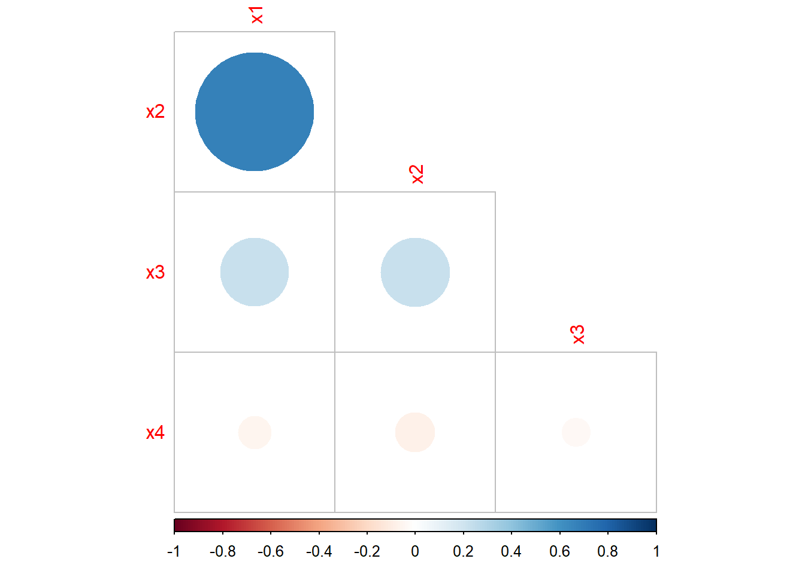

# Practical: Predicting a company’s bankruptcy {.unnumbered}

*This practical is adapted from a demonstration created by Dr. Tatjana
Kecojevic, Lecturer in Social Statistics.*

::: file
For the tasks below, you will require the **four_ratios** dataset.

Click here to download the file:
<a href="data/four_ratios.csv" download="four_ratios.csv"> four_ratios.csv </a>.

Remember to place your data file in a separate subfolder within your R
project working directory.
:::

## Data and Variables {.unnumbered}

In order to build a model to predict a company’s bankruptcy, an analyst
has collected a sample of data as follows:

Four financial ratios (predictors):

-   x1: Retained Earnings / Total Assets\
-   x2: Earnings Before Interest and Taxes / Total Assets\
-   x3: Sales / Total Assets\
-   x4: Cash Flow / Total Debt

And a binary response variable y:

-   0 - if the company went bankrupt   

-   1 - if the company stayed solvent   

## Importing the data {.unnumbered}


```r
four_ratios <- read.csv("data/four_ratios.csv", header = TRUE)
```

## Loading required packages {.unnumbered}


```r
library(MASS)
library(class)
library(tidyverse)
library(corrplot)
library(ISLR2)
library(e1071)
```

Now let's explore the dataset. We can see that the predictors are all of
class double. The response is of class integer, despite this being a
binary categorical variable. There are a total of 111 observations, so
quite a small dataset.


```r
glimpse(four_ratios)
```

```
## Rows: 111
## Columns: 5
## $ x1 <dbl> 0.3778, 0.2783, 0.1192, 0.6070, 0.5334, 0.3868, 0.3312, 0.0130, 0.6…
## $ x2 <dbl> 0.1316, 0.1166, 0.2035, 0.2040, 0.1650, 0.0681, 0.2157, 0.2366, 0.2…
## $ x3 <dbl> 1.0911, 1.3441, 0.8130, 14.4090, 8.0734, 0.5755, 3.0679, 2.4709, 5.…
## $ x4 <dbl> 1.2784, 0.2216, 1.6702, 0.9844, 1.3474, 1.0579, 2.0899, 1.2230, 1.7…
## $ y  <int> 1, 1, 1, 1, 1, 1, 1, 1, 1, 1, 1, 1, 1, 1, 1, 1, 1, 1, 1, 1, 1, 1, 1…
```

We therefore transform the response to a factor.


```r
four_ratios$y <- as_factor(four_ratios$y)
```

## Correlation Matrix and Plot {.unnumbered}

Let's now produce a correlation plot between all pairs of variables in
the dataset.


```r
cor_matrix <- cor(four_ratios[,-5])

corrplot(cor_matrix, type = "lower", diag = FALSE)
```



We observe a strong positive correlation between $X_1$ and $X_2$. The
correlations between other variables are quite weak.

Before we consider the model, we split the data into training and test
sets as we will later on assess model accuracy in correct prediction
using the test data set. We consider a basic fixed split of 80:20. Since
there are a total of 111 observations, we split at row 89


```r
set.seed(123)
split_idx = sample(nrow(four_ratios), 89)
train = four_ratios[split_idx, ]
test = four_ratios[-split_idx, ]
```

## Logistic Regression {.unnumbered}

Now let's first consider logistic regression and build the model. Given
the high correlation between $x_1$ and $x_2$ (this is to be expected,
given what they measure), we have to reflect on how we want to address
this. Assuming we have knowledge of important factors that can predict
bankruptcy, we can decide to drop one of the two financial ratios. In
this case, we drop $x_2$.


```r
fit <- glm(y ~ x1 + x3 + x4,
           data = train, family = binomial)

summary(fit)
```

```
## 
## Call:
## glm(formula = y ~ x1 + x3 + x4, family = binomial, data = train)
## 
## Deviance Residuals: 
##     Min       1Q   Median       3Q      Max  
## -2.1151  -0.4682   0.0000   0.3720   2.2542  
## 
## Coefficients:
##             Estimate Std. Error z value Pr(>|z|)    
## (Intercept)  -2.6970     0.8896  -3.032  0.00243 ** 
## x1           12.6569     3.0942   4.090  4.3e-05 ***
## x3            1.6400     0.5764   2.845  0.00444 ** 
## x4           -0.5247     0.3297  -1.591  0.11151    
## ---
## Signif. codes:  0 '***' 0.001 '**' 0.01 '*' 0.05 '.' 0.1 ' ' 1
## 
## (Dispersion parameter for binomial family taken to be 1)
## 
##     Null deviance: 123.369  on 88  degrees of freedom
## Residual deviance:  54.552  on 85  degrees of freedom
## AIC: 62.552
## 
## Number of Fisher Scoring iterations: 7
```

The key components of R’s `summary()` function for generalised linear
models for binomial family with the logit link are:

-   Call: just like in the case of fitting the lm() model this is R
    reminding us what model we ran, what options we specified, etc

-   the Deviance Residuals are a measure of model fit. This part of the
    output shows the distribution of the deviance residuals for
    individual cases used in the model. Below we discuss how to use
    summaries of the deviance statistic to assess model fit

-   the Coefficients, their standard errors, the z-statistic (sometimes
    called a Wald z-statistic), and the associated p-values. The
    logistic regression coefficients give the change in the log odds of
    the outcome for a one unit increase in the predictor variable

At the end there are fit indices, including the *null* and *deviance*
residuals and the *AIC*, which are used to assess overall model fit.

We realise that the output above has a resemblance to the standard
regression output. Although they differ in the type of information, they
serve similar functions. Let us make an interpretation of it.

The fitted logarithm of the odds ratio, i.e. logit of the probability p
of the firm remaining solvent is modelled as:

$$\hat{g}(X_1,X_2,...X_q)=−9.8846+0.3238X_1+0.1779X_2+4.9443X_3$$
Remember that here instead of predicting Y we obtain the model to
predict $\log \left( \frac{p}{1-p} \right)$. Using the transformation of
the logit we get the predicted probabilities of the firm being solvent.

The estimated parameters are expected changes in the logit for unit
change in their corresponding variables when the other, remaining
variables are held fixed. That is, the logistic regression coefficients
give the change in the log odds of the response variable for a unit
increase in the explanatory variable. This is very hard to make sense of. We have predicted log odds and in order to interpret them into a more sensible fashion we need to “anti-log” them as the changes in odds ratio for a unit change in variable
$X_i$ , while the other variables are held fixed.


```r
round(exp(coef(fit)), 4)
```

```
## (Intercept)          x1          x3          x4 
##      0.0674 313912.8230      5.1550      0.5917
```

Now, we can interpret the coefficients in terms of odds. For example, the odds of a firm being solvent (vs being bankrupt) increases by 313913 for a unit change in ratio $X_1$, all else in the model being being fixed. 

## Explaining the Logit {.unnumbered}

Let's return to the summary of the fit:


```r
summary(fit)
```

```
## 
## Call:
## glm(formula = y ~ x1 + x3 + x4, family = binomial, data = train)
## 
## Deviance Residuals: 
##     Min       1Q   Median       3Q      Max  
## -2.1151  -0.4682   0.0000   0.3720   2.2542  
## 
## Coefficients:
##             Estimate Std. Error z value Pr(>|z|)    
## (Intercept)  -2.6970     0.8896  -3.032  0.00243 ** 
## x1           12.6569     3.0942   4.090  4.3e-05 ***
## x3            1.6400     0.5764   2.845  0.00444 ** 
## x4           -0.5247     0.3297  -1.591  0.11151    
## ---
## Signif. codes:  0 '***' 0.001 '**' 0.01 '*' 0.05 '.' 0.1 ' ' 1
## 
## (Dispersion parameter for binomial family taken to be 1)
## 
##     Null deviance: 123.369  on 88  degrees of freedom
## Residual deviance:  54.552  on 85  degrees of freedom
## AIC: 62.552
## 
## Number of Fisher Scoring iterations: 7
```

The column headed as z value is the ratio of the coefficients (Estimate) to their standard errors (Std. Error) known as Wald statistics for testing the hypothesis that the corresponding parameter are zeros. In standard regression this would be the t-test. Next to Wald test statistics we have their corresponding p-values (Pr(>|z|)) which are used to judge the significance of the coefficients. Values smaller than 0.5 would lead to the conclusion that the coefficient is significantly different from 0 at 5%  significance level. From the output obtained we see that two p-values are smaller than 0.5.  


We now need to make a proper assessment to check if the variables collectively contribute in explaining the logit. That is, we need to examine whether the coefficients $\beta_1$, $\beta_2$, $\beta_3$ and $\beta_4$ are all zeros. We do this using the G statistic, which stands for goodness of fit *G = likelihood without the predictors − likelihood with the predictors*.

G is distributed as a chi-square statistic with 1 degree of freedom, so
a chi-square test is the test of the fit of the model (note, that G is
similar to an $R^2$ type test).

$H_0:\beta_i=0$\
$H_1:$ at least one is different from $0$   

where $i = 1, 2...$.

We decide on $\alpha = 0.05$. If its associated p-value is greater than 0.05, we conclude that the variables do not collectively influence the logits, if however p-value is less that 0.05 we conclude that they do collectively influence the logits.

Let's calculate the G statistic.


```r
G_calc <- fit$null.deviance - fit$deviance

G_calc
```

```
## [1] 68.81702
```

Then the degrees of freedom of the predictors.


```r
Gdf <- fit$df.null - fit$df.residual

Gdf
```

```
## [1] 3
```

We find the critical value for the G statistic.


```r
qchisq(.95, df = Gdf) 
```

```
## [1] 7.814728
```

And finally, the p-value associated with the G statistic.


```r
1 - pchisq(G_calc, Gdf)
```

```
## [1] 7.660539e-15
```

Now, we have to decide whether our model is a statistically valid one.
Since $G_{calc} = 68.82 > G_{crit} = 7.81 ⇒ H1,$ (and the p-value is
much smaller than 0.05), we can conclude that this is a statistically
valid model and that the variables collectively have explanatory power.

**However, do we need ALL three variables?**

In linear regression we assess the significance of individual regression
coefficients, i.e. the contribution of the individual variables using
the t-test. Here, we use the z scores to conduct the equivalent *Wald
statistic (test)*. The ratio of the logistic regression has a normal
distribution as opposed to the t-distribution we have seen in linear
regression.

Nonetheless, the set of hypotheses we wish to test is the same:

$H_0:\beta_i = 0$ (coefficient is not significant, thus $X_i$ is not
important)\
$H_1:\beta_i \ne 0$ (coefficient is significant, thus $X_i$ is
important)

**Decision Rule**: If the Wald’s z statistic lies between -2 and +2,
then the financial ratio, $X_i$, is not needed and can be dropped from
the analysis. Otherwise, we will keep the financial ratio.However, there
is some scope here for subjective judgement depending upon how near to
+/-2 the Wald’s z value is. The p-value decision rule: if $p > 0.05$ ⇒
the variable can be taken out, otherwise if p-value \< 0.05 keep the
variable in the model.

Rather than fitting individual models and doing a manual comparison we
can make use of the anova function for comparing the nested model using
the chi-square test.


```r
anova(fit, test="Chisq")
```

```
## Analysis of Deviance Table
## 
## Model: binomial, link: logit
## 
## Response: y
## 
## Terms added sequentially (first to last)
## 
## 
##      Df Deviance Resid. Df Resid. Dev  Pr(>Chi)    
## NULL                    88    123.369              
## x1    1   54.441        87     68.928 1.602e-13 ***
## x3    1   12.044        86     56.884 0.0005197 ***
## x4    1    2.332        85     54.552 0.1267323    
## ---
## Signif. codes:  0 '***' 0.001 '**' 0.01 '*' 0.05 '.' 0.1 ' ' 1
```

Based on the output, we can remove $X_4$ ratio variable from the model
and we update our model (we also know that $X_4$ is not statistically
significant from the summary of the model results earlier).


```r
fit2 <- update(fit, ~. -x4, data = train)

summary(fit2)
```

```
## 
## Call:
## glm(formula = y ~ x1 + x3, family = binomial, data = train)
## 
## Deviance Residuals: 
##     Min       1Q   Median       3Q      Max  
## -2.2116  -0.4985   0.0000   0.4300   2.3366  
## 
## Coefficients:
##             Estimate Std. Error z value Pr(>|z|)    
## (Intercept)  -3.4779     0.8117  -4.285 1.83e-05 ***
## x1           11.6639     2.7793   4.197 2.71e-05 ***
## x3            1.6202     0.5754   2.816  0.00487 ** 
## ---
## Signif. codes:  0 '***' 0.001 '**' 0.01 '*' 0.05 '.' 0.1 ' ' 1
## 
## (Dispersion parameter for binomial family taken to be 1)
## 
##     Null deviance: 123.369  on 88  degrees of freedom
## Residual deviance:  56.884  on 86  degrees of freedom
## AIC: 62.884
## 
## Number of Fisher Scoring iterations: 7
```

To compare the fit of the new model we will use the Akaike Information
Criterion (AIC), which is an index of fit that takes account of
parsimony of the model by penalising for the number of parameters. It is
defined as:

*AIC = −2× maximum log-likelihood + 2× number of parameters*

Therefore, smaller values are indicative of a better fit to the data. In
the context of logit fit, the AIC is simply the residual deviance plus
twice the number of regression coefficients.

The AIC can be found at the end of the output.


```r
summary(fit2)
```

```
## 
## Call:
## glm(formula = y ~ x1 + x3, family = binomial, data = train)
## 
## Deviance Residuals: 
##     Min       1Q   Median       3Q      Max  
## -2.2116  -0.4985   0.0000   0.4300   2.3366  
## 
## Coefficients:
##             Estimate Std. Error z value Pr(>|z|)    
## (Intercept)  -3.4779     0.8117  -4.285 1.83e-05 ***
## x1           11.6639     2.7793   4.197 2.71e-05 ***
## x3            1.6202     0.5754   2.816  0.00487 ** 
## ---
## Signif. codes:  0 '***' 0.001 '**' 0.01 '*' 0.05 '.' 0.1 ' ' 1
## 
## (Dispersion parameter for binomial family taken to be 1)
## 
##     Null deviance: 123.369  on 88  degrees of freedom
## Residual deviance:  56.884  on 86  degrees of freedom
## AIC: 62.884
## 
## Number of Fisher Scoring iterations: 7
```

The AIC of our initial model is 62.552 and of the new model 62.884 (very
little difference). Checking the new model, we can see that it consists
of the variables that all significantly contribute in explaining the
logits. *So, in the spirit of parsimony we can choose the second model
to be a better fit.* You will learn more about the AIC and other similar
metrics later in the course.

To obtain the overall accuracy rate we need to find the predicted
probabilities of the observations kept aside in the test subset.


```r
pred <- predict(fit2, test, type = "response") > 0.5
```

Now let's compute the confusion matrix such that we can compare our
predictions on the test data against the actual values in our dataset.
We can see that our model predicts one instance incorrectly (it predicts
*bankrupt* when in fact it should predict *solvent*)


```r
(t <- table(ifelse(pred, "Solvent (pred)", "Bankrupt (pred)"), test$y))
```

```
##                  
##                    0  1
##   Bankrupt (pred) 11  1
##   Solvent (pred)   0 10
```

If we then compute the overall fraction of correct predictions, we can
see that this is extremely high (0.955) which means that our model is
performing extremely well. *In practice*: Although the overall accuracy
rate might be easy to compute and to interpret, it makes no distinction
about the type of errors being made. Although we did remove one the
variables due to high correlation, other variables do show some degree
of correlation and so we must be cautious about the strength of the
relationship and therefore, the overall predictive performance.


```r
sum(diag(t)) / sum(t)
```

```
## [1] 0.9545455
```

*Do note that if you performing any rounding of the probabilities prior
to classification, values near the threshold of 0.5 may be classified
differently than if you were not to round the probabilities.*

## Tasks: Linear Discriminant Analysis {.unnumbered}

### Task 1 {.unnumbered}

Build a LDA classifier for the final logistic model with two predictors
and explain what the output means.

### Task 2 {.unnumbered}

Compute the predictions and explain what the results mean.

### Task 3 {.unnumbered}

Compute the confusion matrix for the LDA classifier and calculate the
fraction of correct predictions. Explain the results.

## Tasks: Quadratic Discriminant Analysis {.unnumbered}

### Task 1 {.unnumbered}

Build a QDA clasifier and describe the output.

### Task 2 {.unnumbered}

Compute the predictions, the confusion matrix, and the fraction of
correct predictions and explain what the results mean.

## Tasks: $K$-nearest neighbours {.unnumbered}

### Task 1 {.unnumbered}

Perform KNN regression on the same model as in the previous tasks.

### Task 2 {.unnumbered}

Produce a confusion matrix and compute the fraction of correct
predictions. Comment on the results.

### Task 3 {.unnumbered}

Fit KNN for up to $k = 30$ and then calculate the overall fraction of
correct prediction.

### Task 4 {.unnumbered}

Create a plot to observe at what value for `k` the overall fraction of
correct predictions is highest.

## Tasks: Naive Bayes {.unnumbered}

### Task 1 {.unnumbered}

Build a Naive Bayes classifier for the model used previously and
describe the output.

### Task 2 {.unnumbered}

Compute the predictions, build a confusion matrix, calculate the
fraction of correct predictions and interpret the results.
