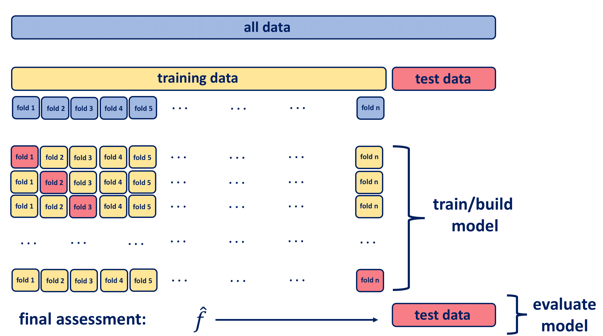
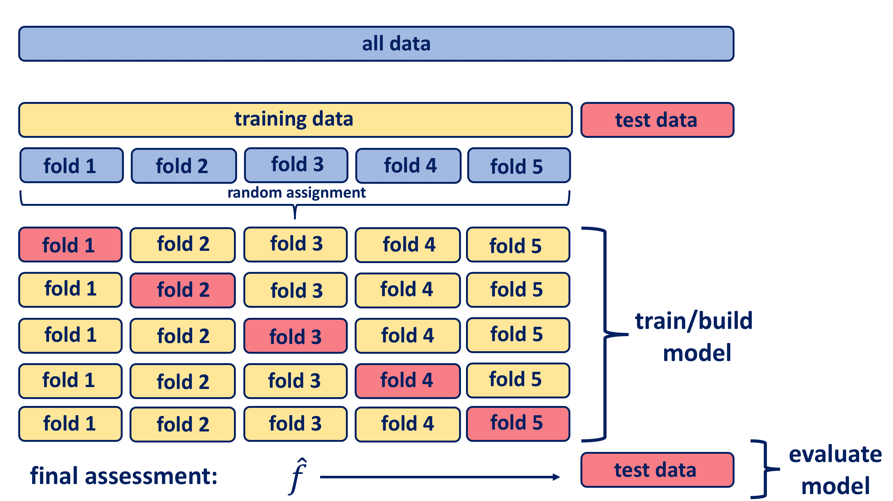

---
editor_options:
  markdown:
    wrap: 72
---

# Demonstration 1: Cross-validation {-}

So far, we have established the importance of training and test data and you now should have a robust understanding of the differences between training and test error rates in relation to model performance. However, several challenges remain and these include:

-  the size of the training set and whether it is sufficient to adequately train our model;  
-  the size of the test set and whether it is sufficient to adequately evaluate our model;  
-  the process of testing our model on just a single test set;    
-  the nature of the training set.    

We are dealing with a gap here: the gap between the need to reliably measure model performance and the process of splitting the data we have available.

In this demonstration, you will learn more about how cross-validation provides us with ways to address this gap.  

## Data and Variables {-}

In this demonstration, we will make use the **Auto** dataset from the core textbook (James et. al 2021). This dataset is part of the `ISRL2` package. By loading the package, the **Auto** dataset loads automatically.

You should already be familiar with the **Auto** dataset but below is a reminder of the variables it contains:

-   mpg: miles per gallon
-   cylinders: Number of cylinders between 4 and 8
-   displacement: Engine displacement (cu. inches)
-   horsepower: Engine horsepower
-   weight: Vehicle weight (lbs.)
-   acceleration: Time to accelerate from 0 to 60 mph (sec.)
-   year: Model year
-   origin: Origin of car (1. American, 2. European, 3. Japanese)
-   name: Vehicle name

In addition to `ISRL2`, you will also require the `boot` package which first needs to be installed. This package is required for both LOOCV and $k$-fold CV.


```r
library(ISLR2)
library(boot) #don't forget to install it first
```

## The Validation Set Approach {-}

Let's first consider the validation set approach.  

The **Auto** dataset has a total of 392 observations and the goal is to randomly split these observations using a 50/50 ratio. We can perform this randomised split using the base R `sample()` function. The first argument within `sample()` is 392. This is the total number of observations available to us from the **Auto** dataset. The second argument is 196. This represents the number of observations we want to select from the total we have available which is 392. Therefore, the `sample()` function will return a vector of 196 unique integers which represents a subset of 196 indices from a total of 392.   

*Note: by default, the `sample()` function conducts the sampling without replacement.*


```r
training_data <- sample(392, 196)

training_data
```

```
##   [1] 372  60 299 282  14 330 280 111 352 298  90  13  27 286   3 264  86  63
##  [19] 281 198  47  66 126  15 102  85 112 269 251 318 201 162  91 369 388 351
##  [37]   1 197 271 223 364 219 374 314 100 224 164 263 343 382 335  49 220  20
##  [55] 338  29 156 130 297   6  87 386 209 371 368 366 207 178  71  48  88 171
##  [73]  78 189 325 168 391   5 163  32 310 342 103 317  37  72  70 181 258 193
##  [91] 291 133 122 252 383  18  93  43 214 336  62  26  55 200  17 254 204 337
## [109]  58 185 158 350 160 172 132 361 238 179 131  95 259 146  82 228 367 173
## [127] 348 115 294 290 242 195 127 129 106 253 345 307 170 187 379 212 194 389
## [145]  68 306  28  59 236 225 119 174 175 354 244 384  50 324 221  65 118 104
## [163] 141  92 121 328 165 329 305  83 295  42 157 292 235  80 114 124   2 300
## [181]  16 113 289 272 117 293  69  46  40 313  34 107 378 196   8 322
```

Now we need to tell R to fit a linear regression model using only the observations corresponding to the training set. We can do so by using the `subset` argument which tells R to only select the 196 observations that are indexed at the specific positions as defined by the  **training_data** object. In this way, the model will be fitted using only the observations from **Auto** dataset that are defined by this vector of indices. 


```r
fit <- lm(mpg ~ horsepower, data = Auto, subset = training_data)
```

Let's now calculate the Mean Squared Error for the test dataset. We obtain the predictions using the`predict()` function with which you are already familiar.


```r
mean((Auto$mpg - predict(fit, Auto))[-training_data]^2)
```

```
## [1] 27.50551
```

Let's try applying some transformations to our predictor **horsepower** using the **poly()** function and then calculate the test MSE values to observe how the MSE values change.   

We first fit a second-degree polynomial regression model:  


```r
lm.fit2 <- lm(mpg ~ poly(horsepower, 2), data = Auto, subset = training_data)
```

Then calculate the test MSE:   


```r
mean((Auto$mpg - predict(lm.fit2, Auto))[-training_data]^2)
```

```
## [1] 21.90222
```

Now we fit a third-degree polynomial regression model  


```r
lm.fit3 <- lm(mpg ~ poly(horsepower, 3), data = Auto, subset = training_data)
```

Then calculate the test MSE:    


```r
mean((Auto$mpg - predict(lm.fit3, Auto))[-training_data]^2)
```

```
## [1] 21.8786
```

What would happen if we choose a different training dataset instead? We can try this out by setting the seed to 2, for example.   


```r
set.seed(2)  
training_data2 <- sample(392, 196)
```

We then run a new set of models: a linear regression model, a second degree polynomial model, and a third degree polynomial model and then calculate the test MSE values for each of the three models.    

**linear regression model and corresponding test MSE:**  


```r
lm.fit <- lm(mpg ~ horsepower, data = Auto, subset = training_data2)
mean((Auto$mpg - predict(lm.fit, Auto))[-training_data2]^2)
```

```
## [1] 25.72651
```

**quadratic regression model and corresponding test MSE:** 


```r
lm.fit2 <- lm(mpg ~ poly(horsepower, 2), data = Auto, subset = training_data2)
mean((Auto$mpg - predict(lm.fit2, Auto))[-training_data2]^2)
```

```
## [1] 20.43036
```

**cubic regression model and corresponding test MSE:** 


```r
lm.fit3 <- lm(mpg ~ poly(horsepower, 3), data = Auto, subset = training_data2)
mean((Auto$mpg - predict(lm.fit3, Auto))[-training_data2]^2)
```

```
## [1] 20.38533
```

The results obtained using the second training dataset are consistent with the findings from the first training dataset whereby a model that predicts **mpg** using a quadratic function of **horsepower** performs better than a model that involves only a linear function of **horsepower**. Also, there is little evidence in favor of a model that uses a cubic function of **horsepower**.  

Overall, the main take-away point is that if we were to choose different training sets, we will obtain somewhat different errors on the validation set. 

This is an important point of reflection: if we implement the fixed split approach directly such that we fit our model once on our single training set and then immediately evaluate the predictive accuracy of that model once on our single test set, 

Nevertheless, the validation set approach still does not solve this challenge. 

## Leave-One-Out Cross-Validation {-}

Now, let's consider LOOCV. The training set of data is split into two parts, with the difference that here they are not of comparable sizes as the validation set consists of a single observation and the remaining observations make up the training set. 



Repeating the process $n$ times produces $n$ square errors and the estimate for the test MSE is the average of those $n$ test error estimates:

$$CV_{(n)} = \frac{1}{n} \sum_{i=1}^{n} MSE_i$$
The main advantage of the LOOCV approach over a simple train and test validation is that it produces less bias. The model is fit on $n−1$ training observations, almost as many as there are in the entire data set. Furthermore, since LOOCV is performed multiple times it yields consistent results with less randomness than in a simple train and test approach. 

One more down side to the generally high value of $k$ is that the computation side of the procedure becomes more taxing especially if the model is rather a complex one. Come to think about it, the LOOCV requires as many model fits as data points and each model fit uses a subset that is ALMOST the same size as the training.  

In R, one way to compute the LOOCV estimate is by using functions from the `boot` package. This package nevertheless requires that the models are built using the `glm()` function, including linear models. The `glm()` function will produce identical results to `lm()` when fitting a linear model. You do not need to specify the `family` argument as you did for logistic regression since it is already set by default to `gaussian`. 

Fitting a linear model with `glm()` is the same as with `lm()`. 


```r
glm.fit <- glm(mpg ~ horsepower, data = Auto)
```

We then perform LOOCV using the `cv.glm()` function from the `boot` package.


```r
cv.err <- cv.glm(Auto, glm.fit)
```

The output includes a list of several components. The component of relevance for LOOCV is `delta`. 


```r
cv.err$delta
```

```
## [1] 24.23151 24.23114
```

The `delta` component therefore provides us with the results of the cross-validation. The first value is the raw cross-validation estimate of prediction error whilst the second value is the adjusted cross-validation estimate that compensates for the bias introduced by not using leave-one-out cross-validation. In our case, the two values are identical to two decimal places and so our cross-validation estimate for the test error is approximately $24.23$. 

We can repeat this procedure for increasingly complex polynomial fits. Instead of writing separate code for each model fit, we can automate the process using the  `for()` function that initiates a *for loop* which iteratively fits polynomial regressions for polynomials of order $i=1$ to $i=10$, computes the associated cross-validation error, and stores it in the $i$th element of the vector `cv.error`.


```r
cv.error <- rep(0, 10)
for (i in 1:10) {
  glm.fit <- glm(mpg ~ poly(horsepower, i), data = Auto)
  cv.error[i] <- cv.glm(Auto, glm.fit)$delta[1]
}
```

The output shows us the estimated test MSE for the linear model and polynomials up to the 10th degree. 


```r
cv.error
```

```
##  [1] 24.23151 19.24821 19.33498 19.42443 19.03321 18.97864 18.83305 18.96115
##  [9] 19.06863 19.49093
```

We can see a sharp drop in the estimated test MSE between the linear and quadratic fits, but then no clear improvement from using higher-order polynomials.

## $k$-Fold Cross-Validation {-}

Finally, let's consider $k$-fold cross-validation. This approach involves randomly dividing the set of observations into $k$ groups (known as folds) of approximately equal size. With cross-validation the test data is held out (approximately one fifth of data), and the remaining training data is randomly divided into $k$ groups. Several different portions of this training data are used for validation, and the remaining part of the data is used for training as shown in the diagram below. Hence, a fold is treated as a validation set, and the method is fit on to the remaining $k−1$ folds. The $k$ resampled estimates of performance are summarised and used for testing and model building.



In this illustration, the non-holdout data is divided into five portions, and we therefore call this *5-fold cross-validation*. If there had been ten blocks, it would have been 10-fold cross-validation. The model that has been built using k-fold cross-validation is then tested on the originally held out test data subset. The $k$ resampled estimates of model’s performance are summarised commonly using the mean and standard error to develop a better reasoning of its effectiveness in relation to its tuning parameters. In fact, LOOCV is a special case of k-fold CV in which $k$ is equal to $n$:

$$CV_{(k)} = \frac{1}{k} \sum_{i=1}^{k} MSE_i$$
A typical choice for $k$ is 5 or 10, but there is no formal rule. One should keep in mind when making a choice that as $k$ increases, the difference in size between the training set and the resampling subset gets smaller, causing the bias of the statistical model to become smaller. However, when compared with k-fold CV, LOOCV results in a poorer estimate as it provides an approximately unbiased estimate for the test error that is highly variable.  

Using k-fold cross-validation increases validation sensitivity, allowing better reasoning with the model. One of the key questions is how to choose the number of folds, i.e. how big does $k$ need to be? In general, the choice of the number of folds depends on the size of the dataset. For large datasets, 5-fold cross-validation is considered to be quite accurate and when dealing with very sparse datasets, we may consider using leave-one-out in order to train on as many examples as possible.

There is a bias-variance trade-off associated with the choice of $k$ in k-fold cross-validation. Larger $k$, for which training folds are closer to the total dataset, results in less bias towards overestimating the true expected error but higher variance and higher running time. We can summarise those findings as follows:

For a large number of folds:  

- positives:small bias of the true error rate estimator (as a result of a very accurate estimator)  
- negatives: large variance of the true error rate estimator; computational time is large 

For a small number of folds: 

- positives: small variance of the estimator; the number of experiments and, therefore, computation time are reduced
- negatives: large bias of the estimator  


In practice, typical choices for k in cross-validation are $k=5$ or $k=10$, as these values have been shown empirically to yield test error rate estimates that suffer neither from excessively high bias nor from very high variance.


Let's practice $k$-fold cross-validation. The same function (`cv.glm()`) can be used by setting the value of $k$. By default, the value of K is equal to the number of observations in data which therefore gives us LOOCV.

In this example, we will use $k = 10$. We will again perform the same approach of increasingly complex polynomial fits as we did for LOOCV. The code is identical to the one we used to LOOCV except that of course, we specified `K = 10`.


```r
set.seed(17)
cv.error.10 <- rep(0, 10)
for (i in 1:10) {
  glm.fit <- glm(mpg ~ poly(horsepower, i), data = Auto)
  cv.error.10[i] <- cv.glm(Auto, glm.fit, K = 10)$delta[1]
}
```

The output shows us a similar pattern to the estimated test MSE for the linear model and polynomials up to the 10th degree: we see a sharp drop between the linear and quadratic fits but once again no improvement with higher order polynomials. We can therefore conclude that a quadratic fit is suitable.


```r
cv.error.10
```

```
##  [1] 24.27207 19.26909 19.34805 19.29496 19.03198 18.89781 19.12061 19.14666
##  [9] 18.87013 20.95520
```

We saw earlier that when we LOOCV, the two values were essentially the same. In the case of $k$-fold CV, these values differ slightly but they are still very similar to each other. 


```r
cv.glm(Auto, glm.fit, K = 10)$delta
```

```
## [1] 19.71557 19.60616
```

