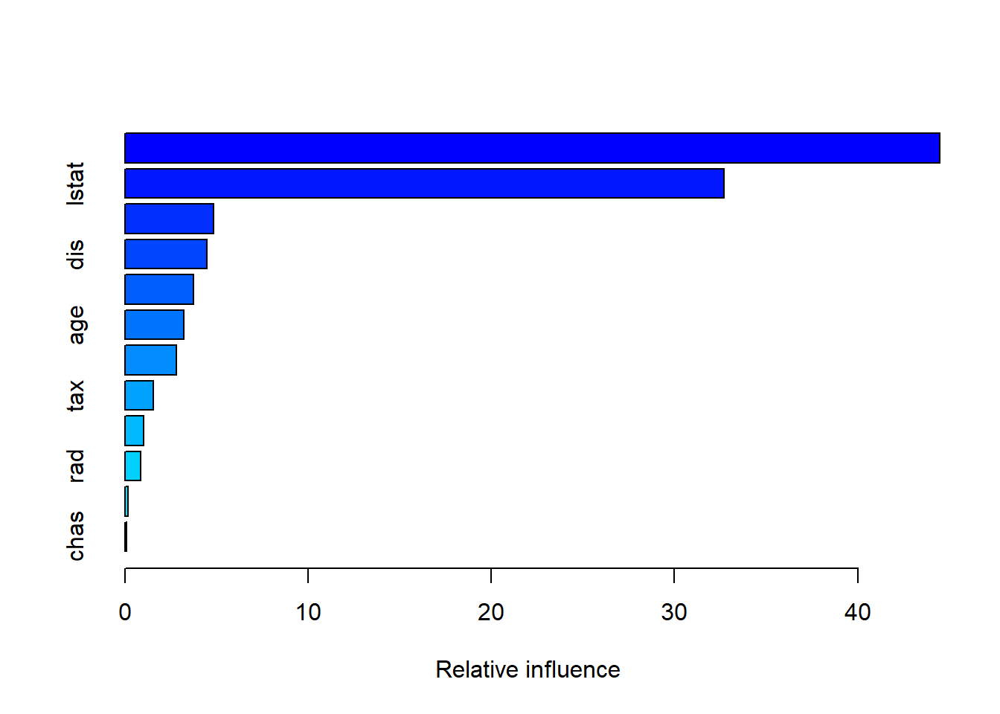

# Demonstration 2: The Basics of Decision Trees and Related Methods {.unnumbered}

In this demonstration, you will learn about *decision trees*:
*regression* trees are used when the outcome is quantitative and
*classification* trees used when the outcome is categorical.

The basics are quite simple (even simpler than linear regression!): we
split the predictor space to a number of regions and the prediction for
every outcome in a region is the *mean* (for regression) or *mode* (for
classification) of the observations in that region. Given that the
structure of decision trees resemble human decision-making (to a certain
extent) and that the output can be easily illustrated, this makes them
quite easy to interpret, even by non-experts. Also, there is no need for
dummy variables since trees easy handle categorical predictors.

We will explore each of these in greater detail in the walkthrough
below. Before beginning, you will need to install and load the `gbm`,
`tree`, and `randomForest` packages. The `tree` library is used to
construct classification and regression trees.


```r
library(gbm)
library(tree)
library(randomForest)
library(ISLR2)
library(tidyverse)
```

## Decision Trees {.unnumbered}

### Classification Trees {.unnumbered}

::: file
For the tasks below, you will require the **Carseats** dataset. This
dataset is part of the `ISRL2` package from the core textbook (James et.
al 2021). By loading the package, the **Carseats** dataset will load
automatically.
:::

The **Carseats** is a simulated dataset on sales of child car seats at
different stores. There are 400 observations on 11 variables.

| Variable Name |                                                   Variable Description                                                   |
|:------------:|:--------------------------------------------------------:|
|     Sales     |                                        Unit sales (in thousands) at each location                                        |
|   CompPrice   |                                       Price charged by competitor at each location                                       |
|    Income     |                                     Community income level (in thousands of dollars)                                     |
|  Advertising  |                     Local advertising budget for company at each location (in thousands of dollars)                      |
|  Population   |                                         Population size in region (in thousands)                                         |
|     Price     |                                     Price company charges for car seats at each site                                     |
|   ShelveLoc   | A factor with levels Bad, Good and Medium indicating the quality of the shelving location for the car seats at each site |
|      Age      |                                           Average age of the local population                                            |
|   Education   |                                             Education level at each location                                             |
|     Urban     |              A factor with levels No and Yes to indicate whether the store is in an urban or rural location              |
|      US       |                    A factor with levels No and Yes to indicate whether the store is in the US or not                     |

We will now explore how classification trees can be used to predict
whether sales of car seats are high or low. Here **Sales** is continuous
and so we create a new binary variable such that all unit sales over
8,000 dollars are classed as 'Yes' (i.e. so high sales) and everything
else and 'No' (i.e. so low sales). We store this as a vector with our
response values for the test set for evaluating our model later and we
also add this as a variable in our dataset.


```r
attach(Carseats)
High <- factor(ifelse(Sales <= 8, "No", "Yes"))
Carseats <- data.frame(Carseats, High)
```

Let's now split the data into training and test sets. We randomly select
half of the observations from the dataset for our training set and we
allocate the rest to the test set (`Carseats.test`).


```r
set.seed(2)
train <- sample(1:nrow(Carseats), 200)
```

Now let's fit the tree using the `tree()` function from the package
`tree` that you have just installed. As shown below, the basic syntax is
quite simple. Since we want to use all variables in the data object as
predictors, there is no need to list them all in the formula. Instead,
we can simply use a dot. However, we must drop the original **Sales**
variable for obvious reasons. To fit the tree to the training data only,
we must subset the Carseats data using the **train** object which
contains a vector of the randomly selected indices that tells R which
values to subset.


```r
tree.carseats <- tree(High ~ . - Sales, Carseats, subset = train)
```

To better understand trees, let's explore the structure of our tree
visually first. We simply specify the name of the model and complement
the `plot()` function with the function `text()` within which we set the
`pretty` argument to `0` in order to include the category names for
categorical predictors.


```r
plot(tree.carseats)
text(tree.carseats, pretty = 0)
```


Our first split occurs at **Price**, which indicates that this is the
feature (i.e. variable) that is most important for classifying sales as
high or not. From this point forward, further splits are made and the
features at which these splits are made are referred to as *internal
nodes*. The tree splits first on **Price**, thus dividing the dataset
into two subsets based on whether Price is less than $96.5$. This is our
split criterion. The left side represents the subset within which price
is less than $96.5$ whilst the right side represents the subset within
which price is equal to or greater than $96.5$.

Let's first consider the left side of the tree. The subsequent internal
node is **Population** and the split criterion is such that population
is less than $414$ which means that within the subset where price is
less than $96.5$ (so the left side), the next most significant predictor
is **Population**. Within population, it is **ShelveLoc**, then **Age**
and so on. Hence, the tree continues to split based on these features
and values, further refining the subsets.

The right side represents the subset within which price is greater than
or equal to $96.5$. Our subsequent node after **Price** is **ShelveLoc**
which is a factor variable. This means that within the subset where
**Price** is greater than or equal to $96.5$, the location of the
shelves is the next most significant predictor. From there onward, as on
the left side, the tree continues to split further and further at
subsequent internal nodes according to specific split criteria.
Therefore, since the feature at which the first split occurs represents
the feature with the most importance regarding classification, the
internal nodes that are closest to this node are generally more
important than those closer to the bottom of the tree.

The vertical lines that connect a feature with an outcome are called
*branches*. Each branch represents a decision based on a feature value,
which then progresses to the next internal node or finally, to a *leaf
node*. A leaf node (also called a terminal node) are the nodes at the
bottom of the tree that provide the final classification. Each leaf node
represents a final decision regarding the classification (e.g., "Yes" or
"No" for high sales). The path from the root to a leaf node gives the
sequence of decisions made to classify an observation. Essentially, the
splits on either side simply refine the classification until a decision
is reached.

So we start off at the first split where $Price < 96.5$. If
$Price < 96.5$ is true, we move on to the next node on the left
hand-side which is $Population < 414$. We follow subsequent nodes and
branches based on the feature values of the observation and we reach a
terminal (leaf) node with the final classification (e.g., "Yes" for high
sales). So a terminal node is one from which no further splits occur. In
summary, our tree make use of features to split the data into subsets to
classify whether sales are high or not.

Now let's explore the output of the tree in greater detail. If we just
type the name of the tree object, R prints output detailed information
about the tree structure that we illustrated . The first line of the
output:
`node), split, n, deviance, yval, (yprob) * denotes terminal node`
describes what each component of the output means.


```r
tree.carseats
```

```
## node), split, n, deviance, yval, (yprob)
##       * denotes terminal node
## 
##   1) root 200 270.000 No ( 0.59500 0.40500 )  
##     2) Price < 96.5 40  47.050 Yes ( 0.27500 0.72500 )  
##       4) Population < 414 31  40.320 Yes ( 0.35484 0.64516 )  
##         8) ShelveLoc: Bad,Medium 25  34.300 Yes ( 0.44000 0.56000 )  
##          16) Age < 64.5 17  20.600 Yes ( 0.29412 0.70588 )  
##            32) Education < 13.5 7   0.000 Yes ( 0.00000 1.00000 ) *
##            33) Education > 13.5 10  13.860 Yes ( 0.50000 0.50000 )  
##              66) Education < 16.5 5   5.004 No ( 0.80000 0.20000 ) *
##              67) Education > 16.5 5   5.004 Yes ( 0.20000 0.80000 ) *
##          17) Age > 64.5 8   8.997 No ( 0.75000 0.25000 ) *
##         9) ShelveLoc: Good 6   0.000 Yes ( 0.00000 1.00000 ) *
##       5) Population > 414 9   0.000 Yes ( 0.00000 1.00000 ) *
##     3) Price > 96.5 160 201.800 No ( 0.67500 0.32500 )  
##       6) ShelveLoc: Bad,Medium 135 154.500 No ( 0.74074 0.25926 )  
##        12) Price < 124.5 82 107.700 No ( 0.63415 0.36585 )  
##          24) Age < 49.5 34  45.230 Yes ( 0.38235 0.61765 )  
##            48) CompPrice < 130.5 21  28.680 No ( 0.57143 0.42857 )  
##              96) Population < 134.5 6   0.000 No ( 1.00000 0.00000 ) *
##              97) Population > 134.5 15  20.190 Yes ( 0.40000 0.60000 )  
##               194) Population < 343 7   5.742 Yes ( 0.14286 0.85714 ) *
##               195) Population > 343 8  10.590 No ( 0.62500 0.37500 ) *
##            49) CompPrice > 130.5 13   7.051 Yes ( 0.07692 0.92308 ) *
##          25) Age > 49.5 48  46.330 No ( 0.81250 0.18750 )  
##            50) CompPrice < 124.5 28  14.410 No ( 0.92857 0.07143 )  
##             100) Price < 101.5 8   8.997 No ( 0.75000 0.25000 ) *
##             101) Price > 101.5 20   0.000 No ( 1.00000 0.00000 ) *
##            51) CompPrice > 124.5 20  25.900 No ( 0.65000 0.35000 )  
##             102) Price < 119 14  19.410 No ( 0.50000 0.50000 )  
##               204) Advertising < 10.5 9  11.460 No ( 0.66667 0.33333 ) *
##               205) Advertising > 10.5 5   5.004 Yes ( 0.20000 0.80000 ) *
##             103) Price > 119 6   0.000 No ( 1.00000 0.00000 ) *
##        13) Price > 124.5 53  33.120 No ( 0.90566 0.09434 )  
##          26) Population < 393.5 34   0.000 No ( 1.00000 0.00000 ) *
##          27) Population > 393.5 19  21.900 No ( 0.73684 0.26316 )  
##            54) CompPrice < 143.5 13   7.051 No ( 0.92308 0.07692 ) *
##            55) CompPrice > 143.5 6   7.638 Yes ( 0.33333 0.66667 ) *
##       7) ShelveLoc: Good 25  31.340 Yes ( 0.32000 0.68000 )  
##        14) Income < 43 7   8.376 No ( 0.71429 0.28571 ) *
##        15) Income > 43 18  16.220 Yes ( 0.16667 0.83333 )  
##          30) US: No 6   8.318 Yes ( 0.50000 0.50000 ) *
##          31) US: Yes 12   0.000 Yes ( 0.00000 1.00000 ) *
```

So let's take `2) Price < 96.5 40  47.050 Yes`( 0.27500 0.72500 )\` as
an example.

-   `2)` denotes the unique identifier of the node (so this is node 2),\
-   `Price < 96.5` is the condition of the split
-   `40` is the number of observations that reach the node \*in this
    case 40)
-   `47.050` is the deviance (i.e. impurity of the node after the split)
-   `Yes` is the predicted class for this node
-   `( 0.27500 0.72500 )` are the class probabilities and so the
    proportion of observations belonging to each class at the node (in
    other words the fraction of observations in that branch that take on
    values of `Yes` and `No`)\
-   the `*` denotes a terminal node

Now you may wonder about the root node (`1)`). This node (node 1)
represents the entire dataset with 200 observations in total, the most
common class at the root node (in this case `No`) and the proportion of
classes (i.e. Yes and No) in the dataset. The root node corresponds to
the decision to split at `Price < 96.5` in the graphic, but essentially,
it represents the entire dataset *before* any splits are made; as you
can see, there is no information about `split` for the root node itself
since it doesn't split. In other words, the root node starts the
solitting process, and each subsequent split aims to further refine the
classification by reducing *impurity* (i.e. variance), with the deviance
value helping in measuring the effectiveness of each split. Therefore
`Price < 96.5` is the condition for the split the root node.

To better understand how each feature and split contribute to the final
prediction, we must consider not only explore the structure as a whole,
but also consider how the data are split into branches based on
different features, how probabilities change at each node, and finally,
what final predictions are provided by the terminal nodes given the path
from the root node.

Starting at the root node, the splits are conducted according to the
following conditions: Price \< 96.5, Population \< 414, ShelveLoc: Bad,
Medium, Age \< 64.5, and Education \< 13.5.

Therefore:

-   Price \< 96.5: Among stores with prices lower than 96.5 (40 stores
    in total), 72.5% are likely have high sales (hence High = "Yes").
-   Population \< 414: Of these, 64.5% in lower population areas tend to
    have high sales.\
-   ShelveLoc: Bad, Medium: Among these, 56.0% stores with poor shelving
    location still tend to have high sales\
-   Age \< 64.5: Of these, in regions where the average age of the
    population is less than 64.5, 70.6% of stores are still likely have
    high sales\
-   Education \< 13.5: Finally, in areas where education is less than
    13.5, stores are still likely to have high sales with 100%
    probability.

As with other models we've explored so far, `summary()` also comes in
handy. The output contains additional information.


```r
summary(tree.carseats)
```

```
## 
## Classification tree:
## tree(formula = High ~ . - Sales, data = Carseats, subset = train)
## Variables actually used in tree construction:
## [1] "Price"       "Population"  "ShelveLoc"   "Age"         "Education"  
## [6] "CompPrice"   "Advertising" "Income"      "US"         
## Number of terminal nodes:  21 
## Residual mean deviance:  0.5543 = 99.22 / 179 
## Misclassification error rate: 0.115 = 23 / 200
```

-   variables actually used in tree construction: here we note 9
    variables (**Urban** is missing)\
-   number of terminal nodes: also referred to as 'leaves', the tree has
    21 terminal nodes; these represent the final decision or
    classification outcome.\
-   residual mean deviance: For classification trees, the deviance is
    given by $-2 \sum_m \sum_k n_{mk} \log \hat{p}_{mk}$, where $n_{mk}$
    is the number of observations in the $m$th terminal node that belong
    to the $k$th class. The smaller the deviance, the better the fit to
    the training data. The *residual mean deviance* is the deviance
    divided by $n-|{T}_0|$.\
-   misclassification error rate: this is the training error rate, which
    in this case is $11.5\%$. This seems quite good.

Now that you have a good grasp of how trees are built and interpreted,
let's evaluate the performance of the algorithm on the test data.The
`predict()` function can be used for this purpose. In the case of a
classification tree, the argument `type = "class"` instructs `R` to
return the actual class prediction. This approach leads to correct
predictions for around $77 \%$ of the locations in the test data set.


```r
High.test <- High[-train]
Carseats.test <- Carseats[-train, ]
tree.pred <- predict(tree.carseats, Carseats.test, type = "class")
table(tree.pred, High.test)
```

```
##          High.test
## tree.pred  No Yes
##       No  104  33
##       Yes  13  50
```

```r
(104 + 50) / 200
```

```
## [1] 0.77
```

(If you re-run the `predict()` function then you might get slightly
different results, due to "ties": for instance, this can happen when the
training observations corresponding to a terminal node are evenly split
between `Yes` and `No` response values.)

Next, we consider whether *pruning* the tree might lead to improved
results. Pruning is used to reduce size and complexity of the tree and
the main goal is to remove parts of the tree that do not provide
additional power in predicting target variables. Pruning is therefore
very important in preventing overfitting, improving interpretability and
enhancing the performance of the tree. One approach is *cost-complexity
pruning* which involves pruning the tree such that it balances the
trade-off between the accuracy and size of the tree (by minimising the
cost-complexity criterion).

Ok so let's see how this works in practice. The function `cv.tree()`
performs $k$-fold cross-validation in order to determine the optimal
level of tree complexity (i.e. to find the deviance or number of
misclassifications as a function of the cost-complexity parameter $k$).
This approach involves growing the tree to its full depth and then
removing nodes that provide little predictive power. We use the argument
`FUN = prune.misclass` to tell R that we want the classification error
rate to guide the cross-validation and pruning process, rather than the
default for the `cv.tree()` function, which is deviance. The `cv.tree()`
function reports the number of terminal nodes of each tree considered
(`size`) as well as the corresponding error rate and the value of the
cost-complexity parameter used (`k`).


```r
set.seed(7)
cv.carseats <- cv.tree(tree.carseats, FUN = prune.misclass)
```

The output contains several pieces of important information such as
size, deviance and the values for $k$. Each of these is paired with the
other, and so the lowest deviance which is 74 (i.e. 74 cross-validation
errors) corresponds to a tree of size 9 (i.e. a tree with 9 terminal
nodes) and a value of 1.4 for $k$. The lower the value for $k$, the less
pruning required.


```r
names(cv.carseats)
```

```
## [1] "size"   "dev"    "k"      "method"
```

```r
cv.carseats
```

```
## $size
## [1] 21 19 14  9  8  5  3  2  1
## 
## $dev
## [1] 75 75 75 74 82 83 83 85 82
## 
## $k
## [1] -Inf  0.0  1.0  1.4  2.0  3.0  4.0  9.0 18.0
## 
## $method
## [1] "misclass"
## 
## attr(,"class")
## [1] "prune"         "tree.sequence"
```

We can also plot the error rate as a function of both `size` and `k`.


```r
par(mfrow = c(1, 2))
plot(cv.carseats$size, cv.carseats$dev, type = "b")
plot(cv.carseats$k, cv.carseats$dev, type = "b")
```


We now apply the `prune.misclass()` function in order to prune the tree
to obtain the nine-node tree as indicated by the cross-validation
results. We specify the size using the `best` argument.


```r
prune.carseats <- prune.misclass(tree.carseats, best = 9)
plot(prune.carseats)
text(prune.carseats, pretty = 0)
```


How well does this pruned tree perform on the test data set? Once again,
we apply the `predict()` function.


```r
tree.pred <- predict(prune.carseats, Carseats.test,
    type = "class")
table(tree.pred, High.test)
```

```
##          High.test
## tree.pred No Yes
##       No  97  25
##       Yes 20  58
```

```r
(97 + 58) / 200
```

```
## [1] 0.775
```

Now $77.5 \%$ of the test observations are correctly classified, so not
only has the pruning process produced a more interpretable tree, but it
has also slightly improved the classification accuracy.

To illustrate what happens if we increase the size of the tree, let's
set the `best` argument to 14. As you can see, a tree of size 14
produces a more complex tree that is somewhat harder to interpret and
the fraction of correct predictions is also slightly lower.


```r
prune.carseats <- prune.misclass(tree.carseats, best = 14)
plot(prune.carseats)
text(prune.carseats, pretty = 0)
```


```r
tree.pred <- predict(prune.carseats, Carseats.test,
    type = "class")
table(tree.pred, High.test)
```

```
##          High.test
## tree.pred  No Yes
##       No  102  31
##       Yes  15  52
```

```r
(102 + 52) / 200
```

```
## [1] 0.77
```

### Regression Trees {.unnumbered}

::: file
For the tasks below, you will require the **Boston** dataset. This
dataset is part of the `ISRL2` package from the core textbook (James et.
al 2021).
:::

The **Boston** is a datast that contains housing values in 506 suburbs
of Boston. There are 13 variables.

| Variable Name |                         Variable Description                          |
|:--------------:|:------------------------------------------------------:|
|     crim      |                     per capita crime rate by town                     |
|      zn       |    proportion of residential land zoned for lots over 25,000 sq.ft    |
|     indus     |           proportion of non-retail business acres per town            |
|     chas      | Charles River dummy variable (= 1 if tract bounds river; 0 otherwise) |
|      nox      |         nitrogen oxides concentration (parts per 10 million)          |
|      rm       |                 average number of rooms per dwelling                  |
|      age      |        proportion of owner-occupied units built prior to 1940         |
|      dis      |     weighted mean of distances to five Boston employment centers      |
|      rad      |               index of accessibility to radial highways               |
|      tax      |               full-value property-tax rate per \$10,000               |
|   ptratio:    |                      pupil-teacher ratio by town                      |
|     lstat     |               lower status of the population (percent).               |
|     medv      |           median value of owner-occupied homes in \$1000s.            |

We will now explore how a regression decision tree can be used to
predict the median value of owner-occupied homes (**medv**) using all
variables in the dataset.

Let's split the data into a training and test set.


```r
set.seed(1)
train <- sample(1:nrow(Boston), nrow(Boston) / 2)
```

We fit the model in the same way as we did for the classification tree.


```r
tree.boston <- tree(medv ~ ., Boston, subset = train)
summary(tree.boston)
```

```
## 
## Regression tree:
## tree(formula = medv ~ ., data = Boston, subset = train)
## Variables actually used in tree construction:
## [1] "rm"    "lstat" "crim"  "age"  
## Number of terminal nodes:  7 
## Residual mean deviance:  10.38 = 2555 / 246 
## Distribution of residuals:
##     Min.  1st Qu.   Median     Mean  3rd Qu.     Max. 
## -10.1800  -1.7770  -0.1775   0.0000   1.9230  16.5800
```

The structure of the results are similar to those of the classification
tree. But note that for our model here, only four variables were used to
construct the tree, namely **rm**, **lstat**, **crim**, **age**. We saw
this already in the case of the classification tree where one of the
variables was missing.

Why is this the case? The algorithm selects variables according to their
role in improving predictive accuracy at each split. The reason for this
is that we did not add any further arguments to this function and so we
allowed R to use the default settings for tree growth, which include
thresholds for minimum deviance, minimum node size, and maximum tree
depth. By not specifying the control parameter, the function uses
default settings for tree growth, which include thresholds for minimum
deviance, minimum node size, and maximum tree depth (31), preventing the
tree from growing excessively large. However, it is important to note
that we *could have fit* a much bigger tree, by passing
`control = tree.control(nobs = length(train), mindev = 0)` into the
`tree()` function.

Since in our case only four variables were selected, this suggests that
only these four provide a sufficiently significant improvement in
reducing *variance* at different splits. There are several reasons for
this, besides the predictive power of the variables and the associated
impurity, such as sample size, correlation among variables, and
complexity. We also note that there are 7 terminal nodes, and that the
residual mean deviance is 10.38. In the context of a regression tree,
the deviance is simply the sum of squared errors for the tree.


```r
tree.boston
```

```
## node), split, n, deviance, yval
##       * denotes terminal node
## 
##  1) root 253 19450.0 21.79  
##    2) rm < 6.9595 222  6794.0 19.35  
##      4) lstat < 14.405 135  1816.0 22.51  
##        8) rm < 6.543 111   763.1 21.38 *
##        9) rm > 6.543 24   256.5 27.73 *
##      5) lstat > 14.405 87  1554.0 14.46  
##       10) crim < 11.4863 61   613.8 16.23  
##         20) age < 93.95 30   245.7 18.09 *
##         21) age > 93.95 31   164.1 14.43 *
##       11) crim > 11.4863 26   302.7 10.32 *
##    3) rm > 6.9595 31  1929.0 39.21  
##      6) rm < 7.553 16   505.5 33.42 *
##      7) rm > 7.553 15   317.0 45.38 *
```

In terms of the details of each node, the results are structured
similarly to a classification tree. So for example, for the root node we
have 253 observations, with a total deviance of 19450.0 and a predicted
value (mean response) of 21.79. Our most important feature appears to be
the average number of rooms per dwelling (**rm**) and our split
criterion is $rm < 6.9595$.

Let's visualise the tree.


```r
plot(tree.boston)
text(tree.boston, pretty = 0)
```


On the left hand side we have multiple splits corresponding to less than
7 average number of rooms per dwelling whilst of the right side we have
a single split corresponding to 7 or more rooms per dwelling. We also
note one more split in the same variable before the terminal nodes which
tell us the median house prices of owner-occupied homes. For homes in
census tracts in which `rm >= 7.553`, the regression tree predicts a
median house price of $45.38$.

Now we apply $k$ fold cross-validation and plot the results to see
whether pruning the tree will improve performance. The `cv.tree()` runs
$k$-fold cross-validation to find the deviance or number of
misclassifications as a function of the cost-complexity parameter $k$.


```r
cv.boston <- cv.tree(tree.boston)

plot(cv.boston$size, cv.boston$dev, type = "b")
```


In this case, the most complex tree under consideration is selected by
cross-validation and so we use the unpruned tree to make predictions on
the test set.


```r
yhat <- predict(tree.boston, newdata = Boston[-train, ])
boston.test <- Boston[-train, "medv"]
plot(yhat, boston.test)
abline(0, 1)
```


```r
mean((yhat - boston.test)^2)
```

```
## [1] 35.28688
```

The test set MSE associated with the regression tree is $35.29$. The
square root of the MSE is therefore around $5.941$, indicating that this
model leads to test predictions that are (on average) within
approximately $5.941$ of the true median home value for the census
tract.

## Ensemble Methods {.unnumbered}

Despite the simplicity of decision trees, this approach is not
necessarily competitive to other supervised approaches we explored so
far in the course, particularly due to high variance, but remember that
this depends on context. For example, when dealing with complex and
highly non-linear relationships, it is possible for decision trees to
outperform more classic supervised learning approaches; we can assess
performance using either cross-validation or the validation set
approach. Do remember that selecting a statistical learning method by
only relying on the test error may not always be sufficient and we may
prefer a decision tree simply because it is easier to interpret and
illustrate.

Nevertheless, since trees do suffer from high variance and are not very
robust with respect to changes in the data, how can we improve
prediction accuracy? Well, we can implement approaches that, at their
core, rely on regression or classification trees as their main building
blocks. These methods are referred to as *ensemble methods*. Below, we
explore *bagging*, *random forests*, and *boosting*.

### Bagging {.unnumbered}

Also called *bootstrap aggregation*, bagging is essentially
bootstrapping as you know it from earlier in the course but this time
used in a completely different context, that is, to reduce the variance
of a statistical learning method. It is particularly useful in the case
of decision trees precisely because these suffer from high variance.
Here we consider bagging for in the context of regression trees but it
can also be extended to classification trees as well. Also, bagging is
not restricted to decision trees but can be used for many regression
methods.\
In this exercise, we continue with the `Boston` data and use the bagging
approach to predict median value of owner-occupied homes using all
variables in the dataset.

Using the `randomForest` package and the function with the same name, we
fit a bagging tree. In addition to the formula, we also must specify the
`mtry` and `importance` arguments. The argument `mtry = 12` tells R that
all $12$ predictors should be considered for each split of the tree,
whilst setting the `importance` argument to `TRUE` tells R to also
assess the importance of the predictors.


```r
set.seed(1)
bag.boston <- randomForest(medv ~ ., data = Boston,
                           subset = train, mtry = 12, importance = TRUE)
```

Now let's have a look at the output. *Note that the exact results
obtained may differ, depending on our R version and version of your
`randomForest` package*.


```r
bag.boston
```

```
## 
## Call:
##  randomForest(formula = medv ~ ., data = Boston, mtry = 12, importance = TRUE,      subset = train) 
##                Type of random forest: regression
##                      Number of trees: 500
## No. of variables tried at each split: 12
## 
##           Mean of squared residuals: 11.40162
##                     % Var explained: 85.17
```

Here we have a few pieces of important information. We have 500 trees in
total. This means that the bagging procedure built 500 decision trees on
different bootstrapped samples of the training data. In other words, for
a regression problem, the bagging procedures constructs B regression
trees using B bootstrapped training sets, and averages the resulting
predictions. There are 12 variables tried at each split; since it uses
all predictors (as specified by `mtry`), the trees are grown deep and
are NOT pruned. As we saw earlier with the decision trees, each
individual tree will have high variance (and low bias) but since the
bagging procedure averages all B trees, then this *reduces* the
variance.

The mean of squared residuals tells us the average squared difference
between predicted and actual values. The percent variance explained is
$85.17\%$, which indicates a very good fit.

Right, so how about interpretation? Well, given that with bagging we
grow many trees, it is no longer possible to represent the results as a
single tree, and so the resulting model can be difficult to interpret.
Nevertheless, we can learn more about the importance of each predictor
using the `varImpPlot()` function from the `randomForest` package that
produces dotcharts.


```r
varImpPlot(bag.boston)
```


Or we can use the `importance()` function from the same package.


```r
importance(bag.boston)
```

```
##           %IncMSE IncNodePurity
## crim    24.948900     873.41761
## zn       4.824575      55.59650
## indus    3.185194     111.59825
## chas    -1.407962      12.46427
## nox     17.549697     260.21778
## rm      52.852626   12231.53572
## age     18.325696     346.97045
## dis      6.046766     272.36149
## rad      3.677714      66.96846
## tax     10.224698     148.96271
## ptratio  9.254946     145.16605
## lstat   53.389661    4789.60479
```

The first measure is the percent increase in mean squared error
(%IncMSE) and is based upon the *out-of-bag error estimation* which
provides an internal measure of model performance without the need for a
separate validation set. This is because the out-of-bag observations are
observations that were not used to fit the model and were instead used
to validate the model (usually only two thirds of the observations are
used to fit the model).

The second measure is the increase in node purity (IncNodePurity) which
reflects the total decrease in node impurity that results from splits
over that variable, averaged over all trees. In the case of regression
trees, the node impurity is measured by the training RSS, and for
classification trees by the deviance. By far, `rm` and `lstat` seem to
be the most important predictors of the model.

But how well does this bagged model perform on the test set?


```r
yhat.bag <- predict(bag.boston, newdata = Boston[-train, ])
plot(yhat.bag, boston.test)
abline(0, 1)
```


```r
mean((yhat.bag - boston.test)^2)
```

```
## [1] 23.41916
```

The test set MSE associated with the bagged regression tree is lower
than the test MSE for an optimally-pruned single tree, but not by
much...

We saw earlier that the bagging was performed using 500 trees. We can
customise the number of trees by telling R how many trees to 'grow'
using the `ntree()` argument.


```r
bag.boston <- randomForest(medv ~ ., data = Boston,
    subset = train, mtry = 12, ntree = 25)
yhat.bag <- predict(bag.boston, newdata = Boston[-train, ])
mean((yhat.bag - boston.test)^2)
```

```
## [1] 25.75055
```

With 25 trees, we see a slight increase in the test MSE and if we have a
look at the results, we also see a reduction in the variance explained.


```r
bag.boston
```

```
## 
## Call:
##  randomForest(formula = medv ~ ., data = Boston, mtry = 12, ntree = 25,      subset = train) 
##                Type of random forest: regression
##                      Number of trees: 25
## No. of variables tried at each split: 12
## 
##           Mean of squared residuals: 13.51568
##                     % Var explained: 82.42
```

### Random Forests {.unnumbered}

Bagging is a special case of a *random forest* which can be seen as an
improvement over bagged trees because it decorrelates the trees. In
other words, the random forest algorithm does not consider a majority of
the available predictors at each split but only a subset. In this way,
it address the limitation of bagged trees looking very similar to one
another due to strong influences of particular predictors. As we saw
earlier, bagging did improve the performance of the model but this
improvement was not very dramatic relative to the individual optimally
pruned tree we built at the beginning of the demonstration. Hence,
random forests can make trees more reliable precisely because the
average of the resulting trees have less variance.

Growing a random forest is accomplished in exactly the same way as
bagging, except that we use a smaller value of the `mtry` argument. By
default, `randomForest()` uses $p/3$ variables when building a random
forest of regression trees, and $\sqrt{p}$ variables when building a
random forest of classification trees. Here we will use `mtry = 6`.


```r
set.seed(1)
rf.boston <- randomForest(medv ~ ., data = Boston,
    subset = train, mtry = 6, importance = TRUE)
yhat.rf <- predict(rf.boston, newdata = Boston[-train, ])
mean((yhat.rf - boston.test)^2)
```

```
## [1] 20.06644
```

The test set MSE is lower than the test MSE for bagging and much lower
than that of the decision tree.

Using the `importance()` function, we can view the importance of each
variable.


```r
importance(rf.boston)
```

```
##           %IncMSE IncNodePurity
## crim    19.435587    1070.42307
## zn       3.091630      82.19257
## indus    6.140529     590.09536
## chas     1.370310      36.70356
## nox     13.263466     859.97091
## rm      35.094741    8270.33906
## age     15.144821     634.31220
## dis      9.163776     684.87953
## rad      4.793720      83.18719
## tax      4.410714     292.20949
## ptratio  8.612780     902.20190
## lstat   28.725343    5813.04833
```

Or display the resuts as dotcharts.


```r
varImpPlot(rf.boston)
```


The results indicate that across all of the trees considered in the
random forest, the wealth of the community (`lstat`) and the house size
(`rm`) are by far the two most important variables.

### Boosting {.unnumbered}

Finally, let's consider boosting that works somewhat similarly to
bagging except that it grows trees sequentially. In other words, each
tree is built to correct the errors of the previous trees by focusing on
the residuals (errors) of the model up to that point. Therefore, many
small, shallow trees incrementally improve the performance of the model
which often requires a large number of trees. There are three tuning
parameters to boosting: the number of trees B (seleced using
cross-validation), the shrinkage parameter $\lambda$ (lambda) which
controls the rate at which boosting learns, and the number of splits
which controls complexity.

In this example, we focus on using boosting for a regression tree but
this approach can also be used with other regression or classification
methods.

Here, we continue with the Boston dataset and fit a boosting regression
tree on the same model as earlier. To implement boosting, we can use the
`gbm()` function from the `gbm` package. We run `gbm()` with the option
`distribution = "gaussian"` since this is a regression problem. The
argument `n.trees = 5000` indicates that we want $5000$ trees, and the
option `interaction.depth = 4` limits the depth of each tree. Hence, we
are going for many, many trees of small size to incrementally improve
the model.


```r
set.seed(1)
boost.boston <- gbm(medv ~ ., data = Boston[train, ],
                    distribution = "gaussian", n.trees = 5000, 
                    interaction.depth = 4)
```

For boosting, the `summary()` function works in a slightly different
way. It produces a relative influence plot and also outputs the relative
influence statistics.


```r
summary(boost.boston)
```



```
##             var     rel.inf
## rm           rm 44.48249588
## lstat     lstat 32.70281223
## crim       crim  4.85109954
## dis         dis  4.48693083
## nox         nox  3.75222394
## age         age  3.19769210
## ptratio ptratio  2.81354826
## tax         tax  1.54417603
## indus     indus  1.03384666
## rad         rad  0.87625748
## zn           zn  0.16220479
## chas       chas  0.09671228
```

We again see that `lstat` and `rm` are by far the most important
variables.

We can also produce *partial dependence plots* for these two variables.
The plots facilitate our interpretation of complex models results from
ensemble methods (or other complex non-linear methods) by allowing us to
visualise the effect of a single predictor on the response.


```r
plot(boost.boston, i = "rm")
```


```r
plot(boost.boston, i = "lstat")
```


These plots illustrate the marginal effect of the selected variables on
the response after *integrating* out the other variables. In this case,
as we might expect, median house prices are increasing with `rm` and
decreasing with `lstat`.

We now use the boosted model to predict `medv` on the test set:


```r
yhat.boost <- predict(boost.boston,
    newdata = Boston[-train, ], n.trees = 5000)
mean((yhat.boost - boston.test)^2)
```

```
## [1] 18.39057
```

The test MSE obtained is the lowest thus far and therefore superior to
the test MSE of random forests and bagging. If we want to, we can
perform boosting with a different value of the shrinkage parameter
$\lambda$. The default value is $0.001$, but this is easily modified.
Here we take $\lambda=0.2$.


```r
boost.boston <- gbm(medv ~ ., data = Boston[train, ],
    distribution = "gaussian", n.trees = 5000,
    interaction.depth = 4, shrinkage = 0.2, verbose = F)
yhat.boost <- predict(boost.boston,
    newdata = Boston[-train, ], n.trees = 5000)
mean((yhat.boost - boston.test)^2)
```

```
## [1] 16.54778
```

In this case, using $\lambda=0.2$ leads to an even lower test MSE than
$\lambda=0.001$. Although typical values are 0.01 or 0.001, the choice
for lambda will depend on the problem at hand.

In this demonstration, you have learned the basics of decision trees,
bagging, random forests, and boosting. For a more in-depth exploration
of these topics, please see the reading assigned for this section.
