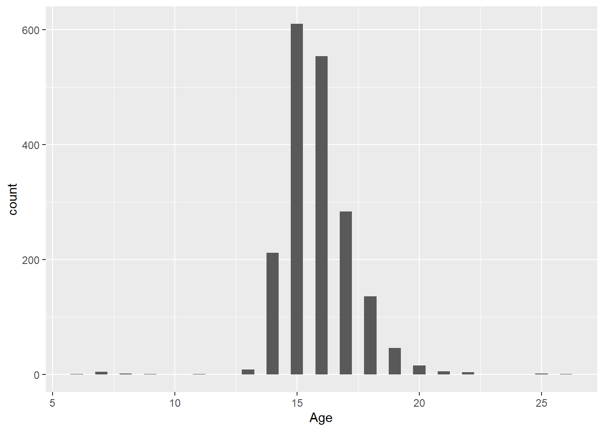

# (PART\*) Section 5 {.unnumbered}

# Overview {.unnumbered}

::: {style="color: #6D009D; font-size: 24px; font-weight: bold;text-align: justify;"}
Section 5: Data Visualisation
:::

::: ilos
**Learning Outcomes:**

-   ADD ILOS.
:::

**In this section, you will practice how to use the following functions:**

| Function |     Description      | Package |
|:--------:|:--------------------:|:-------:|
|  `c()`   | concatenate function | base R  |

::: attention
**WARNING 1:** Before proceeding to the exercises, ensure that you create and work in a RStudio project and that you **write** and **save** your answers to the exercises in an R script.

**WARNING 2:** To adequately develop your practical programming skills, it is **essential** that you attempt all exercises by typing out the code rather than simply copy-pasting the answers.
:::

# 1. The Dataset {.unnumbered}

This practical uses data from a longitudinal survey conducted by Camfed (international non-profit organisation) on educational challenges in Tanzania and Zimbabwe in 2013-2015. To learn more about Camfed and the work that they do, please <a href="https://camfed.org/" target="_blank">visit their website</a>. This dataset is hosted by the UK Data Service and can be downloaded from the \<a href="<a href="https://beta.ukdataservice.ac.uk/datacatalogue/studies/study?id=8335" target="_blank">visit their website</a> " target="\_blank"\>UK Data Service Website</a>.

In this practical, you will use a sample of data from the Camfed survey. Before you begin the tasks, you will need to download the `cfed_small.RDS` data file from the Section 5 learning materials on Blackboard and place it in your **data** subfolder in your RStudio project working directory. 

You will require the following packages for this session: `tidyverse`, `haven`, `gridExtra`, and `ggthemes`.  

# 2. Getting Started {.unnumbered}

<script>
document.addEventListener('DOMContentLoaded', function() {
    var codeBlocks = document.querySelectorAll('pre > code');

    codeBlocks.forEach(function(block) {
        // Check if the block's content starts with '##'
        if (block.textContent.trim().startsWith('##')) {
            var button = document.createElement('button');
            button.className = 'toggle-button';
            button.textContent = 'Show R Output';
            button.style.display = 'block'; // Ensure button is visible
            block.style.display = 'none'; // Initially hide the R output

            button.onclick = function() {
                if (block.style.display === 'none') {
                    block.style.display = 'block';
                    button.textContent = 'Hide R Output';
                } else {
                    block.style.display = 'none';
                    button.textContent = 'Show R Output';
                }
            };

            block.parentNode.insertBefore(button, block);
        }
    });
});
</script>

<script>
document.addEventListener('DOMContentLoaded', function() {
    var rComments = document.querySelectorAll('.r-comment');

    rComments.forEach(function(comment) {
        // Create the toggle button
        var button = document.createElement('button');
        button.className = 'toggle-comment-button';
        button.textContent = 'Show Explanation';
        button.style.display = 'block'; // Ensure button is visible
        comment.style.display = 'none'; // Initially hide the comment

        // Add click event listener to the button
        button.onclick = function() {
            if (comment.style.display === 'none') {
                comment.style.display = 'block'; // Adjust as needed
                button.textContent = 'Hide Explanation';
            } else {
                comment.style.display = 'none';
                button.textContent = 'Show Explanation';
            }
        };

        // Insert the button before the comment
        comment.parentNode.insertBefore(button, comment);
    });
});

</script>

Remember to adequately prepare for your new R session by loading all necessary packages. This is also an opportunity for you to install any packages you may need. 


```r
#Ensure that all of these packages are installed prior to loading

library(tidyverse)
library(haven)
library(gridExtra)
library(ggthemes)
```

Importing the data should be done only after you've installed and loaded all necessary packages.  

Import the `cfed_small.RDS` file and store it in an object called **camfed_sample**


```r
camfed_sample <-  readRDS("data/cfed_small.RDS")
```


# 3. Data Distributions {.unnumbered}

<script>
document.addEventListener('DOMContentLoaded', function() {
    var codeBlocks = document.querySelectorAll('pre > code');

    codeBlocks.forEach(function(block) {
        // Check if the block's content starts with '##'
        if (block.textContent.trim().startsWith('##')) {
            var button = document.createElement('button');
            button.className = 'toggle-button';
            button.textContent = 'Show R Output';
            button.style.display = 'block'; // Ensure button is visible
            block.style.display = 'none'; // Initially hide the R output

            button.onclick = function() {
                if (block.style.display === 'none') {
                    block.style.display = 'block';
                    button.textContent = 'Hide R Output';
                } else {
                    block.style.display = 'none';
                    button.textContent = 'Show R Output';
                }
            };

            block.parentNode.insertBefore(button, block);
        }
    });
});
</script>

<script>
document.addEventListener('DOMContentLoaded', function() {
    var rComments = document.querySelectorAll('.r-comment');

    rComments.forEach(function(comment) {
        // Create the toggle button
        var button = document.createElement('button');
        button.className = 'toggle-comment-button';
        button.textContent = 'Show Explanation';
        button.style.display = 'block'; // Ensure button is visible
        comment.style.display = 'none'; // Initially hide the comment

        // Add click event listener to the button
        button.onclick = function() {
            if (comment.style.display === 'none') {
                comment.style.display = 'block'; // Adjust as needed
                button.textContent = 'Hide Explanation';
            } else {
                comment.style.display = 'none';
                button.textContent = 'Show Explanation';
            }
        };

        // Insert the button before the comment
        comment.parentNode.insertBefore(button, comment);
    });
});

</script>


## 3.1 Task {-}

Use the correct `geom` to create a histogram of the **maths_score** variable with the `binwidth` set to 0.5. This variable, as the name implies, is a measure of the mathematical skills of the respondent.  


```r
ggplot(camfed_sample, aes(Age)) +
  geom_histogram(binwidth = 0.5)
```



:::question 
Based on the contents of the dataset, do you think this is a correct way to display the distribution of the **maths_score** variable? Why, or why not?
:::

::: {.r-comment style="display: none;"}
Given that the file contains data from two different countries, it would be inappropriate to display the distribution of age or any other variable without separating the data according to country. Otherwise, the visualisation would be meaningless.
:::

## 3.2 Task {-}

Use the correct geom to create a boxplot of the **work_support** variable and the **maths_score** variable in Tanzania. Label your plot as "Tanzania". The **work_support** variable ask the respondent how often they work to earn income for their family. Store this plot as an object and name it **work_Tanzania**. 

Perform the same task for Zimbabwe also. Store this plot as an object and name it **work_Zimbabwe**.


```r
work_Tanzania <- camfed_sample %>%
                  filter(Country == "Tanzania") %>%
                  ggplot(aes(work_support, maths_score)) +
                    geom_boxplot() +
                    labs(title = "Tanzania")

work_Zimbabwe <- camfed_sample %>%
                  filter(Country == "Zimbabwe") %>%
                  ggplot(aes(work_support, maths_score)) +
                    geom_boxplot() +
                    labs(title = "Zimbabwe")
```


## 3.3. Task {-}

Create a multipanel plot containing the two plots you created in 1.2 and 1.3 and specify the number of columns as 2. 


```r
grid.arrange(work_Zimbabwe, work_Tanzania, ncol = 2)
```


::: question
Are there any differences between the two countries?
:::

::: {.r-comment style="display: none;"}
At first glance, the two distributions do not seem to be very different, with the exception of larger number of outliers for Tanzania. However, the values on the Y axis are actually very different despite the identical appearance in format. Actually, the main feature distinguishing the two countries is the range of maths score values. Zimbabwe has lower overall scores than Tanzania that do not exceed 50. In contrast, students in Tanzania seem to perform better, with scores reaching 100. However, one important aspect to note is that all high scores are actually outliers; they do not conform to the overall trend. To better illustrate differences in maths scores betwen the two countries, both plots should have identical Y axis ranges; in this case, the Zimbabwe Y axis should range from 0 to 100 as well.
:::


# 4. Bar Charts {-}

<script>
document.addEventListener('DOMContentLoaded', function() {
    var codeBlocks = document.querySelectorAll('pre > code');

    codeBlocks.forEach(function(block) {
        // Check if the block's content starts with '##'
        if (block.textContent.trim().startsWith('##')) {
            var button = document.createElement('button');
            button.className = 'toggle-button';
            button.textContent = 'Show R Output';
            button.style.display = 'block'; // Ensure button is visible
            block.style.display = 'none'; // Initially hide the R output

            button.onclick = function() {
                if (block.style.display === 'none') {
                    block.style.display = 'block';
                    button.textContent = 'Hide R Output';
                } else {
                    block.style.display = 'none';
                    button.textContent = 'Show R Output';
                }
            };

            block.parentNode.insertBefore(button, block);
        }
    });
});
</script>

<script>
document.addEventListener('DOMContentLoaded', function() {
    var rComments = document.querySelectorAll('.r-comment');

    rComments.forEach(function(comment) {
        // Create the toggle button
        var button = document.createElement('button');
        button.className = 'toggle-comment-button';
        button.textContent = 'Show Explanation';
        button.style.display = 'block'; // Ensure button is visible
        comment.style.display = 'none'; // Initially hide the comment

        // Add click event listener to the button
        button.onclick = function() {
            if (comment.style.display === 'none') {
                comment.style.display = 'block'; // Adjust as needed
                button.textContent = 'Hide Explanation';
            } else {
                comment.style.display = 'none';
                button.textContent = 'Show Explanation';
            }
        };

        // Insert the button before the comment
        comment.parentNode.insertBefore(button, comment);
    });
});

</script>


## 4.1 Task {-}

Create a proportion bar chart of the `improvement` variable for Tanzania. This variable asks respondents whether they agree with the following statement: "When I get a bad mark I ask the teacher to explain what I need to improve".


```r
camfed_sample %>%
  filter(Country == "Tanzania") %>%
  ggplot(aes(improvement, y = ..prop.., group = 1)) +
  geom_bar()
```

```
## Warning: The dot-dot notation (`..prop..`) was deprecated in ggplot2 3.4.0.
## ℹ Please use `after_stat(prop)` instead.
## This warning is displayed once every 8 hours.
## Call `lifecycle::last_lifecycle_warnings()` to see where this warning was
## generated.
```


## 4.2 Task {-}

Create a bar chart to illustrate whether responses from Zimbabwe differ between males and females for the `learn_school` variable. This variable asks respondents whether it is important to them whether they are learning in school. Use `position = "dodge"` to display the plot bars next to one another.


```r
camfed_sample %>%
  filter(Country == "Tanzania") %>%
  ggplot(aes(improvement, y = ..prop.., group = 1)) +
  geom_bar()
```


## 4.3 Task {-}

Create a bar chart to illustrate gender differences in both Zimbabwe and Tanzania for the `school_imp` variable. The `school_imp` variable asks the respondent whether their parents or grandparents think it is important for them to attend and finish school. Display the two countries in columns and the two sex categories across rows. 


```r
ggplot(camfed_sample, aes(school_imp)) + 
  geom_bar()+
  facet_grid(Sex ~ Country)
```


# 5. Scatterplots {-}

<script>
document.addEventListener('DOMContentLoaded', function() {
    var codeBlocks = document.querySelectorAll('pre > code');

    codeBlocks.forEach(function(block) {
        // Check if the block's content starts with '##'
        if (block.textContent.trim().startsWith('##')) {
            var button = document.createElement('button');
            button.className = 'toggle-button';
            button.textContent = 'Show R Output';
            button.style.display = 'block'; // Ensure button is visible
            block.style.display = 'none'; // Initially hide the R output

            button.onclick = function() {
                if (block.style.display === 'none') {
                    block.style.display = 'block';
                    button.textContent = 'Hide R Output';
                } else {
                    block.style.display = 'none';
                    button.textContent = 'Show R Output';
                }
            };

            block.parentNode.insertBefore(button, block);
        }
    });
});
</script>

<script>
document.addEventListener('DOMContentLoaded', function() {
    var rComments = document.querySelectorAll('.r-comment');

    rComments.forEach(function(comment) {
        // Create the toggle button
        var button = document.createElement('button');
        button.className = 'toggle-comment-button';
        button.textContent = 'Show Explanation';
        button.style.display = 'block'; // Ensure button is visible
        comment.style.display = 'none'; // Initially hide the comment

        // Add click event listener to the button
        button.onclick = function() {
            if (comment.style.display === 'none') {
                comment.style.display = 'block'; // Adjust as needed
                button.textContent = 'Hide Explanation';
            } else {
                comment.style.display = 'none';
                button.textContent = 'Show Explanation';
            }
        };

        // Insert the button before the comment
        comment.parentNode.insertBefore(button, comment);
    });
});

</script>


## 5.1 Task {-}

Past research has shown that there is a relationship between language skills and mathematical skills in among learners in school. 

Use the appropriate geom to create a scatterplot to illustrate the relationship between mathematical skills (**maths_score**) and language skills (**english_score**) of respondents from **Zimbabwe**. Place the **english_score** variable on the X-axis and the **maths_score** variable on the Y-axis and set the transparency level to 0.5. 


```r
camfed_sample %>%
  filter(Country == "Zimbabwe") %>%
  ggplot(aes(english_score, maths_score)) +
  geom_point(alpha = 0.5)
```


## 5.2 Task {-}

Now create a new plot as above and add a smoother partitioned by color and line type according to the **Sex** variable. 


```r
camfed_sample %>%
  filter(Country == "Zimbabwe") %>%
  ggplot(aes(english_score, maths_score, linetype = Sex)) +
  geom_point(alpha = 0.5) +
  geom_smooth(aes(colour = Sex))
```

```
## `geom_smooth()` using method = 'loess' and formula = 'y ~ x'
```


## 5.3 Task {-}

Modify the plot you have just created as follows: 

- Main plot title: Maths and English Scores of Learners in a Zimbabwe Sample  

- Caption: Data - Camfed Tanzania and Zimbabwe 2013-15 Survey   

- X axis title = English Score   

- Y axis title = Mathematics Score   

- Place the legend at the bottom of the plot  

- Change the theme to `theme_clean()`.   


```r
camfed_sample %>%
  filter(Country == "Zimbabwe") %>%
  ggplot(aes(english_score, maths_score, linetype = Sex)) +
  geom_point(alpha = 0.5) +
  geom_smooth(aes(colour = Sex)) +
  labs(y = "Mathematics Score",
       x = "English Score",
       color = "Degree",
       linetype = "Degree",
       title = "Maths and English Scores of Learners in a Zimbabwe Sample",
       subtitle = "Physical health deteriorates with age",
       caption = "Data - Camfed Tanzania and Zimbabwe 2013-15 Survey") +
  theme(legend.position = "bottom") +
  theme_clean()
```

```
## `geom_smooth()` using method = 'loess' and formula = 'y ~ x'
```


