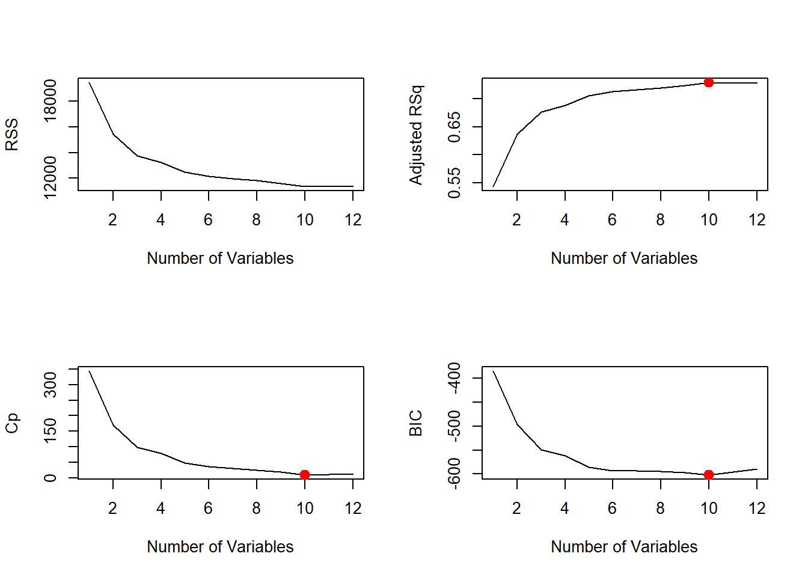
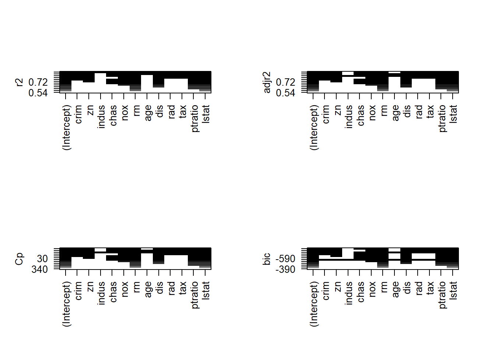

# Demonstration 1: Subset and Stepwise Selection {-}

::: file
For the tasks below, you will require the **Boston** dataset. This dataset is part of the `ISRL2` package from the core textbook (James et. al 2021).

You will also need the `leaps` package; please make sure to install and load it before you begin the practical.
:::

The goal of this demonstration is to predict median value of owner-occupied homes (**medv**) using all variables in the dataset. You should already be familiar with this dataset. To remind yourself of the variables it contains, type `?Boston` in your console after you load the `ISLR2` package.

Loading the packages: 


```r
library(ISLR2)
library(leaps)
```

## Best Subset Selection {-}

Best subset selection can be performed using the `regsubsets()` function from the `leaps` package. This function works by identifying the best model (quantified using the RSS) that contains a given number of predictors. The syntax is similar to other model fitting functions you have encountered so far in the course. 


```r
attach(Boston)
regfit.full <- regsubsets(medv ~ ., Boston)
```

Let's explore the results using `summary()`. 


```r
summary(regfit.full)
```

```
## Subset selection object
## Call: regsubsets.formula(medv ~ ., Boston)
## 12 Variables  (and intercept)
##         Forced in Forced out
## crim        FALSE      FALSE
## zn          FALSE      FALSE
## indus       FALSE      FALSE
## chas        FALSE      FALSE
## nox         FALSE      FALSE
## rm          FALSE      FALSE
## age         FALSE      FALSE
## dis         FALSE      FALSE
## rad         FALSE      FALSE
## tax         FALSE      FALSE
## ptratio     FALSE      FALSE
## lstat       FALSE      FALSE
## 1 subsets of each size up to 8
## Selection Algorithm: exhaustive
##          crim zn  indus chas nox rm  age dis rad tax ptratio lstat
## 1  ( 1 ) " "  " " " "   " "  " " " " " " " " " " " " " "     "*"  
## 2  ( 1 ) " "  " " " "   " "  " " "*" " " " " " " " " " "     "*"  
## 3  ( 1 ) " "  " " " "   " "  " " "*" " " " " " " " " "*"     "*"  
## 4  ( 1 ) " "  " " " "   " "  " " "*" " " "*" " " " " "*"     "*"  
## 5  ( 1 ) " "  " " " "   " "  "*" "*" " " "*" " " " " "*"     "*"  
## 6  ( 1 ) " "  " " " "   "*"  "*" "*" " " "*" " " " " "*"     "*"  
## 7  ( 1 ) " "  "*" " "   "*"  "*" "*" " " "*" " " " " "*"     "*"  
## 8  ( 1 ) "*"  "*" " "   "*"  "*" "*" " " "*" " " " " "*"     "*"
```

As you can see, the output does not contain any coefficients or related information. This is because the function performs an exhaustive model search to identify the best set of variables for each model size but does not actually fit each model.  

Here we see that the function produced models of up to 8 predictors (this is the default option for the function). An asterisk indicates that a given variable is included in the corresponding model; for example, the output indicates that the best two-variable model contains variables **rm** and **lstat**. 

The default option can be overridden such that the model search is performed with more than 8 variables by providing a value for the `nvmax` argument. Excluding the response variable, we have a total of 12 variables available in the dataset and so we set `nvmax` to 12. 


```r
regfit.full <- regsubsets(medv ~ ., Boston, nvmax = 12)
```

Now, it does not seem that `summary` provided much information. Actually, to extract relevant information about each model such as the r-squared, adjusted r-squared, Mallow's $C_p$, BIC, etc., we can assign the summary results to an object and then use the function on that object.


```r
reg.summary <- summary(regfit.full)
summary(reg.summary)
```

```
##        Length Class      Mode     
## which  156    -none-     logical  
## rsq     12    -none-     numeric  
## rss     12    -none-     numeric  
## adjr2   12    -none-     numeric  
## cp      12    -none-     numeric  
## bic     12    -none-     numeric  
## outmat 144    -none-     character
## obj     28    regsubsets list
```

Now, this object has additional information which we can access by using the $\$$ sign. For instance, we can obtain the $R^2$ statistic for each one of the 12 models.


```r
reg.summary$rsq
```

```
##  [1] 0.5441463 0.6385616 0.6786242 0.6903077 0.7080893 0.7157742 0.7196230
##  [8] 0.7236239 0.7282911 0.7342423 0.7342817 0.7343070
```

We can see that the $R^2$ increases from about $54\%$ (for the model with one variable) to about $73 \%$ (when all 12 predictors are included). But note that there is little difference in the $R^2$ from the model with 10 variable onward. As expected, the $R^2$ statistic increases monotonically as more variables are included. 

The `summary()` function also returns $R^2$, RSS, adjusted $R^2$, $C_p$, and BIC and we can examine these to try to select the *best* overall model.

Plotting RSS, adjusted $R^2$, $C_p$, and BIC for all of the models at once will help us decide which model to select. 


```r
#producing a multipanel plot on 2 rows and 2 columns

par(mfrow = c(2,2))

#plotting the RSS
plot(reg.summary$rss, xlab = "Number of Variables",
     ylab = "RSS", type = "l")

#plotting the adjusted r-squared
plot(reg.summary$adjr2, xlab = "Number of Variables",
     ylab = "Adjusted RSq", type = "l")

#finding the largest value for the adjusted r-squared
max_index_adjr2 <- which.max(reg.summary$adjr2)

#highlighting the largest value for the adjusted r-squared
points(max_index_adjr2 <- which.max(reg.summary$adjr2), 
       reg.summary$adjr2[max_index_adjr2], 
       col = "red", cex = 2, pch = 20)

#plotting Mallow's Cp

plot(reg.summary$cp, xlab = "Number of Variables",
     ylab = "Cp", type = "l")

#finding the lowest values for Mallow's Cp
min_index_Cp <- which.min(reg.summary$cp)

#highlighting the lowest value for Mallow's Cp

points(min_index_Cp, reg.summary$cp[min_index_Cp], 
       col = "red", cex = 2, pch = 20)

#plotting the BIC
plot(reg.summary$bic, xlab = "Number of Variables",
     ylab = "BIC", type = "l")

#finding the lowest values for the BIC
min_index_bic <- which.min(reg.summary$bic)

#highlighting the lowest value for the BIC
points(min_index_bic, reg.summary$bic[min_index_bic], 
       col = "red", cex = 2,pch = 20)
```



The `points()` command works like the `plot()` command, except that it adds points on a plot that has already been created. The `which.max()` or `which.min()` functions can be used to identify the location of the maximum and minimum point of a vector, respectively. To emphasise the maximum and minimum points, we plot a red dot.   

The `regsubsets()` function has a built-in `plot()` command which can be used to display the selected variables for the best model with a given number of predictors, ranked according to different measures. This type of plot is handy particularly when there are large number of variables. To find out more about this function, type `?plot.regsubsets`.  


```r
par(mfrow = c(2,2))

plot(regfit.full, scale = "r2")
plot(regfit.full, scale = "adjr2")
plot(regfit.full, scale = "Cp")
plot(regfit.full, scale = "bic")
```



The top row of each plot contains a black square for each variable selected according to the optimal model associated with that statistic; lower values indicate better models. The model with the lowest BIC is the ten-variable model with the following variables:  crim, zn, chas, nox, rm,  dis, rad, tax, ptratio and lstat. 

Now that we have selected our best model, we can extract coefficient estimates using the `coef()` function and proceed with our analysis.


```r
coef(regfit.full, 10)
```

```
##  (Intercept)         crim           zn         chas          nox           rm 
##  41.45174748  -0.12166488   0.04619119   2.87187265 -18.26242664   3.67295747 
##          dis          rad          tax      ptratio        lstat 
##  -1.51595105   0.28393226  -0.01229150  -0.93096144  -0.54650916
```

## Stepwise Selection {-}

We can also use the `regsubsets()` function to perform forward stepwise or backward stepwise selection, using the argument `method = "forward"` or `method = "backward"`.

**Forward Stepwise Selection**: 


```r
regfit.fwd <- regsubsets(medv ~ ., data = Boston,
                         nvmax = 12, method = "forward")
summary(regfit.fwd)
```

```
## Subset selection object
## Call: regsubsets.formula(medv ~ ., data = Boston, nvmax = 12, method = "forward")
## 12 Variables  (and intercept)
##         Forced in Forced out
## crim        FALSE      FALSE
## zn          FALSE      FALSE
## indus       FALSE      FALSE
## chas        FALSE      FALSE
## nox         FALSE      FALSE
## rm          FALSE      FALSE
## age         FALSE      FALSE
## dis         FALSE      FALSE
## rad         FALSE      FALSE
## tax         FALSE      FALSE
## ptratio     FALSE      FALSE
## lstat       FALSE      FALSE
## 1 subsets of each size up to 12
## Selection Algorithm: forward
##           crim zn  indus chas nox rm  age dis rad tax ptratio lstat
## 1  ( 1 )  " "  " " " "   " "  " " " " " " " " " " " " " "     "*"  
## 2  ( 1 )  " "  " " " "   " "  " " "*" " " " " " " " " " "     "*"  
## 3  ( 1 )  " "  " " " "   " "  " " "*" " " " " " " " " "*"     "*"  
## 4  ( 1 )  " "  " " " "   " "  " " "*" " " "*" " " " " "*"     "*"  
## 5  ( 1 )  " "  " " " "   " "  "*" "*" " " "*" " " " " "*"     "*"  
## 6  ( 1 )  " "  " " " "   "*"  "*" "*" " " "*" " " " " "*"     "*"  
## 7  ( 1 )  " "  "*" " "   "*"  "*" "*" " " "*" " " " " "*"     "*"  
## 8  ( 1 )  "*"  "*" " "   "*"  "*" "*" " " "*" " " " " "*"     "*"  
## 9  ( 1 )  "*"  "*" " "   "*"  "*" "*" " " "*" "*" " " "*"     "*"  
## 10  ( 1 ) "*"  "*" " "   "*"  "*" "*" " " "*" "*" "*" "*"     "*"  
## 11  ( 1 ) "*"  "*" " "   "*"  "*" "*" "*" "*" "*" "*" "*"     "*"  
## 12  ( 1 ) "*"  "*" "*"   "*"  "*" "*" "*" "*" "*" "*" "*"     "*"
```

For instance, we see that using forward stepwise selection, the best one-variable model contains only **lstat**, and the best two-variable model additionally includes **rm**. 

**Backward Stepwise Selection**: 


```r
regfit.bwd <- regsubsets(medv ~ ., data = Boston,
                         nvmax = 12, method = "backward")
summary(regfit.bwd)
```

```
## Subset selection object
## Call: regsubsets.formula(medv ~ ., data = Boston, nvmax = 12, method = "backward")
## 12 Variables  (and intercept)
##         Forced in Forced out
## crim        FALSE      FALSE
## zn          FALSE      FALSE
## indus       FALSE      FALSE
## chas        FALSE      FALSE
## nox         FALSE      FALSE
## rm          FALSE      FALSE
## age         FALSE      FALSE
## dis         FALSE      FALSE
## rad         FALSE      FALSE
## tax         FALSE      FALSE
## ptratio     FALSE      FALSE
## lstat       FALSE      FALSE
## 1 subsets of each size up to 12
## Selection Algorithm: backward
##           crim zn  indus chas nox rm  age dis rad tax ptratio lstat
## 1  ( 1 )  " "  " " " "   " "  " " " " " " " " " " " " " "     "*"  
## 2  ( 1 )  " "  " " " "   " "  " " "*" " " " " " " " " " "     "*"  
## 3  ( 1 )  " "  " " " "   " "  " " "*" " " " " " " " " "*"     "*"  
## 4  ( 1 )  " "  " " " "   " "  " " "*" " " "*" " " " " "*"     "*"  
## 5  ( 1 )  " "  " " " "   " "  "*" "*" " " "*" " " " " "*"     "*"  
## 6  ( 1 )  "*"  " " " "   " "  "*" "*" " " "*" " " " " "*"     "*"  
## 7  ( 1 )  "*"  " " " "   " "  "*" "*" " " "*" "*" " " "*"     "*"  
## 8  ( 1 )  "*"  " " " "   " "  "*" "*" " " "*" "*" "*" "*"     "*"  
## 9  ( 1 )  "*"  "*" " "   " "  "*" "*" " " "*" "*" "*" "*"     "*"  
## 10  ( 1 ) "*"  "*" " "   "*"  "*" "*" " " "*" "*" "*" "*"     "*"  
## 11  ( 1 ) "*"  "*" " "   "*"  "*" "*" "*" "*" "*" "*" "*"     "*"  
## 12  ( 1 ) "*"  "*" "*"   "*"  "*" "*" "*" "*" "*" "*" "*"     "*"
```

If we compare the output from the forward and backward stepwise selection based on the asterisks, we can see that forward and backward stepwise selection yield identical models for those with 1 to five and 10, 11 and (obviously) 12 variables. However, the models with 6 to 9 variables are different. 

For example, if we have a look at the 6-model variables, we can see that not only do the variables differ but evidently, that the coefficients differ. If we compare the stepwise selection results with the best subset selection model also, we can see that the results from best subset and forward stepwise selection are the same for these data. 


```r
coef(regfit.fwd, 6)
```

```
## (Intercept)        chas         nox          rm         dis     ptratio 
##  36.9226340   3.2443048 -18.7404327   4.1118117  -1.1445857  -1.0027463 
##       lstat 
##  -0.5698442
```

```r
coef(regfit.bwd, 6)
```

```
##  (Intercept)         crim          nox           rm          dis      ptratio 
##  35.54553027  -0.07202363 -17.00665420   4.25196130  -1.20334533  -1.00080347 
##        lstat 
##  -0.55353166
```

```r
coef(regfit.full, 6)
```

```
## (Intercept)        chas         nox          rm         dis     ptratio 
##  36.9226340   3.2443048 -18.7404327   4.1118117  -1.1445857  -1.0027463 
##       lstat 
##  -0.5698442
```


## Choosing Among Models Using the Validation-Set Approach and Cross-Validation {-}

As discussed in the learning materials, we can use different measures such as $C_p$ and BIC to select one model from among a set of models of different sizes.

However, to obtain accurate estimates of the test error through resampling methods, it is crucial that we perform all steps related to model fitting (including variable selection) only on training observations. In other words, to determine which model of a given size is best, we must consider only the training observations. 

### The Validation Set Approach {-}

Let's first consider the validation set approach. We split the data into training and test sets. 


```r
set.seed(1)
train <- sample(c(TRUE, FALSE), nrow(Boston), replace = TRUE)
test <- (!train)
```

And only once we have done that, we apply `regsubsets()` to the training set to perform best subset selection.


```r
regfit.best <- regsubsets(medv ~ ., data = Boston[train, ], nvmax = 12)
```

Let's now compute the validation set error for the best model of each model size. We first make a model matrix from the test data.


```r
test.mat <- model.matrix(medv ~ ., data = Boston[test, ])
```

The`model.matrix()` function from the built-in `stats` package can be used for building an "X" matrix from data.  Now we run a loop, and for each size `i`, we extract the coefficients from `regfit.best` for the best model of that size,  multiply them into
the appropriate columns of the test model matrix to form the predictions, and compute the test MSE.


```r
val.errors <- rep(NA, 12)
for (i in 1:12) {
 coefi <- coef(regfit.best, id = i)
 pred <- test.mat[, names(coefi)] %*% coefi
 val.errors[i] <- mean((Boston$medv[test] - pred)^2)
}
```

We find that the best model is the one that contains ten variables.


```r
val.errors
```

```
##  [1] 34.80258 27.60874 24.56211 23.50839 21.52928 21.08942 20.83503 20.45645
##  [9] 20.21655 19.66630 19.77416 19.79268
```

```r
which.min(val.errors)
```

```
## [1] 10
```

```r
coef(regfit.best, 10)
```

```
##  (Intercept)         crim           zn         chas          nox           rm 
##  40.32858935  -0.13566265   0.05194674   3.52712484 -16.35131034   3.68720921 
##          dis          rad          tax      ptratio        lstat 
##  -1.42553389   0.27680029  -0.01097970  -0.93449308  -0.57986120
```

Since we will be using this function again, we can capture our steps above and write our own predict method (the reason is that there is no `predict()` method for `regsubsets()`)


```r
 predict.regsubsets <- function(object, newdata, id, ...) {
  form <- as.formula(object$call[[2]])
  mat <- model.matrix(form, newdata)
  coefi <- coef(object, id = id)
  xvars <- names(coefi)
  mat[, xvars] %*% coefi
 }
```

This function pretty much mimics what we did in the previous steps. The only complex part is how we extracted the formula used in the call to `regsubsets()`. 

Finally, we perform best subset selection on the full data set, and select the best 10-variable model. It is important that we make use of the full data set in order to obtain more accurate coefficient estimates. Note that we perform best subset selection on the full data set and select the best 10-variable model, rather than simply using the variables that were obtained from the training set, because the best 10-variable model on the full data set may differ from the corresponding model on the training set.


```r
regfit.best <- regsubsets(medv ~ ., data = Boston,
    nvmax = 12)
coef(regfit.best, 10)
```

```
##  (Intercept)         crim           zn         chas          nox           rm 
##  41.45174748  -0.12166488   0.04619119   2.87187265 -18.26242664   3.67295747 
##          dis          rad          tax      ptratio        lstat 
##  -1.51595105   0.28393226  -0.01229150  -0.93096144  -0.54650916
```

In fact, we see that for these data, the best 10-variable model on the full data set has the same set of variables as the best 10-variable model on the training set.

### Cross-validation {-}

We now try to choose among the models of different sizes using cross-validation which involves performing best subset selection *within each of the $k$ training sets*.
Despite this, we see that with its clever subsetting syntax, `R` makes this job quite easy. First, we create a  vector that allocates each observation to one of $k=10$ folds, and we create a matrix in which we will store the results.


```r
k <- 10
n <- nrow(Boston)
set.seed(1)
folds <- sample(rep(1:k, length = n))
cv.errors <- matrix(NA, k, 12,
                    dimnames = list(NULL, paste(1:12)))
```

Now we write a for loop that performs cross-validation. In the $j$th fold, the elements of `folds` that equal `j` are in the test set, and the remainder are in the training set. We make our predictions for each model size (using our new `predict()` method), compute the test errors on the appropriate subset, and store them in the appropriate slot in the matrix `cv.errors`. Note that in the following code `R` will automatically use our `predict.regsubsets()` function when we call `predict()` because the `best.fit` object has class `regsubsets`.


```r
for (j in 1:k) {
  best.fit <- regsubsets(medv ~ .,
       data = Boston[folds != j, ],
       nvmax = 12)
  for (i in 1:12) {
    pred <- predict(best.fit, Boston[folds == j, ], id = i)
    cv.errors[j, i] <-
         mean((Boston$medv[folds == j] - pred)^2)
   }
 }
```

This has given us a $10 \times 12$ matrix, of which the $(j,i)$th element  corresponds to the test MSE for the $j$th cross-validation fold for the best $i$-variable model. We use the `apply()` function to average over the columns of this matrix in order to obtain a vector for which the $i$th element is the cross-validation error for the $i$-variable model.


```r
mean.cv.errors <- apply(cv.errors, 2, mean)
mean.cv.errors
```

```
##        1        2        3        4        5        6        7        8 
## 38.78478 31.10456 27.77372 27.50234 25.49326 24.89269 25.17946 25.35254 
##        9       10       11       12 
## 24.99038 23.75908 23.89258 23.91715
```

```r
par(mfrow = c(1, 1))
plot(mean.cv.errors, type = "b")
```


We see that cross-validation selects a 10-variable model. We now perform best subset selection on the full data set in order to obtain the 10-variable model and proceed with our analysis.


```r
reg.best <- regsubsets(medv ~ ., data = Boston, nvmax = 12)
coef(reg.best, 10)
```

```
##  (Intercept)         crim           zn         chas          nox           rm 
##  41.45174748  -0.12166488   0.04619119   2.87187265 -18.26242664   3.67295747 
##          dis          rad          tax      ptratio        lstat 
##  -1.51595105   0.28393226  -0.01229150  -0.93096144  -0.54650916
```

