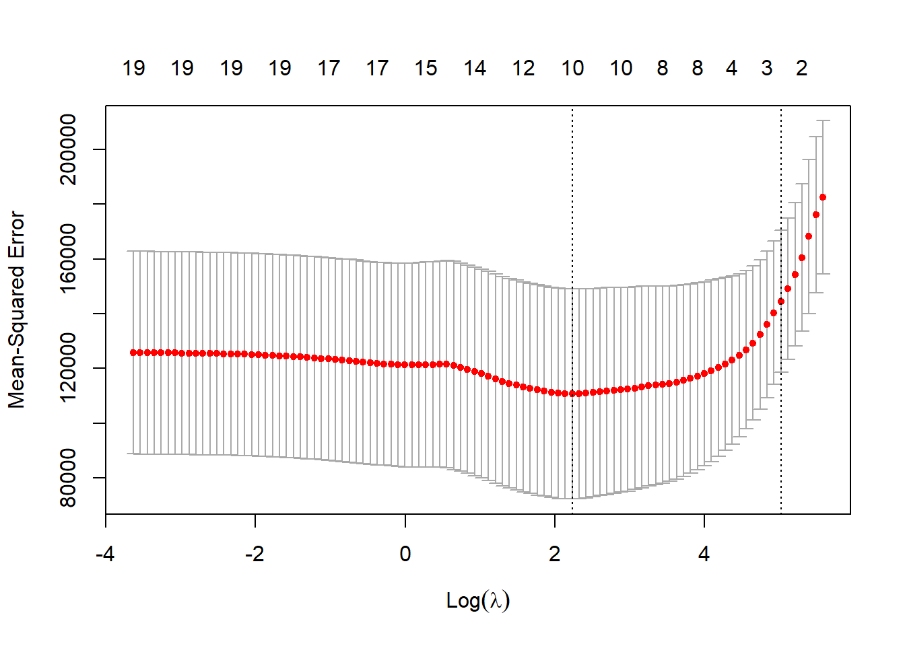

# Demonstration 2: Regularisation {-}

::: file
For the tasks below, you require the **Hitters** dataset from the `ISRL2` package.

You will also need the `glmnet` package; please make sure to install and load it before you begin the practical.
:::

The **Hitters** dataset contains Major League Baseball Data from the 1986 and 1987 season. It is a dataframe with 322 observations and 20 variables. To learn more about the variables, type `?Hitters` in your console. 

The goal of this demonstration is to predict salary of major league players using ridge regression and lasso.

Loading the required packages: 


```r
library(ISLR2)
library(glmnet)
```

## Ridge Regression {-}

Before we proceed, we must check whether the dataset has any missing values. 


```r
attach(Hitters)
sum(is.na(Hitters$Salary))
```

```
## [1] 59
```

We see that `Salary` is missing for $59$ players and so we must remove it before the analysis.


```r
Hitters <- na.omit(Hitters)
sum(is.na(Hitters))
```

```
## [1] 0
```

In R, we can use the `glmnet` package to perform ridge regression (amongst many other types of models, including lasso). This function works slightly differently to the other model fitting functions we have covered so far in the course. This is because the `glmnet()` function does not accept a formula-based specification (i.e. `y ~ x`) since it only takes numerical, quantitative inputs. Therefore, instead of a formula, it requires the predictors to be specified as a matrix `x` and the response as a separate object `y`.   

Therefore, we need to prepare our data adequately before performing regularisation. The `model.matrix()` function from the built-in `stats` package is useful for creating our matrix `x`. This function produces a matrix of all predictors (in this case, 12) and automatically transforms any factor variables into dummy variables. 


```r
x <- model.matrix(Salary ~ ., Hitters)
x
```

```
##                    (Intercept) AtBat Hits HmRun Runs RBI Walks Years CAtBat
## -Alan Ashby                  1   315   81     7   24  38    39    14   3449
## -Alvin Davis                 1   479  130    18   66  72    76     3   1624
## -Andre Dawson                1   496  141    20   65  78    37    11   5628
## -Andres Galarraga            1   321   87    10   39  42    30     2    396
## -Alfredo Griffin             1   594  169     4   74  51    35    11   4408
## -Al Newman                   1   185   37     1   23   8    21     2    214
## -Argenis Salazar             1   298   73     0   24  24     7     3    509
## -Andres Thomas               1   323   81     6   26  32     8     2    341
## -Andre Thornton              1   401   92    17   49  66    65    13   5206
## -Alan Trammell               1   574  159    21  107  75    59    10   4631
## -Alex Trevino                1   202   53     4   31  26    27     9   1876
## -Andy VanSlyke               1   418  113    13   48  61    47     4   1512
## -Alan Wiggins                1   239   60     0   30  11    22     6   1941
## -Bill Almon                  1   196   43     7   29  27    30    13   3231
## -Buddy Bell                  1   568  158    20   89  75    73    15   8068
## -Buddy Biancalana            1   190   46     2   24   8    15     5    479
## -Bruce Bochy                 1   127   32     8   16  22    14     8    727
## -Barry Bonds                 1   413   92    16   72  48    65     1    413
## -Bobby Bonilla               1   426  109     3   55  43    62     1    426
## -Bob Brenly                  1   472  116    16   60  62    74     6   1924
## -Bill Buckner                1   629  168    18   73 102    40    18   8424
## -Brett Butler                1   587  163     4   92  51    70     6   2695
## -Bob Dernier                 1   324   73     4   32  18    22     7   1931
## -Bo Diaz                     1   474  129    10   50  56    40    10   2331
## -Bill Doran                  1   550  152     6   92  37    81     5   2308
## -Brian Downing               1   513  137    20   90  95    90    14   5201
## -Billy Hatcher               1   419  108     6   55  36    22     3    591
## -Brook Jacoby                1   583  168    17   83  80    56     5   1646
## -Bob Kearney                 1   204   49     6   23  25    12     7   1309
## -Bill Madlock                1   379  106    10   38  60    30    14   6207
## -Bob Melvin                  1   268   60     5   24  25    15     2    350
## -BillyJo Robidoux            1   181   41     1   15  21    33     2    232
## -Bill Schroeder              1   217   46     7   32  19     9     4    694
## -Chris Bando                 1   254   68     2   28  26    22     6    999
## -Chris Brown                 1   416  132     7   57  49    33     3    932
## -Carmen Castillo             1   205   57     8   34  32     9     5    756
## -Chili Davis                 1   526  146    13   71  70    84     6   2648
## -Carlton Fisk                1   457  101    14   42  63    22    17   6521
## -Curt Ford                   1   214   53     2   30  29    23     2    226
## -Carney Lansford             1   591  168    19   80  72    39     9   4478
## -Chet Lemon                  1   403  101    12   45  53    39    12   5150
## -Candy Maldonado             1   405  102    18   49  85    20     6    950
## -Carmelo Martinez            1   244   58     9   28  25    35     4   1335
## -Craig Reynolds              1   313   78     6   32  41    12    12   3742
## -Cal Ripken                  1   627  177    25   98  81    70     6   3210
## -Cory Snyder                 1   416  113    24   58  69    16     1    416
## -Chris Speier                1   155   44     6   21  23    15    16   6631
## -Curt Wilkerson              1   236   56     0   27  15    11     4   1115
## -Dave Anderson               1   216   53     1   31  15    22     4    926
## -Don Baylor                  1   585  139    31   93  94    62    17   7546
## -Daryl Boston                1   199   53     5   29  22    21     3    514
## -Darnell Coles               1   521  142    20   67  86    45     4    815
## -Dave Concepcion             1   311   81     3   42  30    26    17   8247
## -Doug DeCinces               1   512  131    26   69  96    52    14   5347
## -Darrell Evans               1   507  122    29   78  85    91    18   7761
## -Dwight Evans                1   529  137    26   86  97    97    15   6661
## -Damaso Garcia               1   424  119     6   57  46    13     9   3651
## -Dan Gladden                 1   351   97     4   55  29    39     4   1258
## -Dave Henderson              1   388  103    15   59  47    39     6   2174
## -Donnie Hill                 1   339   96     4   37  29    23     4   1064
## -Davey Lopes                 1   255   70     7   49  35    43    15   6311
## -Don Mattingly               1   677  238    31  117 113    53     5   2223
## -Dale Murphy                 1   614  163    29   89  83    75    11   5017
## -Dwayne Murphy               1   329   83     9   50  39    56     9   3828
## -Dave Parker                 1   637  174    31   89 116    56    14   6727
## -Dan Pasqua                  1   280   82    16   44  45    47     2    428
## -Darrell Porter              1   155   41    12   21  29    22    16   5409
## -Dick Schofield              1   458  114    13   67  57    48     4   1350
## -Don Slaught                 1   314   83    13   39  46    16     5   1457
## -Darryl Strawberry           1   475  123    27   76  93    72     4   1810
## -Dale Sveum                  1   317   78     7   35  35    32     1    317
## -Danny Tartabull             1   511  138    25   76  96    61     3    592
## -Denny Walling               1   382  119    13   54  58    36    12   2133
## -Dave Winfield               1   565  148    24   90 104    77    14   7287
## -Eric Davis                  1   415  115    27   97  71    68     3    711
## -Eddie Milner                1   424  110    15   70  47    36     7   2130
## -Eddie Murray                1   495  151    17   61  84    78    10   5624
## -Ed Romero                   1   233   49     2   41  23    18     8   1350
## -Frank White                 1   566  154    22   76  84    43    14   6100
## -George Bell                 1   641  198    31  101 108    41     5   2129
## -Glenn Braggs                1   215   51     4   19  18    11     1    215
## -George Brett                1   441  128    16   70  73    80    14   6675
## -Greg Brock                  1   325   76    16   33  52    37     5   1506
## -Gary Carter                 1   490  125    24   81 105    62    13   6063
## -Glenn Davis                 1   574  152    31   91 101    64     3    985
## -Gary Gaetti                 1   596  171    34   91 108    52     6   2862
## -Greg Gagne                  1   472  118    12   63  54    30     4    793
## -George Hendrick             1   283   77    14   45  47    26    16   6840
## -Glenn Hubbard               1   408   94     4   42  36    66     9   3573
## -Garth Iorg                  1   327   85     3   30  44    20     8   2140
## -Gary Matthews               1   370   96    21   49  46    60    15   6986
## -Graig Nettles               1   354   77    16   36  55    41    20   8716
## -Gary Pettis                 1   539  139     5   93  58    69     5   1469
## -Gary Redus                  1   340   84    11   62  33    47     5   1516
## -Garry Templeton             1   510  126     2   42  44    35    11   5562
## -Greg Walker                 1   282   78    13   37  51    29     5   1649
## -Gary Ward                   1   380  120     5   54  51    31     8   3118
## -Glenn Wilson                1   584  158    15   70  84    42     5   2358
## -Harold Baines               1   570  169    21   72  88    38     7   3754
## -Hubie Brooks                1   306  104    14   50  58    25     7   2954
## -Howard Johnson              1   220   54    10   30  39    31     5   1185
## -Hal McRae                   1   278   70     7   22  37    18    18   7186
## -Harold Reynolds             1   445   99     1   46  24    29     4    618
## -Harry Spilman               1   143   39     5   18  30    15     9    639
## -Herm Winningham             1   185   40     4   23  11    18     3    524
## -Jesse Barfield              1   589  170    40  107 108    69     6   2325
## -Juan Beniquez               1   343  103     6   48  36    40    15   4338
## -John Cangelosi              1   438  103     2   65  32    71     2    440
## -Jose Canseco                1   600  144    33   85 117    65     2    696
## -Joe Carter                  1   663  200    29  108 121    32     4   1447
## -Jack Clark                  1   232   55     9   34  23    45    12   4405
## -Jose Cruz                   1   479  133    10   48  72    55    17   7472
## -Jody Davis                  1   528  132    21   61  74    41     6   2641
## -Jim Dwyer                   1   160   39     8   18  31    22    14   2128
## -Julio Franco                1   599  183    10   80  74    32     5   2482
## -Jim Gantner                 1   497  136     7   58  38    26    11   3871
## -Johnny Grubb                1   210   70    13   32  51    28    15   4040
## -Jack Howell                 1   151   41     4   26  21    19     2    288
## -John Kruk                   1   278   86     4   33  38    45     1    278
## -Jeffrey Leonard             1   341   95     6   48  42    20    10   2964
## -Jim Morrison                1   537  147    23   58  88    47    10   2744
## -John Moses                  1   399  102     3   56  34    34     5    670
## -Jerry Mumphrey              1   309   94     5   37  32    26    13   4618
## -Jim Presley                 1   616  163    27   83 107    32     3   1437
## -Johnny Ray                  1   579  174     7   67  78    58     6   3053
## -Jeff Reed                   1   165   39     2   13   9    16     3    196
## -Jim Rice                    1   618  200    20   98 110    62    13   7127
## -Jerry Royster               1   257   66     5   31  26    32    14   3910
## -John Russell                1   315   76    13   35  60    25     3    630
## -Juan Samuel                 1   591  157    16   90  78    26     4   2020
## -John Shelby                 1   404   92    11   54  49    18     6   1354
## -Joel Skinner                1   315   73     5   23  37    16     4    450
## -Jim Sundberg                1   429   91    12   41  42    57    13   5590
## -Jose Uribe                  1   453  101     3   46  43    61     3    948
## -Joel Youngblood             1   184   47     5   20  28    18    11   3327
## -Kevin Bass                  1   591  184    20   83  79    38     5   1689
## -Kal Daniels                 1   181   58     6   34  23    22     1    181
## -Kirk Gibson                 1   441  118    28   84  86    68     8   2723
## -Ken Griffey                 1   490  150    21   69  58    35    14   6126
## -Keith Hernandez             1   551  171    13   94  83    94    13   6090
## -Kent Hrbek                  1   550  147    29   85  91    71     6   2816
## -Ken Landreaux               1   283   74     4   34  29    22    10   3919
## -Kevin McReynolds            1   560  161    26   89  96    66     4   1789
## -Kevin Mitchell              1   328   91    12   51  43    33     2    342
## -Keith Moreland              1   586  159    12   72  79    53     9   3082
## -Ken Oberkfell               1   503  136     5   62  48    83    10   3423
## -Ken Phelps                  1   344   85    24   69  64    88     7    911
## -Kirby Puckett               1   680  223    31  119  96    34     3   1928
## -Kurt Stillwell              1   279   64     0   31  26    30     1    279
## -Leon Durham                 1   484  127    20   66  65    67     7   3006
## -Len Dykstra                 1   431  127     8   77  45    58     2    667
## -Larry Herndon               1   283   70     8   33  37    27    12   4479
## -Lee Lacy                    1   491  141    11   77  47    37    15   4291
## -Len Matuszek                1   199   52     9   26  28    21     6    805
## -Lloyd Moseby                1   589  149    21   89  86    64     7   3558
## -Lance Parrish               1   327   84    22   53  62    38    10   4273
## -Larry Parrish               1   464  128    28   67  94    52    13   5829
## -Larry Sheets                1   338   92    18   42  60    21     3    682
## -Lou Whitaker                1   584  157    20   95  73    63    10   4704
## -Mike Aldrete                1   216   54     2   27  25    33     1    216
## -Marty Barrett               1   625  179     4   94  60    65     5   1696
## -Mike Davis                  1   489  131    19   77  55    34     7   2051
## -Mike Diaz                   1   209   56    12   22  36    19     2    216
## -Mariano Duncan              1   407   93     8   47  30    30     2    969
## -Mike Easler                 1   490  148    14   64  78    49    13   3400
## -Mel Hall                    1   442  131    18   68  77    33     6   1416
## -Mike Heath                  1   288   65     8   30  36    27     9   2815
## -Mike Kingery                1   209   54     3   25  14    12     1    209
## -Mike LaValliere             1   303   71     3   18  30    36     3    344
## -Mike Marshall               1   330   77    19   47  53    27     6   1928
## -Mike Pagliarulo             1   504  120    28   71  71    54     3   1085
## -Mark Salas                  1   258   60     8   28  33    18     3    638
## -Mike Schmidt                1    20    1     0    0   0     0     2     41
## -Mike Scioscia               1   374   94     5   36  26    62     7   1968
## -Mickey Tettleton            1   211   43    10   26  35    39     3    498
## -Milt Thompson               1   299   75     6   38  23    26     3    580
## -Mitch Webster               1   576  167     8   89  49    57     4    822
## -Mookie Wilson               1   381  110     9   61  45    32     7   3015
## -Marvell Wynne               1   288   76     7   34  37    15     4   1644
## -Mike Young                  1   369   93     9   43  42    49     5   1258
## -Ozzie Guillen               1   547  137     2   58  47    12     2   1038
## -Oddibe McDowell             1   572  152    18  105  49    65     2    978
## -Ozzie Smith                 1   514  144     0   67  54    79     9   4739
## -Ozzie Virgil                1   359   80    15   45  48    63     7   1493
## -Phil Bradley                1   526  163    12   88  50    77     4   1556
## -Phil Garner                 1   313   83     9   43  41    30    14   5885
## -Pete Incaviglia             1   540  135    30   82  88    55     1    540
## -Paul Molitor                1   437  123     9   62  55    40     9   4139
## -Pete Rose                   1   237   52     0   15  25    30    24  14053
## -Pat Sheridan                1   236   56     6   41  19    21     5   1257
## -Pat Tabler                  1   473  154     6   61  48    29     6   1966
## -Rafael Belliard             1   309   72     0   33  31    26     5    354
## -Rick Burleson               1   271   77     5   35  29    33    12   4933
## -Randy Bush                  1   357   96     7   50  45    39     5   1394
## -Rick Cerone                 1   216   56     4   22  18    15    12   2796
## -Ron Cey                     1   256   70    13   42  36    44    16   7058
## -Rob Deer                    1   466  108    33   75  86    72     3    652
## -Rick Dempsey                1   327   68    13   42  29    45    18   3949
## -Ron Hassey                  1   341  110     9   45  49    46     9   2331
## -Rickey Henderson            1   608  160    28  130  74    89     8   4071
## -Reggie Jackson              1   419  101    18   65  58    92    20   9528
## -Ron Kittle                  1   376   82    21   42  60    35     5   1770
## -Ray Knight                  1   486  145    11   51  76    40    11   3967
## -Rick Leach                  1   246   76     5   35  39    13     6    912
## -Rick Manning                1   205   52     8   31  27    17    12   5134
## -Rance Mulliniks             1   348   90    11   50  45    43    10   2288
## -Ron Oester                  1   523  135     8   52  44    52     9   3368
## -Rey Quinones                1   312   68     2   32  22    24     1    312
## -Rafael Ramirez              1   496  119     8   57  33    21     7   3358
## -Ronn Reynolds               1   126   27     3    8  10     5     4    239
## -Ron Roenicke                1   275   68     5   42  42    61     6    961
## -Ryne Sandberg               1   627  178    14   68  76    46     6   3146
## -Rafael Santana              1   394   86     1   38  28    36     4   1089
## -Rick Schu                   1   208   57     8   32  25    18     3    653
## -Ruben Sierra                1   382  101    16   50  55    22     1    382
## -Roy Smalley                 1   459  113    20   59  57    68    12   5348
## -Robby Thompson              1   549  149     7   73  47    42     1    549
## -Rob Wilfong                 1   288   63     3   25  33    16    10   2682
## -Robin Yount                 1   522  163     9   82  46    62    13   7037
## -Steve Balboni               1   512  117    29   54  88    43     6   1750
## -Scott Bradley               1   220   66     5   20  28    13     3    290
## -Sid Bream                   1   522  140    16   73  77    60     4    730
## -Steve Buechele              1   461  112    18   54  54    35     2    680
## -Shawon Dunston              1   581  145    17   66  68    21     2    831
## -Scott Fletcher              1   530  159     3   82  50    47     6   1619
## -Steve Garvey                1   557  142    21   58  81    23    18   8759
## -Steve Jeltz                 1   439   96     0   44  36    65     4    711
## -Steve Lombardozzi           1   453  103     8   53  33    52     2    507
## -Spike Owen                  1   528  122     1   67  45    51     4   1716
## -Steve Sax                   1   633  210     6   91  56    59     6   3070
## -Tony Bernazard              1   562  169    17   88  73    53     8   3181
## -Tom Brookens                1   281   76     3   42  25    20     8   2658
## -Tom Brunansky               1   593  152    23   69  75    53     6   2765
## -Tony Fernandez              1   687  213    10   91  65    27     4   1518
## -Tim Flannery                1   368  103     3   48  28    54     8   1897
## -Tom Foley                   1   263   70     1   26  23    30     4    888
## -Tony Gwynn                  1   642  211    14  107  59    52     5   2364
## -Terry Harper                1   265   68     8   26  30    29     7   1337
## -Tommy Herr                  1   559  141     2   48  61    73     8   3162
## -Tim Hulett                  1   520  120    17   53  44    21     4    927
## -Terry Kennedy               1    19    4     1    2   3     1     1     19
## -Tito Landrum                1   205   43     2   24  17    20     7    854
## -Tim Laudner                 1   193   47    10   21  29    24     6   1136
## -Tom Paciorek                1   213   61     4   17  22     3    17   4061
## -Tony Pena                   1   510  147    10   56  52    53     7   2872
## -Terry Pendleton             1   578  138     1   56  59    34     3   1399
## -Tony Phillips               1   441  113     5   76  52    76     5   1546
## -Terry Puhl                  1   172   42     3   17  14    15    10   4086
## -Ted Simmons                 1   127   32     4   14  25    12    19   8396
## -Tim Teufel                  1   279   69     4   35  31    32     4   1359
## -Tim Wallach                 1   480  112    18   50  71    44     7   3031
## -Vince Coleman               1   600  139     0   94  29    60     2   1236
## -Von Hayes                   1   610  186    19  107  98    74     6   2728
## -Vance Law                   1   360   81     5   37  44    37     7   2268
## -Wally Backman               1   387  124     1   67  27    36     7   1775
## -Wade Boggs                  1   580  207     8  107  71   105     5   2778
## -Will Clark                  1   408  117    11   66  41    34     1    408
## -Wally Joyner                1   593  172    22   82 100    57     1    593
## -Willie McGee                1   497  127     7   65  48    37     5   2703
## -Willie Randolph             1   492  136     5   76  50    94    12   5511
## -Wayne Tolleson              1   475  126     3   61  43    52     6   1700
## -Willie Upshaw               1   573  144     9   85  60    78     8   3198
## -Willie Wilson               1   631  170     9   77  44    31    11   4908
##                    CHits CHmRun CRuns CRBI CWalks LeagueN DivisionW PutOuts
## -Alan Ashby          835     69   321  414    375       1         1     632
## -Alvin Davis         457     63   224  266    263       0         1     880
## -Andre Dawson       1575    225   828  838    354       1         0     200
## -Andres Galarraga    101     12    48   46     33       1         0     805
## -Alfredo Griffin    1133     19   501  336    194       0         1     282
## -Al Newman            42      1    30    9     24       1         0      76
## -Argenis Salazar     108      0    41   37     12       0         1     121
## -Andres Thomas        86      6    32   34      8       1         1     143
## -Andre Thornton     1332    253   784  890    866       0         0       0
## -Alan Trammell      1300     90   702  504    488       0         0     238
## -Alex Trevino        467     15   192  186    161       1         1     304
## -Andy VanSlyke       392     41   205  204    203       1         0     211
## -Alan Wiggins        510      4   309  103    207       0         0     121
## -Bill Almon          825     36   376  290    238       1         0      80
## -Buddy Bell         2273    177  1045  993    732       1         1     105
## -Buddy Biancalana    102      5    65   23     39       0         1     102
## -Bruce Bochy         180     24    67   82     56       1         1     202
## -Barry Bonds          92     16    72   48     65       1         0     280
## -Bobby Bonilla       109      3    55   43     62       0         1     361
## -Bob Brenly          489     67   242  251    240       1         1     518
## -Bill Buckner       2464    164  1008 1072    402       0         0    1067
## -Brett Butler        747     17   442  198    317       0         0     434
## -Bob Dernier         491     13   291  108    180       1         0     222
## -Bo Diaz             604     61   246  327    166       1         1     732
## -Bill Doran          633     32   349  182    308       1         1     262
## -Brian Downing      1382    166   763  734    784       0         1     267
## -Billy Hatcher       149      8    80   46     31       1         1     226
## -Brook Jacoby        452     44   219  208    136       0         0     109
## -Bob Kearney         308     27   126  132     66       0         1     419
## -Bill Madlock       1906    146   859  803    571       1         1      72
## -Bob Melvin           78      5    34   29     18       1         1     442
## -BillyJo Robidoux     50      4    20   29     45       0         0     326
## -Bill Schroeder      160     32    86   76     32       0         0     307
## -Chris Bando         236     21   108  117    118       0         0     359
## -Chris Brown         273     24   113  121     80       1         1      73
## -Carmen Castillo     192     32   117  107     51       0         0      58
## -Chili Davis         715     77   352  342    289       1         1     303
## -Carlton Fisk       1767    281  1003  977    619       0         1     389
## -Curt Ford            59      2    32   32     27       1         0     109
## -Carney Lansford    1307    113   634  563    319       0         1      67
## -Chet Lemon         1429    166   747  666    526       0         0     316
## -Candy Maldonado     231     29    99  138     64       1         1     161
## -Carmelo Martinez    333     49   164  179    194       1         1     142
## -Craig Reynolds      968     35   409  321    170       1         1     106
## -Cal Ripken          927    133   529  472    313       0         0     240
## -Cory Snyder         113     24    58   69     16       0         0     203
## -Chris Speier       1634     98   698  661    777       1         0      53
## -Curt Wilkerson      270      1   116   64     57       0         1     125
## -Dave Anderson       210      9   118   69    114       1         1      73
## -Don Baylor         1982    315  1141 1179    727       0         0       0
## -Daryl Boston        120      8    57   40     39       0         1     152
## -Darnell Coles       205     22    99  103     78       0         0     107
## -Dave Concepcion    2198    100   950  909    690       1         1     153
## -Doug DeCinces      1397    221   712  815    548       0         1     119
## -Darrell Evans      1947    347  1175 1152   1380       0         0     808
## -Dwight Evans       1785    291  1082  949    989       0         0     280
## -Damaso Garcia      1046     32   461  301    112       0         0     224
## -Dan Gladden         353     16   196  110    117       1         1     226
## -Dave Henderson      555     80   285  274    186       0         1     182
## -Donnie Hill         290     11   123  108     55       0         1     104
## -Davey Lopes        1661    154  1019  608    820       1         0      51
## -Don Mattingly       737     93   349  401    171       0         0    1377
## -Dale Murphy        1388    266   813  822    617       1         1     303
## -Dwayne Murphy       948    145   575  528    635       0         1     276
## -Dave Parker        2024    247   978 1093    495       1         1     278
## -Dan Pasqua          113     25    61   70     63       0         0     148
## -Darrell Porter     1338    181   746  805    875       0         1     165
## -Dick Schofield      298     28   160  123    122       0         1     246
## -Don Slaught         405     28   156  159     76       0         1     533
## -Darryl Strawberry   471    108   292  343    267       1         0     226
## -Dale Sveum           78      7    35   35     32       0         0      45
## -Danny Tartabull     164     28    87  110     71       0         1     157
## -Denny Walling       594     41   287  294    227       1         1      59
## -Dave Winfield      2083    305  1135 1234    791       0         0     292
## -Eric Davis          184     45   156  119     99       1         1     274
## -Eddie Milner        544     38   335  174    258       1         1     292
## -Eddie Murray       1679    275   884 1015    709       0         0    1045
## -Ed Romero           336      7   166  122    106       0         0     102
## -Frank White        1583    131   743  693    300       0         1     316
## -George Bell         610     92   297  319    117       0         0     269
## -Glenn Braggs         51      4    19   18     11       0         0     116
## -George Brett       2095    209  1072 1050    695       0         1      97
## -Greg Brock          351     71   195  219    214       1         1     726
## -Gary Carter        1646    271   847  999    680       1         0     869
## -Glenn Davis         260     53   148  173     95       1         1    1253
## -Gary Gaetti         728    107   361  401    224       0         1     118
## -Greg Gagne          187     14   102   80     50       0         1     228
## -George Hendrick    1910    259   915 1067    546       0         1     144
## -Glenn Hubbard       866     59   429  365    410       1         1     282
## -Garth Iorg          568     16   216  208     93       0         0      91
## -Gary Matthews      1972    231  1070  955    921       1         0     137
## -Graig Nettles      2172    384  1172 1267   1057       1         1      83
## -Gary Pettis         369     12   247  126    198       0         1     462
## -Gary Redus          376     42   284  141    219       1         0     185
## -Garry Templeton    1578     44   703  519    256       1         1     207
## -Greg Walker         453     73   211  280    138       0         1     670
## -Gary Ward           900     92   444  419    240       0         1     237
## -Glenn Wilson        636     58   265  316    134       1         0     331
## -Harold Baines      1077    140   492  589    263       0         1     295
## -Hubie Brooks        822     55   313  377    187       1         0     116
## -Howard Johnson      299     40   145  154    128       1         0      50
## -Hal McRae          2081    190   935 1088    643       0         1       0
## -Harold Reynolds     129      1    72   31     48       0         1     278
## -Harry Spilman       151     16    80   97     61       1         1     138
## -Herm Winningham     125      7    58   37     47       1         0      97
## -Jesse Barfield      634    128   371  376    238       0         0     368
## -Juan Beniquez      1193     70   581  421    325       0         0     211
## -John Cangelosi      103      2    67   32     71       0         1     276
## -Jose Canseco        173     38   101  130     69       0         1     319
## -Joe Carter          404     57   210  222     68       0         0     241
## -Jack Clark         1213    194   702  705    625       1         0     623
## -Jose Cruz          2147    153   980 1032    854       1         1     237
## -Jody Davis          671     97   273  383    226       1         0     885
## -Jim Dwyer           543     56   304  268    298       0         0      33
## -Julio Franco        715     27   330  326    158       0         0     231
## -Jim Gantner        1066     40   450  367    241       0         0     304
## -Johnny Grubb       1130     97   544  462    551       0         0       0
## -Jack Howell          68      9    45   39     35       0         1      28
## -John Kruk            86      4    33   38     45       1         1     102
## -Jeffrey Leonard     808     81   379  428    221       1         1     158
## -Jim Morrison        730     97   302  351    174       1         0      92
## -John Moses          167      4    89   48     54       0         1     211
## -Jerry Mumphrey     1330     57   616  522    436       1         0     161
## -Jim Presley         377     65   181  227     82       0         1     110
## -Johnny Ray          880     32   366  337    218       1         0     280
## -Jeff Reed            44      2    18   10     18       0         1     332
## -Jim Rice           2163    351  1104 1289    564       0         0     330
## -Jerry Royster       979     33   518  324    382       1         1      87
## -John Russell        151     24    68   94     55       1         0     498
## -Juan Samuel         541     52   310  226     91       1         0     290
## -John Shelby         325     30   188  135     63       0         0     222
## -Joel Skinner        108      6    38   46     28       0         1     227
## -Jim Sundberg       1397     83   578  579    644       0         1     686
## -Jose Uribe          218      6    96   72     91       1         1     249
## -Joel Youngblood     890     74   419  382    304       1         1      49
## -Kevin Bass          462     40   219  195     82       1         1     303
## -Kal Daniels          58      6    34   23     22       1         1      88
## -Kirk Gibson         750    126   433  420    309       0         0     190
## -Ken Griffey        1839    121   983  707    600       0         0      96
## -Keith Hernandez    1840    128   969  900    917       1         0    1199
## -Kent Hrbek          815    117   405  474    319       0         1    1218
## -Ken Landreaux      1062     85   505  456    283       1         1     145
## -Kevin McReynolds    470     65   233  260    155       1         1     332
## -Kevin Mitchell       94     12    51   44     33       1         0     145
## -Keith Moreland      880     83   363  477    295       1         0     181
## -Ken Oberkfell       970     20   408  303    414       1         1      65
## -Ken Phelps          214     64   150  156    187       0         1       0
## -Kirby Puckett       587     35   262  201     91       0         1     429
## -Kurt Stillwell       64      0    31   26     30       1         1     107
## -Leon Durham         844    116   436  458    377       1         0    1231
## -Len Dykstra         187      9   117   64     88       1         0     283
## -Larry Herndon      1222     94   557  483    307       0         0     156
## -Lee Lacy           1240     84   615  430    340       0         0     239
## -Len Matuszek        191     30   113  119     87       1         1     235
## -Lloyd Moseby        928    102   513  471    351       0         0     371
## -Lance Parrish      1123    212   577  700    334       0         0     483
## -Larry Parrish      1552    210   740  840    452       0         1       0
## -Larry Sheets        185     36    88  112     50       0         0       0
## -Lou Whitaker       1320     93   724  522    576       0         0     276
## -Mike Aldrete         54      2    27   25     33       1         1     317
## -Marty Barrett       476     12   216  163    166       0         0     303
## -Mike Davis          549     62   300  263    153       0         1     310
## -Mike Diaz            58     12    24   37     19       1         0     201
## -Mariano Duncan      230     14   121   69     68       1         1     172
## -Mike Easler        1000    113   445  491    301       0         0       0
## -Mel Hall            398     47   210  203    136       0         0     233
## -Mike Heath          698     55   315  325    189       1         0     259
## -Mike Kingery         54      3    25   14     12       0         1     102
## -Mike LaValliere      76      3    20   36     45       1         0     468
## -Mike Marshall       516     90   247  288    161       1         1     149
## -Mike Pagliarulo     259     54   150  167    114       0         0     103
## -Mark Salas          170     17    80   75     36       0         1     358
## -Mike Schmidt          9      2     6    7      4       1         0      78
## -Mike Scioscia       519     26   181  199    288       1         1     756
## -Mickey Tettleton    116     14    59   55     78       0         1     463
## -Milt Thompson       160      8    71   33     44       1         0     212
## -Mitch Webster       232     19   132   83     79       1         0     325
## -Mookie Wilson       834     40   451  249    168       1         0     228
## -Marvell Wynne       408     16   198  120    113       1         1     203
## -Mike Young          323     54   181  177    157       0         0     149
## -Ozzie Guillen       271      3   129   80     24       0         1     261
## -Oddibe McDowell     249     36   168   91    101       0         1     325
## -Ozzie Smith        1169     13   583  374    528       1         0     229
## -Ozzie Virgil        359     61   176  202    175       1         1     682
## -Phil Bradley        470     38   245  167    174       0         1     250
## -Phil Garner        1543    104   751  714    535       1         1      58
## -Pete Incaviglia     135     30    82   88     55       0         1     157
## -Paul Molitor       1203     79   676  390    364       0         0      82
## -Pete Rose          4256    160  2165 1314   1566       1         1     523
## -Pat Sheridan        329     24   166  125    105       0         0     172
## -Pat Tabler          566     29   250  252    178       0         0     846
## -Rafael Belliard      82      0    41   32     26       1         0     117
## -Rick Burleson      1358     48   630  435    403       0         1      62
## -Randy Bush          344     43   178  192    136       0         1     167
## -Rick Cerone         665     43   266  304    198       0         0     391
## -Ron Cey            1845    312   965 1128    990       1         0      41
## -Rob Deer            142     44   102  109    102       0         0     286
## -Rick Dempsey        939     78   438  380    466       0         0     659
## -Ron Hassey          658     50   249  322    274       0         0     251
## -Rickey Henderson   1182    103   862  417    708       0         0     426
## -Reggie Jackson     2510    548  1509 1659   1342       0         1       0
## -Ron Kittle          408    115   238  299    157       0         1       0
## -Ray Knight         1102     67   410  497    284       1         0      88
## -Rick Leach          234     12   102   96     80       0         0      44
## -Rick Manning       1323     56   643  445    459       0         0     155
## -Rance Mulliniks     614     43   295  273    269       0         0      60
## -Ron Oester          895     39   377  284    296       1         1     367
## -Rey Quinones         68      2    32   22     24       0         0      86
## -Rafael Ramirez      882     36   365  280    165       1         1     155
## -Ronn Reynolds        49      3    16   13     14       1         0     190
## -Ron Roenicke        238     16   128  104    172       1         0     181
## -Ryne Sandberg       902     74   494  345    242       1         0     309
## -Rafael Santana      267      3    94   71     76       1         0     203
## -Rick Schu           170     17    98   54     62       1         0      42
## -Ruben Sierra        101     16    50   55     22       0         1     200
## -Roy Smalley        1369    155   713  660    735       0         1       0
## -Robby Thompson      149      7    73   47     42       1         1     255
## -Rob Wilfong         667     38   315  259    204       0         1     135
## -Robin Yount        2019    153  1043  827    535       0         0     352
## -Steve Balboni       412    100   204  276    155       0         1    1236
## -Scott Bradley        80      5    27   31     15       0         1     281
## -Sid Bream           185     22    93  106     86       1         0    1320
## -Steve Buechele      160     24    76   75     49       0         1     111
## -Shawon Dunston      210     21   106   86     40       1         0     320
## -Scott Fletcher      426     11   218  149    163       0         1     196
## -Steve Garvey       2583    271  1138 1299    478       1         1    1160
## -Steve Jeltz         148      1    68   56     99       1         0     229
## -Steve Lombardozzi   123      8    63   39     58       0         1     289
## -Spike Owen          403     12   211  146    155       0         1     209
## -Steve Sax           872     19   420  230    274       1         1     367
## -Tony Bernazard      841     61   450  342    373       0         0     351
## -Tom Brookens        657     48   324  300    179       0         0     106
## -Tom Brunansky       686    133   369  384    321       0         1     315
## -Tony Fernandez      448     15   196  137     89       0         0     294
## -Tim Flannery        493      9   207  162    198       1         1     209
## -Tom Foley           220      9    83   82     86       1         0      81
## -Tony Gwynn          770     27   352  230    193       1         1     337
## -Terry Harper        339     32   135  163    128       1         1      92
## -Tommy Herr          874     16   421  349    359       1         0     352
## -Tim Hulett          227     22   106   80     52       0         1      70
## -Terry Kennedy         4      1     2    3      1       1         1     692
## -Tito Landrum        219     12   105   99     71       1         0     131
## -Tim Laudner         256     42   129  139    106       0         1     299
## -Tom Paciorek       1145     83   488  491    244       0         1     178
## -Tony Pena           821     63   307  340    174       1         0     810
## -Terry Pendleton     357      7   149  161     87       1         0     133
## -Tony Phillips       397     17   226  149    191       0         1     160
## -Terry Puhl         1150     57   579  363    406       1         1      65
## -Ted Simmons        2402    242  1048 1348    819       1         1     167
## -Tim Teufel          355     31   180  148    158       1         0     133
## -Tim Wallach         771    110   338  406    239       1         0      94
## -Vince Coleman       309      1   201   69    110       1         0     300
## -Von Hayes           753     69   399  366    286       1         0    1182
## -Vance Law           566     41   279  257    246       1         0     170
## -Wally Backman       506      6   272  125    194       1         0     186
## -Wade Boggs          978     32   474  322    417       0         0     121
## -Will Clark          117     11    66   41     34       1         1     942
## -Wally Joyner        172     22    82  100     57       0         1    1222
## -Willie McGee        806     32   379  311    138       1         0     325
## -Willie Randolph    1511     39   897  451    875       0         0     313
## -Wayne Tolleson      433      7   217   93    146       0         1      37
## -Willie Upshaw       857     97   470  420    332       0         0    1314
## -Willie Wilson      1457     30   775  357    249       0         1     408
##                    Assists Errors NewLeagueN
## -Alan Ashby             43     10          1
## -Alvin Davis            82     14          0
## -Andre Dawson           11      3          1
## -Andres Galarraga       40      4          1
## -Alfredo Griffin       421     25          0
## -Al Newman             127      7          0
## -Argenis Salazar       283      9          0
## -Andres Thomas         290     19          1
## -Andre Thornton          0      0          0
## -Alan Trammell         445     22          0
## -Alex Trevino           45     11          1
## -Andy VanSlyke          11      7          1
## -Alan Wiggins          151      6          0
## -Bill Almon             45      8          1
## -Buddy Bell            290     10          1
## -Buddy Biancalana      177     16          0
## -Bruce Bochy            22      2          1
## -Barry Bonds             9      5          1
## -Bobby Bonilla          22      2          1
## -Bob Brenly             55      3          1
## -Bill Buckner          157     14          0
## -Brett Butler            9      3          0
## -Bob Dernier             3      3          1
## -Bo Diaz                83     13          1
## -Bill Doran            329     16          1
## -Brian Downing           5      3          0
## -Billy Hatcher           7      4          1
## -Brook Jacoby          292     25          0
## -Bob Kearney            46      5          0
## -Bill Madlock          170     24          1
## -Bob Melvin             59      6          1
## -BillyJo Robidoux       29      5          0
## -Bill Schroeder         25      1          0
## -Chris Bando            30      4          0
## -Chris Brown           177     18          1
## -Carmen Castillo         4      4          0
## -Chili Davis             9      9          1
## -Carlton Fisk           39      4          0
## -Curt Ford               7      3          1
## -Carney Lansford       147      4          0
## -Chet Lemon              6      5          0
## -Candy Maldonado        10      3          1
## -Carmelo Martinez       14      2          1
## -Craig Reynolds        206      7          1
## -Cal Ripken            482     13          0
## -Cory Snyder            70     10          0
## -Chris Speier           88      3          1
## -Curt Wilkerson        199     13          0
## -Dave Anderson         152     11          1
## -Don Baylor              0      0          0
## -Daryl Boston            3      5          0
## -Darnell Coles         242     23          0
## -Dave Concepcion       223     10          1
## -Doug DeCinces         216     12          0
## -Darrell Evans         108      2          0
## -Dwight Evans           10      5          0
## -Damaso Garcia         286      8          1
## -Dan Gladden             7      3          0
## -Dave Henderson          9      4          0
## -Donnie Hill           213      9          0
## -Davey Lopes            54      8          1
## -Don Mattingly         100      6          0
## -Dale Murphy             6      6          1
## -Dwayne Murphy           6      2          0
## -Dave Parker             9      9          1
## -Dan Pasqua              4      2          0
## -Darrell Porter          9      1          0
## -Dick Schofield        389     18          0
## -Don Slaught            40      4          0
## -Darryl Strawberry      10      6          1
## -Dale Sveum            122     26          0
## -Danny Tartabull         7      8          0
## -Denny Walling         156      9          1
## -Dave Winfield           9      5          0
## -Eric Davis              2      7          1
## -Eddie Milner            6      3          1
## -Eddie Murray           88     13          0
## -Ed Romero             132     10          0
## -Frank White           439     10          0
## -George Bell            17     10          0
## -Glenn Braggs            5     12          0
## -George Brett          218     16          0
## -Greg Brock             87      3          0
## -Gary Carter            62      8          1
## -Glenn Davis           111     11          1
## -Gary Gaetti           334     21          0
## -Greg Gagne            377     26          0
## -George Hendrick         6      5          0
## -Glenn Hubbard         487     19          1
## -Garth Iorg            185     12          0
## -Gary Matthews           5      9          1
## -Graig Nettles         174     16          1
## -Gary Pettis             9      7          0
## -Gary Redus              8      4          0
## -Garry Templeton       358     20          1
## -Greg Walker            57      5          0
## -Gary Ward               8      1          0
## -Glenn Wilson           20      4          1
## -Harold Baines          15      5          0
## -Hubie Brooks          222     15          1
## -Howard Johnson        136     20          1
## -Hal McRae               0      0          0
## -Harold Reynolds       415     16          0
## -Harry Spilman          15      1          1
## -Herm Winningham         2      2          1
## -Jesse Barfield         20      3          0
## -Juan Beniquez          56     13          0
## -John Cangelosi          7      9          1
## -Jose Canseco            4     14          0
## -Joe Carter              8      6          0
## -Jack Clark             35      3          1
## -Jose Cruz               5      4          1
## -Jody Davis            105      8          1
## -Jim Dwyer               3      0          0
## -Julio Franco          374     18          0
## -Jim Gantner           347     10          0
## -Johnny Grubb            0      0          0
## -Jack Howell            56      2          0
## -John Kruk               4      2          1
## -Jeffrey Leonard         4      5          1
## -Jim Morrison          257     20          1
## -John Moses              9      3          0
## -Jerry Mumphrey          3      3          1
## -Jim Presley           308     15          0
## -Johnny Ray            479      5          1
## -Jeff Reed              19      2          1
## -Jim Rice               16      8          0
## -Jerry Royster         166     14          0
## -John Russell           39     13          1
## -Juan Samuel           440     25          1
## -John Shelby             5      5          0
## -Joel Skinner           15      3          0
## -Jim Sundberg           46      4          1
## -Jose Uribe            444     16          1
## -Joel Youngblood         2      0          1
## -Kevin Bass             12      5          1
## -Kal Daniels             0      3          1
## -Kirk Gibson             2      2          0
## -Ken Griffey             5      3          1
## -Keith Hernandez       149      5          1
## -Kent Hrbek            104     10          0
## -Ken Landreaux           5      7          1
## -Kevin McReynolds        9      8          1
## -Kevin Mitchell         59      8          1
## -Keith Moreland         13      4          1
## -Ken Oberkfell         258      8          1
## -Ken Phelps              0      0          0
## -Kirby Puckett           8      6          0
## -Kurt Stillwell        205     16          1
## -Leon Durham            80      7          1
## -Len Dykstra             8      3          1
## -Larry Herndon           2      2          0
## -Lee Lacy                8      2          0
## -Len Matuszek           22      5          1
## -Lloyd Moseby            6      6          0
## -Lance Parrish          48      6          1
## -Larry Parrish           0      0          0
## -Larry Sheets            0      0          0
## -Lou Whitaker          421     11          0
## -Mike Aldrete           36      1          1
## -Marty Barrett         450     14          0
## -Mike Davis              9      9          0
## -Mike Diaz               6      3          1
## -Mariano Duncan        317     25          1
## -Mike Easler             0      0          1
## -Mel Hall                7      7          0
## -Mike Heath             30     10          0
## -Mike Kingery            6      3          0
## -Mike LaValliere        47      6          1
## -Mike Marshall           8      6          1
## -Mike Pagliarulo       283     19          0
## -Mark Salas             32      8          0
## -Mike Schmidt          220      6          1
## -Mike Scioscia          64     15          1
## -Mickey Tettleton       32      8          0
## -Milt Thompson           1      2          1
## -Mitch Webster          12      8          1
## -Mookie Wilson           7      5          1
## -Marvell Wynne           3      3          1
## -Mike Young              1      6          0
## -Ozzie Guillen         459     22          0
## -Oddibe McDowell        13      3          0
## -Ozzie Smith           453     15          1
## -Ozzie Virgil           93     13          1
## -Phil Bradley           11      1          0
## -Phil Garner           141     23          1
## -Pete Incaviglia         6     14          0
## -Paul Molitor          170     15          0
## -Pete Rose              43      6          1
## -Pat Sheridan            1      4          0
## -Pat Tabler             84      9          0
## -Rafael Belliard       269     12          1
## -Rick Burleson          90      3          0
## -Randy Bush              2      4          0
## -Rick Cerone            44      4          0
## -Ron Cey               118      8          0
## -Rob Deer                8      8          0
## -Rick Dempsey           53      7          0
## -Ron Hassey              9      4          0
## -Rickey Henderson        4      6          0
## -Reggie Jackson          0      0          0
## -Ron Kittle              0      0          0
## -Ray Knight            204     16          0
## -Rick Leach              0      1          0
## -Rick Manning            3      2          0
## -Rance Mulliniks       176      6          0
## -Ron Oester            475     19          1
## -Rey Quinones          150     15          0
## -Rafael Ramirez        371     29          1
## -Ronn Reynolds           2      9          1
## -Ron Roenicke            3      2          1
## -Ryne Sandberg         492      5          1
## -Rafael Santana        369     16          1
## -Rick Schu              94     13          1
## -Ruben Sierra            7      6          0
## -Roy Smalley             0      0          0
## -Robby Thompson        450     17          1
## -Rob Wilfong           257      7          0
## -Robin Yount             9      1          0
## -Steve Balboni          98     18          0
## -Scott Bradley          21      3          0
## -Sid Bream             166     17          1
## -Steve Buechele        226     11          0
## -Shawon Dunston        465     32          1
## -Scott Fletcher        354     15          0
## -Steve Garvey           53      7          1
## -Steve Jeltz           406     22          1
## -Steve Lombardozzi     407      6          0
## -Spike Owen            372     17          0
## -Steve Sax             432     16          1
## -Tony Bernazard        442     17          0
## -Tom Brookens          144      7          0
## -Tom Brunansky          10      6          0
## -Tony Fernandez        445     13          0
## -Tim Flannery          246      3          1
## -Tom Foley             147      4          1
## -Tony Gwynn             19      4          1
## -Terry Harper            5      3          0
## -Tommy Herr            414      9          1
## -Tim Hulett            144     11          0
## -Terry Kennedy          70      8          0
## -Tito Landrum            6      1          1
## -Tim Laudner            13      5          0
## -Tom Paciorek           45      4          0
## -Tony Pena              99     18          1
## -Terry Pendleton       371     20          1
## -Tony Phillips         290     11          0
## -Terry Puhl              0      0          1
## -Ted Simmons            18      6          1
## -Tim Teufel            173      9          1
## -Tim Wallach           270     16          1
## -Vince Coleman          12      9          1
## -Von Hayes              96     13          1
## -Vance Law             284      3          1
## -Wally Backman         290     17          1
## -Wade Boggs            267     19          0
## -Will Clark             72     11          1
## -Wally Joyner          139     15          0
## -Willie McGee            9      3          1
## -Willie Randolph       381     20          0
## -Wayne Tolleson        113      7          0
## -Willie Upshaw         131     12          0
## -Willie Wilson           4      3          0
## attr(,"assign")
##  [1]  0  1  2  3  4  5  6  7  8  9 10 11 12 13 14 15 16 17 18 19
## attr(,"contrasts")
## attr(,"contrasts")$League
## [1] "contr.treatment"
## 
## attr(,"contrasts")$Division
## [1] "contr.treatment"
## 
## attr(,"contrasts")$NewLeague
## [1] "contr.treatment"
```

As you can see from the output, the function also adds an extra column called `intercept` to the **x** object. Since our data frame does not contain any values for the intercept, R automatically adds a 1 across all rows and so we need to drop the column before proceeding (hence the reason for `[, -1]`). For our **y** object, we only need the values of the response variable **Salary**. 


```r
x <- model.matrix(Salary ~ ., Hitters)[, -1]
y <- Hitters$Salary
```

Also, by default the `glmnet()` function performs ridge regression for an automatically selected range of $\lambda$ values. However, here we have chosen to implement the function over a grid of values ranging from $\lambda=10^{10}$ to $\lambda=10^{-2}$, essentially covering the full range of scenarios from the null model containing only the intercept, to the least squares fit. We call this object **grid** and feed this range of values to the `glmnet()` argument for `lambda`. The `glmnet()` function also has an `alpha` argument that determines what type of model is fit. So, for a ridge regression model, we need to set `alpha` to `0`.  

Also, tote that by default, the `glmnet()` function standardises the variables so that they are on the same scale (to override this, set the argument `standardize = FALSE`).


```r
grid <- 10^seq(10, -2, length = 100)

ridge.mod <- glmnet(x, y, alpha = 0, lambda = grid)
```

Associated with each value of $\lambda$ is a vector of ridge regression coefficients, stored in a matrix that can be accessed using `coef()`. In this case, it is a $20 \times 100$ matrix, with $20$ rows (one for each predictor, plus an intercept) and $100$ columns (one for each value of $\lambda$).


```r
dim(coef(ridge.mod))
```

```
## [1]  20 100
```

The resulting `ridge.mod` object has various values associated with it such as lambda which can be accessed using the $\$$ sign. So for example, the 50th value for lambda (midway) is $\lambda=11{,}498$


```r
ridge.mod$lambda[50]
```

```
## [1] 11497.57
```

We expect the coefficient estimates to be much smaller, in terms of $\ell_2$ norm, when a large value of $\lambda$ is used, as compared to when a small value of $\lambda$ is used. These are the coefficients when $\lambda=11{,}498$, along with their $\ell_2$ norm:


```r
coef(ridge.mod)[, 50]
```

```
##   (Intercept)         AtBat          Hits         HmRun          Runs 
## 407.356050200   0.036957182   0.138180344   0.524629976   0.230701523 
##           RBI         Walks         Years        CAtBat         CHits 
##   0.239841459   0.289618741   1.107702929   0.003131815   0.011653637 
##        CHmRun         CRuns          CRBI        CWalks       LeagueN 
##   0.087545670   0.023379882   0.024138320   0.025015421   0.085028114 
##     DivisionW       PutOuts       Assists        Errors    NewLeagueN 
##  -6.215440973   0.016482577   0.002612988  -0.020502690   0.301433531
```

```r
sqrt(sum(coef(ridge.mod)[-1, 50]^2))
```

```
## [1] 6.360612
```

In contrast, for smaller values of $\lambda$, the associated $\ell_2$ norm of the coefficients are much larger. 


```r
ridge.mod$lambda[60]
```

```
## [1] 705.4802
```

```r
coef(ridge.mod)[, 60]
```

```
##  (Intercept)        AtBat         Hits        HmRun         Runs          RBI 
##  54.32519950   0.11211115   0.65622409   1.17980910   0.93769713   0.84718546 
##        Walks        Years       CAtBat        CHits       CHmRun        CRuns 
##   1.31987948   2.59640425   0.01083413   0.04674557   0.33777318   0.09355528 
##         CRBI       CWalks      LeagueN    DivisionW      PutOuts      Assists 
##   0.09780402   0.07189612  13.68370191 -54.65877750   0.11852289   0.01606037 
##       Errors   NewLeagueN 
##  -0.70358655   8.61181213
```

```r
sqrt(sum(coef(ridge.mod)[-1, 60]^2))
```

```
## [1] 57.11001
```

We can also use the `predict()` function for a number of purposes. For instance, we can obtain the ridge regression coefficients for a new value of $\lambda$, for example, $50$.


```r
predict(ridge.mod, s = 50, type = "coefficients")
```

```
## 20 x 1 sparse Matrix of class "dgCMatrix"
##                        s1
## (Intercept)  4.876610e+01
## AtBat       -3.580999e-01
## Hits         1.969359e+00
## HmRun       -1.278248e+00
## Runs         1.145892e+00
## RBI          8.038292e-01
## Walks        2.716186e+00
## Years       -6.218319e+00
## CAtBat       5.447837e-03
## CHits        1.064895e-01
## CHmRun       6.244860e-01
## CRuns        2.214985e-01
## CRBI         2.186914e-01
## CWalks      -1.500245e-01
## LeagueN      4.592589e+01
## DivisionW   -1.182011e+02
## PutOuts      2.502322e-01
## Assists      1.215665e-01
## Errors      -3.278600e+00
## NewLeagueN  -9.496680e+00
```

We now split the samples into a training set and a test set in order to estimate the test error of ridge regression. As you already know, there many ways to split datasets, one of which is to randomly choose a subset of numbers between $1$ and $n$; these can then be used as the indices for the training observations.  

We first set a random seed so that the results obtained will be reproducible.


```r
set.seed(1)
train <- sample(1:nrow(x), nrow(x) / 2)
test <- (-train)
y.test <- y[test]
```

Next we fit a ridge regression model on the training set.


```r
ridge.mod <- glmnet(x[train, ], y[train], alpha = 0,
                    lambda = grid, thresh = 1e-12)
```

And then evaluate its MSE on the test set, using $\lambda = 4$. This time we get predictions for a test set, by replacing `type="coefficients"` with the `newx` argument. The test MSE is $142{,}199$


```r
ridge.pred <- predict(ridge.mod, s = 4, newx = x[test, ])
mean((ridge.pred - y.test)^2)
```

```
## [1] 142199.2
```

We now check whether there is any benefit to performing ridge regression with $\lambda=4$ instead of just performing least squares regression.  

Recall that least squares is simply ridge regression with $\lambda=0$. (In order for `glmnet()` to yield the exact least squares coefficients when $\lambda=0$, we use the argument `exact = T` when calling the `predict()` function. Otherwise, the `predict()` function will interpolate over the grid of $\lambda$ values used in fitting the `glmnet()` model, yielding approximate results. When we use `exact = T`, there remains a slight discrepancy in the third decimal place between the output of `glmnet()` when $\lambda = 0$ and the output of `lm()`; this  is due to numerical approximation on the part of `glmnet()`. 


```r
ridge.pred <- predict(ridge.mod, s = 0, newx = x[test, ],
                      exact = T, x = x[train, ], y = y[train])

mean((ridge.pred - y.test)^2)
```

```
## [1] 168588.6
```

We can see that the test MSE for the linear model is higher than for the ridge regression model.  


Note that in general, if we want to fit a (unpenalized) least squares model, then we should use the `lm()` function, since that function provides more useful outputs, such as standard errors and p-values for the coefficients.  


```r
lm(y ~ x, subset = train)
```

```
## 
## Call:
## lm(formula = y ~ x, subset = train)
## 
## Coefficients:
## (Intercept)       xAtBat        xHits       xHmRun        xRuns         xRBI  
##    274.0145      -0.3521      -1.6377       5.8145       1.5424       1.1243  
##      xWalks       xYears      xCAtBat       xCHits      xCHmRun       xCRuns  
##      3.7287     -16.3773      -0.6412       3.1632       3.4008      -0.9739  
##       xCRBI      xCWalks     xLeagueN   xDivisionW     xPutOuts     xAssists  
##     -0.6005       0.3379     119.1486    -144.0831       0.1976       0.6804  
##     xErrors  xNewLeagueN  
##     -4.7128     -71.0951
```

```r
predict(ridge.mod, s = 0, exact = T, type = "coefficients",
    x = x[train, ], y = y[train])
```

```
## 20 x 1 sparse Matrix of class "dgCMatrix"
##                       s1
## (Intercept)  274.0200994
## AtBat         -0.3521900
## Hits          -1.6371383
## HmRun          5.8146692
## Runs           1.5423361
## RBI            1.1241837
## Walks          3.7288406
## Years        -16.3795195
## CAtBat        -0.6411235
## CHits          3.1629444
## CHmRun         3.4005281
## CRuns         -0.9739405
## CRBI          -0.6003976
## CWalks         0.3378422
## LeagueN      119.1434637
## DivisionW   -144.0853061
## PutOuts        0.1976300
## Assists        0.6804200
## Errors        -4.7127879
## NewLeagueN   -71.0898914
```

Also, instead of arbitrarily choosing $\lambda=4$, it would be better to use cross-validation to choose the tuning parameter $\lambda$. We can do this using the built-in cross-validation function, `cv.glmnet()`.  By default, the function performs ten-fold cross-validation, though this can be changed using the argument `nfolds`. 


```r
set.seed(1)
cv.out <- cv.glmnet(x[train, ], y[train], alpha = 0)
plot(cv.out)
```


```r
bestlam <- cv.out$lambda.min
bestlam
```

```
## [1] 326.0828
```

Therefore, we see that the value of $\lambda$ that results in the smallest cross-validation error is $326$.     
  
Now let's find out the test MSE associated with this value of $\lambda$.


```r
ridge.pred <- predict(ridge.mod, s = bestlam,
    newx = x[test, ])
mean((ridge.pred - y.test)^2)
```

```
## [1] 139856.6
```

This represents a further improvement over the test MSE that we got using $\lambda=4$. 


Now we refit our ridge regression model on the full data set, using the value of $\lambda$ chosen by cross-validation, and examine the coefficient estimates, we can see that none of the coefficients are zero since ridge regression does not perform variable selection. 


```r
out <- glmnet(x, y, alpha = 0)
predict(out, type = "coefficients", s = bestlam)
```

```
## 20 x 1 sparse Matrix of class "dgCMatrix"
##                       s1
## (Intercept)  15.44383120
## AtBat         0.07715547
## Hits          0.85911582
## HmRun         0.60103106
## Runs          1.06369007
## RBI           0.87936105
## Walks         1.62444617
## Years         1.35254778
## CAtBat        0.01134999
## CHits         0.05746654
## CHmRun        0.40680157
## CRuns         0.11456224
## CRBI          0.12116504
## CWalks        0.05299202
## LeagueN      22.09143197
## DivisionW   -79.04032656
## PutOuts       0.16619903
## Assists       0.02941950
## Errors       -1.36092945
## NewLeagueN    9.12487765
```

## The Lasso {-}

We saw that ridge regression with a suitable choice of $\lambda$ can outperform least squares. 

Let's now consider whether the lasso can yield either a more accurate or a more interpretable model than ridge regression. In order to fit a lasso model, we once again use the `glmnet()` function; however, this time we use the argument
`alpha = 1`. 


```r
lasso.mod <- glmnet(x[train, ], y[train], alpha = 1, lambda = grid)
plot(lasso.mod)
```

```
## Warning in regularize.values(x, y, ties, missing(ties), na.rm = na.rm):
## collapsing to unique 'x' values
```


We can see from the coefficient plot that depending on the choice of tuning parameter, some of the coefficients will be exactly equal to zero. We now perform cross-validation and compute the associated test error.


```r
set.seed(1)
cv.out <- cv.glmnet(x[train, ], y[train], alpha = 1)
plot(cv.out)
```



```r
bestlam <- cv.out$lambda.min
lasso.pred <- predict(lasso.mod, s = bestlam,
    newx = x[test, ])
mean((lasso.pred - y.test)^2)
```

```
## [1] 143673.6
```

This is lower than the test set MSE of the least squares model, but slightly larger than the test MSE for ridge regression with $\lambda$ chosen by cross-validation.

However, the lasso has a substantial advantage over ridge regression in that the resulting coefficient estimates are sparse. Here we see that 8 of the 19 coefficient estimates are exactly zero. So the lasso model with $\lambda$ chosen by cross-validation contains only eleven variables.


```r
out <- glmnet(x, y, alpha = 1, lambda = grid)
lasso.coef <- predict(out, type = "coefficients", s = bestlam)[1:20, ]

lasso.coef
```

```
##   (Intercept)         AtBat          Hits         HmRun          Runs 
##    1.27479059   -0.05497143    2.18034583    0.00000000    0.00000000 
##           RBI         Walks         Years        CAtBat         CHits 
##    0.00000000    2.29192406   -0.33806109    0.00000000    0.00000000 
##        CHmRun         CRuns          CRBI        CWalks       LeagueN 
##    0.02825013    0.21628385    0.41712537    0.00000000   20.28615023 
##     DivisionW       PutOuts       Assists        Errors    NewLeagueN 
## -116.16755870    0.23752385    0.00000000   -0.85629148    0.00000000
```

```r
lasso.coef[lasso.coef != 0]
```

```
##   (Intercept)         AtBat          Hits         Walks         Years 
##    1.27479059   -0.05497143    2.18034583    2.29192406   -0.33806109 
##        CHmRun         CRuns          CRBI       LeagueN     DivisionW 
##    0.02825013    0.21628385    0.41712537   20.28615023 -116.16755870 
##       PutOuts        Errors 
##    0.23752385   -0.85629148
```


