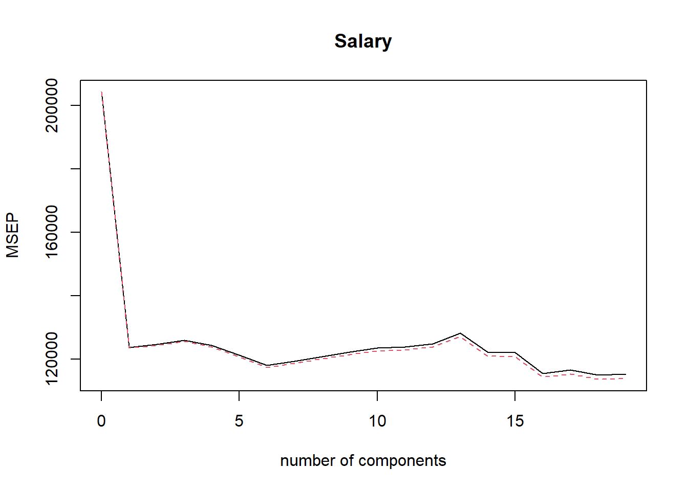

# Demonstration 3: PCR and PLS Regression {-}

::: file
For the tasks below, you require the **Hitters** dataset from the `ISRL2` package.

You will also need the `pls` package; please make sure to install and load it before you begin the practical.
:::

The **Hitters** dataset contains Major League Baseball Data from the 1986 and 1987 season. It is a dataframe with 322 observations and 20 variables. To learn more about the variables type `?Hitters` in your console. 

The goal of this demonstration is to predict salary of major league players using ridge regression and lasso.

Loading the required packages: 


```r
library(ISLR2)
library(pls)
```

Removing missing values: 


```r
attach(Hitters)
Hitters <- na.omit(Hitters)
```

Preparing the data: 


```r
x <- model.matrix(Salary ~ ., Hitters)[, -1]
y <- Hitters$Salary
```

## Principal Components Regression {-}

Principal components regression (PCR) can be performed using the `pcr()` function, which is part of the `pls` package. 

In this demonstration, we continue using the **Hitters** dataset to predict salary of major league players. We first set a random seed so that the results obtained will be reproducible and then split the data into training and test sets. 


```r
set.seed(1)
train <- sample(1:nrow(x), nrow(x) / 2)
test <- (-train)
y.test <- y[test]
```

The syntax for the `pcr()` function is similar to that for `lm()`, with a few additional options. Setting `scale = TRUE` has the effect of *standardising* each predictor, prior to generating the principal components, so that the scale on which each variable is measured will not have an effect.
 Setting `validation = "CV"` causes `pcr()` to compute the ten-fold cross-validation error for each possible value of $M$, the number of principal components used. 


```r
set.seed(2)
pcr.fit <- pcr(Salary ~ ., data = Hitters, scale = TRUE,
               validation = "CV")
```

As usual, the results can be explored using `summary()`.


```r
summary(pcr.fit)
```

```
## Data: 	X dimension: 263 19 
## 	Y dimension: 263 1
## Fit method: svdpc
## Number of components considered: 19
## 
## VALIDATION: RMSEP
## Cross-validated using 10 random segments.
##        (Intercept)  1 comps  2 comps  3 comps  4 comps  5 comps  6 comps
## CV             452    351.9    353.2    355.0    352.8    348.4    343.6
## adjCV          452    351.6    352.7    354.4    352.1    347.6    342.7
##        7 comps  8 comps  9 comps  10 comps  11 comps  12 comps  13 comps
## CV       345.5    347.7    349.6     351.4     352.1     353.5     358.2
## adjCV    344.7    346.7    348.5     350.1     350.7     352.0     356.5
##        14 comps  15 comps  16 comps  17 comps  18 comps  19 comps
## CV        349.7     349.4     339.9     341.6     339.2     339.6
## adjCV     348.0     347.7     338.2     339.7     337.2     337.6
## 
## TRAINING: % variance explained
##         1 comps  2 comps  3 comps  4 comps  5 comps  6 comps  7 comps  8 comps
## X         38.31    60.16    70.84    79.03    84.29    88.63    92.26    94.96
## Salary    40.63    41.58    42.17    43.22    44.90    46.48    46.69    46.75
##         9 comps  10 comps  11 comps  12 comps  13 comps  14 comps  15 comps
## X         96.28     97.26     97.98     98.65     99.15     99.47     99.75
## Salary    46.86     47.76     47.82     47.85     48.10     50.40     50.55
##         16 comps  17 comps  18 comps  19 comps
## X          99.89     99.97     99.99    100.00
## Salary     53.01     53.85     54.61     54.61
```

The CV score is provided for each possible number of components. Note that  `pcr()` reports the *root mean squared error*; in order to obtain the usual MSE, we must square this quantity. For instance, a root mean squared error of $352.8$ corresponds to an MSE of $352.8^2=124{,}468$.

We could also plot the cross-validation scores using the `validationplot()` function. Using `val.type = "MSEP"` will cause the cross-validation MSE to be plotted.


```r
validationplot(pcr.fit, val.type = "MSEP")
```



We see that the smallest cross-validation error occurs when $M=18$ components are used. This is barely fewer than $M=19$, which amounts to simply performing least squares, because when all of the components are used in PCR no dimension reduction occurs. However, from the plot we also see that the cross-validation error is roughly the same when only one component is included in the model. This suggests that a model that uses just a small number of components might suffice.

The `summary()` function also provides the *percentage of variance explained* in the predictors and in the response using different numbers of components. We can think of this as the amount of information about the predictors or the response that is captured using $M$ principal components. For example, setting $M=1$ only captures $38.31 \%$ of all the variance, or information, in the predictors. In contrast, using $M=5$ increases the value to $84.29 \%$. If we were to use all $M=p=19$ components, this would increase to $100 \%$.

We now perform PCR on the training data and evaluate its test set performance.


```r
set.seed(1)
pcr.fit <- pcr(Salary ~ ., data = Hitters, subset = train,
               scale = TRUE, validation = "CV")
validationplot(pcr.fit, val.type = "MSEP")
```


Now we find that the lowest cross-validation error occurs when $M=5$ components are used. We compute the test MSE as follows.


```r
pcr.pred <- predict(pcr.fit, x[test, ], ncomp = 5)
mean((pcr.pred - y.test)^2)
```

```
## [1] 142811.8
```

Finally, we fit PCR on the full data set, using $M=5$, the number of components identified by cross-validation.


```r
pcr.fit <- pcr(y ~ x, scale = TRUE, ncomp = 5)
summary(pcr.fit)
```

```
## Data: 	X dimension: 263 19 
## 	Y dimension: 263 1
## Fit method: svdpc
## Number of components considered: 5
## TRAINING: % variance explained
##    1 comps  2 comps  3 comps  4 comps  5 comps
## X    38.31    60.16    70.84    79.03    84.29
## y    40.63    41.58    42.17    43.22    44.90
```

The test set MSE is competitive with the results obtained using ridge regression and the lasso. However, as a result of the way PCR is implemented, the final model is more difficult to interpret because it does not perform any kind of variable selection or even directly produce coefficient estimates.

## Partial Least Squares {-}

We implement partial least squares (PLS) using the `plsr()` function, also in the `pls` library. The syntax is identical to that of the `pcr()` function.


```r
set.seed(1)
pls.fit <- plsr(Salary ~ ., data = Hitters, subset = train, 
                scale = TRUE, validation = "CV")
summary(pls.fit)
```

```
## Data: 	X dimension: 131 19 
## 	Y dimension: 131 1
## Fit method: kernelpls
## Number of components considered: 19
## 
## VALIDATION: RMSEP
## Cross-validated using 10 random segments.
##        (Intercept)  1 comps  2 comps  3 comps  4 comps  5 comps  6 comps
## CV           428.3    325.5    329.9    328.8    339.0    338.9    340.1
## adjCV        428.3    325.0    328.2    327.2    336.6    336.1    336.6
##        7 comps  8 comps  9 comps  10 comps  11 comps  12 comps  13 comps
## CV       339.0    347.1    346.4     343.4     341.5     345.4     356.4
## adjCV    336.2    343.4    342.8     340.2     338.3     341.8     351.1
##        14 comps  15 comps  16 comps  17 comps  18 comps  19 comps
## CV        348.4     349.1     350.0     344.2     344.5     345.0
## adjCV     344.2     345.0     345.9     340.4     340.6     341.1
## 
## TRAINING: % variance explained
##         1 comps  2 comps  3 comps  4 comps  5 comps  6 comps  7 comps  8 comps
## X         39.13    48.80    60.09    75.07    78.58    81.12    88.21    90.71
## Salary    46.36    50.72    52.23    53.03    54.07    54.77    55.05    55.66
##         9 comps  10 comps  11 comps  12 comps  13 comps  14 comps  15 comps
## X         93.17     96.05     97.08     97.61     97.97     98.70     99.12
## Salary    55.95     56.12     56.47     56.68     57.37     57.76     58.08
##         16 comps  17 comps  18 comps  19 comps
## X          99.61     99.70     99.95    100.00
## Salary     58.17     58.49     58.56     58.62
```

```r
validationplot(pls.fit, val.type = "MSEP")
```


The lowest cross-validation error occurs when only $M=1$ partial least squares directions are used. We now evaluate the corresponding test set MSE.


```r
pls.pred <- predict(pls.fit, x[test, ], ncomp = 1)
mean((pls.pred - y.test)^2)
```

```
## [1] 151995.3
```

The test MSE is comparable to, but slightly higher than, the test MSE obtained using ridge regression, the lasso, and PCR.   

Finally, we perform PLS using the full data set, using $M=1$, the number of components identified by cross-validation.


```r
pls.fit <- plsr(Salary ~ ., data = Hitters, scale = TRUE,
    ncomp = 1)
summary(pls.fit)
```

```
## Data: 	X dimension: 263 19 
## 	Y dimension: 263 1
## Fit method: kernelpls
## Number of components considered: 1
## TRAINING: % variance explained
##         1 comps
## X         38.08
## Salary    43.05
```

Notice that the percentage of variance in **Salary** that the one-component PLS fit explains, $43.05 \%$, is almost as much as that explained using the final five-component model PCR fit, $44.90 \%$. This is because PCR only attempts to maximise the amount of variance explained in the predictors, while PLS searches for directions that explain variance in both the predictors and the response.


