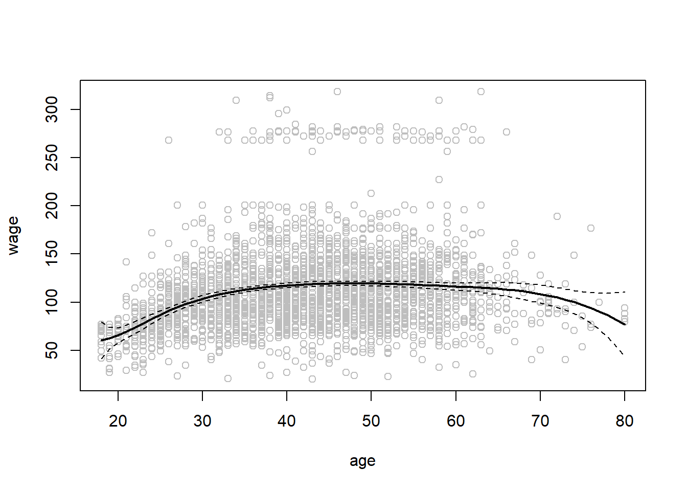

# Demonstration 4: Beyond Linearity {-}

::: file
For the tasks below, you require the **Wage** dataset from the `ISRL2` package.

You will also need the `akima`  and `gam` packages; please make sure to install and load it before you begin the practical.
:::

The **Wage** dataset contains wage and other data for a group of 3000 male workers in the Mid-Atlantic region. It is a data frame with 3,000 observations on 11 variables. To learn more about the variables, type `?Wage` in your console. 

The goal of this demonstration is to fit models that predict wage to exemplify some of the ways in which non-linearity can be addressed. 

Loading the required packages: 


```r
library(ISLR2)
library(akima)
library(gam)
library(splines)
```

## Polynomial Regression and Step Functions {-}

Let's first consider polynomials by fitting a linear model predict wage using age up to the fourth degree polynomial. By using the `poly()` command, we can avoid having to type a formula with powers of `age` up to the fourth. The function returns a matrix whose columns are a basis of *orthogonal polynomials*, which essentially means that each column is a linear combination of the variables `age`, `age^2`,  `age^3` and `age^4`.


```r
attach(Wage)
fit <- lm(wage ~ poly(age, 4), data = Wage)
coef(summary(fit))
```

```
##                 Estimate Std. Error    t value     Pr(>|t|)
## (Intercept)    111.70361  0.7287409 153.283015 0.000000e+00
## poly(age, 4)1  447.06785 39.9147851  11.200558 1.484604e-28
## poly(age, 4)2 -478.31581 39.9147851 -11.983424 2.355831e-32
## poly(age, 4)3  125.52169 39.9147851   3.144742 1.678622e-03
## poly(age, 4)4  -77.91118 39.9147851  -1.951938 5.103865e-02
```

Alternatively, we can set the `raw` argument to `TRUE` if we want to obtain `age`, `age^2`, `age^3` and `age^4` directly. 


```r
fit2 <- lm(wage ~ poly(age, 4, raw = T), data = Wage)
coef(summary(fit2))
```

```
##                             Estimate   Std. Error   t value     Pr(>|t|)
## (Intercept)            -1.841542e+02 6.004038e+01 -3.067172 0.0021802539
## poly(age, 4, raw = T)1  2.124552e+01 5.886748e+00  3.609042 0.0003123618
## poly(age, 4, raw = T)2 -5.638593e-01 2.061083e-01 -2.735743 0.0062606446
## poly(age, 4, raw = T)3  6.810688e-03 3.065931e-03  2.221409 0.0263977518
## poly(age, 4, raw = T)4 -3.203830e-05 1.641359e-05 -1.951938 0.0510386498
```
Either approach is acceptable since the choice does not affect the fitted values (although of course it will affect the coefficient estimates).   

There are several other equivalent ways of fitting this model such as using the wrapper function `I()`: 


```r
fit2a <- lm(wage ~ age + I(age^2) + I(age^3) + I(age^4),
            data = Wage)
coef(fit2a)
```

```
##   (Intercept)           age      I(age^2)      I(age^3)      I(age^4) 
## -1.841542e+02  2.124552e+01 -5.638593e-01  6.810688e-03 -3.203830e-05
```

Or `cbind()` , to build a matrix from a collection of vectors: 


```r
fit2b <- lm(wage ~ cbind(age, age^2, age^3, age^4), 
            data = Wage)
```

We now create a grid of values for `age` at which we want predictions (all ages in the dataset), and then call the generic `predict()` function, specifying that we want standard errors as well by setting `se = TRUE`. 


```r
#obtain range of values for the age variable
agelims <- range(age)

#generate sequence of values for age
age.grid <- seq(from = agelims[1], to = agelims[2])

# obtaining predictions with SE
preds <- predict(fit, newdata = list(age = age.grid),
                 se = TRUE)

# upper and lower bounds
se.bands <- cbind(preds$fit + 2 * preds$se.fit,
                  preds$fit - 2 * preds$se.fit)
```

Finally, we plot the data and add the fit from the degree-4 polynomial. By plotting the data, we can visualise the model fit together with the associated uncertainty. 


```r
#creating the plot
plot(age, wage, xlim = agelims, cex = .5, col = "darkgrey")

#adding a title
title("Degree-4 Polynomial", outer = T)

#adding fitted line
lines(age.grid, preds$fit, lwd = 2, col = "blue")

#adding CIs
matlines(age.grid, se.bands, lwd = 1, col = "blue", lty = 3)
```


Ok, so how exactly do we decide which polynomial degree is suitable to fit a model that explains the relationship between **wage** and **age**?

One way is to use ANOVA (F-test). So for example, we can fit models ranging from linear (1st degree polynomial) to a fifth degree polynomial and use ANOVA to determine the simplest model which is sufficient to explain the relationship between the two variables. 

Our null hypothesis is that a model $M_1$ is sufficient to explain the data against the alternative hypothesis that a more complex model $M_2$ is required. In order to use the `anova()` function, remember that $M_1$ and $M_2$ must be *nested* models. In other words, the predictors in $M_1$ must be a subset of the predictors in $M_2$. 

Therefore, we fit five different sequentially (simplest to most complex)


```r
fit.1 <- lm(wage ~ age, data = Wage)
fit.2 <- lm(wage ~ poly(age, 2), data = Wage)
fit.3 <- lm(wage ~ poly(age, 3), data = Wage)
fit.4 <- lm(wage ~ poly(age, 4), data = Wage)
fit.5 <- lm(wage ~ poly(age, 5), data = Wage)

anova(fit.1, fit.2, fit.3, fit.4, fit.5)
```

```
## Analysis of Variance Table
## 
## Model 1: wage ~ age
## Model 2: wage ~ poly(age, 2)
## Model 3: wage ~ poly(age, 3)
## Model 4: wage ~ poly(age, 4)
## Model 5: wage ~ poly(age, 5)
##   Res.Df     RSS Df Sum of Sq        F    Pr(>F)    
## 1   2998 5022216                                    
## 2   2997 4793430  1    228786 143.5931 < 2.2e-16 ***
## 3   2996 4777674  1     15756   9.8888  0.001679 ** 
## 4   2995 4771604  1      6070   3.8098  0.051046 .  
## 5   2994 4770322  1      1283   0.8050  0.369682    
## ---
## Signif. codes:  0 '***' 0.001 '**' 0.01 '*' 0.05 '.' 0.1 ' ' 1
```

The results show that Model 2 (2nd degree polynomial) and model 3 (3rd degree polynomial) are statistically significant which suggest that a linear model is insufficient. Since the p-values for Models 4 and 5 are large, there is evidence to suggest that higher order models are not justified to explain the relationship between age and wage.  

*As an alternative to using hypothesis tests and ANOVA, we could choose the polynomial degree using cross-validation.*  

Now let's consider a classification problem and predict whether an individual earns more than $\$250{,}000$ per year or not using a logistic regression model.  

We proceed much as before, except that first we create the appropriate response vector, and then apply the `glm()` function using `family = "binomial"` in order to fit a polynomial logistic regression model. The expression `wage > 250` evaluates to a logical variable containing `TRUE`s and `FALSE`s, which `glm()` coerces to binary by setting the `TRUE`s to 1 and the `FALSE`s to 0.


```r
fit <- glm(I(wage > 250) ~ poly(age, 4), data = Wage,
           family = binomial)
```

As before, we obtain the predictions using the  `predict()` function and make use of the **age.grid** object we created earlier. Since we also want the standard errors, we set `se` to `TRUE`.


```r
preds <- predict(fit, newdata = list(age = age.grid), se = TRUE)
```

However, calculating the confidence intervals is slightly more complex than in the linear regression case. The default prediction type for a `glm()` model is `type = "link"` and so we obtain predictions for the *logit*: that is, we have fit a model of the form:
$$
\log\left(\frac{\Pr(Y=1|X)}{1-\Pr(Y=1|X)}\right)=X\beta,
$$
and the predictions given are of the form $X\hat\beta$. The  standard errors given are also for $X \hat\beta$. In order to obtain confidence intervals for $\Pr(Y=1|X)$, we use the transformation:
$$
\Pr(Y=1|X)=\frac{\exp(X\beta)}{1+\exp(X\beta)}.
$$


```r
pfit <- exp(preds$fit) / (1 + exp(preds$fit))
se.bands.logit <- cbind(preds$fit + 2 * preds$se.fit,
                        preds$fit - 2 * preds$se.fit)
se.bands <- exp(se.bands.logit) / (1 + exp(se.bands.logit))
```

Note that we could have directly computed the probabilities by selecting the `type = "response"` option in the `predict()` function.


```r
preds <- predict(fit, newdata = list(age = age.grid),
                 type = "response", se = T)
```

However, the corresponding confidence intervals would not have been sensible because we would end up with negative probabilities.    

Now let's create a *rug plot*. The `age` values corresponding to the observations with `wage` values above $250$ are denoted as gray marks on the top of the plot, and those with `wage` values below $250$ are shown as gray marks on the bottom of the plot. We also use the `jitter()` function to jitter the `age` values slightly to avoid overplotting.


```r
plot(age, I(wage > 250), xlim = agelims, type = "n",
     ylim = c(0, .2))
points(jitter(age), I((wage > 250) / 5), cex = .5, pch = "|", col = "darkgrey")
lines(age.grid, pfit, lwd = 2, col = "blue")
matlines(age.grid, se.bands, lwd = 1, col = "blue", lty = 3)
```


## Step Functions {-}

In order to fit a step function, we use the `cut()` function. 

```r
table(cut(age, 4))
```

```
## 
## (17.9,33.5]   (33.5,49]   (49,64.5] (64.5,80.1] 
##         750        1399         779          72
```

Here `cut()` automatically picked the cutpoints at $33.5$, $49$, and $64.5$ years of age. We could also have specified our own cutpoints directly using the `breaks` option. The function `cut()` returns an ordered categorical variable. 

Therefore, if we use the function directly within `lm()` then it creates a set of dummy variables. Since `age < 33.5` category is left out, the intercept coefficient of $\$94{,}160$ can be interpreted as the average salary for those under $33.5$ years of age, and the other coefficients can be interpreted as the average additional salary for those in the other age groups.


```r
fit <- lm(wage ~ cut(age, 4), data = Wage)

fit
```

```
## 
## Call:
## lm(formula = wage ~ cut(age, 4), data = Wage)
## 
## Coefficients:
##            (Intercept)    cut(age, 4)(33.5,49]    cut(age, 4)(49,64.5]  
##                 94.158                  24.053                  23.665  
## cut(age, 4)(64.5,80.1]  
##                  7.641
```

We can also produce predictions and plots just as we did in the case of the polynomial fit.


```r
coef(summary(fit))
```

```
##                         Estimate Std. Error   t value     Pr(>|t|)
## (Intercept)            94.158392   1.476069 63.789970 0.000000e+00
## cut(age, 4)(33.5,49]   24.053491   1.829431 13.148074 1.982315e-38
## cut(age, 4)(49,64.5]   23.664559   2.067958 11.443444 1.040750e-29
## cut(age, 4)(64.5,80.1]  7.640592   4.987424  1.531972 1.256350e-01
```


## Splines {-}

Now let's consider splines. Splines are easily fitted using the `bs()` function which generates the entire matrix of basis functions for splines with the specified set of knots (cubic splines are produced by default (degree of 3)). Here we knots at ages $25$, $40$, and $60$. This produces a spline with six basis functions


```r
fit <- lm(wage ~ bs(age, knots = c(25, 40, 60)), data = Wage)
pred <- predict(fit, newdata = list(age = age.grid), se = T)
plot(age, wage, col = "gray")
lines(age.grid, pred$fit, lwd = 2)
lines(age.grid, pred$fit + 2 * pred$se, lty = "dashed")
lines(age.grid, pred$fit - 2 * pred$se, lty = "dashed")
```



Recall that a cubic spline with three knots has seven degrees of freedom; these degrees of freedom are used up by an intercept, plus six basis functions. We could also use the `df` option to produce a spline with knots at uniform quantiles of the data.


```r
dim(bs(age, knots = c(25, 40, 60)))
```

```
## [1] 3000    6
```

```r
dim(bs(age, df = 6))
```

```
## [1] 3000    6
```

```r
attr(bs(age, df = 6), "knots")
```

```
##   25%   50%   75% 
## 33.75 42.00 51.00
```

As you can see from the output, R has automatically chosen knots at ages $33.8, 42.0$, and $51.0$, which correspond to the 25th, 50th, and 75th percentiles of age. The function `bs()` also has a `degree` argument, so we can fit splines of any degree, rather than the default.   

In order to instead fit a natural spline, we use the `ns()` function. Here we fit a natural spline with four degrees of freedom. As with the `bs()` function, we could instead specify the knots directly using the `knots` option.


```r
fit2 <- lm(wage ~ ns(age, df = 4), data = Wage)
pred2 <- predict(fit2, newdata = list(age = age.grid), se = T)
plot(age, wage, col = "gray")
lines(age.grid, pred2$fit, col = "red", lwd = 2)
```


To fit a smoothing spline, we use the `smooth.spline()` function. Notice that in the first call to `smooth.spline()`, we specified `df = 16`. The function then determines which value of $\lambda$  leads to $16$ degrees of freedom. In the second call to `smooth.spline()`, we select the smoothness level by cross-validation; this results in a value of $\lambda$ that yields 6.8 degrees of freedom. We plot the results of the two fits for comparison purposes. 


```r
plot(age, wage, xlim = agelims, cex = .5, col = "darkgrey")
title("Smoothing Spline")
fit <- smooth.spline(age, wage, df = 16)
fit2 <- smooth.spline(age, wage, cv = TRUE)
```

```
## Warning in smooth.spline(age, wage, cv = TRUE): cross-validation with
## non-unique 'x' values seems doubtful
```

```r
fit2$df
```

```
## [1] 6.794596
```

```r
lines(fit, col = "red", lwd = 2)
lines(fit2, col = "blue", lwd = 2)
legend("topright", legend = c("16 DF", "6.8 DF"),
       col = c("red", "blue"), lty = 1, lwd = 2, cex = .8)
```


## Local Regression {-}

In order to perform local regression, we use the `loess()` function. Here we have performed local linear regression using spans of $0.2$ and $0.5$: that is, each neighborhood consists of 20 \% or 50 \% of the observations. The larger the span, the smoother the fit.


```r
plot(age, wage, xlim = agelims, cex = .5, col = "darkgrey")
title("Local Regression")
fit <- loess(wage ~ age, span = .2, data = Wage)
fit2 <- loess(wage ~ age, span = .5, data = Wage)
lines(age.grid, predict(fit, data.frame(age = age.grid)),
    col = "red", lwd = 2)
lines(age.grid, predict(fit2, data.frame(age = age.grid)),
    col = "blue", lwd = 2)
legend("topright", legend = c("Span = 0.2", "Span = 0.5"),
    col = c("red", "blue"), lty = 1, lwd = 2, cex = .8)
```


## Generalised Additive Models {-}

Finally, let's consider generalised additive models. Below, we fit a GAM to predict **wage** using natural spline functions of **lyear** and **age**,  treating **education** as a categorical predictor. Since this is just a big linear regression model using an appropriate choice of basis functions, we can simply do this using the `lm()` function.


```r
gam1 <- lm(wage ~ ns(year, 4) + ns(age, 5) + education, 
           data = Wage)
```

We now fit the model using smoothing splines rather than natural splines. In cases of non-linear approaches that cannot be expressed in terms of basis functions and fit using `lm()`, we will need to use the `gam()` function from the `gam` package.

The `s()` function is used to indicate that we would like to use a smoothing spline. We specify that the function of **lyear** should have $4$ degrees of freedom, and that the function of **age** should have $5$ degrees of freedom. Since **education** is qualitative, we leave it as is (since it will be converted into four dummy variables). 


```r
gam.m3 <- gam(wage ~ s(year, 4) + s(age, 5) + education,
              data = Wage)
```

The generic `plot()` function recognises that `gam.m3` is an object of class `Gam`, and invokes the appropriate `plot.Gam()` method.  


```r
par(mfrow = c(1, 3))
plot(gam.m3, se = TRUE, col = "blue")
```


Conveniently, even though   `gam1` is not of class `Gam` but rather of class `lm`, we can still use `plot.Gam()` on it.  


```r
par(mfrow = c(1, 3))
plot.Gam(gam1, se = TRUE, col = "red")
```


Notice here we had to use `plot.Gam()` rather than the `plot()` function.

In these plots, the function of **lyear** looks rather linear. We can perform a series of ANOVA tests in order to determine which of these three models is best.


```r
gam.m1 <- gam(wage ~ s(age, 5) + education, data = Wage)
gam.m2 <- gam(wage ~ year + s(age, 5) + education,
              data = Wage)
anova(gam.m1, gam.m2, gam.m3, test = "F")
```

```
## Analysis of Deviance Table
## 
## Model 1: wage ~ s(age, 5) + education
## Model 2: wage ~ year + s(age, 5) + education
## Model 3: wage ~ s(year, 4) + s(age, 5) + education
##   Resid. Df Resid. Dev Df Deviance       F    Pr(>F)    
## 1      2990    3711731                                  
## 2      2989    3693842  1  17889.2 14.4771 0.0001447 ***
## 3      2986    3689770  3   4071.1  1.0982 0.3485661    
## ---
## Signif. codes:  0 '***' 0.001 '**' 0.01 '*' 0.05 '.' 0.1 ' ' 1
```

We find that there is compelling evidence that a GAM with a linear function of **lyear** is better than a GAM that does not include **lyear** at all. However, there is no evidence that a non-linear function of **lyear** is needed and so $M_2$ is preferred.  

The `summary()` function can also be used with GAMs.


```r
summary(gam.m3)
```

```
## 
## Call: gam(formula = wage ~ s(year, 4) + s(age, 5) + education, data = Wage)
## Deviance Residuals:
##     Min      1Q  Median      3Q     Max 
## -119.43  -19.70   -3.33   14.17  213.48 
## 
## (Dispersion Parameter for gaussian family taken to be 1235.69)
## 
##     Null Deviance: 5222086 on 2999 degrees of freedom
## Residual Deviance: 3689770 on 2986 degrees of freedom
## AIC: 29887.75 
## 
## Number of Local Scoring Iterations: NA 
## 
## Anova for Parametric Effects
##              Df  Sum Sq Mean Sq F value    Pr(>F)    
## s(year, 4)    1   27162   27162  21.981 2.877e-06 ***
## s(age, 5)     1  195338  195338 158.081 < 2.2e-16 ***
## education     4 1069726  267432 216.423 < 2.2e-16 ***
## Residuals  2986 3689770    1236                      
## ---
## Signif. codes:  0 '***' 0.001 '**' 0.01 '*' 0.05 '.' 0.1 ' ' 1
## 
## Anova for Nonparametric Effects
##             Npar Df Npar F  Pr(F)    
## (Intercept)                          
## s(year, 4)        3  1.086 0.3537    
## s(age, 5)         4 32.380 <2e-16 ***
## education                            
## ---
## Signif. codes:  0 '***' 0.001 '**' 0.01 '*' 0.05 '.' 0.1 ' ' 1
```

The "Anova for Parametric Effects" p-values clearly demonstrate that **year**, **age**, and **education** are all highly statistically significant, even when only assuming a linear relationship. Alternatively, the "Anova for Nonparametric Effects" p-values for **year** and **age** correspond to a null hypothesis of a linear relationship versus the alternative of a non-linear relationship. The large p-value for **year** reinforces our conclusion from the ANOVA test that a linear function is adequate for this term. However, there is very clear evidence that a non-linear term is required for **age**.  

We can make predictions using the `predict()` method for the class `Gam`. Here we make predictions on the training set.


```r
preds <- predict(gam.m2, newdata = Wage)
```

We can also use local regression fits as building blocks in a GAM, using the `lo()` function.


```r
par(mfrow = c(1, 3))

gam.lo <- gam(
    wage ~ s(year, df = 4) + lo(age, span = 0.7) + education,
    data = Wage
    )
plot(gam.lo, se = TRUE, col = "green")
```


Here we have used local regression for the `age` term, with a span of $0.7$. We can also use the `lo()` function to create interactions before calling the `gam()` function. For example, the below fits a two-term model, in which the first term is an interaction between `lyear` and `age`, fit by a local regression surface.


```r
gam.lo.i <- gam(wage ~ lo(year, age, span = 0.5) + education,
    data = Wage)
```

We can plot the resulting two-dimensional surface if we first install the `akima` package.


```r
par(mfrow = c(2, 2))

plot(gam.lo.i)
```


In order to fit a logistic regression GAM, we once again use the `I()` function in constructing the binary response variable, and set `family=binomial`.


```r
gam.lr <- gam(I(wage > 250) ~ year + s(age, df = 5) + education,
              family = binomial, data = Wage)
par(mfrow = c(1, 3))
plot(gam.lr, se = T, col = "green")
```


It is easy to see that there are no high earners in the `< HS` category:


```r
table(education, I(wage > 250))
```

```
##                     
## education            FALSE TRUE
##   1. < HS Grad         268    0
##   2. HS Grad           966    5
##   3. Some College      643    7
##   4. College Grad      663   22
##   5. Advanced Degree   381   45
```

Hence, we fit a logistic regression GAM using all but this category. This provides more sensible results.


```r
gam.lr.s <- gam(I(wage > 250) ~ year + s(age, df = 5) + education,
                family = binomial, data = Wage,
                subset = (education != "1. < HS Grad")
                )

par(mfrow = c(1, 3))

plot(gam.lr.s, se = T, col = "green")
```


