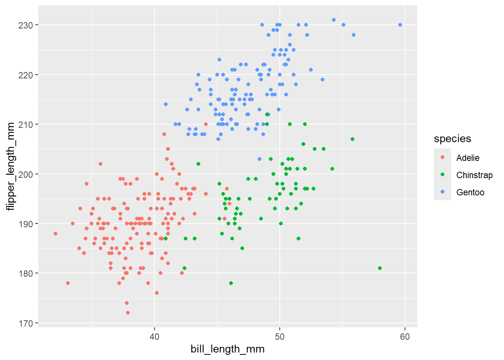

# Demonstration 1: K-means Clustering in R {-}

In this practical, you will learn how to implement k-means clustering using the Palmer Penguins dataset. You can read more about this data here:

[Palmer Penguins Dataset](https://allisonhorst.github.io/palmerpenguins/articles/intro.html)

The task in this practical is to cluster penguins based on their bill length and flipper length. We will then assess whether the predicted clusters map onto the actual species of penguin in the data. You can view this as an exercise in whether bill length and flipper length is sufficient to differentiate between species of penguin.

{fig-align="center"}

(Artwork by \@allison_horst)

You should modify and experiment with the below code. There is also a brief exercise for you complete at the end of the walk-through.  

You will be required to install two new packages first: `palmerpenguins` and `factoextra`.

## Loading the necessary packages {-}


```r
library(palmerpenguins)
library(tidyverse)
library(factoextra)
```

## Profile the Palmer Penguins dataset {-}


```r
head(penguins)
```

```
## # A tibble: 6 × 8
##   species island    bill_length_mm bill_depth_mm flipper_length_mm body_mass_g
##   <fct>   <fct>              <dbl>         <dbl>             <int>       <int>
## 1 Adelie  Torgersen           39.1          18.7               181        3750
## 2 Adelie  Torgersen           39.5          17.4               186        3800
## 3 Adelie  Torgersen           40.3          18                 195        3250
## 4 Adelie  Torgersen           NA            NA                  NA          NA
## 5 Adelie  Torgersen           36.7          19.3               193        3450
## 6 Adelie  Torgersen           39.3          20.6               190        3650
## # ℹ 2 more variables: sex <fct>, year <int>
```

```r
glimpse(penguins)
```

```
## Rows: 344
## Columns: 8
## $ species           <fct> Adelie, Adelie, Adelie, Adelie, Adelie, Adelie, Adel…
## $ island            <fct> Torgersen, Torgersen, Torgersen, Torgersen, Torgerse…
## $ bill_length_mm    <dbl> 39.1, 39.5, 40.3, NA, 36.7, 39.3, 38.9, 39.2, 34.1, …
## $ bill_depth_mm     <dbl> 18.7, 17.4, 18.0, NA, 19.3, 20.6, 17.8, 19.6, 18.1, …
## $ flipper_length_mm <int> 181, 186, 195, NA, 193, 190, 181, 195, 193, 190, 186…
## $ body_mass_g       <int> 3750, 3800, 3250, NA, 3450, 3650, 3625, 4675, 3475, …
## $ sex               <fct> male, female, female, NA, female, male, female, male…
## $ year              <int> 2007, 2007, 2007, 2007, 2007, 2007, 2007, 2007, 2007…
```

## Plot {-}


```r
penguins |>
  ggplot(aes(bill_length_mm, flipper_length_mm, color = species)) +
  geom_point()
```

```
## Warning: Removed 2 rows containing missing values or values outside the scale range
## (`geom_point()`).
```



## Preprocess the data for clustering {-}


```r
pengs <- 
  penguins |>
  drop_na()
```

## Perform k-means clustering {-}


```r
k2 <- 
  pengs |>
  select(bill_length_mm, flipper_length_mm) |>
  kmeans(centers = 3, nstart = 25)
```

Let's add the predicted cluster to the `pengs` data frame:


```r
pengs <- pengs |> mutate(cluster = k2$cluster)
```

## Visualise the clusters {-}


```r
fviz_cluster(
  k2,
  data = pengs |> select(bill_length_mm, flipper_length_mm)
)
```


```r
pengs |>
  ggplot(aes(x = bill_length_mm,
             y = flipper_length_mm,
             color = factor(cluster),
             shape = species)) +
  geom_point() +
  scale_color_discrete("cluster")
```


:::question
To what extent do the clusters overlap with species?
:::


```r
pred <- table(pengs$species, k2$cluster)
pred
```

```
##            
##               1   2   3
##   Adelie     38   2 106
##   Chinstrap  54   5   9
##   Gentoo      2 117   0
```

```r
overlap <- sum(diag(pred))
differs <- sum(pred[upper.tri(pred)], pred[lower.tri(pred)])

# proportion of penguins "correctly" classified according to species:
overlap / sum(overlap, differs)
```

```
## [1] 0.1291291
```

:::question
How can we visualise the cluster-species overlap?
:::


```r
pengs |>
  mutate(
    overlap = case_when(
      species == "Adelie"    & cluster == 1 ~ "overlap",
      species == "Chinstrap" & cluster == 2 ~ "overlap",
      species == "Gentoo"    & cluster == 3 ~ "overlap",
      TRUE ~ "differs"
    )
  ) |>
  ggplot(aes(x = bill_length_mm,
             y = flipper_length_mm,
             color = overlap,
             shape = species)) +
  geom_point()
```


## 👉 TASKS {-}

### TASK 1: How well did k-means clustering perform?  {-}

Suppose you randomly picked Adelie, Chinstrap, or Gentoo for each penguin. What proportion of penguins would you "correctly" classify?

> Your code here

Consider how this compares to the performance of the k-means clustering algorithm.

### TASK 2: How many clusters should we use? {-}

In the above example, we used three clusters because there are three species of penguin in our data. However, in practice, we may not know this "ground-truth" information. That is, we may not know how many species are of penguin are represented in the data.

Additionally, we may wish to cluster the data based on other criteria, such as minimizing the intra-cluster variation. Recall that unsupervised learning is useful for *detecting patterns* in the data.

One method we can use to determine the optimal number of clusters is the **elbow method**. This method involves plotting the within-cluster sum of squares (WSS; also known as within-cluster variation or intra-cluster variation) for a range values of *k* (recall that *k* is the number of clusters). We then look for the location of the "bend" in the in the plot, i.e., the elbow.

Below, we use the elbow method to determine the optimal number of clusters of penguins using the `body_mass_g` and `bill_length_mm` features.


```r
# preprocess data
pengs_mass_length <- 
  pengs |>
  select(body_mass_g, bill_length_mm)

# compute total within-cluster sum of square 
wss <- function(k) {
  kmeans(
    pengs_mass_length,
    centers = k,
    nstart = 10
  )$tot.withinss
}

# Compute and plot WSS for k = 1 to k = 15
k_values <- 1:10

# plot the WSS values against k
wss_values <- map_dbl(k_values, wss)

tibble(
  k_values,
  wss_values
) |>
  ggplot(aes(k_values, wss_values)) +
  geom_line() +
  geom_point() +
  scale_x_continuous("Number of clusters, k", breaks = unique(k_values)) +
  scale_y_continuous("Total within-clusters sum of squares")
```


The results here suggest that the optimal number of clusters is 3 (which neatly aligns with the number of penguin species in the data). Although, 4 also looks like a good choice. The elbow method is useful, but it isn't always clear where the elbow lies, which often simply reflects the reality of the data.

The elbow method is implemented in `fviz_nbclust()` function from the `factoextra` package:


```r
fviz_nbclust(pengs_mass_length, kmeans, method = "wss")
```


### TASK 3: Clustering cars {-}

Cluster the `mtcars` data using `kmeans()`.


```r
head(mtcars)
```

```
##                    mpg cyl disp  hp drat    wt  qsec vs am gear carb
## Mazda RX4         21.0   6  160 110 3.90 2.620 16.46  0  1    4    4
## Mazda RX4 Wag     21.0   6  160 110 3.90 2.875 17.02  0  1    4    4
## Datsun 710        22.8   4  108  93 3.85 2.320 18.61  1  1    4    1
## Hornet 4 Drive    21.4   6  258 110 3.08 3.215 19.44  1  0    3    1
## Hornet Sportabout 18.7   8  360 175 3.15 3.440 17.02  0  0    3    2
## Valiant           18.1   6  225 105 2.76 3.460 20.22  1  0    3    1
```

Use the `mpg` and `hp` features to group the cars into three clusters.  

> Your code here

How well do your predicted clusters map onto the `cyl` feature in the `mtcars` data? (Note that the `cyl` feature (cylinders) has three values: 4, 6, 8).   

> Your code here

Next, find the optimal number of clusters in the data using the elbow method. You should start by using the `mpg` and `hp` features, although feel free to experiment with using other features.  

> Your code here


