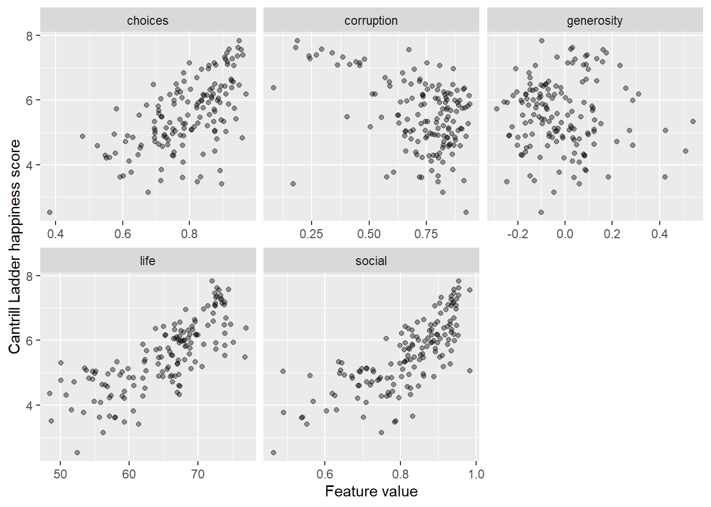

# Demonstration 2: Principal Component Analysis in R {-}

:::file
For the tasks below, you will require the **World Happiness Report (2021)** dataset.  

Click here to download the file: 
<a href="data/world_happiness_report_2021.csv" download="world_happiness_report_2021.csv"> world_happiness_report_2021.csv </a>.   
Remember to place your data file in a separate subfolder within your R project working directory.  
:::


Prior to beginning the practical, you will be required install two packages `easyCODA` and `janitor`. 

## Load packages {-}


```r
library(easyCODA)
library(dplyr)
library(tidyr)
library(readr)
library(janitor)
library(ggplot2)
```

## Preprocess the world happiness report data {-}


```r
happy <-
  read_csv(
    file = "data/world_happiness_report_2021.csv",
    show_col_types = FALSE
  ) |>
  clean_names()

happy_standardized <- 
  happy |>
  select(
    social = social_support,
    life = healthy_life_expectancy,
    choices = freedom_to_make_life_choices,
    generosity,
    corruption = perceptions_of_corruption
  ) |>
  scale()

rownames(happy_standardized) <- happy$country_name
```

## Profile the happiness data {-}


```r
head(happy)
```

```
## # A tibble: 6 × 20
##   country_name regional_indicator ladder_score standard_error_of_ladder_score
##   <chr>        <chr>                     <dbl>                          <dbl>
## 1 Finland      Western Europe             7.84                          0.032
## 2 Denmark      Western Europe             7.62                          0.035
## 3 Switzerland  Western Europe             7.57                          0.036
## 4 Iceland      Western Europe             7.55                          0.059
## 5 Netherlands  Western Europe             7.46                          0.027
## 6 Norway       Western Europe             7.39                          0.035
## # ℹ 16 more variables: upperwhisker <dbl>, lowerwhisker <dbl>,
## #   logged_gdp_per_capita <dbl>, social_support <dbl>,
## #   healthy_life_expectancy <dbl>, freedom_to_make_life_choices <dbl>,
## #   generosity <dbl>, perceptions_of_corruption <dbl>,
## #   ladder_score_in_dystopia <dbl>, explained_by_log_gdp_per_capita <dbl>,
## #   explained_by_social_support <dbl>,
## #   explained_by_healthy_life_expectancy <dbl>, …
```

## Plot happiness score against feature {-}


```r
happy |>
  select(
    ladder = ladder_score,
    social = social_support,
    life = healthy_life_expectancy,
    choices = freedom_to_make_life_choices,
    generosity,
    corruption = perceptions_of_corruption
  ) |>
  pivot_longer(-ladder, names_to = "feature", values_to = "value") |>
  ggplot(aes(value, ladder)) +
  geom_point(alpha = 0.4) +
  scale_x_continuous("Feature value") +
  scale_y_continuous("Cantrill Ladder happiness score") +
  facet_wrap(~ feature, scales = "free_x")
```



## Run PCA using five features {-}


```r
happy_pca <- PCA(happy_standardized, weight = FALSE)
summary(happy_pca)
```

```
## 
## Principal inertias (eigenvalues):
## 
##  dim    value      %   cum%   scree plot               
##  1      0.466493  47.0  47.0  ************             
##  2      0.243482  24.5  71.5  ******                   
##  3      0.139560  14.1  85.5  ****                     
##  4      0.095018   9.6  95.1  **                       
##  5      0.048735   4.9 100.0  *                        
##         -------- -----                                 
##  Total: 0.993289 100.0                                 
## 
## 
## Rows:
##         name   mass  qlt  inr     k=1 cor ctr     k=2 cor ctr  
## 1   |   Fnln |    7  707   19 | -1378 683  27 |  -257  24   2 |
## 2   |   Dnmr |    7  808   19 | -1403 699  28 |  -553 109   8 |
## 3   |   Swtz |    7  860   14 | -1281 789  24 |  -384  71   4 |
## 4   |   Icln |    7  817   10 | -1021 738  15 |  -334  79   3 |
## 5   |   Nthr |    7  929   13 | -1149 667  19 |  -719 261  14 |
## 6   |   Nrwy |    7  918   17 | -1366 763  27 |  -615 155  10 |
## 7   |   Swdn |    7  871   16 | -1303 699  24 |  -647 172  12 |
## 8   |   Lxmb |    7  834    9 | -1030 803  15 |  -201  30   1 |
## 9   |   NwZl |    7  890   17 | -1322 689  25 |  -713 201  14 |
## 10  |  Austr |    7  973    8 | -1022 919  15 |  -247  54   2 |
## 11  |  Astrl |    7  958   11 | -1104 765  18 |  -554 193   8 |
## 12  |   Isrl |    7  615    4 |  -569 563   5 |   173  52   1 |
## 13  |   Grmn |    7  888    6 |  -882 842  11 |  -206  46   1 |
## 14  |   Cand |    7  951   10 | -1099 824  17 |  -433 128   5 |
## 15  |   Irln |    7  867   10 | -1070 750  16 |  -422 116   5 |
## 16  |   CstR |    7  695    5 |  -602 495   5 |   383 200   4 |
## 17  |   UntK |    7  856   10 |  -914 548  12 |  -685 308  13 |
## 18  |   CzcR |    7  885    6 |  -493 261   3 |   763 624  16 |
## 19  |   UntS |    7  665    2 |  -456 572   3 |  -184  93   1 |
## 20  |   Blgm |    7  864    4 |  -522 483   4 |   463 381   6 |
## 21  |   Frnc |    7  890    6 |  -812 717   9 |   399 173   4 |
## 22  |   Bhrn |    7  717    3 |  -533 573   4 |  -267 144   2 |
## 23  |   Malt |    7  873    6 |  -847 759  10 |  -328 114   3 |
## 24  |   TwPC |    7  883    2 |  -338 506   2 |   292 377   2 |
## 25  |   UnAE |    7  919    4 |  -555 578   4 |  -427 342   5 |
## 26  |   SdAr |    7  707    3 |  -431 485   3 |   291 222   2 |
## 27  |   Span |    7  762    5 |  -531 418   4 |   482 345   6 |
## 28  |   Itly |    7  552    5 |  -140  27   0 |   613 525  10 |
## 29  |   Slvn |    7  747    6 |  -754 606   8 |   364 142   4 |
## 30  |   Gtml |    7  139    2 |  -175 138   0 |   -16   1   0 |
## 31  |   Urgy |    7  893    4 |  -721 870   7 |   117  23   0 |
## 32  |   Sngp |    7  710   25 | -1535 644  34 |  -491  66   7 |
## 33  |   Kosv |    7  307    7 |    62   4   0 |  -544 303   8 |
## 34  |   Slvk |    7  762    4 |  -187  56   1 |   664 706  12 |
## 35  |   Brzl |    7  864    1 |  -199 344   1 |   244 520   2 |
## 36  |   Mexc |    7  646    2 |  -240 179   1 |   388 467   4 |
## 37  |   Jamc |    7  534    4 |  -270 140   1 |   453 394   6 |
## 38  |   Lthn |    7  941    4 |  -233  85   1 |   736 855  15 |
## 39  |   Cypr |    7  214    3 |  -138  42   0 |   277 171   2 |
## 40  |   Estn |    7  824    6 |  -829 815  10 |    85   8   0 |
## 41  |   Panm |    7  777    4 |  -382 243   2 |   566 534   9 |
## 42  |   Uzbk |    7  918   13 |  -775 320   9 | -1059 598  31 |
## 43  |   Chil |    7  542    2 |  -133  61   0 |   373 481   4 |
## 44  |   Plnd |    7  959    3 |  -442 445   3 |   475 514   6 |
## 45  |   Kzkh |    7  584    3 |  -411 457   2 |   217 127   1 |
## 46  |   Romn |    7  684    5 |   -32   1   0 |   699 682  13 |
## 47  |   Kuwt |    7  615    1 |  -272 395   1 |   203 220   1 |
## 48  |   Serb |    7  304    1 |  -127  87   0 |   201 217   1 |
## 49  |   ElSl |    7  112    2 |  -170 102   0 |    55  11   0 |
## 50  |   Mrts |    7  601    2 |  -343 450   2 |   199 151   1 |
## 51  |   Latv |    7  823    4 |   -96  18   0 |   650 806  12 |
## 52  |   Clmb |    7  733    2 |  -162  90   0 |   435 643   5 |
## 53  |   Hngr |    7  893    5 |  -170  41   0 |   775 852  17 |
## 54  |   Thln |    7  283    8 |  -262  56   1 |  -526 227   8 |
## 55  |   Ncrg |    7  982    1 |  -350 909   2 |   -99  73   0 |
## 56  |   Japn |    7  820    7 |  -618 351   5 |   715 469  14 |
## 57  |   Argn |    7  916    3 |  -296 171   1 |   618 745  11 |
## 58  |   Prtg |    7  772    7 |  -467 199   3 |   791 573  17 |
## 59  |   Hndr |    7  227    1 |  -130  79   0 |  -177 148   1 |
## 60  |   Crot |    7  726    5 |  -171  41   0 |   703 685  14 |
## 61  |   Phlp |    7   75    2 |  -154  69   0 |    49   7   0 |
## 62  |   SthK |    7  279    4 |   -65   7   0 |   409 272   5 |
## 63  |   Peru |    7  722    3 |   -64  10   0 |   535 711   8 |
## 64  |   BsnH |    7   44    4 |   132  29   0 |    97  16   0 |
## 65  |  Moldv |    7  446    2 |     6   0   0 |   369 446   4 |
## 66  |   Ecdr |    7  600    2 |  -146  73   0 |   392 527   4 |
## 67  |   Kyrg |    7  137    5 |  -250  81   1 |  -209  56   1 |
## 68  |   Grec |    7  741   11 |   199  24   1 |  1088 717  33 |
## 69  |   Bolv |    7  104    2 |    -8   0   0 |   153 104   1 |
## 70  |   Mngl |    7   28    4 |   129  27   0 |   -11   0   0 |
## 71  |   Prgy |    7  137    3 |  -216 125   1 |    65  11   0 |
## 72  |   Mntn |    7  419    2 |    16   1   0 |   320 418   3 |
## 73  |   DmnR |    7  614    2 |  -270 326   1 |   254 288   2 |
## 74  |   NrtC |    7  476    3 |  -445 474   3 |   -23   1   0 |
## 75  |   Blrs |    7  407    5 |   -66   6   0 |   552 401   8 |
## 76  |   Russ |    7  717    2 |    81  18   0 |   508 699   7 |
## 77  |   HKSA |    7  333   10 |  -645 293   6 |  -237  39   2 |
## 78  |   Tjks |    7  404    2 |  -314 375   1 |   -86  28   0 |
## 79  |   Vtnm |    7  432    3 |  -415 350   2 |   201  82   1 |
## 80  |   Liby |    7  120    1 |    57  29   0 |    99  91   0 |
## 81  |   Mlys |    7  263    3 |  -179  73   0 |  -288 190   2 |
## 82  |   Indn |    7  576   20 |    90   3   0 | -1310 574  47 |
## 83  |   CngB |    7  812    6 |   832 809  10 |   -53   3   0 |
## 84  |   Chin |    7  485    3 |  -360 291   2 |   294 194   2 |
## 85  |   IvrC |    7  840   10 |  1074 781  17 |  -295  59   2 |
## 86  |   Armn |    7  334    2 |  -205 137   1 |   245 197   2 |
## 87  |   Nepl |    7  774    2 |   134  66   0 |  -441 708   5 |
## 88  |   Blgr |    7  597    4 |  -118  26   0 |   556 572   9 |
## 89  |  Mldvs |    7  516    3 |  -444 473   3 |   135  43   1 |
## 90  |   Azrb |    7  262    5 |  -327 152   2 |   278 110   2 |
## 91  |   Cmrn |    7  905    6 |   881 858  11 |  -206  47   1 |
## 92  |   Sngl |    7  964    3 |   672 958   6 |    54   6   0 |
## 93  |   Albn |    7  216    3 |   275 161   1 |   160  55   1 |
## 94  |   NrtM |    7  289    2 |   252 254   1 |    93  35   0 |
## 95  |   Ghan |    7  781    4 |   546 481   4 |  -431 300   5 |
## 96  |  Niger |    7  738    7 |   721 506   7 |  -488 232   7 |
## 97  |   Trkm |    7  202   10 |  -268  49   1 |  -474 153   6 |
## 98  |   Gamb |    7  869   17 |   837 280  10 | -1213 589  41 |
## 99  |   Benn |    7  653   14 |  1070 540  16 |  -490 113   7 |
## 100 |   Laos |    7  738    5 |   109  17   0 |  -705 721  14 |
## 101 |   Bngl |    7  120    2 |    51   7   0 |  -201 113   1 |
## 102 |   Guin |    7  991    8 |   964 801  13 |  -468 189   6 |
## 103 |   SthA |    7  460    3 |   415 361   2 |   218  99   1 |
## 104 |   Trky |    7  563    6 |   371 154   2 |   605 409  10 |
## 105 |   Pkst |    7  965    5 |   764 748   8 |  -412 217   5 |
## 106 |   Mrcc |    7  334   10 |   590 239   5 |   372  95   4 |
## 107 |   Vnzl |    7  746    5 |   279  97   1 |   721 649  14 |
## 108 |   Gerg |    7  211    5 |   272  94   1 |   303 117   3 |
## 109 |   Algr |    7  394   10 |   624 252   6 |   468 141   6 |
## 110 |   Ukrn |    7  355    3 |   170  73   0 |   333 282   3 |
## 111 |   Iraq |    7  921    5 |   766 824   8 |   262  96   2 |
## 112 |   Gabn |    7  851    4 |   492 424   3 |   493 427   7 |
## 113 |   BrkF |    7  906    7 |   912 857  12 |  -217  49   1 |
## 114 |   Cmbd |    7  117    4 |    -3   0   0 |  -269 117   2 |
## 115 |   Mzmb |    7  557    5 |   313 134   1 |  -555 423   8 |
## 116 | Nigeri |    7  773    9 |   962 731  13 |  -232  42   1 |
## 117 |   Mali |    7  855    7 |   955 852  13 |   -56   3   0 |
## 118 |   Iran |    7  417    8 |   522 231   4 |  -468 185   6 |
## 119 |   Ugnd |    7  755    5 |   687 641   7 |  -289 114   2 |
## 120 |   Libr |    7  942    4 |   743 874   8 |  -207  68   1 |
## 121 |   Keny |    7  795    8 |   547 251   4 |  -805 544  18 |
## 122 |   Tuns |    7  752    7 |   577 343   5 |   630 409  11 |
## 123 |   Lbnn |    7  520    9 |   528 205   4 |   654 315  12 |
## 124 |   Namb |    7  728    4 |   553 491   4 |   385 238   4 |
## 125 |   PlsT |    7  859    4 |   438 330   3 |   554 529   8 |
## 126 |   Mynm |    7  857   18 |    64   1   0 | -1526 855  64 |
## 127 |   Jrdn |    7  476    2 |    74  20   0 |   357 457   4 |
## 128 |   Chad |    7  943   17 |  1519 907  33 |  -304  36   3 |
## 129 |   SrLn |    7   53    2 |   -79  24   0 |   -86  29   0 |
## 130 |   Swzl |    7  569   10 |   884 525  11 |   256  44   2 |
## 131 |   Cmrs |    7  839   12 |  1211 806  21 |  -247  33   2 |
## 132 |   Egyp |    7  762    3 |   393 381   2 |   392 380   4 |
## 133 |   Ethp |    7  923    2 |   440 624   3 |  -305 299   3 |
## 134 |   Mrtn |    7  610    8 |   789 529   9 |   307  80   3 |
## 135 |   Mdgs |    7  797    9 |  1025 793  15 |    71   4   0 |
## 136 |   Togo |    7  924   13 |  1272 873  23 |  -308  51   3 |
## 137 |   Zamb |    7  872    4 |   676 702   7 |  -332 169   3 |
## 138 |   SrrL |    7  965   11 |  1163 852  19 |  -424 113   5 |
## 139 |   Indi |    7  538    7 |   452 198   3 |  -592 340  10 |
## 140 |   Brnd |    7  724   18 |  1323 647  25 |  -456  77   6 |
## 141 |   Yemn |    7  693    7 |   697 476   7 |   471 217   6 |
## 142 |   Tnzn |    7  950    6 |   275  82   1 |  -894 868  22 |
## 143 |   Hait |    7  876   26 |  1312 450  25 | -1275 426  45 |
## 144 |   Malw |    7  721   10 |   869 535  11 |  -514 187   7 |
## 145 |   Lsth |    7  654   11 |   992 615  14 |   253  40   2 |
## 146 |   Btsw |    7  436    5 |   281 116   1 |   466 320   6 |
## 147 |   Rwnd |    7  430   22 |   -55   1   0 | -1187 429  39 |
## 148 |   Zmbb |    7  910    5 |   777 901   9 |    79   9   0 |
## 149 |   Afgh |    7  890   37 |  2193 878  69 |   257  12   2 |
## 
## Columns:
##     name   mass  qlt  inr    k=1 cor ctr    k=2 cor ctr  
## 1 | socl |  200  767  200 | -822 680 290 |  294  87  71 |
## 2 | life |  200  816  200 | -860 744 317 |  268  72  59 |
## 3 | chcs |  200  664  200 | -761 583 248 | -284  81  66 |
## 4 | gnrs |  200  782  200 |    7   0   0 | -881 782 638 |
## 5 | crrp |  200  544  200 |  582 341 145 |  449 203 166 |
```

:::question
What is the percentage of variance explained by each principal component?
:::


```r
happy_pca$sv ^ 2 / sum(happy_pca$sv ^ 2)
```

```
## [1] 0.46964540 0.24512744 0.14050280 0.09566051 0.04906384
```

:::question
What is the cumulative variance explained for each variable?
:::


```r
vexp <- function(feature, df, pca) {
  reg_pc1 <- lm(df[, feature] ~ pca$rowpcoord[, 1])
  reg_pc1_pc2 <- lm(df[, feature] ~ pca$rowpcoord[, 1] + pca$rowpcoord[, 2])
  
  explained_pc1 <- cor(predict(reg_pc1), df[, feature]) ^ 2
  explained_pc1_pc2 <- cor(predict(reg_pc1_pc2), df[, feature]) ^ 2
  
  c(explained_pc1, explained_pc1_pc2)
}
```


```r
var_explained <- sapply(1:5, \(x) vexp(x, happy_standardized, happy_pca))
colnames(var_explained) <- colnames(happy_standardized)
rownames(var_explained) <- c("PC1", "PC2")
t(round(var_explained, 3))
```

```
##              PC1   PC2
## social     0.680 0.767
## life       0.744 0.816
## choices    0.583 0.664
## generosity 0.000 0.782
## corruption 0.341 0.544
```

```r
round(colMeans(t(var_explained)), 3)
```

```
##   PC1   PC2 
## 0.470 0.715
```

:::question
How do we build a correlation matrix of all variables?
:::


```r
round(cor(cbind("ladder" = happy$ladder_score, happy_standardized)), 3)
```

```
##            ladder social   life choices generosity corruption
## ladder      1.000  0.757  0.768   0.608     -0.018     -0.421
## social      0.757  1.000  0.723   0.483     -0.115     -0.203
## life        0.768  0.723  1.000   0.461     -0.162     -0.364
## choices     0.608  0.483  0.461   1.000      0.169     -0.401
## generosity -0.018 -0.115 -0.162   0.169      1.000     -0.164
## corruption -0.421 -0.203 -0.364  -0.401     -0.164      1.000
```

## Correlations of happiness score with PC1 and PC2 {-}


```r
row_principal <- -happy_pca$rowpcoord[, 1:2]
colnames(row_principal) <- c("PC1", "PC2")
round(cor(cbind("ladder" = happy$ladder_score, row_principal)), 3)
```

```
##        ladder  PC1    PC2
## ladder  1.000 0.85 -0.067
## PC1     0.850 1.00  0.000
## PC2    -0.067 0.00  1.000
```

## Plot first two principal components {-}


```r
row_principal |>
  as_tibble() |>
  mutate(
    region = happy$regional_indicator,
    country = happy$country_name
  ) |>
  ggplot(aes(PC1, -PC2, color = region, label = country)) +
  geom_hline(yintercept = 0, color = "gray70", linetype = "dashed") +
  geom_vline(xintercept = 0, color = "gray70", linetype = "dashed") +
  geom_text(size = 3, show.legend = FALSE) +
  coord_equal()
```


## Regress happiness on the five indicators {-}


```r
happy_standardized_pc <-
  happy_standardized |>
  as_tibble() |>
  mutate(
    ladder = happy$ladder_score,
    pc1 = happy_pca$rowpcoord[, 1],
    pc2 = happy_pca$rowpcoord[, 2],
    country = happy$country_name,
    region = happy$regional_indicator
  )

happiness_full <- 
  lm(ladder ~ social + life + choices + generosity + corruption,
     data = happy_standardized_pc)

summary(happiness_full)
```

```
## 
## Call:
## lm(formula = ladder ~ social + life + choices + generosity + 
##     corruption, data = happy_standardized_pc)
## 
## Residuals:
##      Min       1Q   Median       3Q      Max 
## -1.63771 -0.26591  0.02327  0.37120  1.37329 
## 
## Coefficients:
##             Estimate Std. Error t value Pr(>|t|)    
## (Intercept)  5.53284    0.04581 120.776  < 2e-16 ***
## social       0.40177    0.06975   5.760 4.96e-08 ***
## life         0.38823    0.07217   5.380 2.98e-07 ***
## choices      0.21977    0.05783   3.801 0.000213 ***
## generosity   0.03033    0.04933   0.615 0.539620    
## corruption  -0.13599    0.05301  -2.565 0.011343 *  
## ---
## Signif. codes:  0 '***' 0.001 '**' 0.01 '*' 0.05 '.' 0.1 ' ' 1
## 
## Residual standard error: 0.5592 on 143 degrees of freedom
## Multiple R-squared:  0.738,	Adjusted R-squared:  0.7289 
## F-statistic: 80.57 on 5 and 143 DF,  p-value: < 2.2e-16
```

:::question
What is the correlation between observed y and fitted y?
:::


```r
sqrt(summary(happiness_full)$r.squared)
```

```
## [1] 0.8590876
```

## Visualise happiness against principal components {-}


```r
happy_standardized_pc |>
  pivot_longer(
    cols = c(pc1, pc2),
    names_to = "PC",
    values_to = "value"
  ) |>
  ggplot(aes(value, ladder)) +
  geom_point(aes(color = region)) +
  geom_smooth(
    method = "lm",
    formula = y ~ x,
    linewidth = 0.5,
    color = "grey20",
    se = FALSE
  ) +
  scale_x_continuous("PC Value") +
  scale_y_continuous("Cantrill Ladder Happiness Score") +
  facet_wrap(~ PC) +
  theme(text = element_text(size = 12))
```


## Regress happiness on first principal component {-}


```r
happiness_reduced <-
  lm(formula = ladder ~ pc1, data = happy_standardized_pc)

summary(happiness_reduced)
```

```
## 
## Call:
## lm(formula = ladder ~ pc1, data = happy_standardized_pc)
## 
## Residuals:
##      Min       1Q   Median       3Q      Max 
## -2.19102 -0.26848  0.06941  0.40025  1.20478 
## 
## Coefficients:
##             Estimate Std. Error t value Pr(>|t|)    
## (Intercept)  5.53284    0.04645  119.11   <2e-16 ***
## pc1         -1.33258    0.06801  -19.59   <2e-16 ***
## ---
## Signif. codes:  0 '***' 0.001 '**' 0.01 '*' 0.05 '.' 0.1 ' ' 1
## 
## Residual standard error: 0.567 on 147 degrees of freedom
## Multiple R-squared:  0.7231,	Adjusted R-squared:  0.7212 
## F-statistic: 383.9 on 1 and 147 DF,  p-value: < 2.2e-16
```

```r
sqrt(summary(happiness_reduced)$r.squared)
```

```
## [1] 0.8503647
```

## 👉 TASK {-}

Now let's consider PCA using six features. In the example of PCA above, we did not use `logged_gdp_per_capita` feature for the PCA analysis.  

Run PCA using the original five features (`ladder`, `social`, `life`, 
`choices`, `corruption`) and `logged_gdp_per_capita`. You may need to do 
some preprocessing first.  

> Your code here  

Now regress happiness on the first principal component from your analysis.  

> Your code here  

How does this compare to the previous analysis with five features? Consider 
here the R^2 value and the correlation between the observed and fitted values.  

> Your code here  

