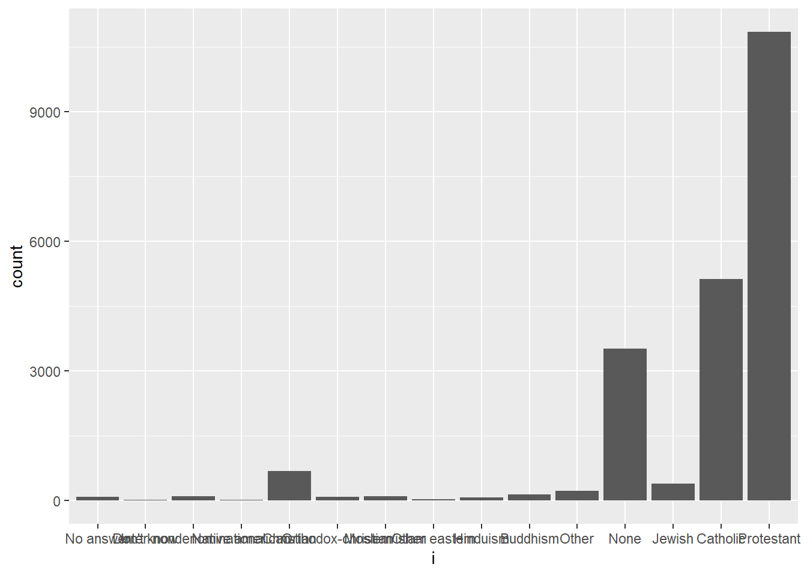

# (PART\*) Section 7 {-}

# Overview {-}

<div style="color: #6D009D; font-size: 24px; font-weight: bold;text-align: justify;">
 Section 7: Programming with R
</div>

::: ilos
**Learning Outcomes:**

-   ADD ILOS.
:::

**In this section, you will practice how to use the following functions:**

|   Function    |               Description               | Package |
|:-------------:|:---------------------------------------:|:-------:|
|     `c()`     |          concatenate function           | base R  |

::: attention
**WARNING 1:** Before proceeding to the exercises, ensure that you create and work in a RStudio project and that you **write** and **save** your answers to the exercises in an R script.

**WARNING 2:** To adequately develop your practical programming skills, it is **essential** that you attempt all exercises by typing out the code rather than simply copy-pasting the answers.
:::

You will require the `tidyverse` package for this practical. 


```r
library(tidyverse)
```

# 1. Basic Functions and Loops {-}

<script>
document.addEventListener('DOMContentLoaded', function() {
    var codeBlocks = document.querySelectorAll('pre > code');

    codeBlocks.forEach(function(block) {
        // Check if the block's content starts with '##'
        if (block.textContent.trim().startsWith('##')) {
            var button = document.createElement('button');
            button.className = 'toggle-button';
            button.textContent = 'Show R Output';
            button.style.display = 'block'; // Ensure button is visible
            block.style.display = 'none'; // Initially hide the R output

            button.onclick = function() {
                if (block.style.display === 'none') {
                    block.style.display = 'block';
                    button.textContent = 'Hide R Output';
                } else {
                    block.style.display = 'none';
                    button.textContent = 'Show R Output';
                }
            };

            block.parentNode.insertBefore(button, block);
        }
    });
});
</script>

<script>
document.addEventListener('DOMContentLoaded', function() {
    var rComments = document.querySelectorAll('.r-comment');

    rComments.forEach(function(comment) {
        // Create the toggle button
        var button = document.createElement('button');
        button.className = 'toggle-comment-button';
        button.textContent = 'Show Explanation';
        button.style.display = 'block'; // Ensure button is visible
        comment.style.display = 'none'; // Initially hide the comment

        // Add click event listener to the button
        button.onclick = function() {
            if (comment.style.display === 'none') {
                comment.style.display = 'block'; // Adjust as needed
                button.textContent = 'Hide Explanation';
            } else {
                comment.style.display = 'none';
                button.textContent = 'Show Explanation';
            }
        };

        // Insert the button before the comment
        comment.parentNode.insertBefore(button, comment);
    });
});

</script>

## 1.1 Task {-}

Write a function that calculates the sum between two values and name it `sum_func`. Use values 55 and 43 to test your function.


```r
sum_func <- function(a, b){
  c <- a + b
  return(c)
}
```

## 1.2 Task {-}

Use values 55 and 43 to test your function.


```r
sum_func(55,43)
```

```
## [1] 98
```

## 1.3 Task {-}

Write a function that calculates the average (mean) of two numbers and name it `av_func`. *Hint: divide the sum of the values by the length of the vector.*  


```r
av_func <- function(x){
  avg <- sum(x)/length(x)
  return(avg)
}
```

Then, use a loop to apply this function to the first 3 columns of the **mtcars** `tidyverse` built-in dataset and store it in a vector of type double called **mean_mtcars**. Print the results


```r
mean_mtcars <- vector("double", length = 3)
  for(i in seq_along(mtcars[1:3])) {
    mean_mtcars[[i]] <- av_func(mtcars[[i]])
  }

mean_mtcars
```

```
## [1]  20.09062   6.18750 230.72188
```

## 1.4 Task {-}

Write a loop that prints values to the power of 2 in a sequence from 1 to 6. 


```r
for(i in 1:6) {
   print(i^2)
}
```

```
## [1] 1
## [1] 4
## [1] 9
## [1] 16
## [1] 25
## [1] 36
```

## 1.5 Task {-}

You have an object x which equals 205. Write a function with the following three conditions and store it in an object called **example**:   

- if x is less than 10, then return "x is smaller than 10"   
- if x greater than 10, then return "x is larger than 10"    
- if x is equal to 10, then return "x is exactly 10"   
 
Print the contents of the object. 


```r
x <- 205
example <- if (x < 10) {
    "x is smaller than 10"
  } else if (x > 10) {
    "x is larger than 10"
  } else if (x == 10) {
    "x is exactly 10"
  }

print(example)
```

```
## [1] "x is larger than 10"
```

# 2. Summary Statistics and Plots

<script>
document.addEventListener('DOMContentLoaded', function() {
    var codeBlocks = document.querySelectorAll('pre > code');

    codeBlocks.forEach(function(block) {
        // Check if the block's content starts with '##'
        if (block.textContent.trim().startsWith('##')) {
            var button = document.createElement('button');
            button.className = 'toggle-button';
            button.textContent = 'Show R Output';
            button.style.display = 'block'; // Ensure button is visible
            block.style.display = 'none'; // Initially hide the R output

            button.onclick = function() {
                if (block.style.display === 'none') {
                    block.style.display = 'block';
                    button.textContent = 'Hide R Output';
                } else {
                    block.style.display = 'none';
                    button.textContent = 'Show R Output';
                }
            };

            block.parentNode.insertBefore(button, block);
        }
    });
});
</script>

<script>
document.addEventListener('DOMContentLoaded', function() {
    var rComments = document.querySelectorAll('.r-comment');

    rComments.forEach(function(comment) {
        // Create the toggle button
        var button = document.createElement('button');
        button.className = 'toggle-comment-button';
        button.textContent = 'Show Explanation';
        button.style.display = 'block'; // Ensure button is visible
        comment.style.display = 'none'; // Initially hide the comment

        // Add click event listener to the button
        button.onclick = function() {
            if (comment.style.display === 'none') {
                comment.style.display = 'block'; // Adjust as needed
                button.textContent = 'Hide Explanation';
            } else {
                comment.style.display = 'none';
                button.textContent = 'Show Explanation';
            }
        };

        // Insert the button before the comment
        comment.parentNode.insertBefore(button, comment);
    });
});

</script>

## 2.1 Task {-}

Create a loop to calculate the standard deviation of each column of the **mtcars** dataset. Print the output


```r
output <- vector("double", ncol(mtcars))
  for (i in seq_along(mtcars)) {
    output[[i]] <- sd(mtcars[[i]])
  }

output
```

```
##  [1]   6.0269481   1.7859216 123.9386938  68.5628685   0.5346787   0.9784574
##  [7]   1.7869432   0.5040161   0.4989909   0.7378041   1.6152000
```

## 2.2 Task {-}

Use an appropriate base R functional to calculate the standard deviation of each column of the **mtcars** dataset and returns a vector.


```r
sapply(mtcars, sd)
```

```
##         mpg         cyl        disp          hp        drat          wt 
##   6.0269481   1.7859216 123.9386938  68.5628685   0.5346787   0.9784574 
##        qsec          vs          am        gear        carb 
##   1.7869432   0.5040161   0.4989909   0.7378041   1.6152000
```

## 2.3 Task {-}

Use an appropriate `tidyverse` functional to calculate the standard deviation of each column of the **mtcars** dataset and returns a vector of type `double`.


```r
map_dbl(mtcars, sd)
```

```
##         mpg         cyl        disp          hp        drat          wt 
##   6.0269481   1.7859216 123.9386938  68.5628685   0.5346787   0.9784574 
##        qsec          vs          am        gear        carb 
##   1.7869432   0.5040161   0.4989909   0.7378041   1.6152000
```

## 2.4 Task {-}

Using an appropriate base R functional, calculate the median age by religion in the **gss_cat** built-in dataset from `tidyverse`. 


```r
tapply(gss_cat$age, gss_cat$relig, median, na.rm = T)
```

```
##               No answer              Don't know Inter-nondenominational 
##                    49.0                    35.0                    37.0 
##         Native american               Christian      Orthodox-christian 
##                    37.0                    38.0                    51.0 
##            Moslem/islam           Other eastern                Hinduism 
##                    37.0                    46.5                    33.0 
##                Buddhism                   Other                    None 
##                    41.0                    40.0                    38.0 
##                  Jewish                Catholic              Protestant 
##                    53.0                    45.0                    49.0 
##          Not applicable 
##                      NA
```

## 2.5 Task {-}

Using an appropriate base R functional, calculate the mean tv hours by party ID in the **gss_cat** dataset. 


```r
tapply(gss_cat$tvhours, gss_cat$partyid, mean, na.rm = T)
```

```
##          No answer         Don't know        Other party  Strong republican 
##           3.222222           2.000000           2.794393           2.718750 
## Not str republican       Ind,near rep        Independent       Ind,near dem 
##           2.628068           2.765358           3.081235           2.804221 
##   Not str democrat    Strong democrat 
##           3.044320           3.516198
```

## 2.6 Task {-}

Write a function that produces plots of variables **rincome**, **relig**, and **tvhours** for the **gss_cat** dataset. Specify these variables by name rather than by index.


```r
for(i in gss_cat[c("rincome", "relig", "tvhours")]){
  p <- ggplot(gss_cat, aes(x = i)) +
        geom_bar()
  print(p)
}
```



```
## Warning: Removed 10146 rows containing non-finite values (`stat_count()`).
```


## 2.7 Task {-}

Create a function called `make_center` that takes as an input a vector and centers it (i.e. subtract the mean from x). Add a check for the input to be numeric or otherwise return an error message that states "x not numeric".


```r
make_center <- function(x) {
  if(!is.numeric(x)) {
    stop("x not numeric")
  }
  x - mean(x, na.rm = T)
}
```

## 2.8 Task {-}

Apply the `make_center()` function you just created to center all variables of the **mtcars** dataset using a functional that returns a data frame as output.


```r
map_df(mtcars, make_center)
```

```
## # A tibble: 32 × 11
##       mpg    cyl    disp    hp    drat       wt   qsec     vs     am   gear
##     <dbl>  <dbl>   <dbl> <dbl>   <dbl>    <dbl>  <dbl>  <dbl>  <dbl>  <dbl>
##  1  0.909 -0.188  -70.7  -36.7  0.303  -0.597   -1.39  -0.438  0.594  0.312
##  2  0.909 -0.188  -70.7  -36.7  0.303  -0.342   -0.829 -0.438  0.594  0.312
##  3  2.71  -2.19  -123.   -53.7  0.253  -0.897    0.761  0.562  0.594  0.312
##  4  1.31  -0.188   27.3  -36.7 -0.517  -0.00225  1.59   0.562 -0.406 -0.688
##  5 -1.39   1.81   129.    28.3 -0.447   0.223   -0.829 -0.438 -0.406 -0.688
##  6 -1.99  -0.188   -5.72 -41.7 -0.837   0.243    2.37   0.562 -0.406 -0.688
##  7 -5.79   1.81   129.    98.3 -0.387   0.353   -2.01  -0.438 -0.406 -0.688
##  8  4.31  -2.19   -84.0  -84.7  0.0934 -0.0272   2.15   0.562 -0.406  0.312
##  9  2.71  -2.19   -89.9  -51.7  0.323  -0.0673   5.05   0.562 -0.406  0.312
## 10 -0.891 -0.188  -63.1  -23.7  0.323   0.223    0.451  0.562 -0.406  0.312
## # ℹ 22 more rows
## # ℹ 1 more variable: carb <dbl>
```

## 2.9 Task {-}

Apply the `make_center()` function to center all variables of the **mtcars** dataset using a loop that stores the output as a list object; name this list object **center_list** and print the output.


```r
center_list <- list(NULL)
  for (i in seq_along(mtcars)) {
    center_list[[i]] <- make_center(mtcars[[i]]) 
  }

center_list
```

```
## [[1]]
##  [1]  0.909375  0.909375  2.709375  1.309375 -1.390625 -1.990625 -5.790625
##  [8]  4.309375  2.709375 -0.890625 -2.290625 -3.690625 -2.790625 -4.890625
## [15] -9.690625 -9.690625 -5.390625 12.309375 10.309375 13.809375  1.409375
## [22] -4.590625 -4.890625 -6.790625 -0.890625  7.209375  5.909375 10.309375
## [29] -4.290625 -0.390625 -5.090625  1.309375
## 
## [[2]]
##  [1] -0.1875 -0.1875 -2.1875 -0.1875  1.8125 -0.1875  1.8125 -2.1875 -2.1875
## [10] -0.1875 -0.1875  1.8125  1.8125  1.8125  1.8125  1.8125  1.8125 -2.1875
## [19] -2.1875 -2.1875 -2.1875  1.8125  1.8125  1.8125  1.8125 -2.1875 -2.1875
## [28] -2.1875  1.8125 -0.1875  1.8125 -2.1875
## 
## [[3]]
##  [1]  -70.721875  -70.721875 -122.721875   27.278125  129.278125   -5.721875
##  [7]  129.278125  -84.021875  -89.921875  -63.121875  -63.121875   45.078125
## [13]   45.078125   45.078125  241.278125  229.278125  209.278125 -152.021875
## [19] -155.021875 -159.621875 -110.621875   87.278125   73.278125  119.278125
## [25]  169.278125 -151.721875 -110.421875 -135.621875  120.278125  -85.721875
## [31]   70.278125 -109.721875
## 
## [[4]]
##  [1] -36.6875 -36.6875 -53.6875 -36.6875  28.3125 -41.6875  98.3125 -84.6875
##  [9] -51.6875 -23.6875 -23.6875  33.3125  33.3125  33.3125  58.3125  68.3125
## [17]  83.3125 -80.6875 -94.6875 -81.6875 -49.6875   3.3125   3.3125  98.3125
## [25]  28.3125 -80.6875 -55.6875 -33.6875 117.3125  28.3125 188.3125 -37.6875
## 
## [[5]]
##  [1]  0.3034375  0.3034375  0.2534375 -0.5165625 -0.4465625 -0.8365625
##  [7] -0.3865625  0.0934375  0.3234375  0.3234375  0.3234375 -0.5265625
## [13] -0.5265625 -0.5265625 -0.6665625 -0.5965625 -0.3665625  0.4834375
## [19]  1.3334375  0.6234375  0.1034375 -0.8365625 -0.4465625  0.1334375
## [25] -0.5165625  0.4834375  0.8334375  0.1734375  0.6234375  0.0234375
## [31] -0.0565625  0.5134375
## 
## [[6]]
##  [1] -0.59725 -0.34225 -0.89725 -0.00225  0.22275  0.24275  0.35275 -0.02725
##  [9] -0.06725  0.22275  0.22275  0.85275  0.51275  0.56275  2.03275  2.20675
## [17]  2.12775 -1.01725 -1.60225 -1.38225 -0.75225  0.30275  0.21775  0.62275
## [25]  0.62775 -1.28225 -1.07725 -1.70425 -0.04725 -0.44725  0.35275 -0.43725
## 
## [[7]]
##  [1] -1.38875 -0.82875  0.76125  1.59125 -0.82875  2.37125 -2.00875  2.15125
##  [9]  5.05125  0.45125  1.05125 -0.44875 -0.24875  0.15125  0.13125 -0.02875
## [17] -0.42875  1.62125  0.67125  2.05125  2.16125 -0.97875 -0.54875 -2.43875
## [25] -0.79875  1.05125 -1.14875 -0.94875 -3.34875 -2.34875 -3.24875  0.75125
## 
## [[8]]
##  [1] -0.4375 -0.4375  0.5625  0.5625 -0.4375  0.5625 -0.4375  0.5625  0.5625
## [10]  0.5625  0.5625 -0.4375 -0.4375 -0.4375 -0.4375 -0.4375 -0.4375  0.5625
## [19]  0.5625  0.5625  0.5625 -0.4375 -0.4375 -0.4375 -0.4375  0.5625 -0.4375
## [28]  0.5625 -0.4375 -0.4375 -0.4375  0.5625
## 
## [[9]]
##  [1]  0.59375  0.59375  0.59375 -0.40625 -0.40625 -0.40625 -0.40625 -0.40625
##  [9] -0.40625 -0.40625 -0.40625 -0.40625 -0.40625 -0.40625 -0.40625 -0.40625
## [17] -0.40625  0.59375  0.59375  0.59375 -0.40625 -0.40625 -0.40625 -0.40625
## [25] -0.40625  0.59375  0.59375  0.59375  0.59375  0.59375  0.59375  0.59375
## 
## [[10]]
##  [1]  0.3125  0.3125  0.3125 -0.6875 -0.6875 -0.6875 -0.6875  0.3125  0.3125
## [10]  0.3125  0.3125 -0.6875 -0.6875 -0.6875 -0.6875 -0.6875 -0.6875  0.3125
## [19]  0.3125  0.3125 -0.6875 -0.6875 -0.6875 -0.6875 -0.6875  0.3125  1.3125
## [28]  1.3125  1.3125  1.3125  1.3125  0.3125
## 
## [[11]]
##  [1]  1.1875  1.1875 -1.8125 -1.8125 -0.8125 -1.8125  1.1875 -0.8125 -0.8125
## [10]  1.1875  1.1875  0.1875  0.1875  0.1875  1.1875  1.1875  1.1875 -1.8125
## [19] -0.8125 -1.8125 -1.8125 -0.8125 -0.8125  1.1875 -0.8125 -1.8125 -0.8125
## [28] -0.8125  1.1875  3.1875  5.1875 -0.8125
```

