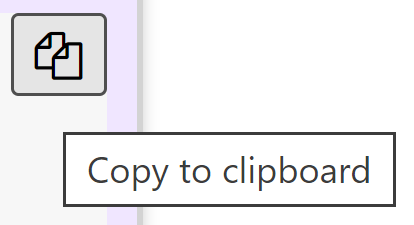

--- 
title: "Data Science Modelling"
author: "Dr. Ioana Macoveciuc"
site: bookdown::bookdown_site
documentclass: book
bibliography: [book.bib, packages.bib]
description: |
  Notebook hosting practical materials for SOST70033.
link-citations: yes
---

# About {-}

Welcome to **SOST70033 Data Science Modelling**! This notebook will host the materials for all R practical tasks for this course unit. The notebook follows the same section-based structure as the learning materials on Blackboard. For each section, you will have at least one practical to complete and each of these can be accessed by using the sidebar menu on the left hand side of your screen. When there are multiple exercises, clicking on the headings in each section will expand the menu and you can access each task individually. To access this notebook, you can bookmark it like any other website in your favourite web browser.  

The sidebar menu can be toggled on and off by clicking on the **Toggle Sidebar** button. 

Other customisation options include changing the font, font size, and the appearance. You also have a handy search button.  

This notebook is also designed to work well on tablet and mobile devices; to enhance your experience on these devices, it is recommended that you hide the sidebar menu and navigate across sections and subsections using the right and left arrows. 

The code, as well as the output and answers, have interactive buttons which can reveal or hide the content. One additional feature of the R code is that it can be copied and pasted directly in your R console or script by clicking on the following icon: 

  

::: attention
**1:** Before beginning, it is recommended that you create a RStudio project for this course and work through the exercises and tasks in each section using this project. 

**2:** You should **write** and **save** your answers to the exercises and tasks in R scripts. You should have at least one R script for each course section. 

**3:** The recommended approach for a ‘clean’ working directory is to place all the data files you plan to use in a separate folder (e.g. a folder called *data*) within your R project working directory. You should always use simple names that allow you easy access to the contents when you want to either explore the folder on your machine or specify the path to these folders in R. 

**4:** The answers to all tasks are also provided in this notebook. To build a robust knowledge basis and adequately develop your practical programming skills, it is absolutely **essential** that you first attempt all tasks and exercises on your own before comparing your answers with those provided in this notebook.  
:::
